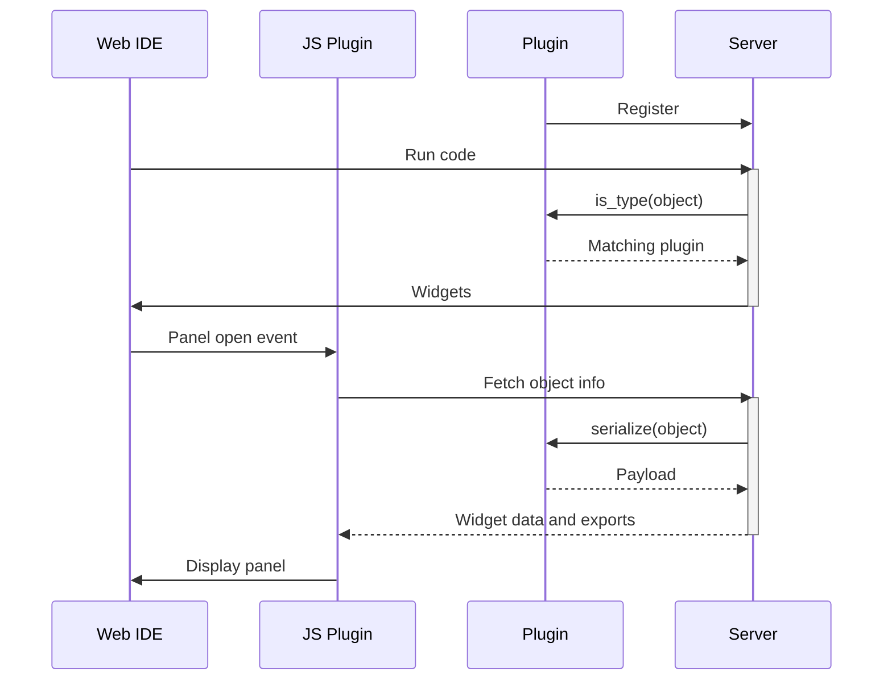
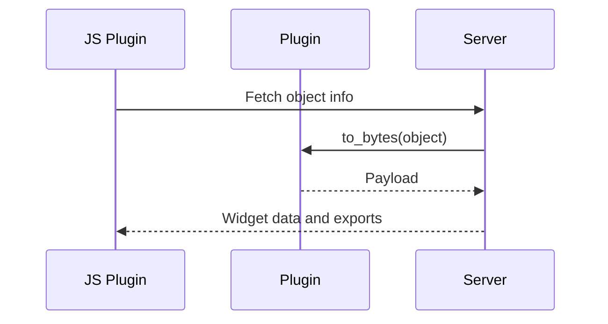
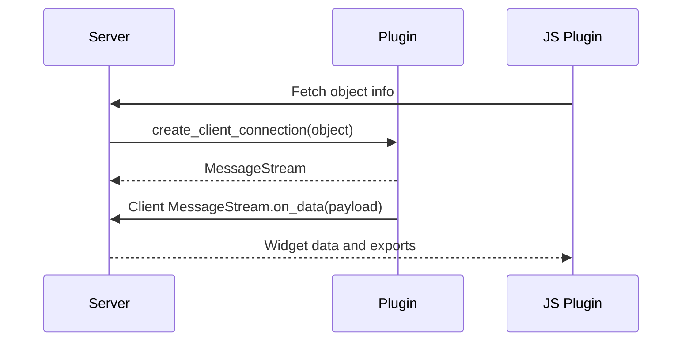
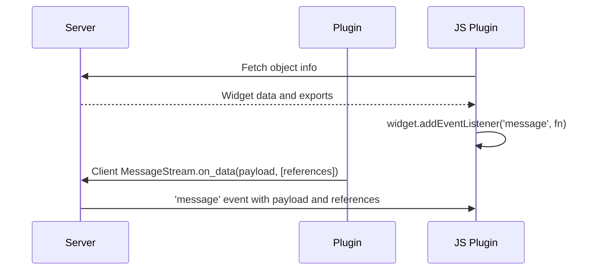
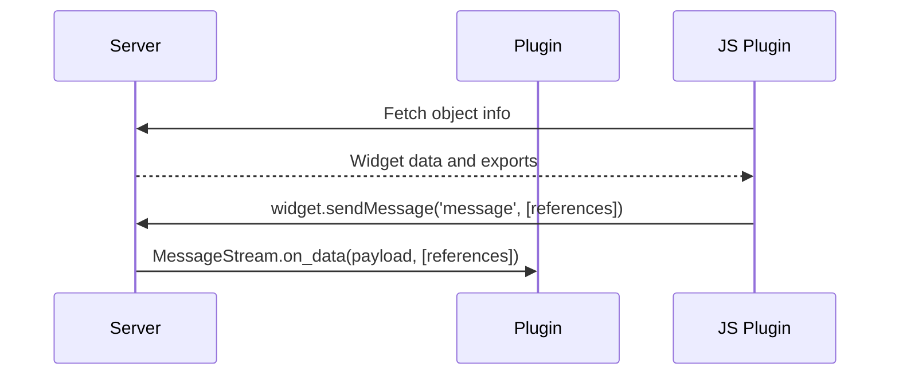

# Plugin Architecture

This document focuses on the architecture of a Python server plugin and corresponding JS plugin to display a widget in the web IDE. The concepts should be similar for Java server plugins, but some method names may differ.

## Terminology

When these terms are used, they refer to the following:

- **Object**: A Python object/variable that is created in the global scope of a script. It may be any type, e.g. list, dictionary, DataFrame, Table, etc.
- **Widget**: Any object that is handled by a server plugin. Clients will be notified of widget names and types. Clients will request info about widgets and can setup bidirectional communication channels based on a widget.
- **Server plugin**: A plugin that is registered on server startup. It is used to serialize objects and communicate with clients about them. E.g. a plugin which handles instances of Plotly figures.
- **JS plugin**: A plugin that is registered on web IDE page load. It is used to display a widget and handle communication with the server.

## Overview of Plugins and Widget fetching

Server plugins are registered on server startup. When a user runs code, the server will check if any plugins handle the object type by calling `is_type` for variables created in the global scope. If a plugin matches, the server will stop checking and delegate any client requests about the widget to the plugin.

When a client requests info about a widget, the server will call a method on the plugin to serialize the provided object. The server plugin is expected return a payload or create a bidirectional stream and send the payload across the stream. The server plugin may also choose to export other widgets such as tables that the client will need to operate.

## Fetch Only Objects

A Python server plugin which extends the [`FetchOnlyObjectType`](https://github.com/deephaven/deephaven-plugin/blob/main/src/deephaven/plugin/object_type.py#L90) class can be used for objects which do not require bidirectional communication. When the client requests the widget, the plugin's `to_bytes` method will be called with the object. The plugin should return a payload which the client understands (e.g. a JSON string).

A JS `DashboardPlugin` will receive a `fetch` prop that can be used to fetch the widget from the server. The returned widget's data can be retrieved by calling `getDataAsString()` (assumes UTF-8 encoding), `getDataAsBase64()`, or `getDataAsU8()`. The plugin can then do whatever it wants with the data.

## Establishing BiDi Communication

A Python server plugin which extends the [`BidirectionalObjectType`](https://github.com/deephaven/deephaven-plugin/blob/main/src/deephaven/plugin/object_type.py#L73) class can be used for objects which require bidirectional communication. When the client requests the widget, the plugin's `create_client_connection` method will be called with the object and a `MessageStream` to send messages to the client. The plugin needs to do 2 things when `create_client_connection` is called:

1. Create and return a `MessageStream` whose `on_data` method will be called when receiving a message from the client.
2. Send a message to the client with the widget's data using the provided `MessageStream.on_data` method.

It is up to the plugin to handle any issues with multi-client access to the object. A single client may also request the widget multiple times. In both cases, `create_client_connection` will be called multiple times with the same object. If the client can manipulate the object in any way, it is recommended to either make a copy of the object to keep in the `MessageStream`, or enforce some sort of immutable state to prevent one client changing the object and affecting other clients.

## Server message

The server may send unsolicited messages to the client in a bidirectional communication scenario. The plugin may export objects with messages. A JS Plugin should add an event listener via `widget.addEventListener('message', fn)` to receive messages. The listener will be called with a `CustomEvent` whose `detail` is the message payload and exported objects.

## Client message

The client can send a message to the server by calling `widget.sendMessage(message, [references])`. The references are optional and are tickets referencing other exported objects.

The message should either be a UTF-8 encoded string or a `Uint8Array`. The server plugin will receive the message via the `MessageStream.on_data` method in created and returned in `create_client_connection`.

