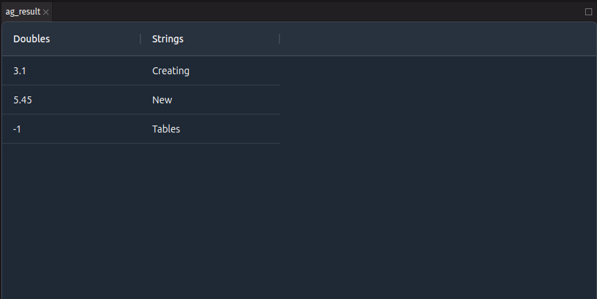

# Deephaven Plugin for AG Grid

Display Deephaven tables using [AG Grid](https://www.ag-grid.com/).

## Plugin Structure

The `src` directory contains the Python and JavaScript code for the plugin.  
Within the `src` directory, the `deephaven/ag_grid` directory contains the Python code, and the `js` directory contains the JavaScript code.

The Python files have the following structure:  
[`AgGridMessageStream.py`](./src/deephaven/ag_grid/AgGridMessageStream.py) defines a simple Python class that can send messages to the client. It just sends the Deephaven table along.
[`AgGridType.py`](./src/deephaven/ag_grid/AgGridType.py) defines the Python type for the plugin (which is used for registration) and a simple message stream. These can be modified to handle different objects or messages. An initial message is sent from the Python side to the client, then additional messages can be sent back and forth.  
[`_register.py`](./src/deephaven/ag_grid/_register.py) registers the plugin with Deephaven. This file will not need to be modified for most plugins at the initial stages, but will need to be if the package is renamed or JavaScript files are moved.

The JavaScript files have the following structure:  
[`AgGridPlugin.ts`](./src/js/src/AgGridPlugin.ts) registers the plugin with Deephaven. This contains the client equivalent of the type in [`AgGridType.py`](./src/deephaven/ag_grid/AgGridType.py) and these should be kept in sync.  
[`AgGridWidget.tsx`](./src/js/src/AgGridWidget.tsx) defines the plugin panel and message handling. This is where messages are received when sent from the Python side of the plugin. It fetches the Deephaven table and passes it to the `AgGridView`.
[`AgGridView.tsx`](./src/js/src/AgGridView.tsx) defines the view for the plugin. This is where the AG Grid is created and updated with the data from the Deephaven table. This is a good starting point for wiring up more functionality from Deephaven table to AG Grid.

Additionally, the `test` directory contains Python tests for the plugin.  
It's recommended to use `tox` to run the tests, and the `tox.ini` file is included in the project.

## Building the Plugin

Use the [`plugin_builder.py`](../../README.md#using-plugin_builderpy) from the root directory to build the plugin.

## Using the Plugin

Once you have the plugin installed and the server started, you can wrap a Deephaven table with the `AgGrid` plugin:

```python
from deephaven import new_table
from deephaven.column import string_col, double_col
from deephaven.ag_grid import AgGrid

_result = new_table(
    [
        double_col("Doubles", [3.1, 5.45, -1.0]),
        string_col("Strings", ["Creating", "New", "Tables"]),
    ]
)

ag_result = AgGrid(_result)
```


