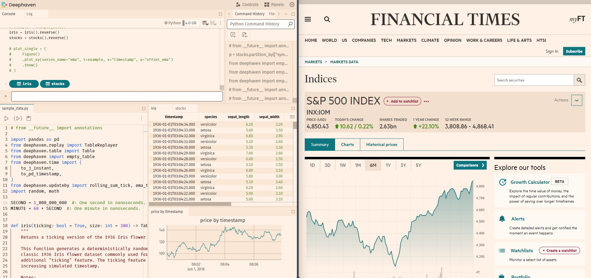
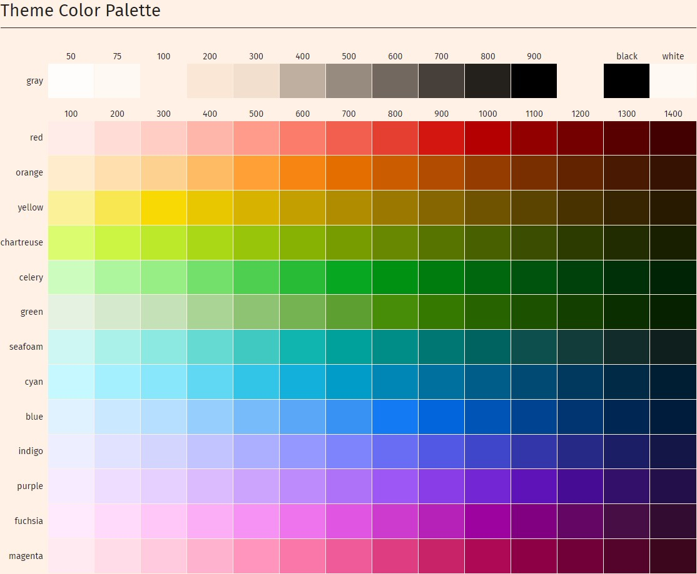

# Deephaven Custom Theme Example

This plugin demonstrates how to create a custom theme for the Deephaven web UI. Deephaven themes work by providing a set of [CSS variables](https://developer.mozilla.org/en-US/docs/Web/CSS/Using_CSS_custom_properties) to override the default theme variables. By way of example, we will create a custom theme inspired by the unique color scheme from the [Financial Times](https://financialtimes.com). The image below shows our example theme we will be creating on the left, and the Financial Times inspiration on the right.



## Installation

Refer to the main [README](../../README.md) for instructions on how to build and install plugins.

## Development

Copy the `example-theme` directory to a new directory and rename it to your plugin name. Rename the `example-theme` references in the `./<your-theme>/src/js/package.json` and `./<your-theme>/src/js/src/index.ts` to your plugin name in your theme folder. Add your plugin's name to the `manifest.json` in the repository root directory to enable your plugin in development previews.

You should also update the `name` key in the `./<your-theme>/src/js/src/index.ts` file with a unique name that will appear in the theme selector UI.

To preview themes during development, you'll need to start three separate processes. The first is a deephaven server, the second is a plugins server, and the third is a development version of the web-client-ui server. This is only necessary if you would like to preview your changes during development.

1. Start a deephaven-core server on port 10000. You can follow the instructions here in [deephaven-core](https://deephaven.io/core/docs/tutorials/quickstart/].
2. In a separate terminal start a plugins server that will proxy your plugins. This is so you don't have to re-install it each time you make a change while developing your custom theme. From the deephaven-plugins project repository root directory, run:

   ```
   npm install
   npm start
   ```

3. Finally, start a local web-client-ui server that will allow you to view a development copy of your theme. Clone the [deephaven/web-client-ui](https://github.com/deephaven/web-client-ui) repository and run in a separate terminal, from the the web-client-ui project repository root directory:

   ```
   npm install
   npm run start
   ```

Then visit http://localhost:4000 to preview in the app, or http://localhost:4000/ide/styleguide for a preview of all the components in the web-client-ui library. You can change the theme by clicking on the theme selector in the top right corner of the styleguide, or in the settings menu from the app.

## Creating your theme

### Inherit a base theme

To create your theme, you must first decide whether your theme is a "light" theme or a "dark" theme. For example if your background color is black, or a dark color, you are creating a dark theme and should inherit the initial styling from the "Default Dark" theme. If your background color is white, or a light color, you are creating a light theme and should inherit the initial styling from the "Default Light" theme.

By inheriting from either `dark` or `light`, it significantly reduces the amount of variables you need to assign. You may choose to override just one variable, or all of them. The choice is yours.

To set which theme to inherit from, set the baseTheme to either `dark` or `light` in the `./<your-theme>/src/js/src/index.ts` file.

```typescript
export const plugin: ThemePlugin = {
  name: 'example-theme',
  type: 'ThemePlugin',
  themes: {
    ...
    baseTheme: 'light', // The base theme to extend, either 'light' or 'dark'
    ...
  },
};
```

### Creating your override variables

Next you'll want to override colors and other variables to create your custom theme in the `./<your-theme>/src/js/src/theme.scss` file. You can find a list of all the variables you can override in the [Default Dark](https://github.com/deephaven/web-client-ui/tree/main/packages/components/src/theme/theme-dark) or [Default Light](https://github.com/deephaven/web-client-ui/tree/main/packages/components/src/theme/theme-light) directory in the web-client-ui repository, organized into files by usage. You can also inspect elements in the browser to discover the class or variable names you may need to override. Use selector based styling sparingly, as these are not guaranteed to be stable across releases. Most themes will start by overriding a few colors, and then add additional variables as needed. For example, to create the example theme above, we only need to override a few colors, mostly from the palette files listed above.

We'll start by overriding the background colors, and then the accent colors, positive and negative colors, and then a few additional colors specific to grids and plots. All colors are defined as raw HSL values without the `hsl()` functional notation. ex. `--dh-color-red-100: 2.14, 86.73%, 44.31%`. This allows web-client-ui to convert the colors internally to the necessary formats for each display purpose (grids, code editors, plots) and also mix in the alpha channel to create transparent colors via HSLA(Hue, Saturation, Lightness, Alpha). When CSS color-mixing is more widely supported, we may deprecate the use of HSL colors in favor of any valid css color.

### Using color generators and defining your palette

The Deephaven design system is based on the [adobe spectrum](https://spectrum.adobe.com/page/color-palette/) color system. It is setup to use a palette consisting of:

- 11 shades of a "gray" palette used for background colors
- 13 shades of each of the 12 colors in the "color" palette: Red, Orange, Yellow, Chartreuse, Celery, Green, Seafoam, Cyan, Blue, Indigo, Purple, Fuschia and Magenta

You can create color palettes with shades for each color using tools like: Adobe's [Leonardo](https://leonardocolor.io/theme.html) color tool (recommended), or [Coolors](https://coolors.co/gradient-palette/fae7d5-24211d?number=11). You may already have an existing brand guide at your company that also gives you full palettes. Leonardo is a great tool for creating color ramps, which has an "Export as CSS" feature to get the HSL values for each color in the ramp. Remove the `hsl()` notation to get the raw values. Consider manually converting to HSL using two decimals for your HSL raw values for additional precision.

The background colors are defined using a set of 11 colors, ranging from light to dark for light themes, and inverted from dark to light for dark themes. With the 50, 75 and 100 colors being closer together, and 100-900 being a more equal distribution. The other colors are more evenly distributed across lightness.

For our example theme, we used a background color inspired from the financial times site to create a palette using Leonardo. The example theme uses the following palette for the "gray" background colors:

```css
// Background colors, labeled as gray but may be any suitable background color
--dh-color-gray-50-hsl: 30, 100%, 99.22%;
--dh-color-gray-75-hsl: 30, 100%, 97.65%;
--dh-color-gray-100-hsl: 27.69, 100%, 94.9%;
--dh-color-gray-200-hsl: 29.19, 78.72%, 90.78%;
--dh-color-gray-300-hsl: 28.33, 58.06%, 87.84%;
--dh-color-gray-400-hsl: 28, 18.99%, 69.02%;
--dh-color-gray-500-hsl: 27.5, 10.34%, 54.51%;
--dh-color-gray-600-hsl: 26.67, 8.57%, 41.18%;
--dh-color-gray-700-hsl: 25, 9.38%, 25.1%;
--dh-color-gray-800-hsl: 34.29, 10.77%, 12.75%;
--dh-color-gray-900-hsl: 0, 0%, 0%;
```

We also override a "red" palette, a "green" palette and a "seafoam" palette based on the colors inspired by the financial times site. You will inherit any color from your chosen base theme that you do not define. Here's is the full palette we used for our example theme:



### Using your palette for semantic colors

Depending on how much you want to customize, you may choose to stop after just setting the palette and inherit the rest of the theme from the default theme. Or you may choose to override additional variables to customize the theme further. For example, we also override the `accent` variables as used for things like buttons from `blue` to `seafoam`. `positive` and `negative` already default to `red` and `green`, so they remained untouched but you could customize these as well. Refer to the semantic files in the default theme for available variables.

```css
--dh-color-accent-100-hsl: var(--dh-color-red-100-hsl);
--dh-color-accent-200-hsl: var(--dh-color-red-200-hsl);
--dh-color-accent-300-hsl: var(--dh-color-seafoam-300-hsl);
--dh-color-accent-400-hsl: var(--dh-color-seafoam-400-hsl);
--dh-color-accent-500-hsl: var(--dh-color-seafoam-500-hsl);
--dh-color-accent-600-hsl: var(--dh-color-seafoam-600-hsl);
--dh-color-accent-700-hsl: var(--dh-color-seafoam-700-hsl);
--dh-color-accent-800-hsl: var(--dh-color-seafoam-800-hsl);
--dh-color-accent-900-hsl: var(--dh-color-seafoam-900-hsl);
--dh-color-accent-1000-hsl: var(--dh-color-seafoam-1000-hsl);
--dh-color-accent-1100-hsl: var(--dh-color-seafoam-1100-hsl);
--dh-color-accent-1200-hsl: var(--dh-color-seafoam-1200-hsl);
--dh-color-accent-1300-hsl: var(--dh-color-seafoam-1300-hsl);
--dh-color-accent-1400-hsl: var(--dh-color-seafoam-1400-hsl);
```

### Using your palette for component specific semantic colors

You may find that after overriding the palette and semantic colors you want even further customization of within specific components. In our example, we also override the default grid grid header color, row stripes and date colors, as well as the plot colorway.

```css
--dh-color-grid-header-bg: var(--dh-color-gray-100);
--dh-color-grid-row-0-bg: var(--dh-color-gray-200);
--dh-color-grid-row-1-bg: var(--dh-color-gray-100);
```

### Additional Customization

You may also override specific components using css selectors and setting your own variables and properties. This however is not recommended as it may break in future updates to the web-client-ui library. If you find yourself needing to do this, please consider opening an issue or pull request to request for additional variables in the default themes.

Feel free to join the [Deephaven Community Slack](https://deephaven.io/slack) and ask questions in the #web-client-ui channel.
