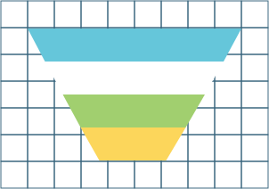

# Deephaven Plotly Express

[Deephaven Plotly Express](https://github.com/deephaven/deephaven-plugins) is a powerful plotting library built on top of [Plotly Express](https://plotly.com/python/plotly-express/) that enhances its capabilities by adding support for real-time Deephaven tables, automatic downsampling, and server-side data grouping and aggregation using the Deephaven query engine. This library seamlessly integrates real-time data from Deephaven with the interactive and expressive visualizations of Plotly Express, allowing you to easily plot or aggregate millions of data points.

## Key Features

- **Live Dataframe Support**: Direct integration with real-time Deephaven tables, allowing you to visualize and analyze data as it updates in real time, in addition to Pandas DataFrames.
- **Automatic Downsampling**: Pixel accurate automatic downsampling that reduces the number of data points displayed, ensuring smooth and responsive visualizations even with large datasets.
- **Server-Side Data Grouping and Aggregation**: Uses server-side processing capabilities to perform data grouping and aggregation directly within Deephaven query engine, enabling efficient analysis of huge datasets without requiring data transfer.
- **Plotly Express Compatibility**: Built on top of Plotly Express, the library inherits its comprehensive set of features, enabling you to create stunning and interactive visualizations effortlessly. In most cases you can directly swap `px` for `dx` for instant compatibility.
- **Interactive Visualizations**: Supports interactive features such as zooming, panning, and hovering, allowing you to explore and interact with your data conveniently.
- **Easy-to-Use API**: Simple and intuitive API, making it easy for users to generate a wide range of visualizations and customize them according to their specific needs.
- **Single entry point**: `from deephaven.plot import express as dx` and get easy access to all plotting functions and built-in demo datasets.

## Plot Types

This page contains a collection of links to examples demonstrating different plot types and usage scenarios. You can explore these examples to gain a better understanding of how to leverage the library in your projects.

### Basic Plots

<CardList>

[](scatter.md)
[](line.md)
[](bar.md)
[](area.md)
[](pie.md)
[](indicator.md)

</CardList>

### 1D Distribution Plots

<CardList>

[](histogram.md)
[](box.md)
[](violin.md)
[](strip.md)

</CardList>

### 2D Distribution Plots

<CardList>

[](density_heatmap.md)

</CardList>

### Financial Plots

<CardList>

[](candlestick.md)
[](ohlc.md)

</CardList>

### Hierarchical Plots

<CardList>

[](treemap.md)
[](icicle.md)
[](sunburst.md)
[](funnel.md)
[](funnel-area.md)

</CardList>

### 3D, Polar, Ternary and Other Plots

<CardList>

[](scatter-3d.md)
[](line-3d.md)
[](scatter-polar.md)
[](line-polar.md)
[](scatter-ternary.md)
[](line-ternary.md)
[](timeline.md)

</CardList>

### Concepts

<CardList>

[](plot-by.md)
[](sub-plots.md)
[](layer-plots.md)
[](multiple-axes.md)
[](titles-legends.md)

</CardList>

## Quickstart

1. Install with Docker, use a Docker image with it already installed, or pip install with:

```bash
pip install deephaven-plugin-plotly-express
```

2. To create a real-time plot using Deephaven Plotly Express, run the following example within Deephaven:

```python order=my_plot,my_table
import deephaven.plot.express as dx

# Deephaven plotly express includes a number of generated data sets for examples
my_table = dx.data.stocks()

# Create a line plot, and assign colors by distinct values in the `sym` column
my_plot = dx.line(table=my_table, x="Timestamp", y="Price", color="Sym")
```

In this example, we create a Deephaven table and create a line plot of `Timestamp` against `Price` with automatic downsampling. A trace is created for each value in the `Sym` column, each of which has a unique color.

## Documentation Terminology

The documentation for Deephaven Express routinely uses some common terms to help clarify how plots are intended to be used:

- **Variable**: Variables, usually represented as columns in a Deephaven table, are a series of data points or observations of a particular characteristic in the data set. Examples include age, GDP, stock price, wind direction, sex, zip code, shoe size, square footage, and height.

The following terms define different types of variables. Variable types are important because any given plot is usually only intended to be used with specific variable types:

- **Categorical variable**: This is a variable with a countable (often small) number of possible measurements for which an average cannot be computed. Examples include sex, country, flower species, stock symbol, and last name. Zip code is also a categorical variable, because while it is made of numbers and can technically be averaged, the "average zip code" is not a sensible concept.
- **Discrete numeric variable** (often abbreviated to _discrete variable_): This is a variable with a countable number of possible measurements for which an average can be computed. These are typically represented with whole numbers. Examples include the number of wins in a season, number of bedrooms in a house, the size of one's immediate family, and the number of letters in a word.
- **Continuous numberic variable** (often abbreviated to _continuous variable_): This is a variable with a spectrum of possible measurements for which an average can be computed. These are typically represented with decimal or fractional numbers. Examples include height, square footage of a home, length of a flower petal, price of a stock, and the distance between two stars.

The following terms define relationships between variables. They do not describe attributes of a variable, but describe how variables relate to one another:

- **Explanatory variable**: A variable that other variables depend on in some important way. A common example is time. If explanatory variables are displayed in a plot, they are presented on the x-axis by convention.
- **Response variable**: A variable that depends directly on another variable (the explanatory variable) in some important way. A rule of thumb is that explanatory variables are used to make predictions about response variables, but not conversely. If response variables are displayed in a plot, they are presented on the y-axis by convention.

## Contributing

We welcome contributions to Deephaven Plotly Express! If you encounter any issues, have ideas for improvements, or would like to add new features, please open an issue or submit a pull request on the [GitHub repository](https://github.com/deephaven/deephaven-plugins).

## License

Deephaven's Plotly Express plugin is licensed under the [Apache License 2.0](https://github.com/deephaven/deephaven-plugins/blob/main/plugins/plotly-express/LICENSE). You are free to use, modify, and distribute this library in compliance with the terms of the license.

## Acknowledgments

We would like to express our gratitude to the Plotly and the Plotly Express team for creating a remarkable plotting library and making it open-source. Their work forms the foundation of the Deephaven Plotly Express plugin.
