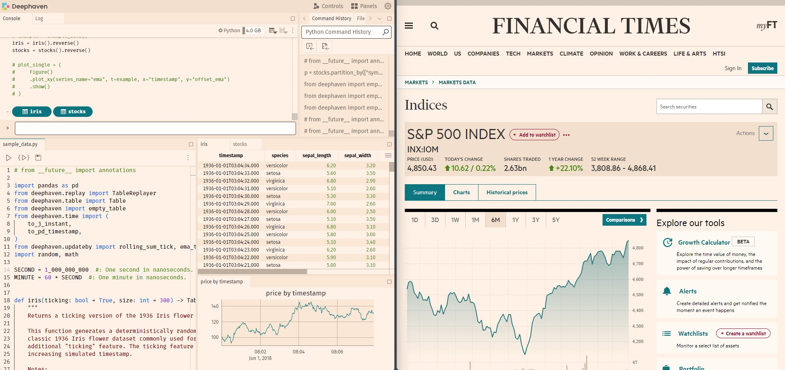
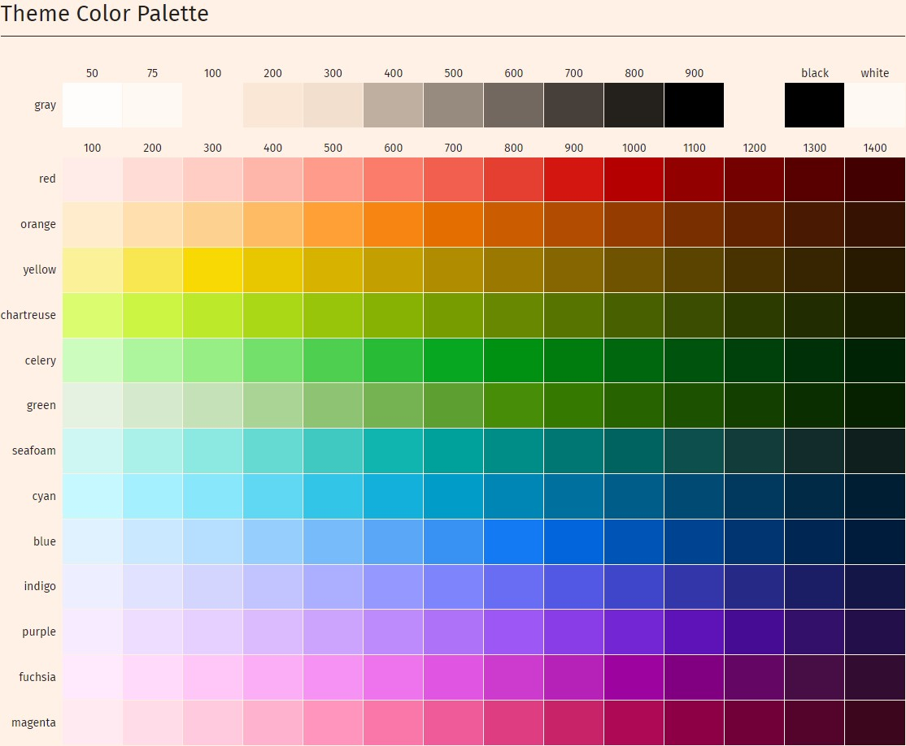

# Deephaven Custom Theme Example

This plugin demonstrates how to create a custom theme for the Deephaven web UI. Deephaven themes work by providing a set of [CSS variables](https://developer.mozilla.org/en-US/docs/Web/CSS/Using_CSS_custom_properties) to override the default theme variables. By way of example, we will create a custom theme inspired by the unique color scheme from the [Financial Times](https://financialtimes.com). The image below shows our example theme on the left and the Financial Times inspiration on the right.



## Prerequisites

Requires Deephaven Core version 0.33.0 or higher.

## Installation

Refer to the main [README](../../../../README.md) for instructions on how to build and install plugins.

## Development

- Copy the `theme-pack` directory to a new directory and rename it to your plugin name.
- Rename the `theme-pack` references in the `./<your-theme>/src/js/package.json` and `./<your-theme>/src/js/src/index.ts` to your plugin name in your theme folder.
- Add your plugin's name to the `./plugins/manifest.json` to enable your plugin in development previews.
- You should also update the `name` key in the `./<your-theme>/src/js/src/index.ts` file with a unique name that will appear in the theme selector UI.

To preview themes during development, you'll need to start three separate processes: The first is a Deephaven server, the second is a plugins server, and the third is a development version of the web-client-ui server. Starting a web-client-ui server version is only necessary if you would like to preview your changes during development.

1. Start a deephaven-core server on port 10000. You can follow the instructions here in [deephaven-core](https://deephaven.io/core/docs/tutorials/quickstart/).
2. In a separate terminal, start a plugins server that will proxy your plugins. This is so you don't have to re-install it each time you make a change while developing your custom theme. From the deephaven-plugins project repository root directory, run:

   ```
   npm install
   npm start
   ```

3. Finally, start a local web-client-ui server that will allow you to view a development copy of your theme. Clone the [deephaven/web-client-ui](https://github.com/deephaven/web-client-ui) repository, follow [instructions here](https://github.com/deephaven/web-client-ui/blob/main/README.md#local-plugin-development) to add a proxy for the plugins.

   Add a line to the file `./packages/code-studio/.env.development.local` in web-client-ui with:

   ```
   VITE_JS_PLUGINS_DEV_PORT=4100
   ```

   From the the web-client-ui project repository root directory, in a terminal run:

   ```
   npm install
   npm run start
   ```

Then visit http://localhost:4000 to preview in the app, or http://localhost:4000/ide/styleguide for a preview of all the components in the web-client-ui library.

You can change the theme by clicking on the theme selector in the top right corner of the styleguide, or in the Deephaven **Settings** menu from the app. If you change your styles, you will need to refresh the page to see the changes.

## Creating your theme

The general steps for creating a theme are as follows:

1. Inherit a base theme (either `dark` or `light`).
2. Create your color palette (gray, red, orange, etc).
3. Override any semantic colors with colors from your palette as desired (accent, positive, negative, etc).
4. Override component-specific colors with semantic colors or colors from your palette as desired (grid colors, plot, etc).

### Inherit a base theme

To create your theme, first decide whether your theme is a "light" or a "dark" theme. For example, if your background color is black or a dark color, you should inherit the initial styling from the "Default Dark" theme. If your background color is white or a light color, you should inherit the initial styling from the "Default Light" theme.

Inheriting from either `dark` or `light` significantly reduces the amount of variables you need to assign. You may choose to override just one variable or all of them. The choice is yours.

Set the `baseTheme` to either `dark` or `light` in the `./<your-theme>/src/js/src/index.ts` file.

```typescript
export const plugin: ThemePlugin = {
  name: 'theme-pack',
  type: 'ThemePlugin',
  themes: {
    ...
    baseTheme: 'light', // The base theme to extend, either 'light' or 'dark'
    ...
  },
};
```

### Creating your override variables

Next, you'll want to override colors and other variables to create your custom theme in the `./<your-theme>/src/js/src/theme.css` file. You can find a list of all the variables you can override in the [Default Dark](https://github.com/deephaven/web-client-ui/tree/main/packages/components/src/theme/theme-dark) or [Default Light](https://github.com/deephaven/web-client-ui/tree/main/packages/components/src/theme/theme-light) directory in the web-client-ui repository, organized into files by usage. You can also inspect elements in the browser to discover the class or variable names you may need to override. Use selector-based styling sparingly, as these are not guaranteed to be stable across releases. Most themes will start by overriding a few colors and then add additional variables as needed. For example, to create the example theme above, we only need to override a few colors, mostly from the palette files listed above.

We'll start by overriding the background colors, accent colors, positive and negative colors, and then a few additional colors specific to grids and plots. **Colors must be in the sRGB color space**. (Supported formats include #HEX, rgb(), rgba(), hsl(), hwb(), color(srgb) or a named color. Other color spaces such as LAB, OKLAB, P3, etc, are not supported). The web-client-ui theme provider will convert your colors to HEX internally via javascript for display in some of the non-traditional dom-elements (canvas-based grids, monaco code editors, svg/webgl plots). We also mix in an alpha channel to create transparent colors for you via [color-mix](https://developer.mozilla.org/en-US/docs/Web/CSS/color_value/color-mix) in srgb space.

### Using color generators and defining your palette

The Deephaven design system is based on the [Adobe spectrum](https://spectrum.adobe.com/page/color-palette/) color system. It is set up to use a palette consisting of:

- 11 shades of a "gray" palette used for background colors
- 13 shades of each of the 12 colors in the "color" palette: Red, Orange, Yellow, Chartreuse, Celery, Green, Seafoam, Cyan, Blue, Indigo, Purple, Fuschia and Magenta

You can create color palettes with shades for each color using tools like Adobe's [Leonardo](https://leonardocolor.io/theme.html) color tool (recommended), or [Coolors](https://coolors.co/gradient-palette/fae7d5-24211d?number=11). You may already have an existing brand guide at your company that gives you full palettes. Leonardo is a great tool for creating color ramps, and has an "Export as CSS" feature to get the HEX values for each color in the ramp. Below we use hsl values, but you can use any color format listed in the previous section.

The background colors are defined using a set of 11 colors, ranging from light to dark for light themes, and inverted from dark to light for dark themes. The 50, 75, and 100 colors are closer together, and 100-900 are a more equal distribution. The other colors are more evenly distributed across lightness.

Our example theme used a background color inspired by the Financial Times site to create a palette using Leonardo. The example theme uses the following palette for the "gray" background colors:

```css
// Background colors, labeled as gray but may be any suitable background color
--dh-color-gray-50: hsl(30, 100%, 99.22%);
--dh-color-gray-75: hsl(30, 100%, 97.65%);
--dh-color-gray-100: hsl(27.69, 100%, 94.9%);
--dh-color-gray-200: hsl(29.19, 78.72%, 90.78%);
--dh-color-gray-300: hsl(28.33, 58.06%, 87.84%);
--dh-color-gray-400: hsl(28, 18.99%, 69.02%);
--dh-color-gray-500: hsl(27.5, 10.34%, 54.51%);
--dh-color-gray-600: hsl(26.67, 8.57%, 41.18%);
--dh-color-gray-700: hsl(25, 9.38%, 25.1%);
--dh-color-gray-800: hsl(34.29, 10.77%, 12.75%);
--dh-color-gray-900: hsl(0, 0%, 0%);
```

We also override a "red" palette, a "green" palette and a "seafoam" palette based on the colors inspired by the Financial Times site. You will inherit any color from your chosen base theme you do not define. Here is the full palette we used for our example theme:



### Using your palette for semantic colors

Depending on how much you want to customize, you may choose to stop after just setting the palette and inherit the rest of the theme from the default theme. Or you may choose to override additional variables to customize the theme further. For example, we also override the `accent` variables used for things like buttons from `blue` to `seafoam`. `positive` and `negative` already default to `red` and `green` -- updating `red` and `green` palettes will change these variables. They could also be changed independently if you prefer a different color associated with positive or negative values or actions. Refer to the files labeled as "semantic" in the default theme for exposed variables.

```css
--dh-color-accent-100: var(--dh-color-seafoam-100);
--dh-color-accent-200: var(--dh-color-seafoam-200);
--dh-color-accent-300: var(--dh-color-seafoam-300);
--dh-color-accent-400: var(--dh-color-seafoam-400);
--dh-color-accent-500: var(--dh-color-seafoam-500);
--dh-color-accent-600: var(--dh-color-seafoam-600);
--dh-color-accent-700: var(--dh-color-seafoam-700);
--dh-color-accent-800: var(--dh-color-seafoam-800);
--dh-color-accent-900: var(--dh-color-seafoam-900);
--dh-color-accent-1000: var(--dh-color-seafoam-1000);
--dh-color-accent-1100: var(--dh-color-seafoam-1100);
--dh-color-accent-1200: var(--dh-color-seafoam-1200);
--dh-color-accent-1300: var(--dh-color-seafoam-1300);
--dh-color-accent-1400: var(--dh-color-seafoam-1400);
```

### Using your palette for component-specific semantic colors

You may find that after overriding the palette and semantic colors, you want even further customization within specific components. In our example, we also override the default grid header color, row stripes, and date colors, as well as the plot colorway.

```css
--dh-color-grid-header-bg: var(--dh-color-gray-100);
--dh-color-grid-row-0-bg: var(--dh-color-gray-200);
--dh-color-grid-row-1-bg: var(--dh-color-gray-100);
```

### Additional customization

You may also override specific components using CSS selectors and setting your own variables and properties. This is not recommended as it may break in future updates to the web-client-ui library. If you find yourself needing to do this, please consider opening an [issue](https://github.com/deephaven/web-client-ui/issues) or pull request to request additional variables to be exposed in the default themes.

Feel free to join the [Deephaven Community Slack](https://deephaven.io/slack) and ask questions in the #web-client-ui channel.
