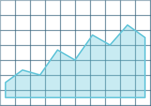
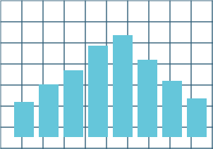
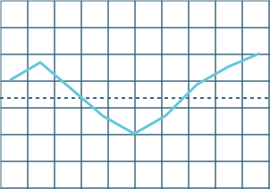
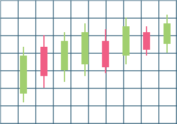
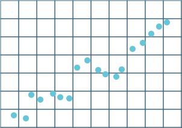
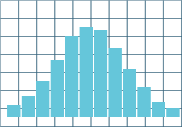
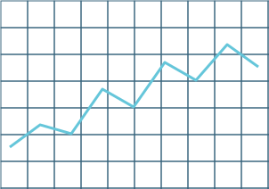
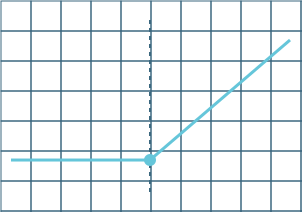
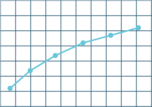

# Deephaven TradingView Lightweight Charts

Deephaven TradingView Lightweight Charts is a high-performance Python plotting plugin for Deephaven built on the [TradingView lightweight-charts](https://tradingview.github.io/lightweight-charts/) library. It is less general-purpose than `deephaven.plot.express`, with a deliberate focus on financial charts and the kinds of layouts traders expect — candlesticks, bars, area / baseline / line series, histograms, multi-pane stacks, and yield curves — paired with viewport-aware downsampling and server-side autobinning to keep render-time low on multi-million-row tables.

## Quickstart

Install via pip (or use a Docker image that already includes the plugin):

```bash
pip install deephaven-plugin-tradingview-lightweight
```

Inside Deephaven, build a two-pane chart with an OHLC candlestick + EMA overlay on top, and a volume histogram below:

```python order=chart,ohlc
import deephaven.plot.tradingview_lightweight as tvl

ohlc = tvl.data.ohlc()

chart = tvl.chart(
    tvl.candlestick(ohlc),
    tvl.line(ohlc, timestamp="Timestamp", value="Ema"),
    tvl.histogram(ohlc, timestamp="Timestamp", value="Volume", pane=1),
    pane_stretch_factors=[3, 1],
)
```

## Key Features

- **Live Table Support**: Direct integration with real-time Deephaven tables, so charts update as the underlying data ticks.
- **Viewport-Aware Downsampling**: Pixel-accurate, whitespace-based downsampling that keeps panning and zooming smooth on multi-million-row series.
- **Server-Side Autobinning**: Histograms compute bin widths and counts directly in the Deephaven query engine, avoiding round-trips of raw data.
- **Multi-Pane Stacks**: Price, volume, and indicator series can be stacked into separate panes with independent height ratios via `pane_index`.
- **Multiple Price Scales**: Left, right, and overlay price scales, with per-scale tick mark density and a configurable default scale for unbound series.
- **Annotations**: First-class support for watermarks, price lines, and markers, including `markers_from_table` for table-driven annotation streams.

## Chart Types

<CardList>

[](area.md)
[](bar.md)
[](baseline.md)
[](candlestick.md)
[](custom-numeric.md)
[](histogram.md)
[](line.md)
[](options-chart.md)
[](yield-curve.md)

</CardList>

## Terminology

The documentation for Deephaven TradingView Lightweight Charts routinely uses some common terms to help clarify how charts are intended to be composed:

- **Pane**: A horizontally stretched section of the chart that shares the same time scale as every other pane but has its own price scale. A common layout is a price pane on top and a volume pane below; `pane_index` selects which pane a series renders into.
- **Series**: A single drawn element on the chart — a candlestick, line, area, bar, baseline, or histogram series. A chart can contain many series across one or more panes.
- **Price scale**: The vertical axis a series is drawn against. Each pane has a left and right price scale, plus optional overlay scales identified by `price_scale_id`.
- **Price line**: A horizontal line drawn at a specific price level, optionally labeled. Useful for marking last close, breakeven, stop-loss, etc.
- **Marker**: An annotation pinned to a specific time on a specific series — an arrow, circle, or labeled shape used to highlight events such as trades, news, or signals.
- **Watermark**: Static text or an image drawn behind the chart, typically used for branding or to label the instrument being shown.
- **Time scale**: The horizontal time axis shared by all panes. Tick mark density and business-day handling are configured here.
- **Downsampling**: The viewport-aware reduction of plotted points so that the displayed series never contains more visually distinguishable points than the chart has horizontal pixels. Lossless at the visible resolution.
- **Autobin**: Server-side selection of histogram bin width and edges from the data, avoiding the need to specify `bin_width` manually.

## Contributing

We welcome contributions to Deephaven TradingView Lightweight Charts! If you encounter any issues, have ideas for improvements, or would like to add new features, please open an issue or submit a pull request on the [GitHub repository](https://github.com/deephaven/deephaven-plugins).

## License

Deephaven's TradingView Lightweight Charts plugin is licensed under the [Apache License 2.0](https://github.com/deephaven/deephaven-plugins/blob/main/plugins/tradingview-lightweight/LICENSE). You are free to use, modify, and distribute this library in compliance with the terms of the license.

## Acknowledgments

We would like to express our gratitude to the TradingView team for creating the [lightweight-charts](https://tradingview.github.io/lightweight-charts/) library and making it open-source. Their work forms the foundation of the Deephaven TradingView Lightweight Charts plugin.
