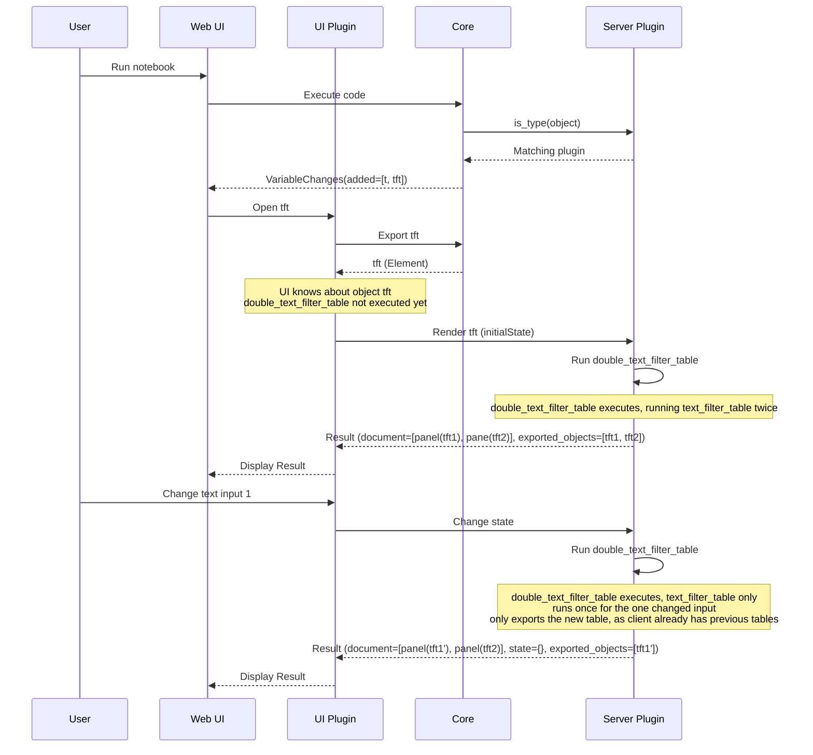
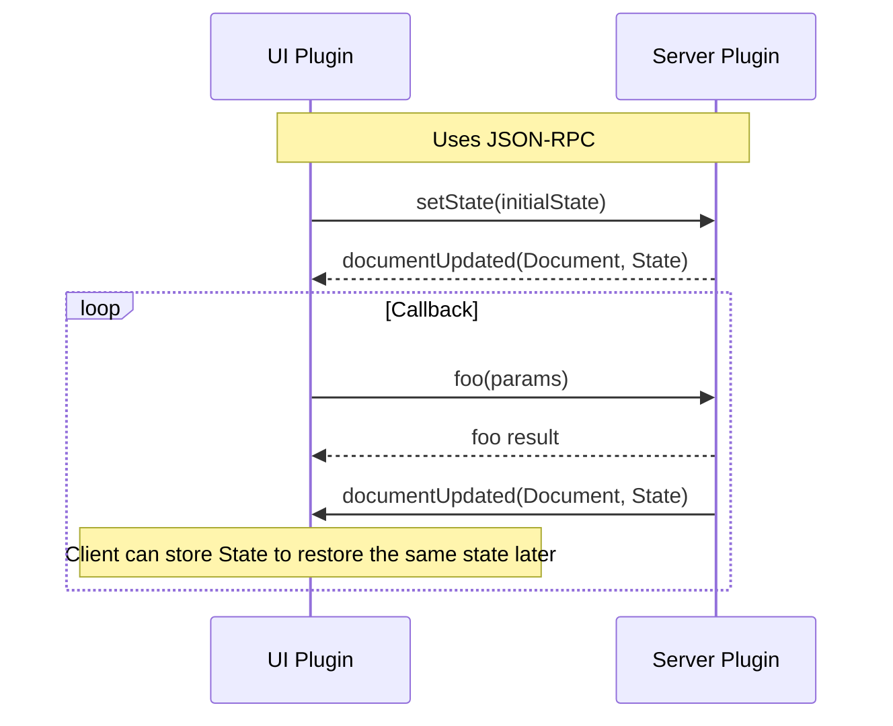

# deephaven.ui Plugin (alpha)

Prototype of the deephaven.ui plugin, mocking out some ideas of how to code up programmatic layouts and callbacks. This is currently very much a prototype and should be used for discussion and evaluation purposes only. Name `deephaven.ui` is not set in stone.

## Development Installation/Setup

1. Until a fix for a bug found with exporting custom objects, you'll need to build/run deephaven-core from @niloc132's branch: https://github.com/niloc132/deephaven-core/tree/4338-live-pyobject
2. Build/Install the `deephaven-plugin-ui` Python plugin in your deephaven-core set up: https://github.com/mofojed/deephaven-plugin-ui
3. Follow the instructions in the [README.md at the root](../../README.md) of this repository to build/install the JS plugins (including this one).

## Other Solutions/Examples

### Parameterized Query

```groovy
import io.deephaven.query.parameterized.ParameterizedQuery
import io.deephaven.query.parameterized.Parameter

myQuery = ParameterizedQuery.create()
  .with(Parameter.ofLong("low").inRange(0, 20).withDefault(5))
  .with(Parameter.ofLong("high").inRange(0, 20).withDefault(15))
  .willDo({scope ->
    def low = scope.getLong("low")
    def high = scope.getLong("high")
    def tableResult = db.t("LearnDeephaven", "StockTrades")
    .where("Date=`2017-08-25`", "Size<=$high", "Size>=$low")
    plotResult = plot("Stuff", tableResult, "Timestamp", "Last").show()
    scope.setResult("tableResult", tableResult)
    scope.setResult("plotResult", plotResult)
  }).build()
```

##### Pros

- Already works
- Scope is defined, and re-runs the whole scope when any param changes
- Easy to understand

##### Cons

- Lots of boilerplate
- Syntax easy to get incorrect
- Lots of strings
- No python
- No specifying different contexts (shared PPQ among sessions/users for example)
- No composability - cannot re-use PPQs within PPQs, or define a "component" that gets used

### Callbacks with decorators (plotly, Shiny for python)

```python
from dash import Dash, html, dcc, Input, Output

app = Dash(__name__, external_stylesheets=external_stylesheets)
app.layout = html.Div(
    [
        dcc.RangeSlider(0, 20, 1, value=[5, 15], id="my-range-slider"),
        html.Div(id="output-container-range-slider"),
    ]
)


@app.callback(
    Output("output-container-range-slider", "children"),
    [Input("my-range-slider", "value")],
)
def update_output(value):
    return 'You have selected "{}"'.format(value)


if __name__ == "__main__":
    app.run_server()
```

Other examples: https://shiny.posit.co/py/docs/overview.html

##### Pros

- Decorators are nice "magic"

##### Cons

- Lots of strings need to match, easy to make a mistake
- Difficult to visualize
- Not sure how to iterate
- Need to have an object named `app`, so not really "composable"

### Streamlit (re-runs entire script on any change)

```python
import streamlit as st

x = st.slider("x")
st.write(x, "squared is", x * x)


@st.cache  # tells streamlit to memoize this function though
def expensive_computation(a, b):
    time.sleep(2)  # This makes the function take 2s to run
    return a * b


a = 2
b = 21
res = expensive_computation(a, b)
st.write("Result:", res)
```

##### Pros

- Can use the values easily anywhere in your script
- Entire script re-runs with any change, easy to understand, easy to iterate

##### Cons

- Re-running everything can be costly, need to be conscious with caching/memoization
- Does not achieve composability

## Proposed Syntaxes

### Interactive Query

Early prototype: https://github.com/mofojed/deephaven-plugin-interactive
UI: https://github.com/mofojed/deephaven-js-plugins/tree/interactive

#### Basic Example

Creates a table that simply updates with the value of the slider.

```python
from deephaven.plugin.interactive import make_iq, dh
from deephaven import empty_table


def my_func(x, a):
    print("x is now " + str(x))
    t = empty_table(1).update_view([f"x={x}"])
    return {"t": t}


my_query = make_iq(my_func, x=dh.slider(22, 2, 111))
```

#### Plotting Example

Create two plots showing a sine function and cosine function with the values set from the slider.

```python
from deephaven.plugin.interactive import make_iq, dh
from deephaven import empty_table
from deephaven.plot.figure import Figure


def sin_func(amplitude, frequency, phase):
    # Note: Should use QST to create filters instead of f-strings?
    t = empty_table(1000).update_view(
        ["x=i", f"y={amplitude}*Math.sin(x*{frequency}+{phase})"]
    )
    f = Figure().plot_xy(series_name="Series", t=t, x="x", y="y").show()
    return {"t": t, "f": f}


def cos_func(amplitude, frequency, phase):
    t = empty_table(1000).update_view(
        ["x=i", f"y={amplitude}*Math.cos(x*{frequency}+{phase})"]
    )
    f = Figure().plot_xy(series_name="Series", t=t, x="x", y="y").show()
    return {"t": t, "f": f}


inputs = {"amplitude": dh.slider(1), "frequency": dh.slider(1), "phase": dh.slider(1)}

iqs = make_iq(sin_func, **inputs)
iqc = make_iq(cos_func, **inputs)
```

##### Pros

- No magic strings (though does have dictionary keys for kwargs)
- Scope is defined, and re-runs the whole scope when any param changes
- Easy to understand
- Should be "easy" to implement once bidirection plugins are completed

##### Cons

- Not clear how to "chain" inputs (e.g. slider based on a table based on another input control, reacting to a click within a table)... unless nesting functions is allowed

### React-like syntax

Use "React hooks" like inspired syntax to write blocks that "re-render" when state changes. **Note**: These examples are just mockups for illustrating the proposed syntax. They may not actually compile.

#### Components (for composability)

Using a "React-like" syntax, it is possible to define "components" which can be re-used and compose other components. For example, we may want to make a "filterable table" component, that just provides a text input field above a table that you can use to filter a specific column in the table.


Read about [React](https://react.dev/learn) and [React Hooks](https://react.dev/reference/react) if you are unfamiliar with them for a primer on the design principles followed. Here is an example of a proposed syntax for that:

```python
import deephaven.ui as ui

# @ui.component decorator marks a function as a "component" function
# By adding this decorator, wraps the function such that "hooks" can be used within the function (effectively similar to `React.createElement`). Hooks are functions following the convention `use_*`, can only be used within a `@ui.component` context
@ui.component
def text_filter_table(source: Table, column: str):
    # The value of the text filter is entirely separate from the text input field definition
    value, set_value = ui.use_state("")

    # TODO: Should be using QST/filters here instead, e.g. https://github.com/deephaven/deephaven-core/issues/3784
    t = source.where(f"{column}=`{value}`")

    # Return a column that has the text input, then the table below it
    return ui.flex(
        [
            ui.text_input(
                value=value, on_change=lambda event: set_value(event["value"])
            ),
            t,
        ]
    )
```

The above component, could then be re-used, to have two tables side-by-side:


```python
# Just using one source table, and allowing it to be filtered using two different filter inputs
@ui.component
def double_filter_table(source: Table, column: str):
    return ui.flex(
        [text_filter_table(source, column), text_filter_table(source, column)],
        direction="row",
    )
```

#### Re-using Components

You can re-use a component, but with different parameters. For example, we may want to have a component that shows an input for `Sym` and the resulting table, and re-use that to show different exchanges:

```python
@ui.component
def stock_table(exchange: str):
    sym, set_sym = use_state("AAPL")
    table = use_memo(
        lambda: db.live_table("LearnDeephaven", "StockTrades").where(
            [f"Exchange=`{exchange}`", f"Sym=`{sym}`"]
        ),
        [exchange, sym],
    )
    return [ui.text_input(value=sym, on_value_change=set_sym), table]


nasdaq_table = stock_table("NASDAQ")
nyse_table = stock_table("NYSE")
```

#### Memoization/Caching

React has a hook [useMemo](https://react.dev/reference/react/useMemo) which is used to cache operations if no dependencies have changed. Streamlit has [Caching](https://docs.streamlit.io/library/advanced-features/caching#basic-usage) as well using `@st.cache_data` and `@st.cache_resource` decorators. We will definitely need some sort of caching, we will need to determine the paradigm. Consider first the example without any caching:

```python
import deephaven.ui as ui
from deephaven.parquet import read


@ui.component
def my_caching_component(parquet_path="/data/stocks.parquet"):
    value, set_value = ui.use_state("")

    # This parquet `read` operation fires _every_ time the component is re-rendered, which happens _every_ time the `value` is changed. This is unnecessary, since we only want to re-run the `.where` part and keep the `source` the same.
    source = read(parquet_path)
    t = source.where(f"sym=`{value}`")

    return ui.flex(
        [
            ui.text_input(
                value=value, on_change=lambda event: set_value(event["value"])
            ),
            t,
        ]
    )
```

Now using a `use_memo` hook, similar to React. This re-enforces the `use_*` hook type behaviour.

```python
import deephaven.ui as ui
from deephaven.parquet import read


@ui.component
def text_filter_table(source: Table, column: str):
    # The value of the text filter is entirely separate from the text input field definition
    value, set_value = ui.use_state("")

    # TODO: Should be using QST/filters here instead, e.g. https://github.com/deephaven/deephaven-core/issues/3784
    t = source.where(f"{column}=`{value}`")

    # Return a column that has the text input, then the table below it
    return ui.flex(
        [
            ui.text_input(
                value=value, on_change=lambda event: set_value(event["value"])
            ),
            t,
        ]
    )


@ui.component
def my_caching_component(parquet_path="/data/stocks.parquet"):
    value, set_value = ui.use_state("")

    # The `read` function will only be called whenever `parquet_path` is changed
    source = use_memo(lambda: read(parquet_path), [parquet_path])
    t = source.where(f"sym=`{value}`")

    return ui.flex(
        [
            ui.text_input(
                value=value, on_change=lambda event: set_value(event["value"])
            ),
            t,
        ]
    )
```

Trying to define it as a decorator gets kind of messy within a functional component. You'd probably want to define at a top level, which is kind of weird:

```python
import deephaven.ui as ui
from deephaven.parquet import read

# Decorator wraps function and will only re-run the function if it hasn't run before or if it doesn't already have the result from a previous execution with the same parameters
@ui.memo
def parquet_table(path: str):
    return read(path)


@ui.component
def my_caching_component(parquet_path="/data/stocks.parquet"):
    value, set_value = ui.use_state("")

    # Memoization is handled by the `parquet_table` method itself
    source = parquet_table(parquet_path)
    t = source.where(f"sym=`{value}`")

    return ui.flex(
        [
            ui.text_input(
                value=value, on_change=lambda event: set_value(event["value"])
            ),
            t,
        ]
    )
```

#### “One Click” plots with Input Filters

Plots work with one_click operations, e.g.

```python
from deephaven.parquet import read
from deephaven.plot.selectable_dataset import one_click
import deephaven.plot.express as dx

source = read("/data/stocks.parquet")
oc = one_click(t=source, by=["Sym"])

# Support for SelectableDataSet in deephaven express is still WIP
plot = dx.line(oc, x="Timestamp", y="Price")
```

The above still requires adding an Input Filter to the dashboard from the UI. You can also add an Input Filter from code, e.g.

```python
from deephaven.parquet import read
from deephaven.plot.selectable_dataset import one_click
import deephaven.plot.express as dx
from deephaven import dtypes as dht

source = read("/data/stocks.parquet")
oc = one_click(t=source, by=["Sym"])

# Support for SelectableDataSet in deephaven express is still WIP
plot = dx.line(oc, x="Timestamp", y="Price")

# Create an Input Filter control that filters on the "Sym" column of type string
sym_filter = ui.input_filter(column="Sym", type=dht.string)
```

The above will add the plot and input filter to default locations in the dashboard. You can specify a dashboard layout if you want control of where the components are placed, e.g.

```python
d = ui.dashboard(ui.column(sym_filter, plot))
```

Along with the standard text Input Filter, you can add other types such as a Dropdown Filter:

```python
from deephaven.parquet import read
from deephaven.plot.selectable_dataset import one_click
import deephaven.plot.express as dx
from deephaven import dtypes as dht

source = read("/data/stocks.parquet")
oc = one_click(t=source, by=["Sym"])

# Support for SelectableDataSet in deephaven express is still WIP
plot = dx.line(oc, x="Timestamp", y="Price")

# Create a Dropdown Filter control that filters on the "Sym" column of type string
sym_filter = ui.dropdown_filter(source=source, source_column="Sym")
```

You can put these in to a `@ui.component` function as well, if you wanted to have an input for the file path to read from, e.g.

```python
from deephaven.parquet import read
from deephaven.plot.selectable_dataset import one_click
import deephaven.plot.express as dx
from deephaven import dtypes as dht


@ui.component
def my_oc_dash():
    # Store the path in state so it can be changed
    path, set_path = use_state("/data/stocks.parquet")

    source = use_memo(lambda: read(path), [path])

    oc = use_memo(lambda: one_click(t=source, by=["Sym"]), [path])

    plot = use_memo(lambda: dx.line(oc, x="Timestamp", y="Price"), [oc])

    sym_filter = ui.dropdown_filter(source=source, source_column="Sym")

    # Dashboard where the top row is a text input for the path and input filter for Sym, then the resulting plot underneath
    return ui.dashboard(
        ui.column(
            ui.row(ui.text_input(value=path, on_change=set_path), sym_filter), plot
        )
    )


d = my_oc_dash()
```

#### Table Actions/Callbacks

We want to be able to react to actions on the table as well. This can be achieved by adding a callback to the table, and used to set the state within our component. For example, if we want to filter a plot based on the selection in another table:


```python
import deephaven.ui as ui


@ui.component
def table_with_plot(source: Table, column: str = "Sym", default_value: str = ""):
    value, set_value = ui.use_state(default_value)

    # Wrap the table with an interactive component to listen to selections within the table
    selectable_table = ui.use_memo(
        lambda: interactive_table(
            t=source,
            # When data is selected, update the value
            on_row_clicked=lambda event: set_value(event["data"][column]),
        ),
        [source],
    )

    # Create the plot by filtering the source using the currently selected value
    p = ui.use_memo(
        lambda: plot_xy(
            t=source.where(f"{column}=`{value}`"), x="Timestamp", y="Price"
        ),
        [value],
    )

    return ui.flex([selectable_table, p])
```

OR could we add an attribute to the table instead? And a custom function on table itself to handle adding that attribute? E.g.:

```python
import deephaven.ui as ui


@ui.component
def table_with_plot(source: Table, column: str = "Sym", default_value: str = ""):
    value, set_value = ui.use_state(default_value)

    # Add the row clicked attribute
    # equivalent to `selectable_table = t.with_attributes({'__on_row_clicked': my_func})`
    selectable_table = source.on_row_clicked(
        lambda event: set_value(event["data"][column])
    )

    # Create the plot by filtering the source using the currently selected value
    p = ui.use_memo(
        lambda: plot_xy(
            t=source.where(f"{column}=`{value}`"), x="Timestamp", y="Price"
        ),
        [value],
    )

    return ui.flex([selectable_table, p])
```

#### Multiple Plots

We can also use the same concept to have multiple plots, and have them all update based on the same input. For example, if we want to have two plots, one showing the "Last" price, and another showing the "Bid" price:


```python
import deephaven.ui as ui


@ui.component
def two_plots(source: Table, column: str = "Sym", default_value: str = ""):
    value, set_value = ui.use_state(default_value)

    # Create the two plots by filtering the source using the currently selected value
    p1 = ui.use_memo(
        lambda: plot_xy(t=source.where(f"{column}=`{value}`"), x="Timestamp", y="Last"),
        [value],
    )
    p2 = ui.use_memo(
        lambda: plot_xy(t=source.where(f"{column}=`{value}`"), x="Timestamp", y="Bid"),
        [value],
    )

    return ui.flex([p1, p2])
```

#### Text Input to Filter a Plot

We can also use the same concept to have a text input field that filters a plot. For example, if we want to have a text input field that filters a plot based on the "Sym" column:


```python
import deephaven.ui as ui


@ui.component
def text_input_plot(source: Table, column: str = "Sym"):
    value, set_value = ui.use_state("")

    # Create the plot by filtering the source using the currently selected value
    # TODO: Is this link visible in the UI or just implicit?
    p = ui.use_memo(
        lambda: plot_xy(t=source.where(f"{column}=`{value}`"), x="Timestamp", y="Last"),
        [value],
    )

    return ui.flex(
        [
            # Text input will update the value when it is changed
            ui.text_input(
                value=value, on_change=lambda event: set_value(event["value"])
            ),
            # Plot will be filtered/updated based on the above logic
            p,
        ]
    )
```

#### Required Parameters

Sometimes we want to require the user to enter a value before applying filtering operations. We can do this by adding a `required` label to the `text_input` itself, and then displaying a label instead of the table:

```python
import deephaven.ui as ui


@ui.component
def text_filter_table(source: Table, column: str):
    value, set_value = ui.use_state("")

    # Return a column that has the text input, then the table below it
    return ui.flex(
        [
            ui.text_input(
                value=value,
                on_change=lambda event: set_value(event["value"]),
                required=True,
            ),
            (
                # Use Python ternary operator to only display the table if there has been a value entered
                source.where(f"{column}=`{value}`")
                if value
                else ui.info("Please input a filter value")
            ),
        ]
    )
```

Alternatively, we could have an overlay displayed on the table if an invalid filter is entered.

#### Cross-Dependent Parameters (DH-15360)

You can define parameters which are dependent on another parameter. You could define two range sliders for a low and high, for example:

```python
import deephaven.ui as ui


@ui.component
def two_sliders(min=0, max=10000):
    lo, set_lo = use_state(min)
    hi, set_hi = use_state(max)

    # Use the `hi` currently set as the `max`. Will update automatically as `hi` is adjusted
    s1 = ui.slider(value=lo, min=min, max=hi, on_change=set_lo)

    # Use the `lo` currently set as the `min`. Will update automatically as `lo` is adjusted
    s2 = ui.slider(value=hi, min=lo, max=max, on_change=set_hi)

    return [s1, s2]
```

Or if you want a drop-down list that is dependent only on a filtered list of results from another table:

```python
@ui.component
def filtered_accounts(source):
    company, set_company = use_state("")
    trader, set_trader = use_state("")

    return [
        # Use the distinct "Company" values as the possible options in the dropdown
        ui.dropdown(source.select_distinct("Company")),
        # Use the distinct "Trader" values after filtering the source by "Company"
        ui.dropdown(source.where(f"Company={company}").select_distinct("Trader")),
        # Show the table filtered on both "Company" and "Trader" selected
        source.where([f"Company={company}", f"Trader={trader}"]),
    ]
```

#### Multiple Queries (Enterprise only)

We want to be able to pull in widgets/components from multiple queries. In DHC we have the [URI resolver](https://deephaven.io/core/docs/reference/uris/uri/) for resolving another resource, and should be able to extend that same functionality to resolve another PQ.

```python
# Persistent Query 'A'
t = empty_table(100).update("a=i")

# Persistent Query 'B'
t = empty_table(100).update("b=i")

# Executed in console session or a 3rd query
import deephaven.ui as ui
from deephaven.uri import resolve


@ui.component
def multi_query():
    # Since the `resolve` method is only called from within a `@ui.component` wrapped function, it is only called when the component is actually rendered (e.g. opened in the UI)
    # Note however this is still resolving the table on the server side, rather than the client fetching the table directly.
    t1 = resolve("dh+plain://query-a:10000/scope/t")
    t2 = resolve("dh+plain://query-b:10000/scope/t")
    return [t1, t2]


mq = multi_query()
```

We could also have a custom function defined such that an object will tell the UI what table to fetch; the downside of this is you would be unable to chain any table operations afterwards (NOTE: It _may_ be possible to build it such that we could do this, using QST and just having the UI apply an arbitrary set of operations defined by the QST afterwards? But may be tricky to build):

```python
# Persistent Query 'A'
t = empty_table(100).update("a=i")

# Persistent Query 'B'
t = empty_table(100).update("b=i")

# Executed in console session or a 3rd query
import deephaven.ui as ui


@ui.component
def multi_query():
    # Object that contains metadata about the table source, then UI client must fetch
    t1 = ui.pq_table("Query A", "t")
    t2 = ui.pq_table("Query B", "t")
    return [t1, t2]


mq = multi_query()
```

It may be that we want to do something interesting, such as defining the input in one query, and defining the output in another query.

```python
# Persistent Query 'A'
import deephaven.ui as ui


@ui.component
def my_input(value, on_change):
    return ui.text_input(value, on_change)


# Persistent Query 'B'
import deephaven.ui as ui


@ui.component
def my_output(value):
    return empty_table(100).update(f"sym=`{value}`")


# Executed in console session or a 3rd query
import deephaven.ui as ui


@ui.component
def multi_query():
    sym, set_sym = use_state("")

    # TODO: Would this actually work? Resolving to a custom type defined in plugins rather than a simple table object
    my_input = resolve("dh+plain://query-a:10000/scope/my_input")
    my_output = resolve("dh+plain://query-b:10000/scope/my_output")

    return [my_input(sym, set_sym), my_output(sym)]


mq = multi_query()
```

#### Putting it all together

Using the proposed components and selection listeners, you should be able to build pretty powerful components, and subsequently dashboards. For example, we could build a component that has the following:

- Dual range slider for specifying the "Size" of trades to filter on
- Table showing only the filtered range
- Text input to filter a specific Sym for a plot derived from the table
- Clicking a row within the table selects that Sym and updates the text input to reflect that
- Clicking a data point in the plot will print out that data


```python
import deephaven.ui as ui
import deephaven.plot.express as dx


@ui.component
def stock_widget(source: Table, column: str = "Sym"):
    lo, set_lo = use_state(0)
    hi, set_hi = use_state(10000)
    sym, set_sym = use_state("")

    # Create the filtered table
    filtered_table = ui.use_memo(
        lambda: source.where([f"Price >= {lo} && Price <= {hi}"]), [lo, hi]
    )

    p = ui.use_memo(
        lambda: dx.line(filtered_table.where(f"Sym=`{sym}`"), x="Timestamp", y="Last"),
        [filtered_table],
    )

    def handle_slider_change(event):
        set_lo(event.value.lo)
        set_hi(event.value.hi)

    return ui.flex(
        [
            # Slider will update the lo/hi values on changes
            ui.range_slider(
                lo=lo, hi=hi, min=0, max=10000, on_change=handle_slider_change
            ),
            # Wrap the filtered table so you can select a row
            ui.interactive_table(
                t=filtered_table,
                # Update the Sym value when a row is selected
                on_row_clicked=lambda event: set_sym(event["data"][column]),
            ),
            # Text input will update the sym when it is changed, or display the new value when selected from the table
            ui.text_input(value=sym, on_change=lambda event: set_sym(event["value"])),
            # Wrap the filtered plot so you can select data
            ui.interactive_plot(
                p=p, on_data_clicked=lambda event: print(f"data selected: {str(event)}")
            ),
        ]
    )
```

#### Layouts/Dashboards

The above examples focussed solely on defining components, all of which are simply rendered within one panel by default. Part of the ask is also about defining panels and dashboards/layouts. We use [Golden Layout](https://golden-layout.com/examples/), which defines all layouts in terms of placing Panels in [Rows, Columns and Stacks](https://golden-layout.com/tutorials/getting-started.html):

- **Panel**: A panel with a tab header, containing one or more components. Can be moved around and resized within a dashboard.
- **Row**: A row of panels arranged horizontally.
- **Column**: A column of panels arranged vertically.
- **Stack**: A stack of panels that overlap one another. Click the tab header to switch between them.
- **Dashboard**: A layout of an entire dashboard

We should be able to map these by using [ui.panel](#uipanel), [ui.row](#uirow), [ui.column](#uicolumn), [ui.stack](#uistack), and [ui.dashboard](#uidashboard).

##### ui.panel

By default, the top level `@ui.component` will automatically be wrapped in a panel, so no need to define it unless you want custom panel functionality, such as giving the tab a custom name, color or calling a method such as focus e.g.:

```py
# The only difference between this and `p = my_component()` is that the title of the panel will be set to `My Title`
p = ui.panel(my_component(), label="My Tab Label")
```

A panel cannot be nested within other components (other than the layout ones such as [ui.row](#uirow), [ui.column](#uicolumn), [ui.stack](#uistack), [ui.dashboard](#uidashboard)). The basic syntax for creating a `UIPanel` is:

```py
import deephaven.ui as ui
ui_panel = ui.panel(
    *children: Element,
    label: (str | Element)[] | None = None,
    description: str | Element | None = None,
    background_color: Color | None = None,
    tab_background_color: Color | None = None,
    height: int | None = None,
    width: int | None = None,
    is_closable: bool = True,
    on_focus: Callable[[UIPanel], None] | None = None,
    on_blur: Callable[[UIPanel], None] | None = None,
    on_hide: Callable[[UIPanel], None] | None = None,
    on_show: Callable[[UIPanel], None] | None = None,
    on_open: Callable[[UIPanel], None] | None = None,
    on_close: Callable[[UIPanel], None] | None = None,
) -> UIPanel
```

###### Parameters

| Parameter              | Type                                | Description                                                                                                                                                                                                                                                                                           |
| ---------------------- | ----------------------------------- | ----------------------------------------------------------------------------------------------------------------------------------------------------------------------------------------------------------------------------------------------------------------------------------------------------- |
| `*children`            | `Element`                           | The component(s) to render within the panel.                                                                                                                                                                                                                                                          |
| `label`                | `(str \| Element)[] \| None`        | The label of the panel. If not provided, a name will be created based on the variable name the top-level component is assigned to. Icons can also be added as children, with a sibling element for the label.                                                                                         |
| `description`          | `str \| Element \| None`            | A description of the panel. Will appear in the tooltip when hovering the panel tab. Can also include an element here.                                                                                                                                                                                 |
| `height`               | `int \| None`                       | The height of the panel, within the current column, relative to the other children of its parent in percent. Only applies if the panel is the child of a column element. If not provided, the panel will be sized automatically.                                                                      |
| `width`                | `int \| None`                       | The width of the panel, relative to the other children of its parent in percent. Only applies if the panel is the child of a row element. If not provided, the panel will be sized automatically.                                                                                                     |
| `background_color`     | `Color \| None`                     | Custom background color of the panel.                                                                                                                                                                                                                                                                 |
| `tab_background_color` | `Color \| None`                     | Custom background color of the tab for the panel.                                                                                                                                                                                                                                                     |
| `is_closable`          | `bool`                              | Whether the panel can be closed when part of a dashboard layout, panels will always be closeable as part of consoles.                                                                                                                                                                                 |
| `on_focus`             | `Callable[[UIPanel], None] \| None` | Callback function to be called when the panel is focused. Triggered when user clicks within the panel or clicks the panel tab. If the panel was previously hidden, this will fire after `on_show` fires for this panel. Will also fire after the `on_blur` triggers for the previously focused panel. |
| `on_blur`              | `Callable[[UIPanel], None] \| None` | Callback function to be called when the panel is blurred and something else in the UI takes focus. If the panel is now hidden, the `on_blur` will fire after the `on_hide` event.                                                                                                                     |
| `on_hide`              | `Callable[[UIPanel], None] \| None` | Callback function to be called when the panel is hidden. If the panel was in focus, `on_hide` will fire before `on_blur` is fired.                                                                                                                                                                    |
| `on_show`              | `Callable[[UIPanel], None] \| None` | Callback function to be called when the panel is shown. If the panel is also focused, the `on_show` event will fire first.                                                                                                                                                                            |
| `on_open`              | `Callable[[UIPanel], None] \| None` | Callback function to be called when the panel is opened.                                                                                                                                                                                                                                              |
| `on_close`             | `Callable[[UIPanel], None] \| None` | Callback function to be called when the panel is closed.                                                                                                                                                                                                                                              |

###### Methods

| Method    | Description        |
| --------- | ------------------ |
| `close()` | Closes the panel.  |
| `focus()` | Focuses the panel. |

##### ui.dashboard

You can use the `ui.dashboard` function to define a dashboard, along with [ui.row](#uirow), [ui.column](#uicolumn), and [ui.stack](#uistack). A dashboard will be opened in a separate dashboard tab instead of within your current code studio. For example, to define a dashboard with an input panel in the top left, a table in the top right, and a stack of plots across the bottom, you could define it like so:

```py
import deephaven.ui as ui

# ui.dashboard takes only one root element
d = ui.dashboard(
    ui.column(
        [
            ui.row([my_input_panel(), my_table_panel()]),
            ui.stack([my_plot1(), my_plot2()]),
        ]
    )
)
```

The `ui.dashboard` function requires a single argument, which is the root element of the dashboard. This can be a single component, or a layout of components. The `ui.dashboard` function also takes the following optional parameters:

```py
import deephaven.ui as ui
ui_dashboard= ui.dashboard(
    root: Element,
    label: Optional[str] = None,
    description: Optional[str] = None,
    background_color: Optional[Color] = None,
    filters: Optional[DashboardFilter[]] = None,
    links: Optional[Link[]] = None,
    settings: Optional[DashboardSettings] = None,
    on_focus: Optional[Callable[[UIDashboard], None]] = None,
    on_blur: Optional[Callable[[UIDashboard], None]] = None,
    on_hide: Optional[Callable[[UIDashboard], None]] = None,
    on_show: Optional[Callable[[UIDashboard], None]] = None,
    on_open: Optional[Callable[[UIDashboard], None]] = None,
    on_close: Optional[Callable[[UIDashboard], None]] = None,
) -> UIDashboard
```

###### Parameters

| Parameter              | Type                                      | Description                                                                                                                                                                                                         |
| ---------------------- | ----------------------------------------- | ------------------------------------------------------------------------------------------------------------------------------------------------------------------------------------------------------------------- |
| `root`                 | `Element`                                 | The root element of the dashboard. Can be a [ui.row](#uirow), [ui.column](#uicolumn), or [ui.stack](#uistack) to build a dashboard with multiple panels, or can just be a widget that takes up the whole dashboard. |
| `label`                | `Optional[str]`                           | The label of the dashboard. If not provided, a name will be created based on the variable name the top-level component is assigned to. Icons can also be added as children, with a sibling element for the label.   |
| `description`          | `Optional[str]`                           | A description of the dashboard purpose or contents. Shown to users in the dashboard tooltip, or a directory listing of dashboards.                                                                                  |
| `background_color`     | `Optional[Color]`                         | Custom background color of the dashboard.                                                                                                                                                                           |
| `filters`              | `Optional[list[DashboardFilter]]`         | Filters to apply to every item with a matching column/type, to match the filter value specified.                                                                                                                    |
| `links`                | `Optional[list[Link]]`                    | Links between items on the dashboard. User will be able to see these links and modify them using the Linker tool.                                                                                                   |
| `settings`             | `Optional[DashboardSettings]`             | Settings for the dashboard. Pass in a dictionary with the appropriate keys.                                                                                                                                         |
| `settings.has_headers` | `Optional[bool]`                          | Whether the dashboard should have headers.                                                                                                                                                                          |
| `settings.has_popout`  | `Optional[bool]`                          | Whether the dashboard should have a popout button.                                                                                                                                                                  |
| `on_focus`             | `Optional[Callable[[UIDashboard], None]]` | Callback function to be called when the dashboard is focused. Triggered when user clicks within the dashboard. If the dashboard was previously hidden, this will fire after `on_show` fires for this dashboard.     |
| `on_blur`              | `Optional[Callable[[UIDashboard], None]]` | Callback function to be called when the dashboard is blurred and something else in the UI takes focus. If the dashboard is now hidden, the `on_blur` will fire after the `on_hide` event.                           |
| `on_hide`              | `Optional[Callable[[UIDashboard], None]]` | Callback function to be called when the dashboard is hidden. If the dashboard was in focus, `on_hide` will fire before `on_blur` is fired.                                                                          |
| `on_show`              | `Optional[Callable[[UIDashboard], None]]` | Callback function to be called when the dashboard is shown. If the dashboard is also focused, the `on_show` event will fire first.                                                                                  |
| `on_open`              | `Optional[Callable[[UIDashboard], None]]` | Callback function to be called when the dashboard is opened.                                                                                                                                                        |
| `on_close`             | `Optional[Callable[[UIDashboard], None]]` | Callback function to be called when the dashboard is closed.                                                                                                                                                        |

###### Methods

| Method    | Description            |
| --------- | ---------------------- |
| `close()` | Closes the dashboard.  |
| `focus()` | Focuses the dashboard. |
| `open()`  | Opens the dashboard.   |

##### ui.row

Define a row of panels to add to a [UIDashboard](#uidashboard).

```py
import deephaven.ui as ui
ui_row = ui.row(
    *children: Element,
    height: int | None = None
) -> UIRow
```

###### Parameters

| Parameter   | Type      | Description                                                                                                                           |
| ----------- | --------- | ------------------------------------------------------------------------------------------------------------------------------------- |
| `*children` | `Element` | The components to render within the row.                                                                                              |
| `height`    | `int`     | The height of the row, relative to the other children of its parent in percent. If not provided, the row will be sized automatically. |

##### ui.column

Define a column of panels to add to a [UIDashboard](#uidashboard).

```py
import deephaven.ui as ui
ui_column = ui.column(
    *children: Element,
    width: int | None = None
) -> UIColumn
```

###### Parameters

| Parameter   | Type      | Description                                                                                                                                |
| ----------- | --------- | ------------------------------------------------------------------------------------------------------------------------------------------ |
| `*children` | `Element` | The components to render within the column.                                                                                                |
| `width`     | `int`     | The width of the column, relative to the other children of its parent in percent. If not provided, the column will be sized automatically. |

##### ui.stack

Define a stack of panels to add to a [UIDashboard](#uidashboard).

```py
import deephaven.ui as ui
ui_stack = ui.stack(
    *children: Element,
    height: int | None = None,
    width: int | None = None
) -> UIStack
```

###### Parameters

| Parameter   | Type      | Description                                                                                                                               |
| ----------- | --------- | ----------------------------------------------------------------------------------------------------------------------------------------- |
| `*children` | `Element` | The components to render within the stack.                                                                                                |
| `height`    | `int`     | The height of the stack, relative to the other children of its parent in percent. If not provided, the stack will be sized automatically. |
| `width`     | `int`     | The width of the stack, relative to the other children of its parent in percent. If not provided, the stack will be sized automatically.  |

##### ui.link

You can add links between components as well. Add the `id` property to components you wish to link, then specify the links on the dashboard itself:

```python
@ui.component
def my_dashboard():
    t1 = empty_table(100).update("a=i")
    t2 = empty_table(100).update("b=i", "c=Math.sin(i)")

    return ui.dashboard(
        ui.row([ui.table(t1, id="t1"), ui.table(t2, id="t2")]),
        links=[
            # Create a link from the "a" column of t1 to the "b" column of t2
            ui.link(
                start=ui.link_point("t1", column="a"),
                end=ui.link_point("t2", column="b"),
            )
        ],
    )


d = my_dashboard()
```

##### ui.item

An item that can be added to a menu, such as a `ui.picker`

```py
import deephaven.ui as ui
ui.item(
    children: Stringable,
    **props: Any
) -> ItemElement
```

###### Parameters

| Parameter   | Type         | Description                            |
| ----------- | ------------ | -------------------------------------- |
| `*children` | `Stringable` | The options to render within the item. |
| `**props`   | `Any`        | Any other Item prop                    |

##### ui.section

A section that can be added to a menu, such as a `ui.picker`. Children are the dropdown options.

```py
import deephaven.ui as ui
ui.section(
    *children: Item,
    title: str | None = None,
    **props: Any
) -> SectionElement
```

###### Parameters

| Parameter   | Type          | Description                               |
| ----------- | ------------- | ----------------------------------------- |
| `*children` | `Item`        | The options to render within the section. |
| `title`     | `str \| None` | The title of the section.                 |
| `**props`   | `Any`         | Any other Section prop                    |

##### ui.picker

A picker that can be used to select from a list. Children should be one of four types:  
If children are of type `Item`, they are the dropdown options.  
If children are of type `SectionElement`, they are the dropdown sections.  
If children are of type `Table`, the values in the table are the dropdown options. There can only be one child, the `Table`.
If children are of type `PartitionedTable`, the values in the table are the dropdown options and the partitions create multiple sections. There can only be one child, the `PartitionedTable`.

```py
import deephaven.ui as ui
ui.picker(
    *children: Item | SectionElement | Table | PartitionedTable,
    key_column: ColumnName | None = None,
    label_column: ColumnName | None = None,
    description_column: ColumnName | None = None,
    icon_column: ColumnName | None = None,
    title_column: ColumnName | None = None,
    default_selected_key: Key | None = None,
    selected_key: Key | None = None,
    on_selection_change: Callable[[Key], None] | None = None,
    on_change: Callable[[Key], None] | None = None,
    **props: Any
) -> PickerElement
```

###### Parameters

| Parameter              | Type                                                  | Description                                                                                                                                                                                                                                                                  |
| ---------------------- | ----------------------------------------------------- | ---------------------------------------------------------------------------------------------------------------------------------------------------------------------------------------------------------------------------------------------------------------------------- |
| `*children`            | `Item \| SectionElement \| Table \| PartitionedTable` | The options to render within the picker.                                                                                                                                                                                                                                     |
| `key_column`           | `ColumnName \| None`                                  | Only valid if children are of type `Table` or `PartitionedTable`. The column of values to use as item keys. Defaults to the first column.                                                                                                                                    |
| `label_column`         | `ColumnName \| None`                                  | Only valid if children are of type `Table` or `PartitionedTable`. The column of values to display as primary text. Defaults to the `key_column` value.                                                                                                                       |
| `description_column`   | `ColumnName \| None`                                  | Only valid if children are of type `Table` or `PartitionedTable`. The column of values to display as descriptions.                                                                                                                                                           |
| `icon_column`          | `ColumnName \| None`                                  | Only valid if children are of type `Table` or `PartitionedTable`. The column of values to map to icons.                                                                                                                                                                      |
| `title_column`         | `ColumnName \| None`                                  | Only valid if children is of type `PartitionedTable`. The column of values to display as section names. Should be the same for all values in the constituent `Table`. If not specified, the section titles will be created from the `key_columns` of the `PartitionedTable`. |
| `default_selected_key` | `Key \| None`                                         | The initial selected key in the collection (uncontrolled).                                                                                                                                                                                                                   |
| `selected_key`         | `Key \| None`                                         | The currently selected key in the collection (controlled).                                                                                                                                                                                                                   |
| `on_selection_change`  | `Callable[[Key], None] \| None`                       | Handler that is called when the selection changes.                                                                                                                                                                                                                           |
| `on_change`            | `Callable[[Key], None] \| None`                       | Alias of `on_selection_change`. Handler that is called when the selection changes.                                                                                                                                                                                           |
| `**props`              | `Any`                                                 | Any other [Picker](https://react-spectrum.adobe.com/react-spectrum/Picker.html) prop, with the exception of `items`, `validate`, `errorMessage` (as a callback) and `onLoadMore`                                                                                             |

```py
import deephaven.ui as ui

# simple picker that takes ui.items and is uncontrolled
picker1 = ui.picker(
    ui.item("Option 1"),
    ui.item("Option 2"),
    ui.item("Option 3"),
    ui.item("Option 4"),
    default_selected_key="Option 2"
)

# simple picker that takes picker options directly and is controlled
option, set_option = ui.use_state("Option 2")

picker2 = ui.picker(
    "Option 1",
    "Option 2",
    "Option 3",
    "Option 4",
    selected_key=option,
    on_selection_change=set_option
)

# manually create a section with items
picker3 = ui.picker(
    ui.section(
        ui.item("Option 1"),
        ui.item("Option 2"),
        title="Section 1"
    ),
    ui.section(
        ui.item("Option 3"),
        ui.item("Option 4"),
        title="Section 2"
    )
)

# manually create a section with picker options directly
picker4 = ui.picker(
    ui.section(
        "Option 1",
        "Option 2",
    ),
    ui.section(
        "Option 3",
        "Option 4",
    )
)

from deephaven import empty_table

table1 = empty_table(4).update_view("data=i")
table2 = empty_table(1).update_view("data=10")

# data hooks can be used to create a picker from a table
# this should be avoided as it is not as performant as just passing in the table directly
options = ui.use_column_data(table1)

picker5 = ui.picker(
    children=options
)

# instead, pass in the table directly
picker6 = ui.picker(
    table1
)

from deephaven import new_table
from deephaven.column import string_col, int_col

color_table = new_table([
    string_col("Sections", ["Interesting Colors", 'Interesting Colors', "Other Colors"]),
    string_col("SectionNames", ["Favorites", 'Favorites', "Other"]),
    int_col("Keys", ["salmon", "lemonchiffon", "black"]),
    string_col("Labels", ["Salmon", "Lemon Chiffon", "Black"]),
    string_col("Descriptions", ["An interesting color", "Another interesting color", "A color"]),
    string_col("Icons", ["Amusementpark", "Teapot", "Sentiment Negative"])
])
partitioned_table = color_table.partition_by("Sections")

color, set_color = ui.use_state("salmon")

# this will create a picker with two sections, one for each partition
picker7 = ui.picker(
    partitioned_table,
    key_column="Keys",
    label_column="Labels",
    description_column="Descriptions",
    icon_column="Icons",
    title_column="SectionNames",
    selected_key=color,
    on_selection_change=set_color
)
```

###### ui.list_action_group

A group of action buttons that can be used to create a list of actions.
This component should be used within the actions prop of a `ListView` component.

```py
def list_action_group(
        *children: ActionGroupItem,
        on_action: Callable[[ActionKey, Key], None] | None = None,
        on_selection_change: Callable[[Selection, Key], None] | None = None,
        **props: Any
) -> ListActionGroupElement:
```

###### Parameters

| Parameter             | Type                                       | Description                                                                                                                                        |
| --------------------- | ------------------------------------------ | -------------------------------------------------------------------------------------------------------------------------------------------------- |
| `*children`           | `ActionGroupItem`                          | The actions to render within the action group.                                                                                                     |
| `on_action`           | `Callable[[ActionKey, Key], None] \| None` | Handler that is called when an item is pressed. The first argument is the key of the action, the second argument is the key of the list_view item. |
| `on_selection_change` | `Callable[[Selection, Key], None] \| None` | Handler that is called when the selection changes. The first argument is the selection, the second argument is the key of the list_view item.      |
| `**props`             | `Any`                                      | Any other [ActionGroup](https://react-spectrum.adobe.com/react-spectrum/ActionGroup.html) prop.                                                    |

###### ui.list_action_menu

A group of action buttons that can be used to create a list of actions.
This component should be used within the actions prop of a `ListView` component.

```py
def list_action_menu(
        *children: ActionMenuItem,
        on_action: Callable[[ActionKey, Key], None] | None = None,
        on_open_change: Callable[[bool, Key], None] | None = None,
        **props: Any
) -> ListActionMenuElement:
```

###### Parameters

| Parameter        | Type                                       | Description                                                                                                                                        |
| ---------------- | ------------------------------------------ | -------------------------------------------------------------------------------------------------------------------------------------------------- |
| `*children`      | `ActionMenuItem`                           | The options to render within the picker.                                                                                                           |
| `on_action`      | `Callable[[ActionKey, Key], None] \| None` | Handler that is called when an item is pressed. The first argument is the key of the action, the second argument is the key of the list_view item. |
| `on_open_change` | `Callable[[bool, Key], None] \| None`      | The first argument is a boolean indicating if the menu is open, the second argument is the key of the list_view item.                              |
| `**props`        | `Any`                                      | Any other [ActionMenu](https://react-spectrum.adobe.com/react-spectrum/ActionMenu.html) prop.                                                      |

###### ui.list_view

A list view that can be used to create a list of items. Children should be one of two types:

1. If children are of type `Item`, they are the list items.
2. If children are of type `Table`, the values in the table are the list items. There can only be one child, the `Table`.

```py
import deephaven.ui as ui
ui.list_view(
    *children: Item | Table,
    key_column: ColumnName | None = None,
    label_column: ColumnName | None = None,
    density: Density | None = "COMPACT",
    description_column: ColumnName | None = None,
    icon_column: ColumnName | None = None,
    actions: ListActionGroupElement | ListActionMenuElement | None = None,
    default_selected_keys: Selection | None = None,
    selected_keys: Selection | None = None,
    selection_mode: SelectionMode | None = "MULTIPLE",
    render_empty_state: Element | None = None,
    on_selection_change: Callable[[Selection], None] | None = None,
    on_change: Callable[[Selection], None] | None = None,
    **props: Any
) -> ListViewElement
```

###### Parameters

| Parameter               | Type                                                      | Description                                                                                                                                                    |
| ----------------------- | --------------------------------------------------------- | -------------------------------------------------------------------------------------------------------------------------------------------------------------- |
| `*children`             | `Item \| Table`                                           | The options to render within the list_view.                                                                                                                    |
| `key_column`            | `ColumnName \| None`                                      | Only valid if children are of type `Table`. The column of values to use as item keys. Defaults to the first column.                                            |
| `label_column`          | `ColumnName \| None`                                      | Only valid if children are of type `Table`. The column of values to display as primary text. Defaults to the `key_column` value.                               |
| `description_column`    | `ColumnName \| None`                                      | Only valid if children are of type `Table`. The column of values to display as descriptions.                                                                   |
| `icon_column`           | `ColumnName \| None`                                      | Only valid if children are of type `Table`. The column of values to map to icons.                                                                              |
| `actions`               | `ListActionGroupElement \| ListActionMenuElement \| None` | Only valid if children are of type Table. The action group or menus to render for all elements within the list view.                                           |
| `default_selected_keys` | `Selection \| None`                                       | The initial selected keys in the collection (uncontrolled).                                                                                                    |
| `selected_keys`         | `Selection \| None`                                       | The currently selected keys in the collection (controlled).                                                                                                    |
| `render_empty_state`    | `Element \| None`                                         | Sets what the `list_view` should render when there is no content to display.                                                                                   |
| `on_selection_change`   | `Callable[[Selection], None] \| None`                     | Handler that is called when the selections changes.                                                                                                            |
| `on_change`             | `Callable[[Selection], None] \| None`                     | Alias of `on_selection_change`. Handler that is called when the selections changes.                                                                            |
| `**props`               | `Any`                                                     | Any other [ListView](https://react-spectrum.adobe.com/react-spectrum/ListView.html) prop, with the exception of `items`, `dragAndDropHooks`, and `onLoadMore`. |

```py
import deephaven.ui as ui

# simple list_view that takes ui.items and is uncontrolled
list_view1 = ui.list_view(
    ui.item("Option 1"),
    ui.item("Option 2"),
    ui.item("Option 3"),
    ui.item("Option 4"),
    default_selected_keys=["Option 2", "Option 3"]
)

# simple list_view that takes list view items directly and is controlled
selection, set_selection = ui.use_state(["Option 1", "Option 2"])

list_view2 = ui.list_view(
    "Option 1",
    "Option 2",
    "Option 3",
    "Option 4",
    selected_keys=selection,
    on_selection_change=selection
)

from deephaven import empty_table

table1 = empty_table(4).update_view("data=i")

# data hooks can be used to create a list view from a table
# this should be avoided as it is not as performant as just passing in the table directly
options = ui.use_column_data(table1)

list_view3 = ui.list_view(
    children=options
)

# instead, pass in the table directly
list_view4 = ui.list_view(
    table1
)

from deephaven import new_table
from deephaven.column import string_col, int_col

color_table = new_table([
    int_col("Keys", ["salmon", "lemonchiffon", "black"]),
    string_col("Labels", ["Salmon", "Lemon Chiffon", "Black"]),
    string_col("Descriptions", ["An interesting color", "Another interesting color", "A color"]),
    string_col("Icons", ["Amusementpark", "Teapot", "Sentiment Negative"]),
    string_col("SectionKeys", ["Interesting Colors", "Interesting Colors", "Other Colors"]),
    string_col("SectionLabels", ["Favorites", "Favorites", "Other"]),
    string_col("SectionDescriptions", ["Favorite colors", "Favorite colors", "Other colors"]),
    string_col("SectionIcons", ["Folder", "Folder", "Not Found"])
])

colors, set_colors = ui.use_state(["salmon", "lemonchiffon"])

# this will create a controlled list_view with color_table
list_view5 = ui.list_view(
    color_table,
    key_column="Keys",
    label_column="Labels",
    description_column="Descriptions",
    icon_column="Icons",
    selected_keys=colors,
    on_selection_change=set_colors
)


# Buttons can be embedded in the list view. Note key is added to the on_press handler, but is not required.
on_button_action = lambda action_key, key: print(f"Action {action_key} was pressed for list item {key}")
button = ui.list_action_group("Print Item", on_action=on_button_action)

list_view7 = ui.list_view(
    "Option 1",
    "Option 2",
    "Option 3",
    "Option 4",
    actions=button,
)
```

###### ui.date_picker

A date picker that can be used to select a date.

There are three types that can be passed in to the props that control the date format:

1. `LocalDate`: A LocalDate is a date without a time zone in the ISO-8601 system, such as "2007-12-03" or "2057-01-28".
   This will create a date picker with a granularity of days.
2. `Instant`: An Instant represents an unambiguous specific point on the timeline, such as 2021-04-12T14:13:07 UTC.
   This will create a date picker with a granularity of seconds in UTC.
3. `ZonedDateTime`: A ZonedDateTime represents an unambiguous specific point on the timeline with an associated time zone, such as 2021-04-12T14:13:07 America/New_York.
   This will create a date picker with a granularity of seconds in the specified time zone.

The format of the date picker and the type of the value passed to the `on_change` handler
is determined by the type of the following props in order of precedence:

1. `value`
2. `default_value`
3. `placeholder_value`

If none of these are provided, the `on_change` handler will be passed an `Instant`.

```py
import deephaven.ui as ui
ui.date_picker(
    placeholder_value: Date | None = None,
    value: Date | None = None,
    default_value: Date | None = None,
    min_value: Date | None = None,
    max_value: Date | None = None,
    unavailable_values: Sequence[Date] | None = None,
    granularity: Granularity | None = None,
    on_change: Callable[[Date], None] | None = None,
    **props: Any
) -> DatePickerElement
```

###### Parameters

| Parameter            | Type                             | Description                                                                                                                                                                               |
| -------------------- | -------------------------------- | ----------------------------------------------------------------------------------------------------------------------------------------------------------------------------------------- |
| `placeholder_value`  | `Date \| None`                   | A placeholder date that influences the format of the placeholder shown when no value is selected. Defaults to today at midnight in the user's timezone.                                   |
| `value`              | `Date \| None`                   | The current value (controlled).                                                                                                                                                           |
| `default_value`      | `Date \| None`                   | The default value (uncontrolled).                                                                                                                                                         |
| `min_value`          | `Date \| None`                   | The minimum allowed date that a user may select.                                                                                                                                          |
| `max_value`          | `Date \| None`                   | The maximum allowed date that a user may select.                                                                                                                                          |
| `unavailable_values` | `Sequence[Date] \| None`         | A list of dates that cannot be selected.                                                                                                                                                  |
| `granularity`        | `Granularity \| None`            | Determines the smallest unit that is displayed in the date picker. By default, this is `"DAY"` for `LocalDate`, and `"SECOND"` otherwise.                                                 |
| `on_change`          | `Callable[[Date], None] \| None` | Handler that is called when the value changes. The exact `Date` type will be the same as the type passed to `value`, `default_value` or `placeholder_value`, in that order of precedence. |
| `**props`            | `Any`                            | Any other [DatePicker](https://react-spectrum.adobe.com/react-spectrum/DatePicker.html) prop, with the exception of `isDateUnavailable`, `validate`, and `errorMessage` (as a callback)   |

```py

import deephaven.ui as ui
from deephaven.time import to_j_local_date, dh_today, to_j_instant, to_j_zdt

zoned_date_time = to_j_zdt("1995-03-22T11:11:11.23142 UTC")
instant = to_j_instant("2022-01-01T00:00:00 ET")
local_date = to_j_local_date(dh_today())

# simple date picker that takes ui.items and is uncontrolled
# this creates a date picker with a granularity of days with a default value of today
date_picker1 = ui.date_picker(
    default_value=local_date
)

# simple date picker that takes list view items directly and is controlled
# this creates a date picker with a granularity of seconds in UTC
# the on_change handler is passed an instant
date, set_date = ui.use_state(instant)

date_picker2 = ui.date_picker(
    value=date,
    on_change=set_date
)

# this creates a date picker with a granularity of seconds in the specified time zone
# the on_change handler is passed a zoned date time
date, set_date = ui.use_state(None)

date_picker3 = ui.date_picker(
    placeholder_value=zoned_date_time,
    on_change=set_date
)

# this creates a date picker with a granularity of seconds in UTC
# the on_change handler is passed an instant
date, set_date = ui.use_state(None)

date_picker4 = ui.date_picker(
    placeholder_value=instant,
    on_change=set_date
)

# this creates a date picker with a granularity of days
# the on_change handler is passed a local date
date, set_date = ui.use_state(None)

date_picker5 = ui.date_picker(
    placeholder_value=local_date,
    on_change=set_date
)

# this creates a date picker with a granularity of days, but the on_change handler is still passed an instant
date, set_date = ui.use_state(None)

date_picker6 = ui.date_picker(
    placeholder_value=instant,
    granularity="day",
    on_change=set_date
)

# this creates a date picker with a granularity of seconds and the on_change handler is passed an instant
date, set_date = ui.use_state(None)

date_picker7 = ui.date_picker(
    on_change=set_date
)

# this create a date picker with a granularity of days, a min and max value, and unavailable dates
min_value = to_j_local_date("2022-01-01")
max_value = to_j_local_date("2022-12-31")
unavailable_dates = [to_j_local_date("2022-03-15"), to_j_local_date("2022-03-17")]
date, set_date = ui.use_state(to_j_local_date("2022-03-16"))
date_picker8 = ui.date_picker(
    value=date,
    min_value=min_value,
    max_value=max_value,
    unavailable_values=unavailable_dates,
    on_change=set_date
)
```

##### ui.combo_box

A combo_box that can be used to search or select from a list.
Children should be one of four types:  
If children are of type `Item`, they are the dropdown options.  
If children are of type `SectionElement`, they are the dropdown sections.  
If children are of type `Table`, the values in the table are the dropdown options. There can only be one child, the `Table`.
If children are of type `PartitionedTable`, the values in the table are the dropdown options and the partitions create multiple sections. There can only be one child, the `PartitionedTable`.

```py
import deephaven.ui as ui
ui.combo_box(
    *children: Item | SectionElement | Table | PartitionedTable,
    key_column: ColumnName | None = None,
    label_column: ColumnName | None = None,
    description_column: ColumnName | None = None,
    icon_column: ColumnName | None = None,
    title_column: ColumnName | None = None,
    default_selected_key: Key | None = None,
    selected_key: Key | None = None,
    input_value: str | None = None,
    default_input_value: str | None = None,
    on_input_change: Callable[[str], None] | None = None,
    on_selection_change: Callable[[Key], None] | None = None,
    on_change: Callable[[Key], None] | None = None,
    on_open_change: Callable[[bool, MenuTriggerAction], None] | None = None,
    **props: Any
) -> ComboBoxElement
```

###### Parameters

| Parameter              | Type                                                  | Description                                                                                                                                                                                                                                                                  |
| ---------------------- | ----------------------------------------------------- | ---------------------------------------------------------------------------------------------------------------------------------------------------------------------------------------------------------------------------------------------------------------------------- |
| `*children`            | `Item \| SectionElement \| Table \| PartitionedTable` | The options to render within the combo_box.                                                                                                                                                                                                                                  |
| `key_column`           | `ColumnName \| None`                                  | Only valid if children are of type `Table` or `PartitionedTable`. The column of values to use as item keys. Defaults to the first column.                                                                                                                                    |
| `label_column`         | `ColumnName \| None`                                  | Only valid if children are of type `Table` or `PartitionedTable`. The column of values to display as primary text. Defaults to the `key_column` value.                                                                                                                       |
| `description_column`   | `ColumnName \| None`                                  | Only valid if children are of type `Table` or `PartitionedTable`. The column of values to display as descriptions.                                                                                                                                                           |
| `icon_column`          | `ColumnName \| None`                                  | Only valid if children are of type `Table` or `PartitionedTable`. The column of values to map to icons.                                                                                                                                                                      |
| `title_column`         | `ColumnName \| None`                                  | Only valid if children is of type `PartitionedTable`. The column of values to display as section names. Should be the same for all values in the constituent `Table`. If not specified, the section titles will be created from the `key_columns` of the `PartitionedTable`. |
| `default_selected_key` | `Key \| None`                                         | The initial selected key in the collection (uncontrolled).                                                                                                                                                                                                                   |
| `selected_key`         | `Key \| None`                                         | The currently selected key in the collection (controlled).                                                                                                                                                                                                                   |
| `input_value`          | `str \| None`                                         | The value of the search input (controlled).                                                                                                                                                                                                                                  |
| `default_input_value`  | `str \| None`                                         | The default value of the search input (uncontrolled).                                                                                                                                                                                                                        |
| `on_input_change`      | `Callable[[str], None] \| None`                       | Handler that is called when the search input value changes.                                                                                                                                                                                                                  |
| `on_selection_change`  | `Callable[[Key], None] \| None`                       | Handler that is called when the selection changes.                                                                                                                                                                                                                           |
| `on_change`            | `Callable[[Key], None] \| None`                       | Alias of `on_selection_change`. Handler that is called when the selection changes.                                                                                                                                                                                           |
| `on_open_change`       | `Callable[[bool, MenuTriggerAction], None] \| None`   | Method that is called when the open state of the menu changes. Returns the new open state and the action that caused the opening of the menu.                                                                                                                                |
| `**props`              | `Any`                                                 | Any other [Combo_Box](https://react-spectrum.adobe.com/react-spectrum/ComboBox.html) prop, with the exception of `items`, `validate`, `errorMessage` (as a callback) and `onLoadMore`                                                                                        |

```py
import deephaven.ui as ui

# simple combo_box that takes ui.items and is uncontrolled
combo_box1 = ui.combo_box(
    ui.item("Option 1"),
    ui.item("Option 2"),
    ui.item("Option 3"),
    ui.item("Option 4"),
    default_selected_key="Option 2",
)

# simple combo_box that takes combo_box options directly and is controlled
option, set_option = ui.use_state("Option 2")

combo_box2 = ui.combo_box(
    "Option 1",
    "Option 2",
    "Option 3",
    "Option 4",
    selected_key=option,
    on_selection_change=set_option
)

# the input value can be uncontrolled
combo_box3 = ui.combo_box(
    ui.item("Option 1"),
    ui.item("Option 2"),
    ui.item("Option 3"),
    ui.item("Option 4"),
    default_input_value="Option"
)

# the input value can be controlled
input_value, set_input_value = ui.use_state("Option")

combo_box4 = ui.combo_box(
    ui.item("Option 1"),
    ui.item("Option 2"),
    ui.item("Option 3"),
    ui.item("Option 4"),
    input_value=input_value,
    on_input_change=set_input_value
)

# manually create a section with items
combo_box5 = ui.combo_box(
    ui.section(
        ui.item("Option 1"),
        ui.item("Option 2"),
        title="Section 1"
    ),
    ui.section(
        ui.item("Option 3"),
        ui.item("Option 4"),
        title="Section 2"
    )
)

# manually create a section with combo_box options directly
combo_box6 = ui.combo_box(
    ui.section(
        "Option 1",
        "Option 2",
    ),
    ui.section(
        "Option 3",
        "Option 4",
    )
)

from deephaven import empty_table

table1 = empty_table(4).update_view("data=i")
table2 = empty_table(1).update_view("data=10")

# data hooks can be used to create a combo_box from a table
# this should be avoided as it is not as performant as just passing in the table directly
options = ui.use_column_data(table1)

combo_box7 = ui.combo_box(children=options)

# instead, pass in the table directly
combo_box8 = ui.combo_box(table1)

from deephaven import new_table
from deephaven.column import string_col, int_col

color_table = new_table([
    string_col("Sections", ["Interesting Colors", "Interesting Colors", "Other Colors"]),
    string_col("SectionNames", ["Favorites", "Favorites", "Other"]),
    int_col("Keys", ["salmon", "lemonchiffon", "black"]),
    string_col("Labels", ["Salmon", "Lemon Chiffon", "Black"]),
    string_col("Descriptions", ["An interesting color", "Another interesting color", "A color"]),
    string_col("Icons", ["Amusementpark", "Teapot", "Sentiment Negative"])
])
partitioned_table = color_table.partition_by("Sections")

color, set_color = ui.use_state("salmon")

# this will create a combo_box with two sections, one for each partition
combo_box9 = ui.combo_box(
    partitioned_table,
    key_column="Keys",
    label_column="Labels",
    description_column="Descriptions",
    icon_column="Icons",
    title_column="SectionNames",
    selected_key=color,
    on_selection_change=set_color
)

color, set_color = ui.use_state("salmon")

# this will create a combo_box that matches against the start of the label when searching
combo_box10 = ui.combo_box(
    color_table,
    key_column="Keys",
    search_type="STARTS_WITH",
    selected_key=color,
    on_selection_change=set_color
)

# data can be filtered using the input value
items = ["First Option", "Second Option", "Third Option", "Fourth Option"]
filter_value, set_filter_value = ui.use_state('')
filtered_items = ui.use_memo(lambda: filter(lambda item: item.startswith(filter_value), items), [filter_value, items])

combo_box11 = ui.combo_box(*filtered_items, on_input_change=set_filter_value)
```

#### ui.table

`ui.table` is a wrapper for a Deephaven `Table` object that allows you to add UI customizations or callbacks. The basic syntax for creating a `UITable` is:

```py
import deephaven.ui as ui
ui_table = ui.table(table: Table, **props: Any) -> UITable
```

It has an [immutable fluent](https://en.wikipedia.org/wiki/Fluent_interface#Immutability) interface for some functionality, similar to Deephaven `Table`. That means each method below will return a new `UITable` object, rather than modifying the existing one. This allows you to chain multiple customizations together, e.g.:

```py
from deephaven import ui

# Create a table with some customizations
ui_table = (
    ui.table(source)
    .color_column("X", ["X = Y > 5 ? RED : NO_FORMATTING"])
    .column_group("Group 1", ["Col1", "Col2"], "RED")
)
```

You can also set margins and padding by passing in the appropriate arguments to the `ui.table` function:

```py
ui_table = ui.table(source, padding="size-250")
```

Other props that can be passed into `ui.table` are defined below.

##### Parameters

```py
ui_table(
    table: Table,
    always_fetch_columns: ColumnNameCombination | None,
    back_columns: ColumnNameCombination | None,
    freeze_columns: ColumnNameCombination | None,
    front_columns: ColumnNameCombination | None,
    hide_columns: ColumnNameCombination | None,
    quick_filters: dict[ColumnName, QuickFilterExpression] | None,
    show_search: bool | None,
    show_quick_filters: bool | None,
    show_column_headers: bool | None,
    selection_mode: SelectionMode | None,
    selection_area: SelectionArea | None,
    selection_style: SelectionStyleCombination | None,
    selected_rows: RowIndexCombination | None,
    selected_columns: ColumnIndexCombination | None,
    selected_cells: CellIndexCombination | None,
    density: DensityMode | None,
    column_display_names: dict[ColumnName, ColumnNameCombination] | None,
    on_row_press: Callable[[RowIndex, RowData], None] | None,
    on_row_double_press: Callable[[RowIndex, RowData], None] | None
    on_cell_press: Callable[[CellIndex, CellData], None] | None,
    on_cell_double_press: Callable[[CellIndex, CellData], None] | None
    on_column_press: Callable[[ColumnName], None] | None,
    on_columns_double_press: Callable[[ColumnName], None] | None,
    on_search: Callable[[str], None],
    on_quick_filter: Callable[[ColumnName, QuickFilterExpression], None] | None
    on_freeze_column: Callable[[ColumnName], None] | None,
    on_hide_column: Callable[[ColumnName], None] | None,
    on_sort: Callable[[ColumnName, LiteralSortDirection], None] | None
) -> UITable
```

| Parameter                | Type                                                          | Description                                                                                                                                                                                                                                                                         |
| ------------------------ | ------------------------------------------------------------- | ----------------------------------------------------------------------------------------------------------------------------------------------------------------------------------------------------------------------------------------------------------------------------------- |
| `always_fetch_columns`   | `ColumnNameCombination \| None`                               | The columns to always fetch from the server. May be a single column name. These will not be affected by the users current viewport/horizontal scrolling. Useful if you have a column with key value data that you want to always include in the data sent for row click operations. |
| `back_columns`           | `ColumnNameCombination \| None`                               | The columns to show at the back of the table. May be a single column name. These will not be moveable in the UI.                                                                                                                                                                    |
| `freeze_columns`         | `ColumnNameCombination \| None`                               | The columns to freeze to the front of the table. May be a single column name. These will always be visible and not affected by horizontal scrolling.                                                                                                                                |
| `front_columns`          | `ColumnNameCombination \| None`                               | The columns to show at the front of the table. May be a single column name. These will not be moveable in the UI.                                                                                                                                                                   |
| `hide_columns`           | `ColumnNameCombination \| None`                               | The columns to hide by default from the table. May be a single column name. The user can still resize the columns to view them.                                                                                                                                                     |
| `quick_filters`          | `dict[ColumnName, QuickFilterExpression] \| None`             | Quick filters for the UI to apply to the table.                                                                                                                                                                                                                                     |
| `show_search`            | `bool \| None`                                                | `True` to show the search bar by default, `False` to not.                                                                                                                                                                                                                           |
| `show_quick_filters`     | `bool \| None`                                                | `True` to show the quick filters by default, `False` to not.                                                                                                                                                                                                                        |
| `show_column_headers`    | `bool \| None`                                                | `True` to show the column headers by default, `False` to not.                                                                                                                                                                                                                       |
| `selection_mode`         | `SelectionMode \| None`                                       | Can be `MULTIPLE` to allow multiple selection or `SINGLE` to not allow it.                                                                                                                                                                                                          |
| `selection_area`         | `SelectionArea \| None`                                       | The unit that is selected on press. Can be `ROW`, `COLUMN`, or `CELL`.                                                                                                                                                                                                              |
| `selection_style`        | `SelectionStyleCombination \| None`                           | The style of the selection. Can be `HIGHLIGHT`, `CHECKBOX`, or a combination of those.                                                                                                                                                                                              |
| `selected_rows`          | `RowIndexCombination \| None`                                 | The rows that are selected by default. Only valid if `selection_area` is `ROW`.                                                                                                                                                                                                     |
| `selected_columns`       | `ColumnIndexCombination \| None`                              | The columns that are selected by default. Only valid if `selection_area` is `COLUMN`.                                                                                                                                                                                               |
| `selected_cells`         | `CellIndexCombination \| None`                                | The cells that are selected by default. Only valid if `selection_area` is `CELL`.                                                                                                                                                                                                   |
| `density`                | `DensityMode \| None`                                         | The density of the table. Can be `COMPACT`, `REGULAR`, or `SPACIOUS`.                                                                                                                                                                                                               |
| `column_display_names`   | `dict[ColumnName, ColumnNameCombination] \| None`             | The display names. If a sequence of column names is provided for a column, the display name will be set to the longest column name that can be fully displayed.                                                                                                                     |
| `on_row_press`           | `Callable[[RowIndex, RowData], None] \| None`                 | The callback function to run when a cell in a row is released (such as a click). The first parameter is the row index, and the second is the row data provided in a dictionary where the column names are the keys.                                                                 |
| `on_row_double_press`    | `Callable[[RowIndex, RowData], None] \| None`                 | The callback function to run when a cell in a row is double pressed. The first parameter is the row index, and the second is the row data provided in a dictionary where the column names are the keys.                                                                             |
| `on_cell_press`          | `Callable[[CellIndex, CellData], None] \| None`               | The callback function to run when a cell is released (such as a click). The first parameter is the cell index, and the second is the cell data.                                                                                                                                     |
| `on_cell_double_press`   | `Callable[[CellIndex, CellData], None] \| None`               | The callback function to run when a cell is double pressed. The first parameter is the cell index, and the second is the cell data.                                                                                                                                                 |
| `on_column_press`        | `Callable[[ColumnName], None] \| None`                        | The callback function to run when a column is released (such as a click). The only parameter is the column name.                                                                                                                                                                    |
| `on_column_double_press` | `Callable[[ColumnName], None] \| None`                        | The callback function to run when a cell in a column is double pressed. The only parameter is the column name.                                                                                                                                                                      |
| `on_search`              | `Callable[[str], None] \| None`                               | The callback function to run when the search bar is used. The only parameter is the search string.                                                                                                                                                                                  |
| `on_quick_filter`        | `Callable[[ColumnName, QuickFilterExpression], None] \| None` | The callback function to run when a quick filter is applied. The first parameter is the column name, and the second is the quick filter expression.                                                                                                                                 |
| `on_freeze_column`       | `Callable[[ColumnName], None] \| None`                        | The callback function to run when a column is frozen. The only parameter is the frozen column name.                                                                                                                                                                                 |
| `on_hide_column`         | `Callable[[ColumnName], None] \| None`                        | The callback function to run when a column is hidden. The only parameter is the hidden column name.                                                                                                                                                                                 |
| `on_sort`                | `Callable[[ColumnName, LiteralSortDirection], None] \| None`  | The callback function to run when a column is sorted. The first parameter is the column name, and the second is the sort direction.                                                                                                                                                 |

`ui.table` will also support the below methods.

##### aggregations

Set the totals table to display below the main table.

###### Syntax

```py
ui_table.aggregations(
    operations: dict[ColumnName, list[AggregationOperation]],
    operation_order: list[AggregationOperation] = [],
    default_operation: AggregationOperation = "Skip",
    group_by: list[ColumnName] = [],
    show_on_top: bool = False,
) -> UITable
```

###### Parameters

| Parameter           | Type                                           | Description                                                                        |
| ------------------- | ---------------------------------------------- | ---------------------------------------------------------------------------------- |
| `operations`        | `dict[ColumnName, list[AggregationOperation]]` | The operations to apply to the columns of the table.                               |
| `operation_order`   | `list[AggregationOperation]`                   | The order in which to display the operations.                                      |
| `default_operation` | `AggregationOperation`                         | The default operation to apply to columns that do not have an operation specified. |
| `group_by`          | `list[ColumnName]`                             | The columns to group by.                                                           |
| `show_on_top`       | `bool`                                         | Whether to show the totals table above the main table.                             |

##### column_group

Create a group for columns in the table.

###### Syntax

```py
ui_table.column_group(name: str, children: list[str], color: str | None) -> UITable
```

###### Parameters

| Parameter  | Type          | Description                                                                                                                |
| ---------- | ------------- | -------------------------------------------------------------------------------------------------------------------------- |
| `name`     | `str`         | The group name. Must be a valid column name and not a duplicate of another column or group.                                |
| `children` | `list[str]`   | The children in the group. May contain column names or other group names. Each item may only be specified as a child once. |
| `color`    | `str \| None` | The hex color string or Deephaven color name.                                                                              |

##### color_column

Applies color formatting to a column of the table.

###### Syntax

```py
ui_table.color_column(
    column: ColumnName,
    where: QuickFilterExpression | None = None,
    color: Color | None = None,
    background_color: Color | None = None,
) -> UITable
```

###### Parameters

| Parameter          | Type                            | Description                                                                   |
| ------------------ | ------------------------------- | ----------------------------------------------------------------------------- |
| `column`           | `ColumnName`                    | The column name                                                               |
| `where`            | `QuickFilterExpression \| None` | The filter to apply to the expression. Uses quick filter format (e.g. `>10`). |
| `color`            | `Color \| None`                 | The text color. Accepts hex color strings or Deephaven color names.           |
| `background_color` | `Color \| None`                 | The background color. Accepts hex color strings or Deephaven color names.     |

<!-- TODO: For ranges, such as "In Between", how should we specify that? Should we define a quick filter format for that? (e.g. `(5, 20)`, and `[5, 20]`, matching how you'd notate an interval) -->
<!--
    TODO: We also don't allow conditional formatting that sets a colour on one column depending on the value on another column; eg. `source.format_columns(["A = B > 2 ? BLUE : NO_FORMATTING"])`
    That seems like a limitation of our UI - should we build support for that in the UI?
-->

##### color_row

Applies color formatting to rows of the table conditionally based on the value of a column.

###### Syntax

```py
ui_table.color_row(
    column: ColumnName,
    where: QuickFilterExpression,
    color: Color | None = None,
    background_color: Color | None = None
) -> UITable
```

<!--
    TODO: This doesn't allow for formatting by row index like we could do previously, e.g. `t4.formatRowWhere("i % 2 == 0", "VIVID_PURPLE")`
    This is a limitation in our UI - should we build support for that in the UI?
-->

###### Parameters

| Parameter          | Type                    | Description                                                                   |
| ------------------ | ----------------------- | ----------------------------------------------------------------------------- |
| `column`           | `str`                   | The column name                                                               |
| `where`            | `QuickFilterExpression` | The filter to apply to the expression. Uses quick filter format (e.g. `>10`). |
| `color`            | `Color \| None`         | The text color. Accepts hex color strings or Deephaven color names.           |
| `background_color` | `Color \| None`         | The background color. Accepts hex color strings or Deephaven color names.     |

##### context_menu

Add custom items to the context menu. You can provide a list of actions that always appear, or a callback that can process the selection and send back menu items asynchronously. You can also specify whether you want the menu items provided for a cell context menu, a header context menu, or some combination of those. You can also chain multiple sets of menu items by calling `.context_menu` multiple times.

###### Syntax

```py
ui_table.context_menu(
    items: ContextMenuAction
    | list[ContextMenuAction]
    | Callable[[CellIndex, RowData], ContextMenuAction | list[ContextMenuAction]],
    mode: ContextMenuMode = "CELL",
) -> UITable
```

###### Parameters

| Parameter | Type                                                                                                                           | Description                                                                                                                                                                                                                                                                      |
| --------- | ------------------------------------------------------------------------------------------------------------------------------ | -------------------------------------------------------------------------------------------------------------------------------------------------------------------------------------------------------------------------------------------------------------------------------- |
| `items`   | `ContextMenuAction \| list[ContextMenuAction] \| Callable[[CellIndex, RowData], ContextMenuAction \| list[ContextMenuAction]]` | The items to add to the context menu. May be a single `ContextMenuAction`, a list of `ContextMenuAction` objects, or a callback function that takes the cell index and row data and returns either a single `ContextMenuAction` or a list of `ContextMenuAction` objects.        |
| `mode`    | `ContextMenuMode`                                                                                                              | Which specific context menu(s) to add the menu item(s) to. Can be one or more modes. Using `None` will add menu items in all cases.<br/>- `CELL`: Triggered from a cell.<br/>- `ROW_HEADER`: Triggered from a row header.<br/>- `COLUMN_HEADER`: Triggered from a column header. |

##### data_bar

Applies data bar formatting to the specified column.

###### Syntax

```py
ui_table.data_bar(self,
    col: str,
    value_col: str = None,
    min: float | str = None,
    max: float | str = None,
    axis: DataBarAxis | None = None,
    positive_color: Color | list[Color] = None,
    negative_color: Color | list[Color] = None,
    value_placement: DataBarValuePlacement | None = None,
    direction: DataBarDirection | None = None,
    opacity: float = None,
    marker_col: str = None,
    marker_color: Color = None
) -> UITable
```

###### Parameters

| Parameter         | Type                            | Description                                                    |
| ----------------- | ------------------------------- | -------------------------------------------------------------- |
| `col`             | `str`                           | Column to generate data bars in                                |
| `value_col`       | `str`                           | Column containing the values to generate data bars from        |
| `min`             | `float \| str`                  | Minimum value for data bar scaling or column to get value from |
| `max`             | `float \| str`                  | Maximum value for data bar scaling or column to get value from |
| `axis`            | `DataBarAxis \| None`           | Orientation of data bar relative to cell                       |
| `positive_color`  | `Color \| list[Color]`          | Color for positive bars. Use list of colors to form a gradient |
| `negative_color`  | `Color \| list[Color]`          | Color for negative bars. Use list of colors to form a gradient |
| `value_placement` | `DataBarValuePlacement \| None` | Orientation of values relative to data bar                     |
| `direction`       | `DataBarDirection \| None`      | Orientation of data bar relative to horizontal axis            |
| `opacity`         | `float`                         | Opacity of data bars. Accepts values from 0 to 1               |
| `marker_col`      | `str`                           | Column containing the values to generate markers from          |
| `marker_color`    | `'Color'`                       | Color for markers                                              |

##### format

Specify the formatting to display a column in.

###### Syntax

```py
ui_table.format(column: ColumnName, format: str) -> UITable
```

###### Parameters

| Parameter | Type  | Description                                                              |
| --------- | ----- | ------------------------------------------------------------------------ |
| `column`  | `str` | The column name                                                          |
| `format`  | `str` | The format to display the column in. Valid format depends on column type |

<!-- TODO: Give more details on what the format string can be for different column types. Seems to be lacking in existing documentation as well. -->

##### sort

Provide the default sort that will be used by the UI.
Can use Deephaven [SortDirection](https://deephaven.io/core/pydoc/code/deephaven.html#deephaven.SortDirection) used in
a table [sort](https://deephaven.io/core/docs/reference/table-operations/sort/) operation or`"ASC"` or `"DESC"`.

###### Syntax

```py
ui_table.sort(
    order_by: str | Sequence[str],
    order: TableSortDirection | Sequence[TableSortDirection] | None = None
) -> UITable
```

###### Parameters

| Parameter   | Type                                                         | Description                                                                                                 |
| ----------- | ------------------------------------------------------------ | ----------------------------------------------------------------------------------------------------------- |
| `by`        | `str \| Sequence[str]`                                       | The column(s) to sort by. May be a single column name, or a list of column names.                           |
| `direction` | `TableSortDirection \| Sequence[TableSortDirection] \| None` | The sort direction(s) to use. If provided, that must match up with the columns provided. Defaults to "ASC". |

#### ui.fragment

A fragment maps to a [React.Fragment](https://react.dev/reference/react/Fragment). This lets you group elements without using a wrapper node. It only takes children, and does not take any additional props.

```py
import deephaven.ui as ui
ui_fragment = ui.fragment(*children: Element) -> Element
```

#### Deprecations

The functionality provided my `ui.table` replaces some of the existing functions on `Table`. Below are the functions that are planned for deprecation/deletion of the `Table` interface, and their replacements with the new `ui.table` interface.

| Table Function                                                    | ui.table Replacement                                                                                                                                      |
| ----------------------------------------------------------------- | --------------------------------------------------------------------------------------------------------------------------------------------------------- |
| `format_columns`<br/>`format_column_where`<br/>`format_row_where` | [color_column](#color_column)<br/>[color_row](#color_row)<br/>[format](#format)                                                                           |
| `layout_hints`                                                    | [Props](#Parameters-5) of back_columns, front_columns, freeze_columns, hide_columns, and show_search, as well as method of [column_group](#column_groups) |
| `dropColumnFormats`                                               | No replacement                                                                                                                                            |
| `setTotalsTable`                                                  | [aggregations](#aggregations)                                                                                                                             |

#### Custom Hooks

Many hooks mirror React implementations (such as `use_memo` and `use_state`) but there are custom hooks that are useful for interacting with Deephaven data and structures.

##### use_table_listener

Call a callback function or `on_update` in a `TableListener` when the table is updated.

###### Syntax

```py
use_table_listener(
    table: Table,
    listener: Callable[[TableUpdate, bool], None] | TableListener,
    dependencies: set[Any],
    description: str | None = None,
    do_replay: bool = False,
    replay_lock: LockType = "shared",
) -> None
```

###### Parameters

| Parameter     | Type                                                   | Description                                                                                                                                                                                                                                                                                                                                                                                                                                        |
| ------------- | ------------------------------------------------------ | -------------------------------------------------------------------------------------------------------------------------------------------------------------------------------------------------------------------------------------------------------------------------------------------------------------------------------------------------------------------------------------------------------------------------------------------------- |
| `table`       | `Table`                                                | The table to listen to.                                                                                                                                                                                                                                                                                                                                                                                                                            |
| `listener`    | `Callable[[TableUpdate, bool], None] \| TableListener` | Either a function or a [TableListener](https://deephaven.io/core/pydoc/code/deephaven.table_listener.html#deephaven.table_listener.TableListener) with an on_update function. The function must take a [TableUpdate](https://deephaven.io/core/pydoc/code/deephaven.table_listener.html#deephaven.table_listener.TableUpdate) and is_replay bool. [More table listener info](https://deephaven.io/core/docs/how-to-guides/table-listeners-python/) |
| `description` | `str \| None`                                          | An optional description for the UpdatePerformanceTracker to append to the listener’s entry description, default is None.                                                                                                                                                                                                                                                                                                                           |
| `do_replay`   | `bool`                                                 | Whether to replay the initial snapshot of the table, default is False.                                                                                                                                                                                                                                                                                                                                                                             |
| `replay_lock` | `LockType`                                             | The lock type used during replay, default is ‘shared’, can also be ‘exclusive’.                                                                                                                                                                                                                                                                                                                                                                    |

##### use_table_data

Capture the data in a table. If the table is still loading, a sentinel value will be returned.
A transform function can be used to transform the data from a pandas Dataframe to a custom object, but this should
not be used to perform large filtering operations.
Data should already be filtered to the desired rows and columns before passing to this hook as it is best to filter before data is retrieved.
Use functions such as [head](https://deephaven.io/core/docs/reference/table-operations/filter/head/) or [slice](https://deephaven.io/core/docs/reference/table-operations/filter/slice/) to retrieve specific rows and functions such
as [select or view](https://deephaven.io/core/docs/how-to-guides/use-select-view-update/) to retrieve specific columns.

###### Syntax

```py
use_table_data(
    table: Table,
    sentinel: Sentinel = None,
    transform: Callable[
        [pd.DataFrame | Sentinel, bool], TransformedData | Sentinel
    ] = None,
) -> TableData | Sentinel | TransformedData:
```

###### Parameters

| Parameter   | Type                                                                      | Description                                                                                                                                                                                                                             |
| ----------- | ------------------------------------------------------------------------- | --------------------------------------------------------------------------------------------------------------------------------------------------------------------------------------------------------------------------------------- |
| `table`     | `Table`                                                                   | The table to retrieve data from.                                                                                                                                                                                                        |
| `sentinel`  | `Sentinel`                                                                | A sentinel value to return if the viewport is still loading. Default `None`.                                                                                                                                                            |
| `transform` | `Callable[[pd.DataFrame \| Sentinel, bool], TransformedData \| Sentinel]` | A function to transform the data from a pandas Dataframe to a custom object. The function takes a pandas dataframe or `Sentinel` as the first value and as a second value `bool` that is `True` if the the first value is the sentinel. |

##### use_column_data

Capture the data in a column. If the table is still loading, a sentinel value will be returned.
Data should already be filtered to desired rows and a specific column before passing to this hook as it is best to filter before data is retrieved and this hook will only return data for the first column.
Use functions such as [head](https://deephaven.io/core/docs/reference/table-operations/filter/head/) or [slice](https://deephaven.io/core/docs/reference/table-operations/filter/slice/) to retrieve specific rows and functions such
as [select or view](https://deephaven.io/core/docs/how-to-guides/use-select-view-update/) to retrieve a specific column.

###### Syntax

```py
use_column_data(
    table: Table,
    sentinel: Sentinel = None
) -> ColumnData | Sentinel:
```

###### Parameters

| Parameter  | Type       | Description                                                                |
| ---------- | ---------- | -------------------------------------------------------------------------- |
| `table`    | `Table`    | The table to create a viewport on.                                         |
| `sentinel` | `Sentinel` | A sentinel value to return if the column is still loading. Default `None`. |

##### use_row_data

Capture the data in a row. If the table is still loading, a sentinel value will be returned.
Data should already be filtered to a single row and desired columns before passing to this hook as it is best to filter before data is retrieved and this hook will only return data for the first row.
Use functions such as [head](https://deephaven.io/core/docs/reference/table-operations/filter/head/) or [slice](https://deephaven.io/core/docs/reference/table-operations/filter/slice/) to retrieve a specific row and functions such
as [select or view](https://deephaven.io/core/docs/how-to-guides/use-select-view-update/) to retrieve specific columns.

###### Syntax

```py
use_row_data(
    table: Table,
    sentinel: SentinelType = None
) -> RowData | Sentinel:
```

###### Parameters

| Parameter  | Type       | Description                                                             |
| ---------- | ---------- | ----------------------------------------------------------------------- |
| `table`    | `Table`    | The table to create a viewport on.                                      |
| `sentinel` | `Sentinel` | A sentinel value to return if the row is still loading. Default `None`. |

##### use_row_list

Capture the data in a row. If the table is still loading, a sentinel value will be returned. This function is identical to `use_row_data` except that it always returns a list of data instead of a `RowData` object for convenience.
Data should already be filtered to a single row and desired columns before passing to this hook as it is best to filter before data is retrieved and this hook will only return data for the first row.
Use functions such as [head](https://deephaven.io/core/docs/reference/table-operations/filter/head/) or [slice](https://deephaven.io/core/docs/reference/table-operations/filter/slice/) to retrieve a specific row and functions such
as [select or view](https://deephaven.io/core/docs/how-to-guides/use-select-view-update/) to retrieve specific columns.

###### Syntax

```py
use_row_list(
    table: Table,
    sentinel: SentinelType = None
) -> list[Any] | Sentinel:
```

###### Parameters

| Parameter  | Type       | Description                                                             |
| ---------- | ---------- | ----------------------------------------------------------------------- |
| `table`    | `Table`    | The table to create a viewport on.                                      |
| `sentinel` | `Sentinel` | A sentinel value to return if the row is still loading. Default `None`. |

##### use_cell_data

Capture the data in a cell. If the table is still loading, a sentinel value will be returned.
Data should already be filtered to a single row and column before passing to this hook as it is best to filter before data is retrieved and this hook will only return data for the first cell.
Use functions such as [head](https://deephaven.io/core/docs/reference/table-operations/filter/head/) or [slice](https://deephaven.io/core/docs/reference/table-operations/filter/slice/) to retrieve a specific row and functions such
as [select or view](#https://deephaven.io/core/docs/how-to-guides/use-select-view-update/) to retrieve a specific column.

```py
use_cell_data(
    table: Table,
    sentinel: Sentinel = None
) -> Any | Sentinel:
```

###### Parameters

| Parameter  | Type       | Description                                                              |
| ---------- | ---------- | ------------------------------------------------------------------------ |
| `table`    | `Table`    | The table to create a viewport on.                                       |
| `sentinel` | `Sentinel` | A sentinel value to return if the cell is still loading. Default `None`. |

#### Custom Types

Below are some of the custom types that are used in the above API definitions:

```py
AggregationOperation = Literal["COUNT", "COUNT_DISTINCT", "DISTINCT", "MIN", "MAX", "SUM", "ABS_SUM", "VAR", "AVG", "STD", "FIRST", "LAST", "UNIQUE", "SKIP"]
# An index of None means a header was selected
GridIndex = [ColumnIndex | None, RowIndex | None]
CellIndex = [ColumnIndex, RowIndex]
Color = DeephavenColor | HexColor
ColumnIndex = int
ColumnName = str
ColumnData = list[Any]
# ID of a component. Used for linking.
ComponentId = str
ContextMenuAction = dict[str, Any]
ContextMenuModeOption = Literal["CELL", "ROW_HEADER", "COLUMN_HEADER"]
ContextMenuMode = ContextMenuModeOption | list[ContextMenuModeOption] | None
DataBarAxis = Literal["PROPORTIONAL", "MIDDLE", "DIRECTIONAL"]
DataBarDirection = Literal["LTR", "RTL"]
DataBarValuePlacement = Literal["BESIDE", "OVERLAP", "HIDE"]
# TODO: Fill in the list of Deephaven Colors we allow
DeephavenColor = Literal[...]
HexColor = str
LockType = Literal["shared", "exclusive"]
QuickFilterExpression = str
RowData = dict[ColumnName, RowDataValue]
RowIndex = int
SelectionStyle = Literal["HIGHLIGHT", "CHECKBOX"]
SelectionArea = Literal["CELL", "ROW", "COLUMN"]
SelectionMode = Literal["SINGLE", "MULTIPLE"]
DensityMode = Literal["COMPACT", "REGULAR", "SPACIOUS"]
Sentinel = Any
LiteralSortDirection = Literal["ASC", "DESC"]
TableSortDirection = Union[LiteralSortDirection, SortDirection]
TableData = dict[ColumnName, ColumnData]
TransformedData = Any
# Stringable is a type that is naturally convertible to a string
Stringable = str | int | float | bool
Item = Stringable | ItemElement
Key = Stringable
ActionKey = Key
Selection = Sequence[Key]
ListViewItem = Stringable | ItemElement
LocalDateConvertible = Union[None, LocalDate, str, datetime.date, datetime.datetime, numpy.datetime64, pandas.Timestamp]
InstantConvertible = Union[None, Instant, int, str, datetime.datetime, numpy.datetime64, pandas.Timestamp]
ZonedDateTimeConvertible = Union[None, ZonedDateTime, str, datetime.datetime, numpy.datetime64, pandas.Timestamp]
Date = Instant | LocalDate | ZonedDateTime | LocalDateConvertible | InstantConvertible | ZonedDateTimeConvertible
Granularity = Literal["DAY", "HOUR", "MINUTE", "SECOND"]
MenuTriggerAction = Literal["FOCUS", "INPUT", "MANUAL"]

T = TypeVar("T")
Combination: TypeAlias = T | set[T] | Sequence[T]

RowIndexCombination = Combination[RowIndex]
ColumnNameCombination = Combination[ColumnName]
ColumnIndexCombination = Combination[ColumnIndex]
CellIndexCombination = Combination[CellIndex]
SelectionStyleCombination = Combination[SelectionStyle]

# Data for one cell. Returned with click handlers.
class CellData(TypedDict):
    type: str
    text: str
    value: Any

# Data for value of one column in a row. Returned with row press handlers.
class RowDataValue(CellData):
  isExpandable: bool
  isGrouped: bool

# Set a filter for a dashboard. Filter will apply to all items with a matching column/type, except for items specified in the `exclude_ids` parameter
class DashboardFilter(TypedDict):
  # Name of column to filter on
  name: ColumnName

  # Type of column to filter on
  type: str

  # Quick filter value to apply to the column
  value: QuickFilterExpression

  # Do not apply the filter to these items specified, even if they have a matching colum/type
  exclude_ids: Optional[ComponentId | ComponentId[]];

# Typed dictionary for settings that can be passed into a Dashboards initialization
class DashboardSettings(TypedDict):
    # Whether to show headers on the panels. Defaults to `True`
    # Note that if you use stacks with this option enabled, you will not be able to see all of the tabs in the stack
    has_headers: Optional[bool]

    # Whether the panels can be re-organized or resized by dragging. Defaults to `True`
    reorder_enabled: Optional[bool]

# Typed dictionary for links that can be added to a dashboard
class Link(TypeDict):
    start: LinkPoint
    end: LinkPoint

# Typed dictionary for a link point
class LinkPoint(TypedDict):
    # ID of the component to link to
    id: ComponentId

    # Column to link to
    column: str
```

#### Context

By default, the context of a `@ui.component` will be created per client session (same as [Parameterized Query's "parallel universe" today](https://github.com/deephaven-ent/iris/blob/868b868fc9e180ee948137b10b6addbac043605e/ParameterizedQuery/src/main/java/io/deephaven/query/parameterized/impl/ParameterizedQueryServerImpl.java#L140)). However, it would be interesting if it were possible to share a context among all sessions for the current user, and/or share a context with other users even; e.g. if one user selects and applies a filter, it updates immediately for all other users with that dashboard open. So three cases:

1. Limit to a particular client session (like Paramterized Queries, should likely be the default)
2. Limit to the particular user (so if you have the same PQ open multiple tabs, it updates in all)
3. Share with all users (if one user makes a change, all users see it)

We can specify this by adding a `context` parameter to the `@ui.component` decorator:

```python
# Define a client session component, where execution will be scoped to the current client session
# One user making a change will not be reflected to other tabs for that user
# This will be the default and is equivalent to not specifying a context
# @ui.component(context=ui.ContextType.CLIENT)
# def client_component():
# ... component details here

# Define a user component, where execution will be scoped to the current user
# One user making a change will be reflected to all tabs for that user
# @ui.component(context=ui.ContextType.USER)
# def user_component():
# ... component details here

# Define a shared component, where execution will be scoped to all users
# One user making a change will be reflected to all users
# @ui.component(context=ui.ContextType.SHARED)
# def shared_component():
# ... component details here
```

Note this could get interesting with nested components. It only makes sense to restrict the scope further when nesting, e.g. you can nest a `ui.ContextType.CLIENT` component within a `ui.ContextType.USER` component, but not the other way around. If you try to nest a `ui.ContextType.USER` component within a `ui.ContextType.CLIENT` component, it will throw an error:

```python
# This component will be scoped to the current client session
@ui.component(context=ui.ContextType.CLIENT)
def stock_table(source: Table):
    sym, set_sym = use_state("AAPL")
    t = source.where(f"sym=`{sym}`")
    return [ui.text_input(value=sym, on_change=set_sym), t]


# This component is scoped to the current user, so if they change the path in one tab, it will update in all other tabs
@ui.component(context=ui.ContextType.USER)
def user_path_component():
    path, set_path = use_state("/data/stocks.parquet")
    t = use_memo(lambda: read(path), [path])
    # Using the `stock_table` component which is scoped to the current client session allows different filtering in different tabs
    return [ui.text_input(value=path, on_change=set_path), stock_table(t)]


result = user_path_component()

# The other way around would throw an error though, e.g.
@ui.component(context=ui.ContextType.CLIENT)
def bad_scoping():
    # Can't use `user_path_component` as that would expand the scope/context
    return user_path_component()
```

Note: I think this is a stretch goal, and not planned for the initial implementation (but should be considered in the design). Only the default `ui.ContextType.CLIENT` will be supported initially.

#### Problems

Listing some problems and areas of concern that need further discussion.

##### State Latency

With callbacks, there will be a delay between when the user makes changes in the UI and when the state change is processed on the server. We can mitigate this with debounced input (e.g. when typing in a text input or changing a slider, debounce sending an update until they have stopped typing or sliding for a moment), and displaying some sort of "processing" state in the UI (e.g. a spinner or disabling the input) while the state is being updated. Optimistic updates are not possible, as there is no way for the UI to know what effect a particular state change will have on the output/other components. This is similar to what we do with Parameterized Queries currently, where we display a spinner in the "Submit" button while the query is being executed, and only after it returns do the output tables update.

##### Language Compatibility

The above examples are all in Python, and particularly take some advantage of language constructs in python (such as positional arguments and kwargs). We should consider how it would work in Groovy/Java as well, and how we can build one on top of the other.

#### Architecture

##### Rendering

When you call a function decorated by `@ui.component`, it will return an `Element` object that has a reference to the function it is decorated; that is to say, the function does _not_ get run immediately. The function is only run when the `Element` is rendered by the client, and the result is sent back to the client. This allows the `@ui.component` decorator to execute the function with the appropriate rendering context. The client must also set the initial state before rendering, allowing the client to persist the state and re-render in the future.

Let's say we execute the following, where a table is filtered based on the value of a text input:

```python
from deephaven import ui


@ui.component
def text_filter_table(source, column, initial_value=""):
    value, set_value = ui.use_state(initial_value)
    ti = ui.text_field(value=value, on_change=set_value)
    tt = source.where(f"{column}=`{value}`")
    return [ti, tt]


# This will render two panels, one filtering the table by Sym, and the other by Exchange
@ui.component
def double_text_filter_table(source):
    tft1 = text_filter_table(source, "sym")
    tft2 = text_filter_table(source, "exchange")
    return ui.panel(tft1, title="Sym"), ui.panel(tft2, title="Exchange")


import deephaven.plot.express as dx

_stocks = dx.data.stocks()

tft = double_text_filter_table(_stocks)
```

Which should result in a UI like this:


How does that look when the notebook is executed? When does each code block execute?



##### Communication/Callbacks

When the document is first rendered, it will pass the entire document to the client. When the client makes a callback, it needs to send a message to the server indicating which callback it wants to trigger, and with which parameters. For this, we use [JSON-RPC](https://www.jsonrpc.org/specification). When the client opens the message stream to the server, the communication looks like:



##### Communication Layers

A component that is created on the server side runs through a few steps before it is rendered on the client side:

1. [Element](./src/deephaven/ui/elements/Element.py) - The basis for all UI components. Generally a [FunctionElement](./src/deephaven/ui/elements/FunctionElement.py) created by a script using the [@ui.component](./src/deephaven/ui/components/make_component.py) decorator, and does not run the function until it is rendered. The result can change depending on the context that it is rendered in (e.g. what "state" is set).
2. [ElementMessageStream](./src/deephaven/ui/object_types/ElementMessageStream.py) - The `ElementMessageStream` is responsible for rendering one instance of an element in a specific rendering context and handling the server-client communication. The element is rendered to create a [RenderedNode](./src/deephaven/ui/renderer/RenderedNode.py), which is an immutable representation of a rendered document. The `RenderedNode` is then encoded into JSON using [NodeEncoder](./src/deephaven/ui/renderer/NodeEncoder.py), which pulls out all the non-serializable objects (such as Tables) and maps them to exported objects, and all the callables to be mapped to commands that can be accepted by JSON-RPC. This is the final representation of the document that is sent to the client, and ultimately handled by the `WidgetHandler`.
3. [DashboardPlugin](./src/js/src/DashboardPlugin.tsx) - Client side `DashboardPlugin` that listens for when a widget of type `Element` is opened, and manage the `WidgetHandler` instances that are created for each widget.
4. [WidgetHandler](./src/js/src/WidgetHandler.tsx) - Uses JSON-RPC communication with an `ElementMessageStream` instance to load the initial rendered document and associated exported objects. Listens for any changes and updates the document accordingly.
5. [DocumentHandler](./src/js/src/DocumentHandler.tsx) - Handles the root of a rendered document, laying out the appropriate panels or dashboard specified.

#### Other Decisions

While mocking this up, there are a few decisions regarding the syntax we should be thinking about/address prior to getting too far along with implementation.

##### Module name

The above examples use `deephaven.ui` for the module name. Another option would be `deephaven.layout`, but I thought this might get confusing with Golden Layout already existing.

##### Structuring imports

In the above example, there is one simple import, `import deephaven.ui as ui`. From there you just call `ui.component`, `ui.use_state`, etc.

Another option would be importing items directly, e.g. `from deephaven.ui import component, use_state, range_slider`, etc.

Or we could have some sort of hybrid:

```python
# Use `ui` import for components/elements
import deephaven.ui as ui

# Import hooks `use_` directly from `deephaven.ui`
from deephaven.ui import use_state, use_memo

# ... or even have a separate import for all hooks
# import * from deephaven.ui.hooks
```

##### Decorators vs. Render function

In React, it uses the `renderWithHooks` function internally to build a context. That's triggered by the `React.createElement` method, or more commonly via JSX when rendering the elements. Pushing/popping the context is crucial for maintaining the proper state and enabling hooks to work reliably.

In Python, we do not have JSX available (or any such equivalent). The above examples use the `@ui.component` decorator for wrapping a function component:

```python
# Just using one source table, and allowing it to be filtered using two different filter inputs
@ui.component
def double_filter_table(source: Table, column: str):
    return ui.flex(
        [text_filter_table(source, column), text_filter_table(source, column)],
        direction="row",
    )


dft = double_filter_table(source, "Sym")
```

Another option would be to require calling an explicit render function, e.g.:

```python
# Just using one source table, and allowing it to be filtered using two different filter inputs
def double_filter_table(source: Table, column: str):
    return ui.flex(
        [
            ui.render(text_filter_table(source, column)),
            ui.render(text_filter_table(source, column)),
        ],
        direction="row",
    )


dft = ui.render(double_filter_table(source, "Sym"))
```

I think the decorator syntax is less verbose and more clear about how to use; especially when rendering/building a component composed of many other components. Calling `ui.render` to render all the children component seems problematic. Marking every possible component as just `@ui.component` is pretty straightforward, and should allow for easily embedding widgets.

Note there was an interesting project for using [React Hooks in Python](https://github.com/amitassaraf/python-hooks). However, it is not recommended for production code and likely has some performance issues. It [inspects the call stack](https://github.com/amitassaraf/python-hooks/blob/main/src/hooks/frame_utils.py#L86) to manage hook state, which is kind of neat in that you don't need to wrap your functions; however that would come at performance costs, and also more difficult to be strict (e.g. requiring functions that use hooks to be wrapped in `@ui.component` - maybe there's other dev related things we want to do in there).

##### Panel Titles/Tooltips

- How do we preserve the behaviour of panel/tab tooltips for components?
- How do we have components save their state?

## Scheduling

Breaking down the project schedule to be roughly:

- **Phase 1 "Definition" (August)**: Distribute API syntax for discussion, gather feedback
  - Bender gets a document together with examples mocking out the proposed syntax
  - Solicit feedback from interested stakeholders on the proposed syntax and get agreement
  - Rough Proof of Concept prototype built
- **Phase 2 "Alpha" (September 4 - October 13, 6 weeks)**: Define custom components
  - Create building blocks for defining custom components
  - Python side (Joe):
    - Create `deephaven.ui` module, testing
    - Create render context/lifecycle
      - Render into virtual object model (e.g. Virtual DOM)
    - Create `@ui.component`, `use_state`, `use_memo` hooks, `ui.flex`, `ui.text_input`, `ui.slider` components
    - Define/create messaging to send updates to client
      - First send entire virtual DOM.
      - Send updates for just the elements that are changed/updated (can start with just re-sending the whole document, but will need to break it down into just element updates afterwards).
  - JavaScript side (Matt):
    - Create `@deephaven/js-plugin-ui` JS plugin, wired up with testing
    - Create `DashboardPlugin` to open up components created by `@ui.component`
      - Render into one panel for now; multi-panel/dashboard layout comes in the next phase
    - `ObjectPlugin` (`WidgetPlugin`? `ElementPlugin`? whatever the name) for plugins to wire up just displaying an object as an element (rather than all the panel wiring)
      - `@deephaven/js-plugin-ui` needs to be able to render elements as defined in other `ObjectPlugin`s that are loaded.
      - `ObjectPlugin`s that match `ui.flex`, `ui.text_input`, `ui.slider` elements
    - Handle updates sent from the server
    - Update Linker to allow setting links between components (instead of just panels)
    - Handle dehydrating/rehydrating of components
    - Release "Alpha"
- **Phase 3 "Beta" (October 16 - November 17, 5 weeks):** Define layouts/dashboards
  - Python side (Joe):
    - Create `@ui.panel`, `@ui.dashboard` components?
  - JavaScript side (Matt):
    - Handle opening up `@ui.panel` in a dashboard?
  - Gather feedback from actual usage
    - Fix any critical bugs
    - Incorporate feedback when possible, or record for later implementation in Phase 4 and beyond
  - Release "Beta"
- **Phase 4 (November 20 - December 22, 5 weeks):** Polish
  - Fix any bugs that are identified
  - Lots of testing
  - Add any additional components that are requested based on feedback from previous phases
  - Release "Production"

## Using a list and keys

We can add hooks for retrieving a snapshot or list of data from a table and using it within code. For example, if we wanted to display a list of users:

```python
@ui.component
def user_list():
    # Get the user table using a hook
    user_table = use_table("Company", "Users")

    # Use a snapshot of the table to get a list of users
    users = use_snapshot(user_table, ["Name", "Email", "ID"])

    return ui.flex(
        [
            # Use a list of users to render a list of user components
            # The `_key` kwarg is used to uniquely identify each component in the list.
            # This can save on re-renders when the list is updated, even if items change order.
            map(
                lambda user: ui.text(
                    f"{user['Name']}: {user['Email']}", _key=user["ID"]
                ),
                users,
            )
        ]
    )


ul = user_list()
```

## Converting a Parameterized Query

Taking the [example Parameterized Query from our docs](https://deephaven.io/enterprise/docs/development/parameterized-queries/):

```groovy
import io.deephaven.query.parameterized.ParameterizedQuery
import io.deephaven.query.parameterized.Parameter

myQuery = ParameterizedQuery.create()
    .with(Parameter.ofLong("intParam").inRange(0,100))
    .with(Parameter.ofString("stringParam"))
    .with(Parameter.ofDouble("doubleParam").inRange(-1.0, 1.0).optional())
    .willDo({scope ->
        def intParam = scope.getInteger("intParam")
        def stringParam = scope.getString("stringParam")

        // Get the authenticated or effective ('run as') user names of the person or
        // process executing this query.
        def authenticatedUser = scope.getAuthenticatedUser()
        def effectiveUser = scope.getEffectiveUser()

        // Get the groups of the effective user.
        def groups = scope.getPermissionFilterProvider().getGroupsForUser(scope.getUserContext())

                // Using db.i() or db.t() will return results in the context of the query's owner, not the executor.
        // You may want to perform this fetch with the owner's elevated permissions, for example, to produce
        // summaries that can be more broadly shared. The query writer is responsible for ensuring that they
        // are not returning sensitive data to viewers.
        def tableResultAsOwner = db.i("SomeNamespace", "SomeTable")

        // Using the fetchTableIntraday() or fetchTableHistorical() from the scope will return results in the
        // context of the query's executor, which will apply the permissions for that user. You can then safely
        // display the resulting table to that user.
        def tableResult = scope.fetchTableIntraday("SomeNamespace", "SomeTable")

        def tableResult = tableResult.where("Date=currentDateNy()", "StringCol=`$stringParam`")
            .updateView("OffsetInt = IntCol + $intParam", "Scaled = (double)OffsetInt")

        if (scope.isPresent("doubleParam")) {
            def maybeDoubleParam = scope.getDouble("doubleParam")
            tableResult = tableResult.updateView("Scaled = OffsetInt * $maybeDoubleParam")
        }

        plotResult = plot("Stuff", tableResult, "Timestamp", "Scaled").show()

        scope.setResult("tableResult", tableResult)
        scope.setResult("plotResult", plotResult)
    }).build()
```

Building the same thing using `deephaven.ui`:

```python
import deephaven.ui as ui
from deephaven.ui.hooks import *
import deephaven.plot.express as dx


@ui.component
def my_query_component():
    # Store the state for our parameters
    int_param, set_int_param = use_state(0)
    string_param, set_string_param = use_state("")
    double_param, set_double_param = use_state(0.0)
    is_double_used, set_is_double_used = use_state(False)

    # Hooks for getting the authenticated/effective user names and groups
    authenticated_user = use_authenticated_user()
    effective_user = use_effective_user()
    groups = use_groups()

    # Hooks for getting tables. Pass in an optional `as_owner` to fetch as query owner
    table_result_as_owner = use_intraday_table(
        "SomeNamespace", "SomeTable", as_owner=True
    )
    table_result = use_intraday_table("SomeNamespace", "SomeTable")

    # Apply the parameters
    table_result = table_result.where(
        f"Date=currentDateNy()", f"StringCol=`{string_param}`"
    ).update_view(f"OffsetInt = IntCol + {int_param}", "Scaled = (double)OffsetInt")

    # Apply the double_param if it is used
    if is_double_used:
        table_result = table_result.update_view(f"Scaled = OffsetInt * {double_param}")

    plot_result = dx.line(table=table_result, x="Timestamp", y="Scaled")

    return [
        # One panel for all the inputs
        ui.panel(
            [
                # For each kind of input, we can specify the control we want to use (e.g. slider, text input, checkbox)
                ui.slider(value=my_int, on_change=on_int_change, min=0, max=100),
                ui.text_input(value=my_str, on_change=on_str_change),
                ui.checkbox(
                    "Use double?", value=is_double_used, on_change=set_is_double_used
                ),
                ui.slider(
                    value=double_param,
                    on_change=set_double_param,
                    min=-1.0,
                    max=1.0,
                    disabled=not is_double_used,
                ),
            ]
        ),
        # One panel for the table
        ui.panel(table_result),
        # One panel for the plot
        ui.panel(plot("Stuff", table_result, "Timestamp", "Scaled").show()),
    ]


my_query = my_query_component()
```

## Glossary

- **Programmatic Layouts**: The concept of being able to programmatically define how output from a command will appear in the UI.
- **Callbacks**: Programmatically defined functions that will execute when an action is taken in the UI (e.g. inputting text, selecting a row in a table)
- **Widget**: Custom objects defined on the server. Defined by `LiveWidget`, only implemented by our native `Figure` object right now.
- **ObjectType Plugin**: A plugin defined for serializing custom objects between server/client.
- **deephaven.ui**: Proposed name of the module containing the programmatic layout/callback functionality
- **Component**: Denoted by `@ui.component` decorator, a Functional Component programmatically defined with a similar rendering lifecycle as a [React Functional Component](https://react.dev/learn#components). (Note: Might be more proper to name it `Element` and denote with `@ui.element`)
