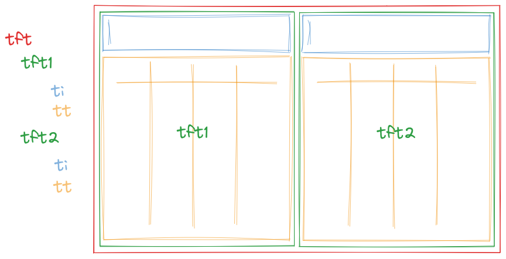

# deephaven.ui Plugin (alpha)

Prototype of the deephaven.ui plugin, mocking out some ideas of how to code up programmatic layouts and callbacks. This is currently very much a prototype and should be used for discussion and evaluation purposes only. Name `deephaven.ui` is not set in stone.

## Development Installation/Setup

1. Until a fix for a bug found with exporting custom objects, you'll need to build/run deephaven-core from @niloc132's branch: https://github.com/niloc132/deephaven-core/tree/4338-live-pyobject
2. Build/Install the `deephaven-plugin-ui` Python plugin in your deephaven-core set up: https://github.com/mofojed/deephaven-plugin-ui
3. Follow the instructions in the [README.md at the root](../../README.md) of this repository to build/install the JS plugins (including this one).

## Other Solutions/Examples

### Parameterized Query

```groovy
import io.deephaven.query.parameterized.ParameterizedQuery
import io.deephaven.query.parameterized.Parameter

myQuery = ParameterizedQuery.create()
  .with(Parameter.ofLong("low").inRange(0, 20).withDefault(5))
  .with(Parameter.ofLong("high").inRange(0, 20).withDefault(15))
  .willDo({scope ->
    def low = scope.getLong("low")
    def high = scope.getLong("high")
    def tableResult = db.t("LearnDeephaven", "StockTrades")
    .where("Date=`2017-08-25`", "Size<=$high", "Size>=$low")
    plotResult = plot("Stuff", tableResult, "Timestamp", "Last").show()
    scope.setResult("tableResult", tableResult)
    scope.setResult("plotResult", plotResult)
  }).build()
```

##### Pros

- Already works
- Scope is defined, and re-runs the whole scope when any param changes
- Easy to understand

##### Cons

- Lots of boilerplate
- Syntax easy to get incorrect
- Lots of strings
- No python
- No specifying different contexts (shared PPQ among sessions/users for example)
- No composability - cannot re-use PPQs within PPQs, or define a "component" that gets used

### Callbacks with decorators (plotly, Shiny for python)

```python
from dash import Dash, html, dcc, Input, Output

app = Dash(__name__, external_stylesheets=external_stylesheets)
app.layout = html.Div(
    [
        dcc.RangeSlider(0, 20, 1, value=[5, 15], id="my-range-slider"),
        html.Div(id="output-container-range-slider"),
    ]
)


@app.callback(
    Output("output-container-range-slider", "children"),
    [Input("my-range-slider", "value")],
)
def update_output(value):
    return 'You have selected "{}"'.format(value)


if __name__ == "__main__":
    app.run_server()
```

Other examples: https://shiny.posit.co/py/docs/overview.html

##### Pros

- Decorators are nice "magic"

##### Cons

- Lots of strings need to match, easy to make a mistake
- Difficult to visualize
- Not sure how to iterate
- Need to have an object named `app`, so not really "composable"

### Streamlit (re-runs entire script on any change)

```python
import streamlit as st

x = st.slider("x")
st.write(x, "squared is", x * x)


@st.cache  # tells streamlit to memoize this function though
def expensive_computation(a, b):
    time.sleep(2)  # This makes the function take 2s to run
    return a * b


a = 2
b = 21
res = expensive_computation(a, b)
st.write("Result:", res)
```

##### Pros

- Can use the values easily anywhere in your script
- Entire script re-runs with any change, easy to understand, easy to iterate

##### Cons

- Re-running everything can be costly, need to be conscious with caching/memoization
- Does not achieve composability

## Proposed Syntaxes

### Interactive Query

Early prototype: https://github.com/mofojed/deephaven-plugin-interactive
UI: https://github.com/mofojed/deephaven-js-plugins/tree/interactive

#### Basic Example

Creates a table that simply updates with the value of the slider.

```python
from deephaven.plugin.interactive import make_iq, dh
from deephaven import empty_table


def my_func(x, a):
    print("x is now " + str(x))
    t = empty_table(1).update_view([f"x={x}"])
    return {"t": t}


my_query = make_iq(my_func, x=dh.slider(22, 2, 111))
```

#### Plotting Example

Create two plots showing a sine function and cosine function with the values set from the slider.

```python
from deephaven.plugin.interactive import make_iq, dh
from deephaven import empty_table
from deephaven.plot.figure import Figure


def sin_func(amplitude, frequency, phase):
    # Note: Should use QST to create filters instead of f-strings?
    t = empty_table(1000).update_view(
        ["x=i", f"y={amplitude}*Math.sin(x*{frequency}+{phase})"]
    )
    f = Figure().plot_xy(series_name="Series", t=t, x="x", y="y").show()
    return {"t": t, "f": f}


def cos_func(amplitude, frequency, phase):
    t = empty_table(1000).update_view(
        ["x=i", f"y={amplitude}*Math.cos(x*{frequency}+{phase})"]
    )
    f = Figure().plot_xy(series_name="Series", t=t, x="x", y="y").show()
    return {"t": t, "f": f}


inputs = {"amplitude": dh.slider(1), "frequency": dh.slider(1), "phase": dh.slider(1)}

iqs = make_iq(sin_func, **inputs)
iqc = make_iq(cos_func, **inputs)
```

##### Pros

- No magic strings (though does have dictionary keys for kwargs)
- Scope is defined, and re-runs the whole scope when any param changes
- Easy to understand
- Should be "easy" to implement once bidirection plugins are completed

##### Cons

- Not clear how to "chain" inputs (e.g. slider based on a table based on another input control, reacting to a click within a table)... unless nesting functions is allowed

### React-like syntax

Use "React hooks" like inspired syntax to write blocks that "re-render" when state changes. **Note**: These examples are just mockups for illustrating the proposed syntax. They may not actually compile.

#### Components (for composability)

Using a "React-like" syntax, it is possible to define "components" which can be re-used and compose other components. For example, we may want to make a "filterable table" component, that just provides a text input field above a table that you can use to filter a specific column in the table.


Read about [React](https://react.dev/learn) and [React Hooks](https://react.dev/reference/react) if you are unfamiliar with them for a primer on the design principles followed. Here is an example of a proposed syntax for that:

```python
import deephaven.ui as ui

# @ui.component decorator marks a function as a "component" function
# By adding this decorator, wraps the function such that "hooks" can be used within the function (effectively similar to `React.createElement`). Hooks are functions following the convention `use_*`, can only be used within a `@ui.component` context
@ui.component
def text_filter_table(source: Table, column: str):
    # The value of the text filter is entirely separate from the text input field definition
    value, set_value = ui.use_state("")

    # TODO: Should be using QST/filters here instead, e.g. https://github.com/deephaven/deephaven-core/issues/3784
    t = source.where(f"{column}=`{value}`")

    # Return a column that has the text input, then the table below it
    return ui.flex(
        [
            ui.text_input(
                value=value, on_change=lambda event: set_value(event["value"])
            ),
            t,
        ]
    )
```

The above component, could then be re-used, to have two tables side-by-side:


```python
# Just using one source table, and allowing it to be filtered using two different filter inputs
@ui.component
def double_filter_table(source: Table, column: str):
    return ui.flex(
        [text_filter_table(source, column), text_filter_table(source, column)],
        direction="row",
    )
```

#### Re-using Components

You can re-use a component, but with different parameters. For example, we may want to have a component that shows an input for `Sym` and the resulting table, and re-use that to show different exchanges:

```python
@ui.component
def stock_table(exchange: str):
    sym, set_sym = use_state("AAPL")
    table = use_memo(
        lambda: db.live_table("LearnDeephaven", "StockTrades").where(
            [f"Exchange=`{exchange}`", f"Sym=`{sym}`"]
        ),
        [exchange, sym],
    )
    return [ui.text_input(value=sym, on_value_change=set_sym), table]


nasdaq_table = stock_table("NASDAQ")
nyse_table = stock_table("NYSE")
```

#### Memoization/Caching

React has a hook [useMemo](https://react.dev/reference/react/useMemo) which is used to cache operations if no dependencies have changed. Streamlit has [Caching](https://docs.streamlit.io/library/advanced-features/caching#basic-usage) as well using `@st.cache_data` and `@st.cache_resource` decorators. We will definitely need some sort of caching, we will need to determine the paradigm. Consider first the example without any caching:

```python
import deephaven.ui as ui
from deephaven.parquet import read


@ui.component
def my_caching_component(parquet_path="/data/stocks.parquet"):
    value, set_value = ui.use_state("")

    # This parquet `read` operation fires _every_ time the component is re-rendered, which happens _every_ time the `value` is changed. This is unnecessary, since we only want to re-run the `.where` part and keep the `source` the same.
    source = read(parquet_path)
    t = source.where(f"sym=`{value}`")

    return ui.flex(
        [
            ui.text_input(
                value=value, on_change=lambda event: set_value(event["value"])
            ),
            t,
        ]
    )
```

Now using a `use_memo` hook, similar to React. This re-enforces the `use_*` hook type behaviour.

```python
import deephaven.ui as ui
from deephaven.parquet import read


@ui.component
def text_filter_table(source: Table, column: str):
    # The value of the text filter is entirely separate from the text input field definition
    value, set_value = ui.use_state("")

    # TODO: Should be using QST/filters here instead, e.g. https://github.com/deephaven/deephaven-core/issues/3784
    t = source.where(f"{column}=`{value}`")

    # Return a column that has the text input, then the table below it
    return ui.flex(
        [
            ui.text_input(
                value=value, on_change=lambda event: set_value(event["value"])
            ),
            t,
        ]
    )


@ui.component
def my_caching_component(parquet_path="/data/stocks.parquet"):
    value, set_value = ui.use_state("")

    # The `read` function will only be called whenever `parquet_path` is changed
    source = use_memo(lambda: read(parquet_path), [parquet_path])
    t = source.where(f"sym=`{value}`")

    return ui.flex(
        [
            ui.text_input(
                value=value, on_change=lambda event: set_value(event["value"])
            ),
            t,
        ]
    )
```

Trying to define it as a decorator gets kind of messy within a functional component. You'd probably want to define at a top level, which is kind of weird:

```python
import deephaven.ui as ui
from deephaven.parquet import read

# Decorator wraps function and will only re-run the function if it hasn't run before or if it doesn't already have the result from a previous execution with the same parameters
@ui.memo
def parquet_table(path: str):
    return read(path)


@ui.component
def my_caching_component(parquet_path="/data/stocks.parquet"):
    value, set_value = ui.use_state("")

    # Memoization is handled by the `parquet_table` method itself
    source = parquet_table(parquet_path)
    t = source.where(f"sym=`{value}`")

    return ui.flex(
        [
            ui.text_input(
                value=value, on_change=lambda event: set_value(event["value"])
            ),
            t,
        ]
    )
```

#### “One Click” plots with Input Filters

Plots work with one_click operations, e.g.

```python
from deephaven.parquet import read
from deephaven.plot.selectable_dataset import one_click
import deephaven.plot.express as dx

source = read("/data/stocks.parquet")
oc = one_click(t=source, by=["Sym"])

# Support for SelectableDataSet in deephaven express is still WIP
plot = dx.line(oc, x="Timestamp", y="Price")
```

The above still requires adding an Input Filter to the dashboard from the UI. You can also add an Input Filter from code, e.g.

```python
from deephaven.parquet import read
from deephaven.plot.selectable_dataset import one_click
import deephaven.plot.express as dx
from deephaven import dtypes as dht

source = read("/data/stocks.parquet")
oc = one_click(t=source, by=["Sym"])

# Support for SelectableDataSet in deephaven express is still WIP
plot = dx.line(oc, x="Timestamp", y="Price")

# Create an Input Filter control that filters on the "Sym" column of type string
sym_filter = ui.input_filter(column="Sym", type=dht.string)
```

The above will add the plot and input filter to default locations in the dashboard. You can specify a dashboard layout if you want control of where the components are placed, e.g.

```python
d = ui.dashboard(ui.column(sym_filter, plot))
```

Along with the standard text Input Filter, you can add other types such as a Dropdown Filter:

```python
from deephaven.parquet import read
from deephaven.plot.selectable_dataset import one_click
import deephaven.plot.express as dx
from deephaven import dtypes as dht

source = read("/data/stocks.parquet")
oc = one_click(t=source, by=["Sym"])

# Support for SelectableDataSet in deephaven express is still WIP
plot = dx.line(oc, x="Timestamp", y="Price")

# Create a Dropdown Filter control that filters on the "Sym" column of type string
sym_filter = ui.dropdown_filter(source=source, source_column="Sym")
```

You can put these in to a `@ui.component` function as well, if you wanted to have an input for the file path to read from, e.g.

```python
from deephaven.parquet import read
from deephaven.plot.selectable_dataset import one_click
import deephaven.plot.express as dx
from deephaven import dtypes as dht


@ui.component
def my_oc_dash():
    # Store the path in state so it can be changed
    path, set_path = use_state("/data/stocks.parquet")

    source = use_memo(lambda: read(path), [path])

    oc = use_memo(lambda: one_click(t=source, by=["Sym"]), [path])

    plot = use_memo(lambda: dx.line(oc, x="Timestamp", y="Price"), [oc])

    sym_filter = ui.dropdown_filter(source=source, source_column="Sym")

    # Dashboard where the top row is a text input for the path and input filter for Sym, then the resulting plot underneath
    return ui.dashboard(
        ui.column(
            ui.row(ui.text_input(value=path, on_change=set_path), sym_filter), plot
        )
    )


d = my_oc_dash()
```

#### Table Actions/Callbacks

We want to be able to react to actions on the table as well. This can be achieved by adding a callback to the table, and used to set the state within our component. For example, if we want to filter a plot based on the selection in another table:


```python
import deephaven.ui as ui


@ui.component
def table_with_plot(source: Table, column: str = "Sym", default_value: str = ""):
    value, set_value = ui.use_state(default_value)

    # Wrap the table with an interactive component to listen to selections within the table
    selectable_table = ui.use_memo(
        lambda: interactive_table(
            t=source,
            # When data is selected, update the value
            on_row_clicked=lambda event: set_value(event["data"][column]),
        ),
        [source],
    )

    # Create the plot by filtering the source using the currently selected value
    p = ui.use_memo(
        lambda: plot_xy(
            t=source.where(f"{column}=`{value}`"), x="Timestamp", y="Price"
        ),
        [value],
    )

    return ui.flex([selectable_table, p])
```

OR could we add an attribute to the table instead? And a custom function on table itself to handle adding that attribute? E.g.:

```python
import deephaven.ui as ui


@ui.component
def table_with_plot(source: Table, column: str = "Sym", default_value: str = ""):
    value, set_value = ui.use_state(default_value)

    # Add the row clicked attribute
    # equivalent to `selectable_table = t.with_attributes({'__on_row_clicked': my_func})`
    selectable_table = source.on_row_clicked(
        lambda event: set_value(event["data"][column])
    )

    # Create the plot by filtering the source using the currently selected value
    p = ui.use_memo(
        lambda: plot_xy(
            t=source.where(f"{column}=`{value}`"), x="Timestamp", y="Price"
        ),
        [value],
    )

    return ui.flex([selectable_table, p])
```

#### Multiple Plots

We can also use the same concept to have multiple plots, and have them all update based on the same input. For example, if we want to have two plots, one showing the "Last" price, and another showing the "Bid" price:


```python
import deephaven.ui as ui


@ui.component
def two_plots(source: Table, column: str = "Sym", default_value: str = ""):
    value, set_value = ui.use_state(default_value)

    # Create the two plots by filtering the source using the currently selected value
    p1 = ui.use_memo(
        lambda: plot_xy(t=source.where(f"{column}=`{value}`"), x="Timestamp", y="Last"),
        [value],
    )
    p2 = ui.use_memo(
        lambda: plot_xy(t=source.where(f"{column}=`{value}`"), x="Timestamp", y="Bid"),
        [value],
    )

    return ui.flex([p1, p2])
```

#### Text Input to Filter a Plot

We can also use the same concept to have a text input field that filters a plot. For example, if we want to have a text input field that filters a plot based on the "Sym" column:


```python
import deephaven.ui as ui


@ui.component
def text_input_plot(source: Table, column: str = "Sym"):
    value, set_value = ui.use_state("")

    # Create the plot by filtering the source using the currently selected value
    # TODO: Is this link visible in the UI or just implicit?
    p = ui.use_memo(
        lambda: plot_xy(t=source.where(f"{column}=`{value}`"), x="Timestamp", y="Last"),
        [value],
    )

    return ui.flex(
        [
            # Text input will update the value when it is changed
            ui.text_input(
                value=value, on_change=lambda event: set_value(event["value"])
            ),
            # Plot will be filtered/updated based on the above logic
            p,
        ]
    )
```

#### Required Parameters

Sometimes we want to require the user to enter a value before applying filtering operations. We can do this by adding a `required` label to the `text_input` itself, and then displaying a label instead of the table:

```python
import deephaven.ui as ui


@ui.component
def text_filter_table(source: Table, column: str):
    value, set_value = ui.use_state("")

    # Return a column that has the text input, then the table below it
    return ui.flex(
        [
            ui.text_input(
                value=value,
                on_change=lambda event: set_value(event["value"]),
                required=True,
            ),
            (
                # Use Python ternary operator to only display the table if there has been a value entered
                source.where(f"{column}=`{value}`")
                if value
                else ui.info("Please input a filter value")
            ),
        ]
    )
```

Alternatively, we could have an overlay displayed on the table if an invalid filter is entered.

#### Cross-Dependent Parameters (DH-15360)

You can define parameters which are dependent on another parameter. You could define two range sliders for a low and high, for example:

```python
import deephaven.ui as ui


@ui.component
def two_sliders(min=0, max=10000):
    lo, set_lo = use_state(min)
    hi, set_hi = use_state(max)

    # Use the `hi` currently set as the `max`. Will update automatically as `hi` is adjusted
    s1 = ui.slider(value=lo, min=min, max=hi, on_change=set_lo)

    # Use the `lo` currently set as the `min`. Will update automatically as `lo` is adjusted
    s2 = ui.slider(value=hi, min=lo, max=max, on_change=set_hi)

    return [s1, s2]
```

Or if you want a drop-down list that is dependent only on a filtered list of results from another table:

```python
@ui.component
def filtered_accounts(source):
    company, set_company = use_state("")
    trader, set_trader = use_state("")

    return [
        # Use the distinct "Company" values as the possible options in the dropdown
        ui.dropdown(source.select_distinct("Company")),
        # Use the distinct "Trader" values after filtering the source by "Company"
        ui.dropdown(source.where(f"Company={company}").select_distinct("Trader")),
        # Show the table filtered on both "Company" and "Trader" selected
        source.where([f"Company={company}", f"Trader={trader}"]),
    ]
```

#### Multiple Queries (Enterprise only)

We want to be able to pull in widgets/components from multiple queries. In DHC we have the [URI resolver](https://deephaven.io/core/docs/reference/uris/uri/) for resolving another resource, and should be able to extend that same functionality to resolve another PQ.

```python
# Persistent Query 'A'
t = empty_table(100).update("a=i")

# Persistent Query 'B'
t = empty_table(100).update("b=i")

# Executed in console session or a 3rd query
import deephaven.ui as ui
from deephaven.uri import resolve


@ui.component
def multi_query():
    # Since the `resolve` method is only called from within a `@ui.component` wrapped function, it is only called when the component is actually rendered (e.g. opened in the UI)
    # Note however this is still resolving the table on the server side, rather than the client fetching the table directly.
    t1 = resolve("dh+plain://query-a:10000/scope/t")
    t2 = resolve("dh+plain://query-b:10000/scope/t")
    return [t1, t2]


mq = multi_query()
```

We could also have a custom function defined such that an object will tell the UI what table to fetch; the downside of this is you would be unable to chain any table operations afterwards (NOTE: It _may_ be possible to build it such that we could do this, using QST and just having the UI apply an arbitrary set of operations defined by the QST afterwards? But may be tricky to build):

```python
# Persistent Query 'A'
t = empty_table(100).update("a=i")

# Persistent Query 'B'
t = empty_table(100).update("b=i")

# Executed in console session or a 3rd query
import deephaven.ui as ui


@ui.component
def multi_query():
    # Object that contains metadata about the table source, then UI client must fetch
    t1 = ui.pq_table("Query A", "t")
    t2 = ui.pq_table("Query B", "t")
    return [t1, t2]


mq = multi_query()
```

It may be that we want to do something interesting, such as defining the input in one query, and defining the output in another query.

```python
# Persistent Query 'A'
import deephaven.ui as ui


@ui.component
def my_input(value, on_change):
    return ui.text_input(value, on_change)


# Persistent Query 'B'
import deephaven.ui as ui


@ui.component
def my_output(value):
    return empty_table(100).update(f"sym=`{value}`")


# Executed in console session or a 3rd query
import deephaven.ui as ui


@ui.component
def multi_query():
    sym, set_sym = use_state("")

    # TODO: Would this actually work? Resolving to a custom type defined in plugins rather than a simple table object
    my_input = resolve("dh+plain://query-a:10000/scope/my_input")
    my_output = resolve("dh+plain://query-b:10000/scope/my_output")

    return [my_input(sym, set_sym), my_output(sym)]


mq = multi_query()
```

#### Putting it all together

Using the proposed components and selection listeners, you should be able to build pretty powerful components, and subsequently dashboards. For example, we could build a component that has the following:

- Dual range slider for specifying the "Size" of trades to filter on
- Table showing only the filtered range
- Text input to filter a specific Sym for a plot derived from the table
- Clicking a row within the table selects that Sym and updates the text input to reflect that
- Clicking a data point in the plot will print out that data


```python
import deephaven.ui as ui
import deephaven.plot.express as dx


@ui.component
def stock_widget(source: Table, column: str = "Sym"):
    lo, set_lo = use_state(0)
    hi, set_hi = use_state(10000)
    sym, set_sym = use_state("")

    # Create the filtered table
    filtered_table = ui.use_memo(
        lambda: source.where([f"Price >= {lo} && Price <= {hi}"]), [lo, hi]
    )

    p = ui.use_memo(
        lambda: dx.line(filtered_table.where(f"Sym=`{sym}`"), x="Timestamp", y="Last"),
        [filtered_table],
    )

    def handle_slider_change(event):
        set_lo(event.value.lo)
        set_hi(event.value.hi)

    return ui.flex(
        [
            # Slider will update the lo/hi values on changes
            ui.range_slider(
                lo=lo, hi=hi, min=0, max=10000, on_change=handle_slider_change
            ),
            # Wrap the filtered table so you can select a row
            ui.interactive_table(
                t=filtered_table,
                # Update the Sym value when a row is selected
                on_row_clicked=lambda event: set_sym(event["data"][column]),
            ),
            # Text input will update the sym when it is changed, or display the new value when selected from the table
            ui.text_input(value=sym, on_change=lambda event: set_sym(event["value"])),
            # Wrap the filtered plot so you can select data
            ui.interactive_plot(
                p=p, on_data_clicked=lambda event: print(f"data selected: {str(event)}")
            ),
        ]
    )
```

#### Layouts/Dashboards

The above examples focussed solely on defining components, all of which are simply rendered within one panel by default. Part of the ask is also about defining panels and dashboards/layouts. We use [Golden Layout](https://golden-layout.com/examples/), which defines all layouts in terms of placing Panels in [Rows, Columns and Stacks](https://golden-layout.com/tutorials/getting-started.html):

- **Panel**: A panel with a tab header, containing one or more components. Can be moved around and resized within a dashboard.
- **Row**: A row of panels arranged horizontally.
- **Column**: A column of panels arranged vertically.
- **Stack**: A stack of panels that overlap one another. Click the tab header to switch between them.
- **Dashboard**: A layout of an entire dashboard

We should be able to map these by using `ui.panel`, `ui.row`, `ui.column`, `ui.stack`, and `ui.dashboard`.

##### ui.panel

By default, the top level `@ui.component` will automatically be wrapped in a panel, so no need to define it unless you want custom panel functionality, such as giving the tab a custom name, e.g.:

```python
import deephaven.ui as ui

# The only difference between this and `p = my_component()` is that the title of the panel will be set to `My Title`
p = ui.panel(my_component(), title="My Title")
```

Note that a panel can only have one root component, and cannot be nested within other components (other than the layout ones `ui.row`, `ui.column`, `ui.stack`, `ui.dashboard`)

TBD: How do you specify a title and/or tooltip for your panel? How do panels get a title or tooltip by default?

##### ui.row, ui.column, ui.stack, ui.dashboard

You can define a dashboard using these functions. By wrapping in a `ui.dashboard`, you are defining a whole dashboard. If you omit the `ui.dashboard`, it will add the layouts you've defined to the existing dashboard:

- `ui.row` will add a new row of the panels defined at the bottom of the current dashboard
- `ui.column` will add a new column of panels defined at the right of the current dashboard
- `ui.stack` will add a new stack of panels at the next spot in the dashboard

Defining these without a `ui.dashboard` is likely only going to be applicable to testing/iterating purposes, and in most cases you'll want to define the whole dashboard. For example, to define a dashboard with an input panel in the top left, a table in the top right, and a stack of plots across the bottom, you could define it like so:

```python
import deephaven.ui as ui

# ui.dashboard takes only one root element
d = ui.dashboard(
    ui.column(
        [
            ui.row([my_input_panel(), my_table_panel()]),
            ui.stack([my_plot1(), my_plot2()]),
        ]
    )
)
```

Much like handling other components, you can do a prop/state thing to handle changing inputs/filtering appropriately:

```python
import deephaven.ui as ui

# Need to add the `@ui.component` decorator so we can keep track of state
@ui.component
def my_dashboard():
    value, set_value = use_state("")

    return ui.dashboard(
        ui.column(
            [
                ui.row(
                    [
                        my_input_panel(value=value, on_change=set_value),
                        my_table_panel(value=value),
                    ]
                ),
                ui.stack([my_plot1(value=value), my_plot2(value=value)]),
            ]
        )
    )


d = my_dashboard()
```

##### ui.link

```python
@ui.component
def my_dashboard():
    t1 = empty_table(100).update("a=i")
    t2 = empty_table(100).update("b=i", "c=Math.sin(i)")

    return ui.dashboard(
        ui.row([ui.table(t1, _id="t1"), ui.table(t2, _id="t2")]),
        links=[
            ui.link(
                start=ui.link_point("t1", column="a"),
                end=ui.link_point("t2", column="b"),
            )
        ],
    )


d = my_dashboard()
```

#### ui.table

`ui.table` is a wrapper for a Deephaven `Table` object where you can add customizations or callbacks to the table that the UI will handle. The basic syntax for creating a `UITable` is:

```py
import deephaven.ui as ui
ui_table = ui.table(table: Table) -> UITable
```

It has an [immutable fluent](https://en.wikipedia.org/wiki/Fluent_interface#Immutability) interface, similar to Deephaven `Table`. That means each method below will return a new `UITable` object, rather than modifying the existing one. This allows you to chain multiple customizations together, e.g.:

```py
from deephaven import ui

# Create a table with some customizations
ui_table = (
    ui.table(source)
    .format_columns(["X = Y > 5 ? RED : NO_FORMATTING"])
    .column_group("Group 1", ["Col1", "Col2"], "RED")
)
```

`ui.table` will support the below methods.

##### always_fetch_columns

Set the columns to always fetch from the server. These will not be affected by the users current viewport/horizontal scrolling. Useful if you have a column with key value data that you want to always include in the data sent for row click operations.

###### Syntax

```py
ui_table.always_fetch_columns(columns: Union[str, list[str]]) -> UITable
```

###### Parameters

| Parameter | Type                    | Description                                                               |
| --------- | ----------------------- | ------------------------------------------------------------------------- |
| `columns` | `Union[str, list[str]]` | The columns to always fetch from the server. May be a single column name. |

##### back_columns

Set the columns to show at the back of the table.

###### Syntax

```py
ui_table.back_columns(columns: Union[str, list[str]]) -> UITable
```

###### Parameters

| Parameter | Type                    | Description                                                                |
| --------- | ----------------------- | -------------------------------------------------------------------------- |
| `columns` | `Union[str, list[str]]` | The columns to show at the back of the table. May be a single column name. |

##### column_group

Create a group for columns in the table.

###### Syntax

```py
ui_table.column_group(name: str, children: list[str], color: Optional[str]) -> UITable
```

###### Parameters

| Parameter  | Type            | Description                                                                                                                |
| ---------- | --------------- | -------------------------------------------------------------------------------------------------------------------------- |
| `name`     | `str`           | The group name. Must be a valid column name and not a duplicate of another column or group.                                |
| `children` | `list[str]`     | The children in the group. May contain column names or other group names. Each item may only be specified as a child once. |
| `color`    | `Optional[str]` | The hex color string or Deephaven color name.                                                                              |

##### context_menu

Add custom items to the context menu. You can provide a list of actions that always appear, or a callback that can process the selected rows and send back menu items asynchronously.

###### Syntax

```py
ui_table.context_menu(
    items: Union[
        list[ContextMenuAction],
        Callable[[int, dict[str, Any]], list[ContextMenuAction]],
    ]
) -> UITable
```

###### Parameters

| Parameter | Type                                                                                       | Description                                                                                                                                                                                         |
| --------- | ------------------------------------------------------------------------------------------ | --------------------------------------------------------------------------------------------------------------------------------------------------------------------------------------------------- |
| `items`   | `Union[list[ContextMenuAction], Callable[[int, dict[str, Any]], list[ContextMenuAction]]]` | The items to add to the context menu. May be a list of `ContextMenuAction` objects, or a callback function that takes the row index and row data and returns a list of `ContextMenuAction` objects. |

##### format_columns

Applies color formatting to the columns of the table.

###### Syntax

```py
ui_table.format_columns(column_formats: Union[str, list[str]]) -> UITable
```

###### Parameters

| Parameter        | Type                    | Description                                                                                              |
| ---------------- | ----------------------- | -------------------------------------------------------------------------------------------------------- |
| `column_formats` | `Union[str, list[str]]` | Formulas to compute formats for columns or rows in the table; e.g., `"X = Y > 5 ? RED : NO_FORMATTING"`. |

##### format_column_where

Applies color formatting to the specified column conditionally.

###### Syntax

```py
ui_table.format_column_where(self,    col: str,    cond: str,    formula: str) -> UITable
```

###### Parameters

| Parameter | Type  | Description                                                                          |
| --------- | ----- | ------------------------------------------------------------------------------------ |
| `col`     | `str` | The column name                                                                      |
| `cond`    | `str` | The condition expression                                                             |
| `formula` | `str` | The formatting string in the form of assignment expression "column=color expression" |

##### format_row_where

Applies color formatting to rows of the table conditionally.

###### Syntax

```py
ui_table.format_row_where(self,    cond: str,    formula: str) -> UITable
```

###### Parameters

| Parameter | Type  | Description                                                                          |
| --------- | ----- | ------------------------------------------------------------------------------------ |
| `cond`    | `str` | The condition expression                                                             |
| `formula` | `str` | The formatting string in the form of assignment expression "column=color expression" |

##### format_data_bar

Applies data bar formatting to the specified column.

###### Syntax

```py
ui_table.format_data_bar(self,
    col: str,
    value_col: str = None,
    min: Union[float, str] = NULL_DOUBLE,
    max: Union[float, str] = NULL_DOUBLE,
    axis: Union[DataBarAxisOption, str] = None,
    positive_color: Union['Color', List['Color']] = None,
    negative_color: Union['Color', List['Color']] = None,
    value_placement: Union[DataBarValuePlacementOption, str] = None,
    direction: Union[DataBarDirectionOption, str] = None,
    opacity: float = NULL_DOUBLE,
    marker_col: str = None,
    marker_color: 'Color' = None
) -> UITable
```

###### Parameters

| Parameter         | Type                                      | Description                                                    |
| ----------------- | ----------------------------------------- | -------------------------------------------------------------- |
| `col`             | `str`                                     | column to generate data bars in                                |
| `value_col`       | `str`                                     | column containing the values to generate data bars from        |
| `min`             | `Union[float, str]`                       | minimum value for data bar scaling or column to get value from |
| `max`             | `Union[float, str]`                       | maximum value for data bar scaling or column to get value from |
| `axis`            | `Union[DataBarAxisOption, str]`           | orientation of data bar relative to cell                       |
| `positive_color`  | `Union['Color', List['Color']]`           | color for positive bars. Use list of colors to form a gradient |
| `negative_color`  | `Union['Color', List['Color']]`           | color for negative bars. Use list of colors to form a gradient |
| `value_placement` | `Union[DataBarValuePlacementOption, str]` | orientation of values relative to data bar                     |
| `direction`       | `Union[DataBarDirectionOption, str]`      | orientation of data bar relative to horizontal axis            |
| `opacity`         | `float`                                   | opacity of data bars. Accepts values from 0 to 1               |
| `marker_col`      | `str`                                     | column containing the values to generate markers from          |
| `marker_color`    | `'Color'`                                 | color for markers                                              |

##### freeze_columns

Set the columns to freeze to the front of the table. These will not be affected by horizontal scrolling.

###### Syntax

```py
ui_table.freeze_columns(columns: Union[str, list[str]]) -> UITable
```

###### Parameters

| Parameter | Type                    | Description                                                                   |
| --------- | ----------------------- | ----------------------------------------------------------------------------- |
| `columns` | `Union[str, list[str]]` | The columns to freeze to the front of the table. May be a single column name. |

##### front_columns

Set the columns to show at the front of the table.

###### Syntax

```py
ui_table.front_columns(columns: Union[str, list[str]]) -> UITable
```

###### Parameters

| Parameter | Type                    | Description                                                                 |
| --------- | ----------------------- | --------------------------------------------------------------------------- |
| `columns` | `Union[str, list[str]]` | The columns to show at the front of the table. May be a single column name. |

##### hide_columns

Set the columns to hide from the table.

###### Syntax

```py
ui_table.hide_columns(columns: Union[str, list[str]]) -> UITable
```

###### Parameters

| Parameter | Type                    | Description                                                      |
| --------- | ----------------------- | ---------------------------------------------------------------- |
| `columns` | `Union[str, list[str]]` | The columns to hide from the table. May be a single column name. |

##### on_row_click

Add a callback for when a row is clicked.

###### Syntax

```py
ui_table.on_row_click(callback: Callable[[int, dict[str, Any]], None]) -> UITable
```

###### Parameters

| Parameter  | Type                                    | Description                                                                                                                                                                            |
| ---------- | --------------------------------------- | -------------------------------------------------------------------------------------------------------------------------------------------------------------------------------------- |
| `callback` | `Callable[[int, dict[str, Any]], None]` | The callback function to run when a row is clicked. The first parameter is the row index, and the second is the row data provided in a dictionary where the column names are the keys. |

##### on_row_double_click

Add a callback for when a row is double clicked.

###### Syntax

```py
ui_table.on_row_double_click(callback: Callable[[int, dict[str, Any]], None]) -> UITable
```

###### Parameters

| Parameter  | Type                                    | Description                                                                                                                                                                                   |
| ---------- | --------------------------------------- | --------------------------------------------------------------------------------------------------------------------------------------------------------------------------------------------- |
| `callback` | `Callable[[int, dict[str, Any]], None]` | The callback function to run when a row is double clicked. The first parameter is the row index, and the second is the row data provided in a dictionary where the column names are the keys. |

##### search_display_mode

Set the search bar to explicitly be accessible or inaccessible, or use the system default.

###### Syntax

```py
ui_table.search_display_mode(mode: Literal["show", "hide", "default"]) -> UITable
```

###### Parameters

| Parameter | Type                                 | Description                                                                                |
| --------- | ------------------------------------ | ------------------------------------------------------------------------------------------ |
| `mode`    | `Literal["show", "hide", "default"]` | set the search bar to explicitly be accessible or inaccessible, or use the system default. |

#### Deprecations

The functionality provided my `ui.table` replaces many of the existing functions on `Table`. Below are the functions that are planned for deprecation/deletion of the `Table` interface, and their replacements with the new `ui.table` interface.

| Table Function        | ui.table Replacement                                                                                                                                                                                                         |
| --------------------- | ---------------------------------------------------------------------------------------------------------------------------------------------------------------------------------------------------------------------------- |
| `format_columns`      | [format_columns](#format_columns)                                                                                                                                                                                            |
| `format_column_where` | [format_column_where](#format_column_where)                                                                                                                                                                                  |
| `format_row_where`    | [format_row_where](#format_row_where)                                                                                                                                                                                        |
| `layout_hints`        | [back_columns](#back_columns)<br/>[front_columns](#front_columns)<br/>[column_group](#column_groups)<br/>[freeze_columns](#freeze_columns)<br/>[hide_columns](#hide_columns)<br/>[search_display_mode](#search_display_mode) |

#### Context

By default, the context of a `@ui.component` will be created per client session (same as [Parameterized Query's "parallel universe" today](https://github.com/deephaven-ent/iris/blob/868b868fc9e180ee948137b10b6addbac043605e/ParameterizedQuery/src/main/java/io/deephaven/query/parameterized/impl/ParameterizedQueryServerImpl.java#L140)). However, it would be interesting if it were possible to share a context among all sessions for the current user, and/or share a context with other users even; e.g. if one user selects and applies a filter, it updates immediately for all other users with that dashboard open. So three cases:

1. Limit to a particular client session (like Paramterized Queries, should likely be the default)
2. Limit to the particular user (so if you have the same PQ open multiple tabs, it updates in all)
3. Share with all users (if one user makes a change, all users see it)

We can specify this by adding a `context` parameter to the `@ui.component` decorator:

```python
# Define a client session component, where execution will be scoped to the current client session
# One user making a change will not be reflected to other tabs for that user
# This will be the default and is equivalent to not specifying a context
# @ui.component(context=ui.ContextType.CLIENT)
# def client_component():
# ... component details here

# Define a user component, where execution will be scoped to the current user
# One user making a change will be reflected to all tabs for that user
# @ui.component(context=ui.ContextType.USER)
# def user_component():
# ... component details here

# Define a shared component, where execution will be scoped to all users
# One user making a change will be reflected to all users
# @ui.component(context=ui.ContextType.SHARED)
# def shared_component():
# ... component details here
```

Note this could get interesting with nested components. It only makes sense to restrict the scope further when nesting, e.g. you can nest a `ui.ContextType.CLIENT` component within a `ui.ContextType.USER` component, but not the other way around. If you try to nest a `ui.ContextType.USER` component within a `ui.ContextType.CLIENT` component, it will throw an error:

```python
# This component will be scoped to the current client session
@ui.component(context=ui.ContextType.CLIENT)
def stock_table(source: Table):
    sym, set_sym = use_state("AAPL")
    t = source.where(f"sym=`{sym}`")
    return [ui.text_input(value=sym, on_change=set_sym), t]


# This component is scoped to the current user, so if they change the path in one tab, it will update in all other tabs
@ui.component(context=ui.ContextType.USER)
def user_path_component():
    path, set_path = use_state("/data/stocks.parquet")
    t = use_memo(lambda: read(path), [path])
    # Using the `stock_table` component which is scoped to the current client session allows different filtering in different tabs
    return [ui.text_input(value=path, on_change=set_path), stock_table(t)]


result = user_path_component()

# The other way around would throw an error though, e.g.
@ui.component(context=ui.ContextType.CLIENT)
def bad_scoping():
    # Can't use `user_path_component` as that would expand the scope/context
    return user_path_component()
```

Note: I think this is a stretch goal, and not planned for the initial implementation (but should be considered in the design). Only the default `ui.ContextType.CLIENT` will be supported initially.

#### Problems

Listing some problems and areas of concern that need further discussion.

##### State Latency

With callbacks, there will be a delay between when the user makes changes in the UI and when the state change is processed on the server. We can mitigate this with debounced input (e.g. when typing in a text input or changing a slider, debounce sending an update until they have stopped typing or sliding for a moment), and displaying some sort of "processing" state in the UI (e.g. a spinner or disabling the input) while the state is being updated. Optimistic updates are not possible, as there is no way for the UI to know what effect a particular state change will have on the output/other components. This is similar to what we do with Parameterized Queries currently, where we display a spinner in the "Submit" button while the query is being executed, and only after it returns do the output tables update.

##### Language Compatibility

The above examples are all in Python, and particularly take some advantage of language constructs in python (such as positional arguments and kwargs). We should consider how it would work in Groovy/Java as well, and how we can build one on top of the other.

#### Architecture

##### Rendering

When you call a function decorated by `@ui.component`, it will return a `UiNode` object that has a reference to the function it is decorated; that is to say, the function does _not_ get run immediately. The function is only run when the `UiNode` is rendered by the client, and the result is sent back to the client. This allows the `@ui.component` decorator to execute the function with the appropriate rendering context, and also allows for memoization of the function (e.g. if the function is called multiple times with the same arguments, it will only be executed once - akin to a [memoized component](https://react.dev/reference/react/memo) or PureComponent in React).

Let's say we execute the following, where a table is filtered based on the value of a text input:

```python
@ui.component
def text_filter_table(source, column, initial_value=""):
    value, set_value = use_state(initial_value)
    ti = ui.text_field(value, on_change=set_value)
    tt = source.where(f"{column}=`{value}`")
    return [ti, tt]


@ui.component
def sym_exchange(source):
    tft1 = text_filter_table(source, "Sym")
    tft2 = text_filter_table(source, "Exchange")
    return ui.flex(tft1, tft2, direction="row")


import deephaven.plot.express as dx

t = dx.data.stocks()

tft = text_filter_table(t, "sym")
```

Which should result in a UI like this:



How does that look when the notebook is executed? When does each code block execute?


##### Communication/Callbacks

When the document is first rendered, it will pass the entire document to the client. When the client makes a callback, it needs to send a message to the server indicating which callback it wants to trigger, and with which parameters. For this, we use [JSON-RPC](https://www.jsonrpc.org/specification). When the client opens the message stream to the server, the communication looks like:


##### Communication Layers

A component that is created on the server side runs through a few steps before it is rendered on the client side:

1. Element - The basis for all UI components. Generally a `FunctionElement`, and does not run the function until it is requested by the UI. The result can change depending on the context that it is rendered in (e.g. what "state" is set).
2. RenderedNode - After an element has been rendered using a renderer, it becomes a `RenderedNode`. This is an immutable representation of the document.
3. JSONEncodedNode - The `RenderedNode` is then encoded into JSON using `NodeEncoder`. It pulls out all the objects and maps them to exported objects, and all the callables to be mapped to commands that can be accepted by JSON-RPC. This is the final representation of the document that is sent to the client.
4. ElementPanel - Client side where it's receiving the `documentUpdated` from the server plugin, and then rendering the `JSONEncodedNode` into a `ElementPanel` (e.g. a `GoldenLayout` panel). Decodes the JSON, maps all the exported objects to the actual objects, and all the callables to async methods that will call to the server.
5. ElementView - Renders the decoded panel into the UI. Picks the element based on the name of it.
6. ObjectView - Render an exported object

#### Other Decisions

While mocking this up, there are a few decisions regarding the syntax we should be thinking about/address prior to getting too far along with implementation.

##### Module name

The above examples use `deephaven.ui` for the module name. Another option would be `deephaven.layout`, but I thought this might get confusing with Golden Layout already existing.

##### Structuring imports

In the above example, there is one simple import, `import deephaven.ui as ui`. From there you just call `ui.component`, `ui.use_state`, etc.

Another option would be importing items directly, e.g. `from deephaven.ui import component, use_state, range_slider`, etc.

Or we could have some sort of hybrid:

```python
# Use `ui` import for components/elements
import deephaven.ui as ui

# Import hooks `use_` directly from `deephaven.ui`
from deephaven.ui import use_state, use_memo

# ... or even have a separate import for all hooks
# import * from deephaven.ui.hooks
```

##### Decorators vs. Render function

In React, it uses the `renderWithHooks` function internally to build a context. That's triggered by the `React.createElement` method, or more commonly via JSX when rendering the elements. Pushing/popping the context is crucial for maintaining the proper state and enabling hooks to work reliably.

In Python, we do not have JSX available (or any such equivalent). The above examples use the `@ui.component` decorator for wrapping a function component:

```python
# Just using one source table, and allowing it to be filtered using two different filter inputs
@ui.component
def double_filter_table(source: Table, column: str):
    return ui.flex(
        [text_filter_table(source, column), text_filter_table(source, column)],
        direction="row",
    )


dft = double_filter_table(source, "Sym")
```

Another option would be to require calling an explicit render function, e.g.:

```python
# Just using one source table, and allowing it to be filtered using two different filter inputs
def double_filter_table(source: Table, column: str):
    return ui.flex(
        [
            ui.render(text_filter_table(source, column)),
            ui.render(text_filter_table(source, column)),
        ],
        direction="row",
    )


dft = ui.render(double_filter_table(source, "Sym"))
```

I think the decorator syntax is less verbose and more clear about how to use; especially when rendering/building a component composed of many other components. Calling `ui.render` to render all the children component seems problematic. Marking every possible component as just `@ui.component` is pretty straightforward, and should allow for easily embedding widgets.

Note there was an interesting project for using [React Hooks in Python](https://github.com/amitassaraf/python-hooks). However, it is not recommended for production code and likely has some performance issues. It [inspects the call stack](https://github.com/amitassaraf/python-hooks/blob/main/src/hooks/frame_utils.py#L86) to manage hook state, which is kind of neat in that you don't need to wrap your functions; however that would come at performance costs, and also more difficult to be strict (e.g. requiring functions that use hooks to be wrapped in `@ui.component` - maybe there's other dev related things we want to do in there).

##### Panel Titles/Tooltips

- How do we preserve the behaviour of panel/tab tooltips for components?
- How do we have components save their state?

## Scheduling

Breaking down the project schedule to be roughly:

- **Phase 1 "Definition" (August)**: Distribute API syntax for discussion, gather feedback
  - Bender gets a document together with examples mocking out the proposed syntax
  - Solicit feedback from interested stakeholders on the proposed syntax and get agreement
  - Rough Proof of Concept prototype built
- **Phase 2 "Alpha" (September 4 - October 13, 6 weeks)**: Define custom components
  - Create building blocks for defining custom components
  - Python side (Joe):
    - Create `deephaven.ui` module, testing
    - Create render context/lifecycle
      - Render into virtual object model (e.g. Virtual DOM)
    - Create `@ui.component`, `use_state`, `use_memo` hooks, `ui.flex`, `ui.text_input`, `ui.slider` components
    - Define/create messaging to send updates to client
      - First send entire virtual DOM.
      - Send updates for just the elements that are changed/updated (can start with just re-sending the whole document, but will need to break it down into just element updates afterwards).
  - JavaScript side (Matt):
    - Create `@deephaven/js-plugin-ui` JS plugin, wired up with testing
    - Create `DashboardPlugin` to open up components created by `@ui.component`
      - Render into one panel for now; multi-panel/dashboard layout comes in the next phase
    - `ObjectPlugin` (`WidgetPlugin`? `ElementPlugin`? whatever the name) for plugins to wire up just displaying an object as an element (rather than all the panel wiring)
      - `@deephaven/js-plugin-ui` needs to be able to render elements as defined in other `ObjectPlugin`s that are loaded.
      - `ObjectPlugin`s that match `ui.flex`, `ui.text_input`, `ui.slider` elements
    - Handle updates sent from the server
    - Update Linker to allow setting links between components (instead of just panels)
    - Handle dehydrating/rehydrating of components
    - Release "Alpha"
- **Phase 3 "Beta" (October 16 - November 17, 5 weeks):** Define layouts/dashboards
  - Python side (Joe):
    - Create `@ui.panel`, `@ui.dashboard` components?
  - JavaScript side (Matt):
    - Handle opening up `@ui.panel` in a dashboard?
  - Gather feedback from actual usage
    - Fix any critical bugs
    - Incorporate feedback when possible, or record for later implementation in Phase 4 and beyond
  - Release "Beta"
- **Phase 4 (November 20 - December 22, 5 weeks):** Polish
  - Fix any bugs that are identified
  - Lots of testing
  - Add any additional components that are requested based on feedback from previous phases
  - Release "Production"

## Using a list and keys

We can add hooks for retrieving a snapshot or list of data from a table and using it within code. For example, if we wanted to display a list of users:

```python
@ui.component
def user_list():
    # Get the user table using a hook
    user_table = use_table("Company", "Users")

    # Use a snapshot of the table to get a list of users
    users = use_snapshot(user_table, ["Name", "Email", "ID"])

    return ui.flex(
        [
            # Use a list of users to render a list of user components
            # The `_key` kwarg is used to uniquely identify each component in the list.
            # This can save on re-renders when the list is updated, even if items change order.
            map(
                lambda user: ui.text(
                    f"{user['Name']}: {user['Email']}", _key=user["ID"]
                ),
                users,
            )
        ]
    )


ul = user_list()
```

## Converting a Parameterized Query

Taking the [example Parameterized Query from our docs](https://deephaven.io/enterprise/docs/development/parameterized-queries/):

```groovy
import io.deephaven.query.parameterized.ParameterizedQuery
import io.deephaven.query.parameterized.Parameter

myQuery = ParameterizedQuery.create()
    .with(Parameter.ofLong("intParam").inRange(0,100))
    .with(Parameter.ofString("stringParam"))
    .with(Parameter.ofDouble("doubleParam").inRange(-1.0, 1.0).optional())
    .willDo({scope ->
        def intParam = scope.getInteger("intParam")
        def stringParam = scope.getString("stringParam")

        // Get the authenticated or effective ('run as') user names of the person or
        // process executing this query.
        def authenticatedUser = scope.getAuthenticatedUser()
        def effectiveUser = scope.getEffectiveUser()

        // Get the groups of the effective user.
        def groups = scope.getPermissionFilterProvider().getGroupsForUser(scope.getUserContext())

                // Using db.i() or db.t() will return results in the context of the query's owner, not the executor.
        // You may want to perform this fetch with the owner's elevated permissions, for example, to produce
        // summaries that can be more broadly shared. The query writer is responsible for ensuring that they
        // are not returning sensitive data to viewers.
        def tableResultAsOwner = db.i("SomeNamespace", "SomeTable")

        // Using the fetchTableIntraday() or fetchTableHistorical() from the scope will return results in the
        // context of the query's executor, which will apply the permissions for that user. You can then safely
        // display the resulting table to that user.
        def tableResult = scope.fetchTableIntraday("SomeNamespace", "SomeTable")

        def tableResult = tableResult.where("Date=currentDateNy()", "StringCol=`$stringParam`")
            .updateView("OffsetInt = IntCol + $intParam", "Scaled = (double)OffsetInt")

        if (scope.isPresent("doubleParam")) {
            def maybeDoubleParam = scope.getDouble("doubleParam")
            tableResult = tableResult.updateView("Scaled = OffsetInt * $maybeDoubleParam")
        }

        plotResult = plot("Stuff", tableResult, "Timestamp", "Scaled").show()

        scope.setResult("tableResult", tableResult)
        scope.setResult("plotResult", plotResult)
    }).build()
```

Building the same thing using `deephaven.ui`:

```python
import deephaven.ui as ui
from deephaven.ui.hooks import *
import deephaven.plot.express as dx


@ui.component
def my_query_component():
    # Store the state for our parameters
    int_param, set_int_param = use_state(0)
    string_param, set_string_param = use_state("")
    double_param, set_double_param = use_state(0.0)
    is_double_used, set_is_double_used = use_state(False)

    # Hooks for getting the authenticated/effective user names and groups
    authenticated_user = use_authenticated_user()
    effective_user = use_effective_user()
    groups = use_groups()

    # Hooks for getting tables. Pass in an optional `as_owner` to fetch as query owner
    table_result_as_owner = use_intraday_table(
        "SomeNamespace", "SomeTable", as_owner=True
    )
    table_result = use_intraday_table("SomeNamespace", "SomeTable")

    # Apply the parameters
    table_result = table_result.where(
        f"Date=currentDateNy()", f"StringCol=`{string_param}`"
    ).update_view(f"OffsetInt = IntCol + {int_param}", "Scaled = (double)OffsetInt")

    # Apply the double_param if it is used
    if is_double_used:
        table_result = table_result.update_view(f"Scaled = OffsetInt * {double_param}")

    plot_result = dx.line(table=table_result, x="Timestamp", y="Scaled")

    return [
        # One panel for all the inputs
        ui.panel(
            [
                # For each kind of input, we can specify the control we want to use (e.g. slider, text input, checkbox)
                ui.slider(value=my_int, on_change=on_int_change, min=0, max=100),
                ui.text_input(value=my_str, on_change=on_str_change),
                ui.checkbox(
                    "Use double?", value=is_double_used, on_change=set_is_double_used
                ),
                ui.slider(
                    value=double_param,
                    on_change=set_double_param,
                    min=-1.0,
                    max=1.0,
                    disabled=not is_double_used,
                ),
            ]
        ),
        # One panel for the table
        ui.panel(table_result),
        # One panel for the plot
        ui.panel(plot("Stuff", table_result, "Timestamp", "Scaled").show()),
    ]


my_query = my_query_component()
```

## Glossary

- **Programmatic Layouts**: The concept of being able to programmatically define how output from a command will appear in the UI.
- **Callbacks**: Programmatically defined functions that will execute when an action is taken in the UI (e.g. inputting text, selecting a row in a table)
- **Widget**: Custom objects defined on the server. Defined by `LiveWidget`, only implemented by our native `Figure` object right now.
- **ObjectType Plugin**: A plugin defined for serializing custom objects between server/client.
- **deephaven.ui**: Proposed name of the module containing the programmatic layout/callback functionality
- **Component**: Denoted by `@ui.component` decorator, a Functional Component programmatically defined with a similar rendering lifecycle as a [React Functional Component](https://react.dev/learn#components). (Note: Might be more proper to name it `Element` and denote with `@ui.element`)
