# Introduction

deephaven.ui is a plugin for Deephaven that allows for programmatic layouts and callbacks. It uses a React-like approach to building components and rendering them in the UI, allowing for creating reactive components that can be re-used and composed together, as well as reacting to user input from the UI.

Below are some examples to demonstrate some of the functionality you can do so far with deephaven.ui. At this point it is only showcasing the subset of the planned functionality that has been implemented, but should give an idea of what is possible. Most notably, all examples will only appear within one panel in the UI, the `ui.table` functionality (allowing interactivity and customization of displayed tables), and ability to use other plugins (such as deephaven.plot.express) is not yet implemented.

You can run the example Docker container with the following command:

```
docker run --rm --name deephaven-ui -p 10000:10000 --pull=always ghcr.io/deephaven/server-ui:edge
```

You'll need to find the link to open the UI in the Docker logs:


# Using components

Get started by importing the `deephaven.ui` package as `ui`:

```python
from deephaven import ui
```

The `ui` package contains many _components_, which you can display in the UI:

```python
hello_world = ui.heading("Hello World!")
```


By assigning the component to the `hello_world` variable, it displays in the UI in a panel named `hello_world`.

## Handling events

Write functions to handle events. To write a button that will print event details to the console when clicked:

```python
my_button = ui.button("Click Me!", on_press=lambda e: print(f"Button was clicked! {e}"))
```


## Creating components

Use the `@ui.component` decorator to create your own custom components. This decorator wraps the function provided as a Deephaven component. For more details on the architecture, see [TODO: Link to architecture]().

We can display a heading above a button as our custom component:

```python
@ui.component
def ui_foo_bar():
    return [
        ui.heading("Click button below"),
        ui.button("Click Me!", on_press=lambda: print("Button was clicked!")),
    ]


foo_bar = ui_foo_bar()
```


## Using state

Often, you'll want to react to the button presses and update the display. For example, to count the number of times a button has been pressed, use `ui.use_state` to introduce a _state variable_ in your custom component:

```python
@ui.component
def ui_counter():
    count, set_count = ui.use_state(0)
    # ...
```

Returned from `ui.use_state` is a tuple with two values: the current state (`count`), and a function to update that state (`set_count`).

The first time the button is displayed, the count will be `0` because that is the initial value passed into `ui.use_state`. Call `set_count` to update the state:

```python
@ui.component
def ui_counter():
    count, set_count = ui.use_state(0)
    return ui.button(f"Pressed {count} times", on_press=lambda: set_count(count + 1))
```

When state is updated, deephaven.ui will call your component again to re-render with the new value. After clicking once, it will re-render with `count` set to `1`, then set to `2`, and so on.

Each individual component has its own state:

```python
@ui.component
def ui_counter():
    count, set_count = ui.use_state(0)
    return ui.button(f"Pressed {count} times", on_press=lambda: set_count(count + 1))


c1 = ui_counter()
c2 = ui_counter()
```


> [!NOTE]
> Functions are prefixed with `use_` are called _hooks_. `use_state` is built-in to deephaven.ui, and there are other hooks built-in shown below. You can also create your own hooks.
> Hooks are special functions. They must only be used at the _top_ of a `@ui.component` or another hook. If you want to use one in a conditional or a loop, extract that logic to a new component and put it there.

## Sharing state

In the previous example, the two buttons incremented their counter independently. State was stored within the counter components:

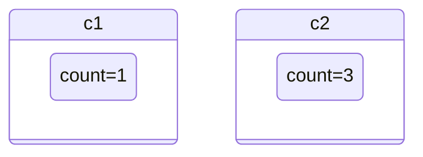

What if we wanted to have two buttons share the same count? To do this, move the state `count` upward to a parent component:

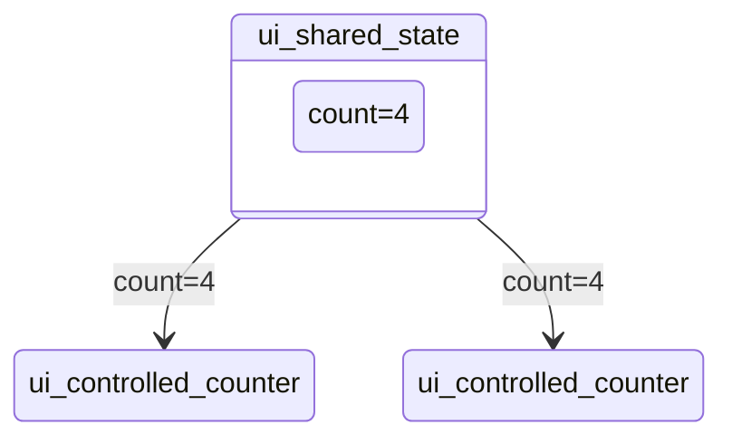

In the example below, we create a parent component `ui_shared_state` that contains the state, and then passes the state down into two `ui_controlled_counter` components. Now the buttons will always be in sync:

```python
@ui.component
def ui_controlled_counter(count, operation, on_press):
    return ui.button(f"Value is {count}, press to {operation}", on_press=on_press)


@ui.component
def ui_shared_state():
    count, set_count = ui.use_state(0)

    def handle_press():
        set_count(count + 1)

    return [
        ui.heading(f"Value is {count}"),
        ui_controlled_counter(count, "increment", lambda: set_count(count + 1)),
        ui_controlled_counter(count, "decrement", lambda: set_count(count - 1)),
    ]


shared_state = ui_shared_state()
```

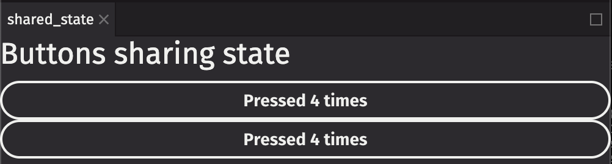

# Examples

Below are some examples building custom components using deephaven.ui.

## Text field (string)

You can create a [TextField](https://react-spectrum.adobe.com/react-spectrum/TextField.html) that takes input from the user. You can also use a [Flex](https://react-spectrum.adobe.com/react-spectrum/Flex.html) component to display multiple components in a row (or column, depending on the `direction` argument).

```python
@ui.component
def ui_input():
    text, set_text = ui.use_state("hello")

    return [ui.text_field(value=text, on_change=set_text), ui.text(f"You typed {text}")]


my_input = ui_input()
```

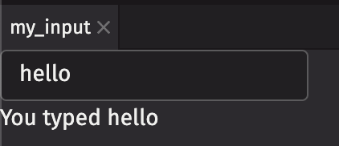

## Checkbox (boolean)

You can use a [checkbox](https://react-spectrum.adobe.com/react-spectrum/Checkbox.html) to get a boolean value from the user.

```python
@ui.component
def ui_checkbox():
    liked, set_liked = ui.use_state(True)
    return ui.flex(
        ui.checkbox("I liked this", is_selected=liked, on_change=set_liked),
        ui.text("You liked this" if liked else "You didn't like this"),
        direction="column",
    )


my_checkbox = ui_checkbox()
```

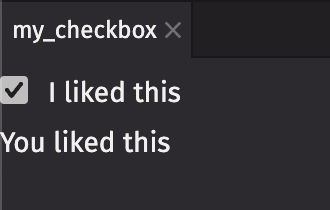

## Picker (string values)

The `ui.picker` component can be used to select from a list of items. Here's a basic example for selecting from a list of string values and displaying the selected key in a text field.

```python
@ui.component
def ui_picker():
    value, set_value = ui.use_state("")

    # Picker for selecting values
    pick = ui.picker(
        "Text 1",
        "Text 2",
        "Text 3",
        label="Text",
        on_selection_change=set_value,
        selected_key=value,
    )

    # Show current selection in a ui.text component
    text = ui.text("Selection: " + value)

    # Display picker and output in a flex column
    return ui.flex(
        pick,
        text,
        direction="column",
        margin=10,
        gap=10,
    )


my_picker = ui_picker()
```

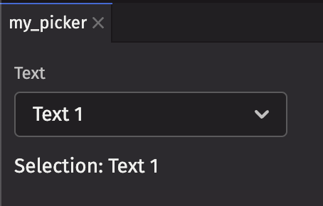

## ListView (string values)
A list view that can be used to create a list of selectable items. Here's a basic example for selecting from a list of string values and displaying the selected key in a text field.

```python
from deephaven import ui


@ui.component
def ui_list_view():
    value, set_value = ui.use_state(["Text 2"])

    # list_view with text children
    lv = ui.list_view(
        "Text 1",
        "Text 2",
        "Text 3",
        on_change=set_value,
        selected_keys=value,
    )

    # list_view with item children
    lv2 = ui.list_view(
        ui.item("Item 1", key="Text 1"),
        ui.item("Item 2", key="Text 2"),
        ui.item("Item 3", key="Text 3"),
        on_change=set_value,
        selected_keys=value,
    )

    text = ui.text("Selection: " + ", ".join(map(str, value)), grid_column="span 2")

    return ui.grid(
        text, lv, lv2, columns="repeat(2, 1fr)", rows="min-content", height="100%"
    )


lv = ui_list_view()
```

## ListView (table)
```python
from deephaven import time_table, ui
import datetime

# Ticking table with initial row count of 200 that adds a row every second
initial_row_count = 200
column_types = time_table(
    "PT1S",
    start_time=datetime.datetime.now() - datetime.timedelta(seconds=initial_row_count),
).update(
    [
        "Id=new Integer(i)",
        "Display=new String(`Display `+i)",
    ]
)


@ui.component
def ui_list_view_table():
    value, set_value = ui.use_state([2, 4, 5])

    lv = ui.list_view(
        column_types,
        key_column="Id",
        label_column="Display",
        aria_label="List View",
        on_change=set_value,
        selected_keys=value,
    )

    text = ui.text("Selection: " + ", ".join(map(str, value)))

    return ui.flex(
        lv,
        text,
        direction="column",
        margin=10,
        gap=10,
        # necessary to avoid overflowing container height
        min_height=0,
    )


lv_table = ui_list_view_table()
```

## Form (two variables)

You can have state with multiple different variables in one component. This example creates a [text field](https://react-spectrum.adobe.com/react-spectrum/TextField.html) and a [slider](https://react-spectrum.adobe.com/react-spectrum/Slider.html), and we display the values of both of them.

```python
@ui.component
def ui_form():
    name, set_name = ui.use_state("Homer")
    age, set_age = ui.use_state(36)

    return ui.flex(
        ui.text_field(value=name, on_change=set_name),
        ui.slider(value=age, on_change=set_age),
        ui.text(f"Hello {name}, you are {age} years old"),
        direction="column",
    )


my_form = ui_form()
```

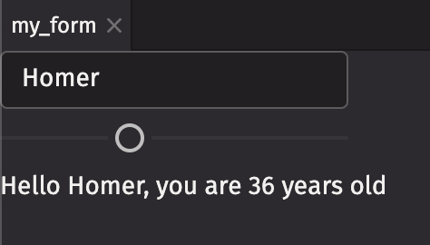

## Form with submit

You can also create a form on which the user can click **Submit** and react to that on a specified callback. In this example, we create a [Form](https://react-spectrum.adobe.com/react-spectrum/forms.html) that takes a name and age, and when the user clicks **Submit**, the values entered in the form are sent to the user on the form's `on_submit` callback.

```python
@ui.component
def ui_form_submit():
    def handle_submit(data):
        print(f"Hello {data['name']}, you are {data['age']} years old")

    return ui.form(
        ui.text_field(default_value="Douglas", name="name"),
        ui.number_field(default_value=42, name="age"),
        ui.button("Submit", type="submit"),
        on_submit=handle_submit,
    )


my_form_submit = ui_form_submit()
```

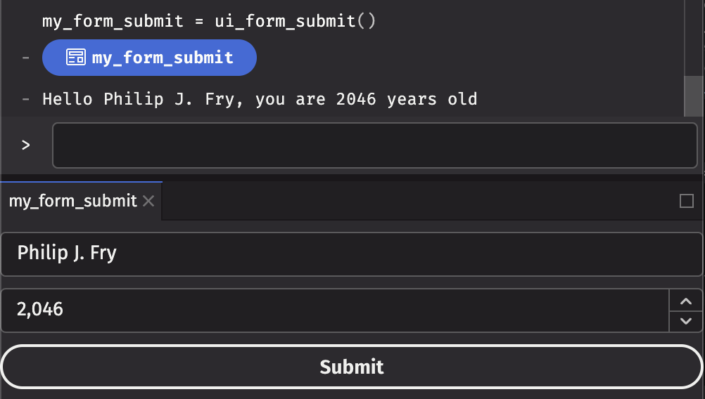

## Button events

Included with events are many details about the action itself, e.g. modifier keys held down, or the name of the target element. In this example, we create a custom component that prints all press, key, and focus events to the console, and add two of them to a panel to show interaction with both of them (e.g. when focus switches from one button to another):

```python
@ui.component
def ui_button_event_printer(*children, id="My Button"):
    return ui.button(
        *children,
        on_key_down=print,
        on_key_up=print,
        on_press=print,
        on_press_start=print,
        on_press_end=print,
        on_press_change=lambda is_pressed: print(f"{id} is_pressed: {is_pressed}"),
        on_press_up=print,
        on_focus=print,
        on_blur=print,
        on_focus_change=lambda is_focused: print(f"{id} is_focused: {is_focused}"),
        id=id,
    )


@ui.component
def ui_button_events():
    return [
        ui_button_event_printer("1", id="My Button 1"),
        ui_button_event_printer("2", id="My Button 2"),
    ]


my_button_events = ui_button_events()
```

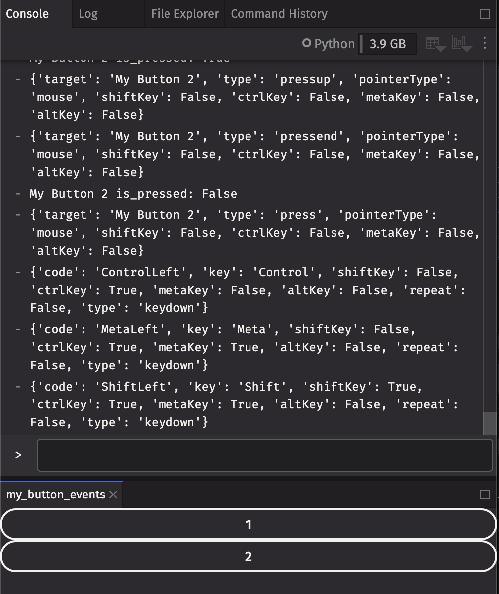

# Data Examples

Many of the examples below use the stocks table provided by `deephaven.plot.express` package:

```python
import deephaven.plot.express as dx

stocks = dx.data.stocks()
```

## Table with input filter

User input can filter a table using the `where` method. In this example, a [text field](https://react-spectrum.adobe.com/react-spectrum/TextField.html) takes input from the user, and we filter the table based on the input. Simply returning the table `t` from the component will display it in the UI (as if we had set it to a variable name).

```python
@ui.component
def ui_text_filter_table(source, column):
    value, set_value = ui.use_state("FISH")
    t = source.where(f"{column}=`{value}`")
    return ui.flex(
        ui.text_field(value=value, on_change=set_value),
        t,
        direction="column",
        flex_grow=1,
    )


my_text_filter_table = ui_text_filter_table(stocks, "sym")
```

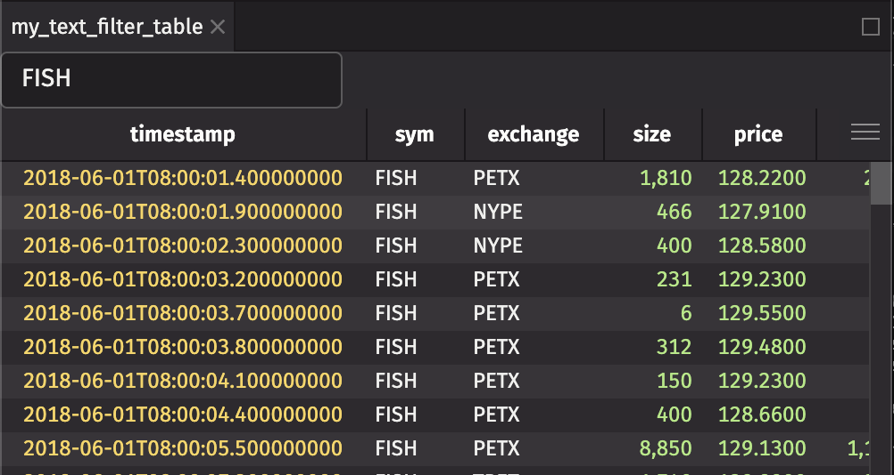

## Table with range filter

You can also filter a table based on a range. In this example, a [range slider](https://react-spectrum.adobe.com/react-spectrum/RangeSlider.html) takes input from the user, and we filter the table by price based on the input. Simply returning the table `t` from the component will display it in the UI (as if we had set it to a variable name).

```python
@ui.component
def ui_range_table(source, column):
    range, set_range = ui.use_state({"start": 1000, "end": 10000})
    t = source.where(f"{column} >= {range['start']} && {column} <= {range['end']}")
    return ui.flex(
        ui.range_slider(
            value=range, on_change=set_range, label=column, min_value=0, max_value=50000
        ),
        t,
        direction="column",
        flex_grow=1,
    )


my_range_table = ui_range_table(stocks, "size")
```


## Table with required filters

In the previous example, we took a user's input. Nothing was displayed if the user didn't enter any text. Instead, we can display a different message prompting the user for input. We use a few new components in this example:

- [IllustratedMessage](https://react-spectrum.adobe.com/react-spectrum/IllustratedMessage.html) (ui.illustrated_message): A component that displays an icon, heading, and content. In this case, we display a warning icon, a heading, and some content.
- [Icon](https://react-spectrum.adobe.com/react-spectrum/Icon.html) (ui.icon): A component that displays an icon. In this case, we display the warning icon, and set the font size to 48px so it appears large in the UI.
- [Flex](https://react-spectrum.adobe.com/react-spectrum/Flex.html) (ui.flex): A component that displays its children in a row. In this case, we display the input text fields beside eachother in a row.

```python
@ui.component
def ui_stock_widget_table(source, default_sym="", default_exchange=""):
    sym, set_sym = ui.use_state(default_sym)
    exchange, set_exchange = ui.use_state(default_exchange)

    ti1 = ui.text_field(
        label="Sym", label_position="side", value=sym, on_change=set_sym
    )
    ti2 = ui.text_field(
        label="Exchange", label_position="side", value=exchange, on_change=set_exchange
    )
    error_message = ui.illustrated_message(
        ui.icon("vsWarning", style={"fontSize": "48px"}),
        ui.heading("Invalid Input"),
        ui.content("Please enter 'Sym' and 'Exchange' above"),
    )
    t1 = (
        source.where([f"sym=`{sym.upper()}`", f"exchange=`{exchange.upper()}`"])
        if sym and exchange
        else error_message
    )

    return ui.flex(ui.flex(ti1, ti2), t1, direction="column", flex_grow=1)


my_stock_widget_table = ui_stock_widget_table(stocks, "", "")
```

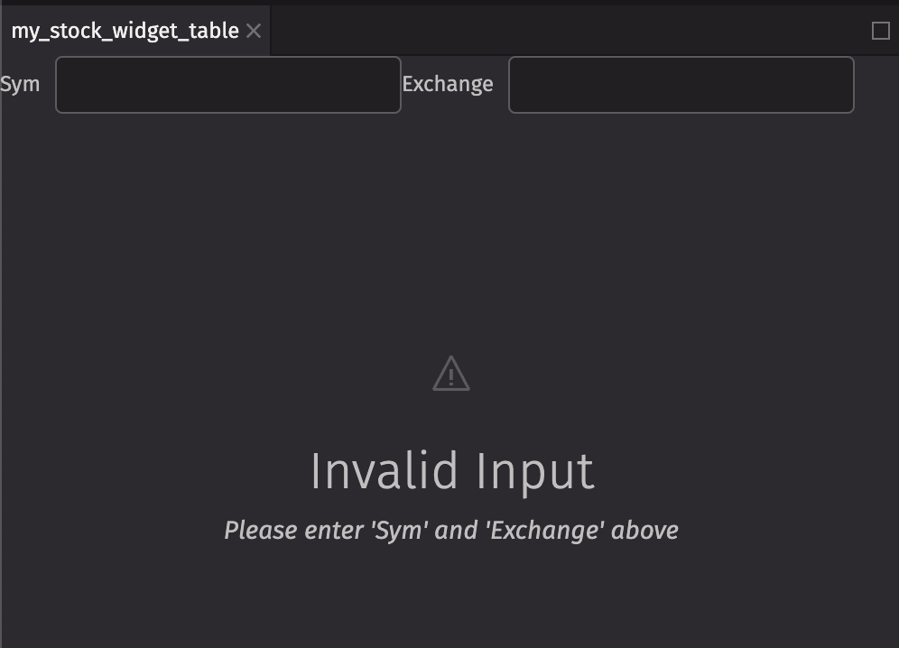

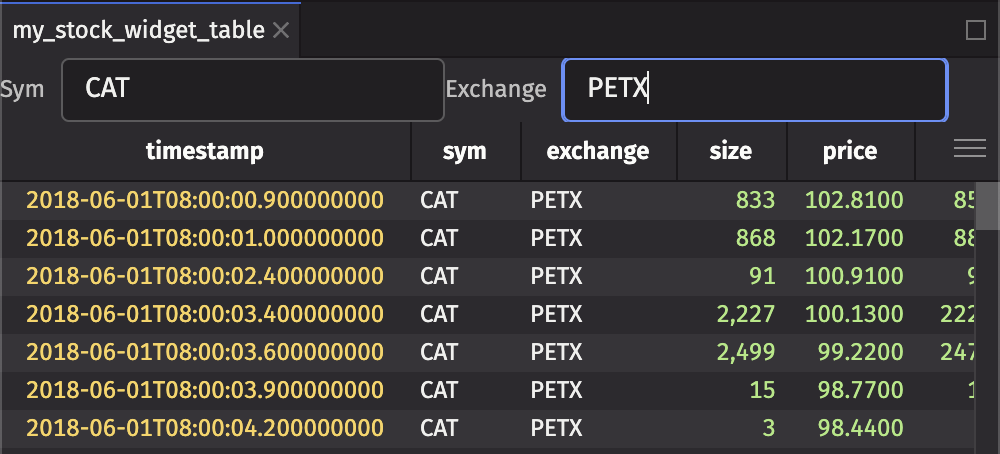

## Plot with filters

You can also do plots as you would expect.

```python
from deephaven.plot.figure import Figure


@ui.component
def ui_stock_widget_plot(source, default_sym="", default_exchange=""):
    sym, set_sym = ui.use_state(default_sym)
    exchange, set_exchange = ui.use_state(default_exchange)

    ti1 = ui.text_field(
        label="Sym", label_position="side", value=sym, on_change=set_sym
    )
    ti2 = ui.text_field(
        label="Exchange", label_position="side", value=exchange, on_change=set_exchange
    )
    t1 = source.where([f"sym=`{sym.upper()}`", f"exchange=`{exchange}`"])
    p = (
        Figure()
        .plot_xy(series_name=f"{sym}-{exchange}", t=t1, x="timestamp", y="price")
        .show()
    )

    return ui.flex(ui.flex(ti1, ti2), t1, p, direction="column", flex_grow=1)


my_stock_widget_plot = ui_stock_widget_plot(stocks, "CAT", "TPET")
```

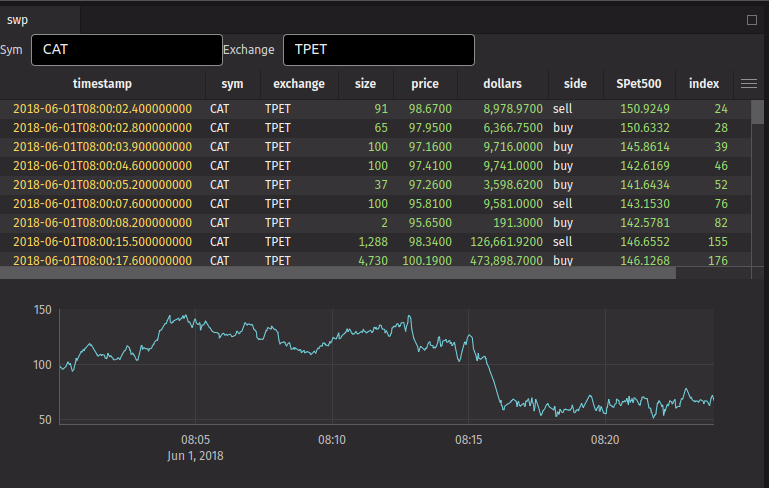

# Dashboard Examples

In addition to creating components, you can also create dashboards that displays many components laid out how you prefer.

## Dashboard Layout Elements

The dashboard layout elements available are:

- `ui.dashboard`: Create a dashboard to contain other layout elements.
- `ui.column`: Create a column of elements stacked vertically.
- `ui.row`: Create a row of elements laid out horizontally.
- `ui.stack`: Create a stack of panels on top of each other. You can use the panel tab to switch between panels in the stack. Only one panel in a stack is visible at a time.
- `ui.panel`: Create a panel to wrap an element. Panels can be moved around a dashboard manually by dragging the panel tab.

### ui.dashboard

A dashboard should only contain 1 root layout element. If the component for the dashboard returns an array of elements, they will be wrapped in a single root element. If there are multiple child elements of a dashboard, they will be wrapped as follows:

- If there are any rows, they will be wrapped in a column.
- If there are no rows and any columns, they will be wrapped in a row.
- If there are no rows or columns, they will be wrapped in a column.

### ui.row and ui.column

Rows and columns typically contain other rows and columns or stacks. If a row or column contains no other rows or columns, each element will be wrapped in a stack if needed. For example, if you create a row with two panels, those panels will be laid out side by side in their own stacks.

### ui.stack

Stacks are used to create a stack of panels on top of each other. Any elements in a stack will be wrapped in a panel if needed. It is recommended to provide the panels with a title because the automatically wrapped panels will receive a title of "Untitled".

## Basic Dashboard

Putting that all together, we can create a dashboard with two tables across the top and one plot across the bottom:

```python
from deephaven import ui
from deephaven.plot import express as dx
from deephaven.plot.figure import Figure

_stocks = dx.data.stocks()
_cat_stocks = _stocks.where("sym=`CAT`")
_dog_stocks = _stocks.where("sym=`DOG`")
_stocks_plot = (
    Figure()
    .plot_xy("Cat", _cat_stocks, x="timestamp", y="price")
    .plot_xy("Dog", _dog_stocks, x="timestamp", y="price")
    .show()
)

my_dash = ui.dashboard(
    ui.column(
        ui.row(
            ui.stack(ui.panel(_cat_stocks, title="Cat")),
            ui.stack(ui.panel(_dog_stocks, title="Dog")),
        ),
        ui.stack(ui.panel(_stocks_plot, title="Stocks")),
    )
)
```

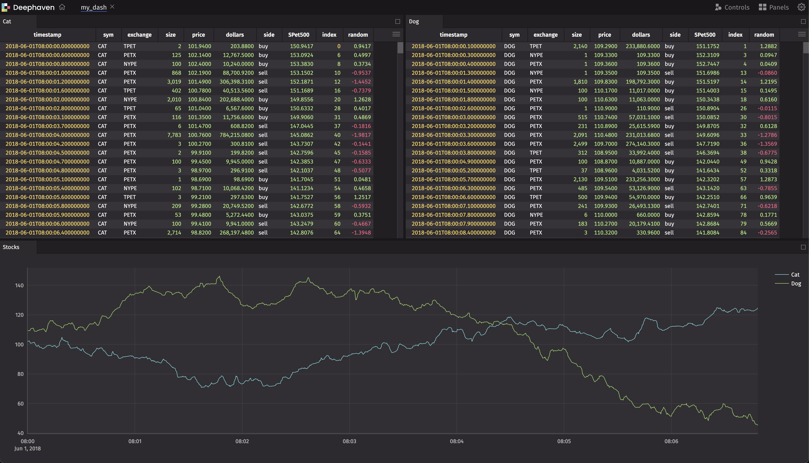

## Custom Components Dashboard

We can also create our own components and add them to a dashboard. In this example, we create one panel that will be used as the control input for selecting the phase, frequency, and amplitude of a wave. We then display multiple plots to show the different types of waves:

```python
from deephaven import ui, time_table
from deephaven.plot.figure import Figure


def use_wave_input():
    """
    Demonstrating a custom hook.
    Creates an input panel that controls the amplitude, frequency, and phase for a wave
    """
    amplitude, set_amplitude = ui.use_state(1.0)
    frequency, set_frequency = ui.use_state(1.0)
    phase, set_phase = ui.use_state(1.0)

    input_panel = ui.flex(
        ui.slider(
            label="Amplitude",
            default_value=amplitude,
            min_value=-100.0,
            max_value=100.0,
            on_change=set_amplitude,
            step=0.1,
        ),
        ui.slider(
            label="Frequency",
            default_value=frequency,
            min_value=-100.0,
            max_value=100.0,
            on_change=set_frequency,
            step=0.1,
        ),
        ui.slider(
            label="Phase",
            default_value=phase,
            min_value=-100.0,
            max_value=100.0,
            on_change=set_phase,
            step=0.1,
        ),
        direction="column",
    )

    return amplitude, frequency, phase, input_panel


@ui.component
def multiwave():
    amplitude, frequency, phase, wave_input = use_wave_input()

    tt = ui.use_memo(lambda: time_table("PT1s").update("x=i"), [])
    t = ui.use_memo(
        lambda: tt.update(
            [
                f"y_sin={amplitude}*Math.sin({frequency}*x+{phase})",
                f"y_cos={amplitude}*Math.cos({frequency}*x+{phase})",
                f"y_tan={amplitude}*Math.tan({frequency}*x+{phase})",
            ]
        ),
        [amplitude, frequency, phase],
    )
    p_sin = ui.use_memo(
        lambda: Figure().plot_xy(series_name="Sine", t=t, x="x", y="y_sin").show(), [t]
    )
    p_cos = ui.use_memo(
        lambda: Figure().plot_xy(series_name="Cosine", t=t, x="x", y="y_cos").show(),
        [t],
    )
    p_tan = ui.use_memo(
        lambda: Figure().plot_xy(series_name="Tangent", t=t, x="x", y="y_tan").show(),
        [t],
    )

    return ui.column(
        ui.row(
            ui.stack(
                ui.panel(wave_input, title="Wave Input"),
                ui.panel(t, title="Wave Table"),
                activeItemIndex=0,
            ),
            height=25,
        ),
        ui.row(
            ui.stack(ui.panel(p_sin, title="Sine"), width=50),
            ui.stack(ui.panel(p_cos, title="Cosine"), width=30),
            ui.stack(ui.panel(p_tan, title="Tangent")),
        ),
    )


mw = ui.dashboard(multiwave())
```

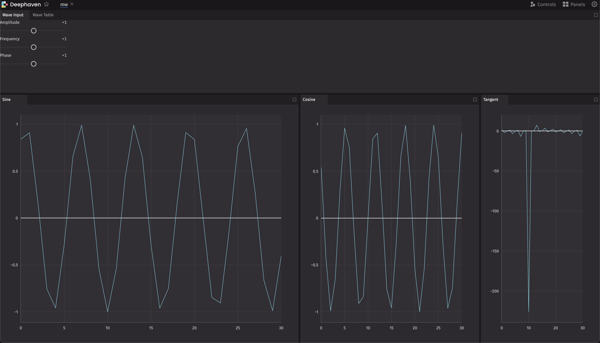

# Other Examples

## Memoization

We can use the `use_memo` hook to memoize a value. This is useful if you have a value that is expensive to compute and you only want to compute it when the inputs change. In this example, we create a time table with a new column, `y_sin,` which is a sine wave. We use `use_memo` to memoize the time table, so that it is only re-computed when the inputs to the `use_memo` function change (in this case, the function is a lambda that takes no arguments, so it will only re-compute when the dependencies change, which is never). We then use the `update` method to update the table with the new column, based on the values inputted on the sliders.

```python
from deephaven import ui
from deephaven import time_table


@ui.component
def waves():
    amplitude, set_amplitude = ui.use_state(1)
    frequency, set_frequency = ui.use_state(1)
    phase, set_phase = ui.use_state(1)

    tt = ui.use_memo(lambda: time_table("PT1s").update("x=i"), [])
    t = tt.update_view([f"y_sin={amplitude}*Math.sin({frequency}*x+{phase})"])

    return ui.flex(
        ui.flex(
            ui.slider(
                label="Amplitude",
                default_value=amplitude,
                min_value=-100,
                max_value=100,
                on_change=set_amplitude,
            ),
            ui.slider(
                label="Frequency",
                default_value=frequency,
                min_value=-100,
                max_value=100,
                on_change=set_frequency,
            ),
            ui.slider(
                label="Phase",
                default_value=phase,
                min_value=-100,
                max_value=100,
                on_change=set_phase,
            ),
            direction="column",
        ),
        t,
        flex_grow=1,
    )


w = waves()
```

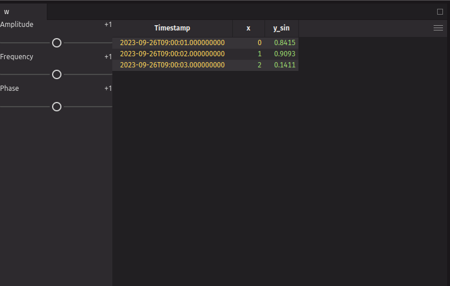

## Custom hook

We can write custom hooks that can be re-used. In this example, we create a custom hook that creates an input panel that controls the amplitude, frequency, and phase for a wave. We then use this custom hook in our `waves` component.

```python
from deephaven import ui
from deephaven import time_table


def use_wave_input():
    """
    Demonstrating a custom hook.
    Creates an input panel that controls the amplitude, frequency, and phase for a wave
    """
    amplitude, set_amplitude = ui.use_state(1.0)
    frequency, set_frequency = ui.use_state(1.0)
    phase, set_phase = ui.use_state(1.0)

    input_panel = ui.flex(
        ui.slider(
            label="Amplitude",
            default_value=amplitude,
            min_value=-100.0,
            max_value=100.0,
            on_change=set_amplitude,
            step=0.1,
        ),
        ui.slider(
            label="Frequency",
            default_value=frequency,
            min_value=-100.0,
            max_value=100.0,
            on_change=set_frequency,
            step=0.1,
        ),
        ui.slider(
            label="Phase",
            default_value=phase,
            min_value=-100.0,
            max_value=100.0,
            on_change=set_phase,
            step=0.1,
        ),
        direction="column",
    )

    return amplitude, frequency, phase, input_panel


@ui.component
def waves():
    amplitude, frequency, phase, wave_input = use_wave_input()

    tt = ui.use_memo(lambda: time_table("PT1s").update("x=i"), [])
    t = tt.update([f"y_sin={amplitude}*Math.sin({frequency}*x+{phase})"])

    return ui.flex(wave_input, t, flex_grow=1)


w = waves()
```

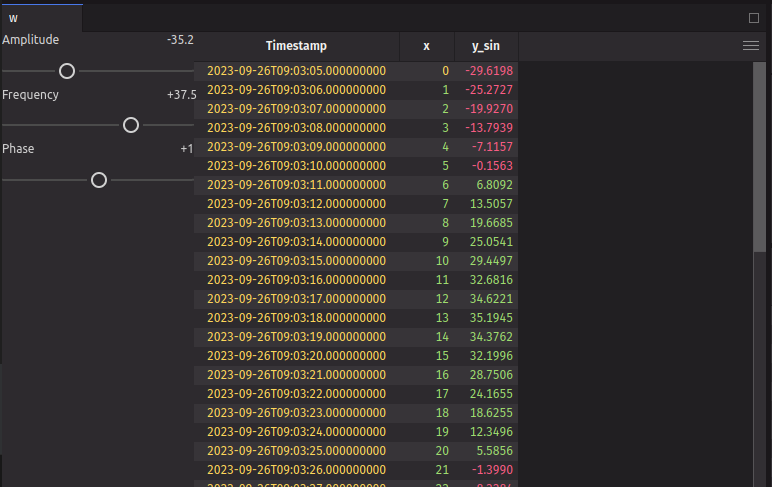

We can then re-use that hook to make a component that displays a plot as well:

```python
from deephaven import ui
from deephaven.plot.figure import Figure


@ui.component
def waves_with_plot():
    amplitude, frequency, phase, wave_input = use_wave_input()

    tt = ui.use_memo(lambda: time_table("PT1s").update("x=i"), [])
    t = ui.use_memo(
        lambda: tt.update(
            [
                f"y_sin={amplitude}*Math.sin({frequency}*x+{phase})",
            ]
        ),
        [amplitude, frequency, phase],
    )
    p = ui.use_memo(
        lambda: Figure().plot_xy(series_name="Sine", t=t, x="x", y="y_sin").show(), [t]
    )

    return ui.flex(wave_input, ui.flex(t, max_width=200), p, flex_grow=1)


wp = waves_with_plot()
```

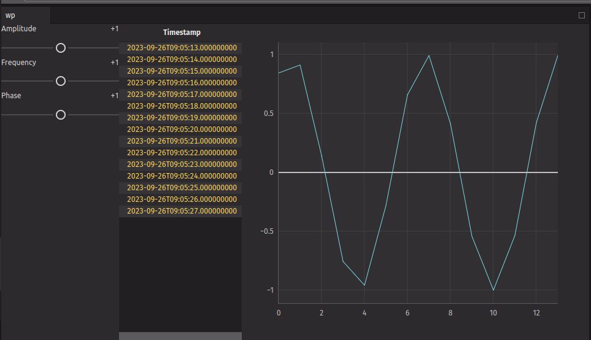

## Using Panels

When you return an array of elements, they automatically get created as individual panels. You can use the `ui.panel` component to name the panel.

```python
from deephaven import ui
from deephaven.plot.figure import Figure


@ui.component
def multiwave():
    amplitude, frequency, phase, wave_input = use_wave_input()

    tt = ui.use_memo(lambda: time_table("PT1s").update("x=i"), [])
    t = ui.use_memo(
        lambda: tt.update(
            [
                f"y_sin={amplitude}*Math.sin({frequency}*x+{phase})",
                f"y_cos={amplitude}*Math.cos({frequency}*x+{phase})",
                f"y_tan={amplitude}*Math.tan({frequency}*x+{phase})",
            ]
        ),
        [amplitude, frequency, phase],
    )
    p_sin = ui.use_memo(
        lambda: Figure().plot_xy(series_name="Sine", t=t, x="x", y="y_sin").show(), [t]
    )
    p_cos = ui.use_memo(
        lambda: Figure().plot_xy(series_name="Cosine", t=t, x="x", y="y_cos").show(),
        [t],
    )
    p_tan = ui.use_memo(
        lambda: Figure().plot_xy(series_name="Tangent", t=t, x="x", y="y_tan").show(),
        [t],
    )

    return [
        ui.panel(wave_input, title="Wave Input"),
        ui.panel(t, title="Wave Table"),
        ui.panel(p_sin, title="Sine"),
        ui.panel(p_cos, title="Cosine"),
        ui.panel(p_tan, title="Tangent"),
    ]


mw = multiwave()
```

## Using ui.table

You can use `ui.table` to add interactivity to a table, or give other instructions to the UI. Here's an example that creates two tables and a plot. The first table, `t1`, is an unfiltered view of the stocks table, with a row double-press listener so if you double-click on a row, it will filter the second table, `t2`, to show that row only and the plot to show that selected sym and exchange.

```py
from deephaven import ui
from deephaven.plot.figure import Figure
import deephaven.plot.express as dx

stocks = dx.data.stocks()


@ui.component
def stock_table_input(source, default_sym="", default_exchange=""):
    sym, set_sym = ui.use_state(default_sym)
    exchange, set_exchange = ui.use_state(default_exchange)

    t1 = source
    t2 = source.where([f"sym=`{sym.upper()}`", f"exchange=`{exchange}`"])
    p = (
        Figure()
        .plot_xy(series_name=f"{sym}-{exchange}", t=t2, x="timestamp", y="price")
        .show()
    )

    def handle_row_double_press(row, data):
        set_sym(data["sym"]["value"])
        set_exchange(data["exchange"]["value"])

    return [
        ui.panel(
            ui.table(t1, on_row_double_press=handle_row_double_press),
            title="Stock Table Input",
        ),
        ui.panel(t2, title="Stock Filtered Table"),
        ui.panel(p, title="Stock Plot"),
    ]


sti = stock_table_input(stocks, "CAT", "TPET")
```

### ui.table Events

The `ui.table` component has a few events that you can listen to. You can listen to different kinds of press events that include the data about the region pressed.

```py
from deephaven import ui
import deephaven.plot.express as dx

te = ui.table(
    dx.data.stocks(),
    on_row_press=lambda row, data: print(f"Row Press: {row}, {data}"),
    on_row_double_press=lambda row, data: print(f"Row Double Press: {row}, {data}"),
    on_cell_press=lambda cell_index, data: print(f"Cell Press: {cell_index}, {data}"),
    on_cell_double_press=lambda cell_index, data: print(
        f"Cell Double Press: {cell_index}, {data}"
    ),
    on_column_press=lambda column: print(f"Column Press: {column}"),
    on_column_double_press=lambda column: print(f"Column Double Press: {column}"),
)
```


## Re-using components

In a previous example, we created a text_filter_table component. We can re-use that component, and display two tables with an input filter side-by-side:

```python
from deephaven import ui


@ui.component
def text_filter_table(source, column, default_value=""):
    value, set_value = ui.use_state(default_value)
    return ui.flex(
        ui.text_field(
            label=column, label_position="side", value=value, on_change=set_value
        ),
        source.where(f"{column}=`{value}`"),
        direction="column",
        flex_grow=1,
    )


@ui.component
def double_table(source):
    return ui.flex(
        text_filter_table(source, "sym", "FISH"),
        text_filter_table(source, "exchange", "PETX"),
        flex_grow=1,
    )


dt = double_table(stocks)
```

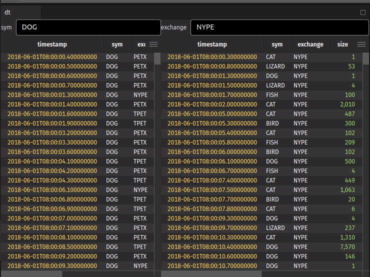

## Stock rollup

You can use the `rollup` method to create a rollup table. In this example, we create a rollup table that shows the average price of each stock and/or exchange. You can toggle the rollup by clicking on the [ToggleButton](https://react-spectrum.adobe.com/react-spectrum/ToggleButton.html). You can also highlight a specific stock by entering the symbol in the text field, but only when a rollup option isn't selected. We wrap the highlight input field with a `ui.fragment` that is conditionally used so that it doesn't appear when the rollup is selected. We also use the `ui.contextual_help` component to display a help message when you hover over the help icon.

```python
from deephaven import ui
from deephaven import agg
import deephaven.plot.express as dx

stocks = dx.data.stocks()


def get_by_filter(**byargs):
    """
    Gets a by filter where the arguments are all args passed in where the value is true.
    e.g.
    get_by_filter(sym=True, exchange=False) == ["sym"]
    get_by_filter(exchange=False) == []
    get_by_filter(sym=True, exchange=True) == ["sym", "exchange"]

    """
    return [k for k in byargs if byargs[k]]


@ui.component
def stock_table(source):
    is_sym, set_is_sym = ui.use_state(False)
    is_exchange, set_is_exchange = ui.use_state(False)
    highlight, set_highlight = ui.use_state("")
    aggs, set_aggs = ui.use_state(agg.avg(cols=["size", "price", "dollars"]))

    by = get_by_filter(sym=is_sym, exchange=is_exchange)

    formatted_table = ui.use_memo(
        lambda: source.format_row_where(f"sym=`{highlight}`", "LEMONCHIFFON"),
        [source, highlight],
    )
    rolled_table = ui.use_memo(
        lambda: (
            formatted_table
            if len(by) == 0
            else formatted_table.rollup(aggs=aggs, by=by)
        ),
        [formatted_table, aggs, by],
    )

    return ui.flex(
        ui.flex(
            ui.toggle_button(ui.icon("vsSymbolMisc"), "By Sym", on_change=set_is_sym),
            ui.toggle_button(
                ui.icon("vsBell"), "By Exchange", on_change=set_is_exchange
            ),
            (
                ui.fragment(
                    ui.text_field(
                        label="Highlight Sym",
                        label_position="side",
                        value=highlight,
                        on_change=set_highlight,
                    ),
                    ui.contextual_help(
                        ui.heading("Highlight Sym"),
                        ui.content("Enter a sym you would like highlighted."),
                    ),
                )
                if not is_sym and not is_exchange
                else None
            ),
            align_items="center",
            gap="size-100",
            margin="size-100",
            margin_bottom="0",
        ),
        rolled_table,
        direction="column",
        flex_grow=1,
    )


st = stock_table(stocks)
```

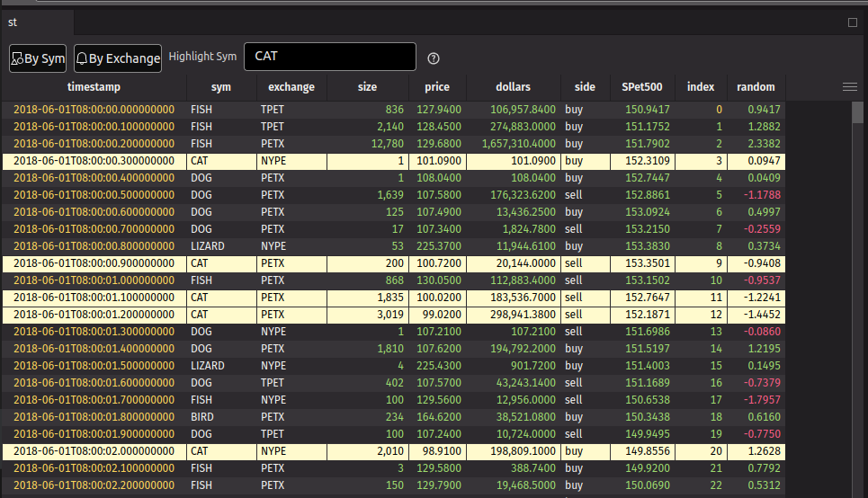

## Listening to Table Updates

You can use the `use_table_listener` hook to listen to changes to a table. In this example, we use the `use_table_listener` hook to listen to changes to the table then display the last changes.

This is an advanced feature, requiring understanding of how the [table listeners](https://deephaven.io/core/docs/how-to-guides/table-listeners-python/) work, and limitations of running code while the Update Graph is running. Most usages of this are more appropriate to implement with [the table data hooks](#using-table-data-hooks).

```python
from deephaven import ui
from deephaven.table import Table
from deephaven import time_table, empty_table, merge
from deephaven import pandas as dhpd
import pandas as pd


def to_table(update):
    return dhpd.to_table(pd.DataFrame.from_dict(update))


def add_as_op(ls, t, op):
    t = t.update(f"type=`{op}`")
    ls.append(t)


@ui.component
def monitor_changed_data(source: Table):

    changed, set_changed = ui.use_state(empty_table(0))

    show_added, set_show_added = ui.use_state(True)
    show_removed, set_show_removed = ui.use_state(True)

    def listener(update, is_replay):

        to_merge = []

        if (added_dict := update.added()) and show_added:
            added = to_table(added_dict)
            add_as_op(to_merge, added, "added")

        if (removed_dict := update.removed()) and show_removed:
            removed = to_table(removed_dict)
            add_as_op(to_merge, removed, "removed")

        if to_merge:
            set_changed(merge(to_merge))
        else:
            set_changed(empty_table(0))

    ui.use_table_listener(source, listener, [])

    added_check = ui.checkbox(
        "Show Added", isSelected=show_added, on_change=set_show_added
    )

    removed_check = ui.checkbox(
        "Show Removed", isSelected=show_removed, on_change=set_show_removed
    )

    return [added_check, removed_check, changed]


t = time_table("PT1S").update(formulas=["X=i"]).tail(5)

monitor = monitor_changed_data(t)
```

## Handling liveness in functions

Some functions which interact with a component will create live objects that need to be managed by the component to ensure they are kept active.

The primary use case for this is when creating tables outside the component's own function, and passing them as state for the component's next update:

```python
from deephaven import ui, time_table


@ui.component
def resetable_table():
    table, set_table = ui.use_state(lambda: time_table("PT1s"))
    handle_press = ui.use_liveness_scope(lambda _: set_table(time_table("PT1s")), [])
    return [
        ui.action_button(
            "Reset",
            on_press=handle_press,
        ),
        table,
    ]


f = resetable_table()
```

Without the `use_liveness_scope` wrapping the lamdba, the newly created live tables it creates go out of scope before the component can make use of it.

For more information on liveness scopes and why they are needed, see the [liveness scope documentation](https://deephaven.io/core/docs/conceptual/liveness-scope-concept/).

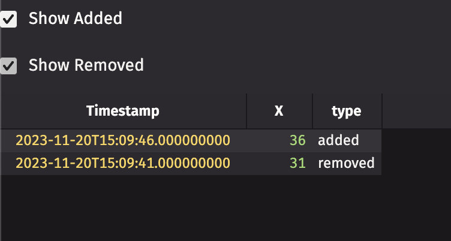

## Tabs

You can add [Tabs](https://react-spectrum.adobe.com/react-spectrum/Tabs.html) within a panel by using the `ui.tabs` method. In this example, we create a tabbed panel with multiple tabs:

- Unfiltered table
- Table filtered on sym `CAT`. We also include an icon in the tab header.
- Table filtered on sym `DOG`

```python
from deephaven import ui
from deephaven.plot import express as dx

stocks = dx.data.stocks()


@ui.component
def table_tabs(source):
    return ui.tabs(
        ui.tab_list(
            ui.item("Unfiltered", key="Unfiltered"),
            ui.item(ui.icon("vsGithubAlt"), "CAT", key="CAT"),
            ui.item("DOG", key="DOG"),
        ),
        ui.tab_panels(
            ui.item(source, key="Unfiltered"),
            ui.item(source.where("sym=`CAT`"), key="CAT"),
            ui.item(source.where("sym=`DOG`"), key="DOG"),
        ),
        flex_grow=1,
    )


tt = table_tabs(stocks)
```

## Using Table Data Hooks

There are five different hooks that can be used to get data from a table:

1. `use_table_data`: Returns a dictionary of rows and columns from the table.
2. `use_row_data`: Returns a single row from the table as a dictionary
3. `use_row_list`: Returns a single row from the table as a list
4. `use_column_data`: Returns a single column from the table as a list
5. `use_cell_data`: Returns a single cell from the table

In this example, the hooks are used to display various pieces of information about LIZARD trades.

```python
from deephaven import ui
from deephaven.table import Table
from deephaven import time_table, agg
import deephaven.plot.express as dx

stocks = dx.data.stocks()


@ui.component
def watch_lizards(source: Table):

    sold_lizards = source.where(["side in `sell`", "sym in `LIZARD`"])
    exchange_count_table = sold_lizards.view(["exchange"]).count_by(
        "count", by=["exchange"]
    )
    last_sell_table = sold_lizards.tail(1)
    max_size_and_price_table = sold_lizards.agg_by([agg.max_(cols=["size", "price"])])
    last_ten_sizes_table = sold_lizards.view("size").tail(10)
    average_sell_table = (
        sold_lizards.view(["size", "dollars"])
        .tail(100)
        .sum_by()
        .view("average = dollars/size")
    )

    exchange_count = ui.use_table_data(exchange_count_table)
    last_sell = ui.use_row_data(last_sell_table)
    max_size_and_price = ui.use_row_list(max_size_and_price_table)
    last_ten_sizes = ui.use_column_data(last_ten_sizes_table)
    average_sell = ui.use_cell_data(average_sell_table)

    exchange_count_view = ui.view(f"Exchange counts {exchange_count}")
    last_sell_view = ui.view(f"Last Sold LIZARD: {last_sell}")
    max_size_and_price_view = ui.view(f"Max size and max price: {max_size_and_price}")
    last_ten_sizes_view = ui.view(f"Last Ten Sizes: {last_ten_sizes}")
    average_sell_view = ui.view(f"Average LIZARD price: {average_sell}")

    return ui.flex(
        exchange_count_view,
        last_sell_view,
        max_size_and_price_view,
        last_ten_sizes_view,
        average_sell_view,
        margin=10,
        gap=10,
        direction="column",
    )


watch = watch_lizards(stocks)
```

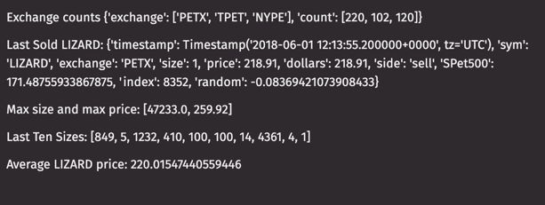

## Multi-threading

State updates must be called from the render thread. All callbacks are automatically called from the render thread, but sometimes you will need to do some long-running operations asynchronously. You can use the `use_render_queue` hook to run a callback on the render thread. In this example, we create a form that takes a URL as input, and loads the CSV file from another thread before updating the state on the current thread.

```python
import logging
import threading
import time
from deephaven import read_csv, ui


@ui.component
def csv_loader():
    # The render_queue we fetch using the `use_render_queue` hook at the top of the component
    render_queue = ui.use_render_queue()
    table, set_table = ui.use_state()
    error, set_error = ui.use_state()

    def handle_submit(data):
        # We define a callable that we'll queue up on our own thread
        def load_table():
            try:
                # Read the table from the URL
                t = read_csv(data["url"])

                # Define our state updates in another callable. We'll need to call this on the render thread
                def update_state():
                    set_error(None)
                    set_table(t)

                # Queue up the state update on the render thread
                render_queue(update_state)
            except Exception as e:
                # In case we have any errors, we should show the error to the user. We still need to call this from the render thread,
                # so we must assign the exception to a variable and call the render_queue with a callable that will set the error
                error_message = e

                def update_state():
                    set_table(None)
                    set_error(error_message)

                # Queue up the state update on the render thread
                render_queue(update_state)

        # Start our own thread loading the table
        threading.Thread(target=load_table).start()

    return [
        # Our form displaying input from the user
        ui.form(
            ui.flex(
                ui.text_field(
                    default_value="https://media.githubusercontent.com/media/deephaven/examples/main/DeNiro/csv/deniro.csv",
                    label="Enter URL",
                    label_position="side",
                    name="url",
                    flex_grow=1,
                ),
                ui.button(f"Load Table", type="submit"),
                gap=10,
            ),
            on_submit=handle_submit,
        ),
        (
            # Display a hint if the table is not loaded yet and we don't have an error
            ui.illustrated_message(
                ui.heading("Enter URL above"),
                ui.content("Enter a URL of a CSV above and click 'Load' to load it"),
            )
            if error is None and table is None
            else None
        ),
        # The loaded table. Doesn't show anything if it is not loaded yet
        table,
        # An error message if there is an error
        (
            ui.illustrated_message(
                ui.icon("vsWarning"),
                ui.heading("Error loading table"),
                ui.content(f"{error}"),
            )
            if error != None
            else None
        ),
    ]


my_loader = csv_loader()
```
