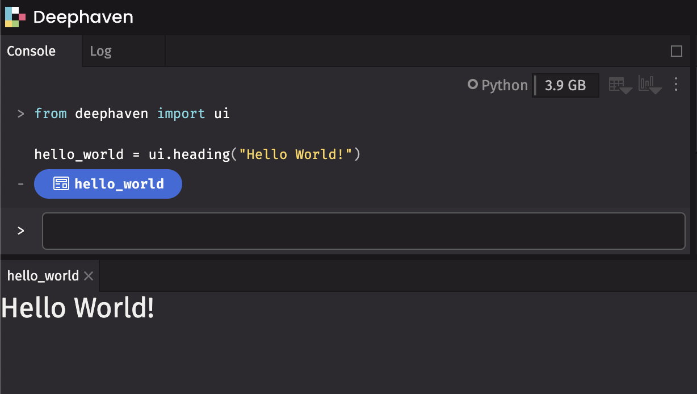

# deephaven.ui

## A Python web framework for building real-time data-focused apps

`deephaven.ui` is a plugin for Deephaven that combines a reactive UI framework and a library of pre-built real-time data-focused components for creating data apps. Write scripts entirely in Python -- no front-end engineering Javascript or CSS required. It uses a React-like approach to building components and rendering them in the UI, allowing for the creation of reactive components that can be re-used and composed together, as well as reacting to user input from the UI.

## Key Features

- **Components**: Create user interfaces from components defined entirely with Python.
- **Live dataframe aware**: Components are live dataframe aware and can use Deephaven tables as a data source.
- **Reactive**: UI components automatically update when the underlying Python data changes.
- **Declarative**: Describe the UI as a function of the data and let the framework handle the rest.
- **Composable**: Combine and re-use components to build complex interfaces.
- **Wide range of components**: From simple text fields to complex tables and plots, the library has a wide range of components to build your app.

## Getting Started

You can run the example Docker container with either of the following commands, depending on your Deephaven version:

```bash
# For Deephaven < 0.37.0
docker run --rm --name deephaven-ui -p 10000:10000 --pull=always ghcr.io/deephaven/server-ui:latest

# For Deephaven >= 0.37.0
docker run --rm --name deephaven-ui -p 10000:10000 --pull=always ghcr.io/deephaven/server:latest
```

You'll need to find the link to open the UI in the Docker logs:


## Creating and using components

Get started by importing the `deephaven.ui` package as `ui`:

```python test-set=readme
from deephaven import ui
```

The `ui` package contains many _components_, which you can display in the UI:

```python test-set=readme
hello_world = ui.heading("Hello World!")
```



By assigning the component to the `hello_world` variable, it displays in the UI in a panel named `hello_world`.

## Handling events

Write functions to handle events. To write a button that will print event details to the console when clicked:

```python test-set=readme
my_button = ui.button("Click Me!", on_press=lambda e: print(f"Button was clicked! {e}"))
```


## Creating components

Use the `@ui.component` decorator to create your own custom components. This decorator wraps the function provided as a Deephaven component. For more details on the architecture, see [Architecture documentation](./architecture.md).

We can display a heading above a button as our custom component:

```python test-set=readme
@ui.component
def ui_foo_bar():
    return [
        ui.heading("Click button below"),
        ui.button("Click Me!", on_press=lambda: print("Button was clicked!")),
    ]


foo_bar = ui_foo_bar()
```


## Using state

Often, you'll want to react to the button presses and update the display. For example, to count the number of times a button has been pressed, use `ui.use_state` to introduce a _state variable_ in your custom component:

```python skip-test
@ui.component
def ui_counter():
    count, set_count = ui.use_state(0)
    # ...
```

Returned from `ui.use_state` is a tuple with two values: the current state (`count`), and a function to update that state (`set_count`).

The first time the button is displayed, the count will be `0` because that is the initial value passed into `ui.use_state`. Call `set_count` to update the state:

```python skip-test
@ui.component
def ui_counter():
    count, set_count = ui.use_state(0)
    return ui.button(f"Pressed {count} times", on_press=lambda: set_count(count + 1))
```

When state is updated, deephaven.ui will call your component again to re-render with the new value. After clicking once, it will re-render with `count` set to `1`, then set to `2`, and so on.

Each individual component has its own state:

```python test-set=readme order=c1,c2
@ui.component
def ui_counter():
    count, set_count = ui.use_state(0)
    return ui.button(f"Pressed {count} times", on_press=lambda: set_count(count + 1))


c1 = ui_counter()
c2 = ui_counter()
```


## Attribution

We would like to thank the [React](https://react.dev/) and [React Spectrum](https://github.com/adobe/react-spectrum) project teams. The `deephaven.ui` framework is inspired by React, and exposes library components from React Spectrum with Python. Further, the `deephaven.ui` docs themselves are adapted from [react.dev/learn](https://react.dev/learn) by Meta, used under [Creative Commons Attribution 4.0 International](https://github.com/reactjs/react.dev/blob/main/LICENSE-DOCS.md). The original work has been converted contextually to Python and the deephaven.ui framework, but much of the concepts and structure remain the same. Portions of the component documentation are also derived from the [React Spectrum](https://react-spectrum.adobe.com/react-spectrum/index.html) project by Adobe, licensed under the [Apache License, Version 2.0](https://github.com/adobe/react-spectrum/blob/main/LICENSE).

The `deephaven.ui` framework is licensed under the [Apache License, Version 2.0](https://github.com/deephaven/deephaven-plugins/blob/main/plugins/ui/LICENSE).

## What's next

Follow the [tutorial](./tutorial.md), or dive into the [architecture](./architecture.md) to learn more about how `deephaven.ui` works.
