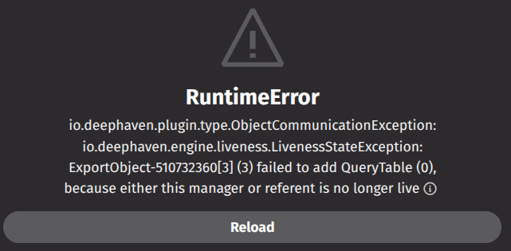

# Update Tables in State

As your `deephaven.ui` components become more complex, you may want to set a deephaven [table](../describing/ui_with_tables.md) as state for your component. This will allow you to create UIs where the underlying table changes in response to user events. However, it is important to keep in mind the [liveness scope](/core/docs/conceptual/liveness-scope-concept/) of a table when you set it in state.

For example, this component allows a user to reset a table by setting it in state:

```python
from deephaven import ui, time_table


@ui.component
def ui_resetable_table():
    table, set_table = ui.use_state(lambda: time_table("PT1s"))
    handle_press = ui.use_callback(lambda _: set_table(time_table("PT1s")), [])
    return [
        ui.action_button(
            "Reset",
            on_press=handle_press,
        ),
        table,
    ]


resetable_table = ui_resetable_table()
```

Clicking the "Reset" button displays an error:



The error states that "this manager or referent is no longer live". This is a liveness error. It means that the component is trying to use a table that has not been kept alive. There are several ways to fix this error.

## The `use_liveness_scope` hook

The first way to fix this error is the [`use_liveness_scope`](../hooks/use_liveness_scope.md) hook. This hook allows you to manage the liveness of table to prevent it being garbage collected before your component is done using it. With this change, we can reset the table:

```python
from deephaven import ui, time_table


@ui.component
def ui_resetable_table():
    table, set_table = ui.use_state(lambda: time_table("PT1s"))
    handle_press = ui.use_liveness_scope(lambda _: set_table(time_table("PT1s")), [])
    return [
        ui.action_button(
            "Reset",
            on_press=handle_press,
        ),
        table,
    ]


resetable_table = ui_resetable_table()
```
