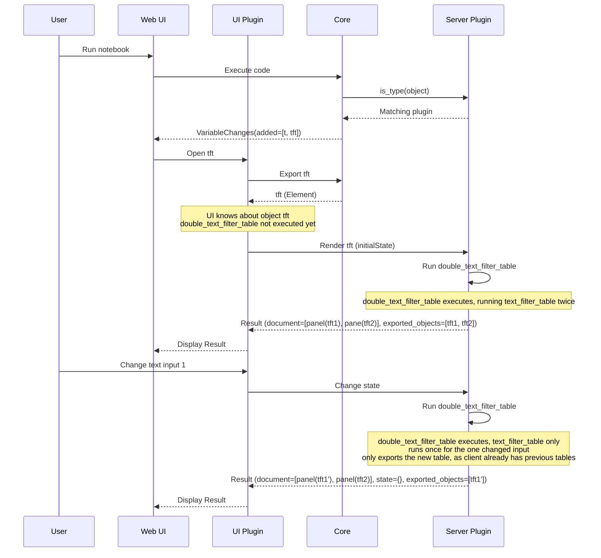
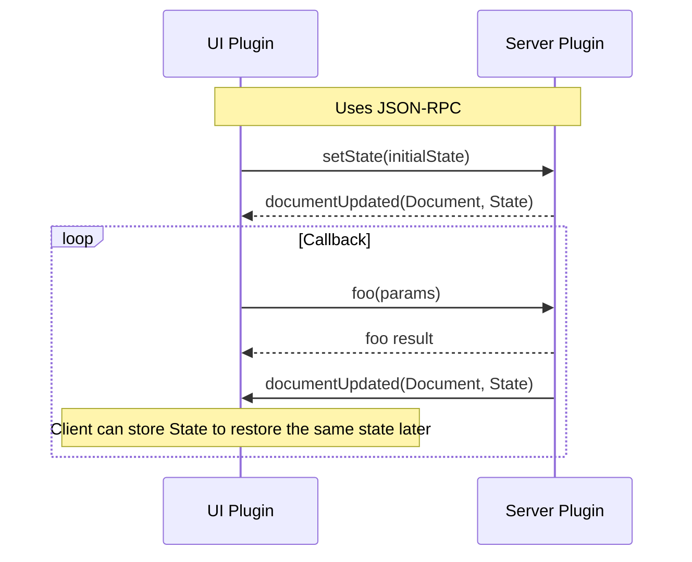

# Architecture

deephaven.ui is a flexible and extensible [React-like](https://react.dev/learn/thinking-in-react) UI framework that can create complex UIs in Python. You can create UIs using only the components provided by deephaven.ui, or you can create your own components using the `@ui.component` decorator.

## Rendering

When you call a function decorated by `@ui.component`, it will return an `Element` object that references the function it is decorated by; that is to say, the function does _not_ run immediately. The function runs when the `Element` is rendered by the client, and the result is sent back to the client. This allows the `@ui.component` decorator to execute the function with the appropriate rendering context. The client must also set the initial state before rendering, allowing the client to persist the state and re-render in the future.

Let's say we execute the following, where a table is filtered based on the value of a text input:

```python
from deephaven import ui


@ui.component
def text_filter_table(source, column, initial_value=""):
    value, set_value = ui.use_state(initial_value)
    ti = ui.text_field(value=value, on_change=set_value)
    tt = source.where(f"{column}=`{value}`")
    return [ti, tt]


# This will render two panels, one filtering the table by Sym, and the other by Exchange
@ui.component
def double_text_filter_table(source):
    tft1 = text_filter_table(source, "Sym", "CAT")
    tft2 = text_filter_table(source, "Exchange", "PETX")
    return ui.panel(tft1, title="Sym"), ui.panel(tft2, title="Exchange")


import deephaven.plot.express as dx

_stocks = dx.data.stocks()

tft = double_text_filter_table(_stocks)
```

This should result in a UI like:


How does that look when the notebook is executed? When does each code block execute?



### Threads and rendering

When a component is rendered, the render task is [submitted to the Deephaven server as a "concurrent" task](https://deephaven.io/core/pydoc/code/deephaven.server.executors.html#deephaven.server.executors.submit_task). This ensures that rendering one component does not block another component from rendering. A lock is then held on that component instance to ensure it can only be rendered by one thread at a time, a root [render context](#render-context) is set in the thread-local data, and the component is rendered.

### Render context

While rendering components, "hooks" are used to manage state and other side effects. The magic part of hooks is they work based on the order they are called within a component. When a component is rendered, a new context is set, replacing the existing context. When the component is done rendering, the context is reset to the previous context. This allows for nested components to have their own state and side effects, and for the parent component to manage the state of the child components, re-using the same context when re-rendering a child component.

## Communication/Callbacks

When the document is first rendered, it will pass the entire document to the client. When the client makes a callback, it needs to send a message to the server indicating which callback it wants to trigger, and with which parameters. For this, we use [JSON-RPC](https://www.jsonrpc.org/specification). When the client opens the message stream to the server, the communication looks like:



## Communication Layers

A component that is created on the server side runs through a few steps before it is rendered on the client side:

1. [Element](./src/deephaven/ui/elements/Element.py) - The basis for all UI components. Generally, a [FunctionElement](./src/deephaven/ui/elements/FunctionElement.py) created by a script using the [@ui.component](./src/deephaven/ui/components/make_component.py) decorator that does not run the function until it is rendered. The result can change depending on the context that it is rendered in (e.g., what "state" is set).
2. [ElementMessageStream](./src/deephaven/ui/object_types/ElementMessageStream.py) - The `ElementMessageStream` is responsible for rendering one instance of an element in a specific rendering context and handling the server-client communication. The element is rendered to create a [RenderedNode](./src/deephaven/ui/renderer/RenderedNode.py), which is an immutable representation of a rendered document. The `RenderedNode` is then encoded into JSON using [NodeEncoder](./src/deephaven/ui/renderer/NodeEncoder.py), which pulls out all the non-serializable objects (such as Tables) and maps them to exported objects, and all the callables to be mapped to commands that JSON-RPC can accept. This is the final representation of the document sent to the client and ultimately handled by the `WidgetHandler`.
3. [DashboardPlugin](./src/js/src/DashboardPlugin.tsx) - Client-side `DashboardPlugin` that listens for when a widget of type `Element` is opened and manages the `WidgetHandler` instances that are created for each widget.
4. [WidgetHandler](./src/js/src/WidgetHandler.tsx) - Uses JSON-RPC communication with an `ElementMessageStream` instance to load the initial rendered document and associated exported objects. Listens for any changes and updates the document accordingly.
5. [DocumentHandler](./src/js/src/DocumentHandler.tsx) - Handles the root of a rendered document, laying out the appropriate panels or dashboard specified.
