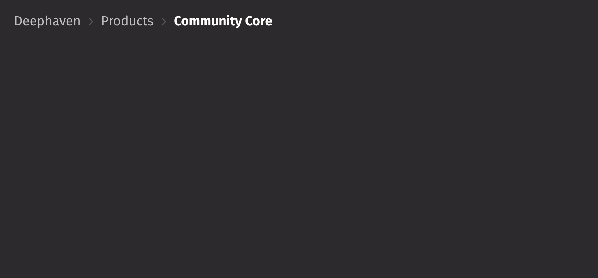

# Breadcrumbs

Breadcrumbs show hierarchy and navigational context for a user's location within an application.

```python
from deephaven import ui


breadcrumbs_example = ui.view(
    ui.breadcrumbs(
        ui.item("Deephaven", key="deephaven"),
        ui.item("Products", key="products"),
        ui.item("Community Core", key="community_core"),
    ),
    width="100%",
)
```



## Content

`ui.breadcrumbs` accepts `item` elements as children, each with a `key` prop. Basic usage of breadcrumbs, seen in the example above, shows multiple items populated with a string.

## Events

Use the `on_action` prop to specify a callback to handle press events on items.

```python
from deephaven import ui


@ui.component
def breadcrumbs_action_example():
    selected, set_selected = ui.use_state("None")

    return (
        ui.view(
            ui.breadcrumbs(
                ui.item("Deephaven", key="deephaven"),
                ui.item("Products", key="products"),
                ui.item("Community Core", key="community_core"),
                on_action=set_selected,
            ),
            ui.text(f"{selected} clicked"),
            width="100%",
        ),
    )


my_breadcrumbs_action_example = breadcrumbs_action_example()
```

## Links

By default, interacting with an item in breadcrumbs triggers `on_action`. By passing the `href` prop to the `ui.item` component, items may also be links to another page or website. The target window to open the link in can be configured using the `target` prop.

```python
from deephaven import ui


breadcrumbs_link_example = ui.view(
    ui.breadcrumbs(
        ui.item(
            "Deephaven",
            key="deephaven",
            href="https://deephaven.io/",
            target="_blank",
        ),
        ui.item(
            "Community Core",
            key="community_core",
            href="https://deephaven.io/community/",
            target="_blank",
        ),
        ui.item(
            "Getting Started",
            key="getting_started",
            href="https://deephaven.io/core/docs/getting-started/quickstart/",
            target="_blank",
        ),
    ),
    width="100%",
)
```

## Size

The size of the breadcrumbs including spacing and layout can be set using the `size` prop. By default this is set to `"L"`.

```python
from deephaven import ui


breadcrumbs_size_example = ui.view(
    ui.breadcrumbs(
        ui.item("Deephaven", key="deephaven"),
        ui.item("Products", key="products"),
        ui.item("Community Core", key="community_core"),
    ),
    ui.breadcrumbs(
        ui.item("Deephaven", key="deephaven"),
        ui.item("Products", key="products"),
        ui.item("Community Core", key="community_core"),
        size="M",
    ),
    ui.breadcrumbs(
        ui.item("Deephaven", key="deephaven"),
        ui.item("Products", key="products"),
        ui.item("Community Core", key="community_core"),
        size="S",
    ),
    width="100%",
)
```

## Multiline

Use the `is_multiline` prop to place the last item below the other items. This adds emphasis to the current location as a page title or heading.

```python
from deephaven import ui


breadcrumbs_multiline_example = ui.view(
    ui.breadcrumbs(
        ui.item("Deephaven", key="deephaven"),
        ui.item("Products", key="products"),
        ui.item("Community Core", key="community_core"),
        is_multiline=True,
    ),
    width="100%",
)
```

## Root context

Some applications find that always displaying the root item is useful to orient users. Use the `show_root` prop to keeps the root visible when other items are truncated into the menu.

```python
from deephaven import ui


breadcrumbs_root_context_example = ui.view(
    ui.breadcrumbs(
        ui.item("Deephaven", key="deephaven"),
        ui.item("Products", key="products"),
        ui.item("Community Core", key="community_core"),
        ui.item("Getting Started", key="getting_started"),
        ui.item("Create Tables", key="create_tables"),
        show_root=True,
    ),
    width="300px",
)
```

## Disabled

Use the `is_disabled` prop to show items but indicate that navigation is not available. This can be used to maintain layout continuity.

```python
from deephaven import ui


breadcrumbs_disabled_example = ui.view(
    ui.breadcrumbs(
        ui.item("Deephaven", key="deephaven"),
        ui.item("Products", key="products"),
        ui.item("Community Core", key="community_core"),
        is_disabled=True,
    ),
    width="100%",
)
```

## Overflow behavior

Breadcrumbs collapses items into a menu when space is limited. It will only show a maximum of 4 visible items including the root and menu button, if either are visible.

If the root item cannot be rendered in the available horizontal space, it will be collapsed into the menu regardless of the `show_root` prop.

Note that the last breadcrumb item will automatically truncate with an ellipsis instead of collapsing into the menu.

```python
from deephaven import ui


@ui.component
def breadcrumbs_overflow_example():
    return [
        ui.view(
            ui.breadcrumbs(
                ui.item("Deephaven", key="deephaven"),
                ui.item("Products", key="products"),
                ui.item("Community Core", key="community_core"),
                ui.item("Getting Started", key="getting_started"),
                ui.item("Create Tables", key="create_tables"),
                show_root=True,
            ),
            border_width="thin",
            border_color="accent-400",
            width="100%",
        ),
        ui.view(
            ui.breadcrumbs(
                ui.item("Deephaven", key="deephaven"),
                ui.item("Products", key="products"),
                ui.item("Community Core", key="community_core"),
                ui.item("Getting Started", key="getting_started"),
                ui.item("Create Tables", key="create_tables"),
                show_root=True,
            ),
            border_width="thin",
            border_color="accent-400",
            width="200px",
        ),
        ui.view(
            ui.breadcrumbs(
                ui.item("Deephaven", key="deephaven"),
                ui.item("Products", key="products"),
                ui.item("Community Core", key="community_core"),
                ui.item("Getting Started", key="getting_started"),
                ui.item("Create Tables", key="create_tables"),
            ),
            border_width="thin",
            border_color="accent-400",
            width="100px",
        ),
    ]


my_breadcrumbs_overflow_example = breadcrumbs_overflow_example()
```

## Detailed example

Below is an example using the generated `tips` dataset from the Deephaven Express API. It allows you to explore the data in a hierarchical order of day, time, sex, and smoker status.

```python order=my_tips,_tips
import deephaven.plot.express as dx
from deephaven.table import Table
from deephaven import ui


@ui.component
def table_breadcrumb_filterer(
    table: Table, filter_columns: list[str], all_item_text="All"
):
    items, set_items = ui.use_state([ui.item(all_item_text)])
    option_column, set_option_column = ui.use_state(filter_columns[0])
    filters, set_filters = ui.use_state([])

    filtered_table = ui.use_memo(lambda: table.where(filters), [table, filters])
    column_value_table = ui.use_memo(
        lambda: filtered_table.select_distinct(option_column),
        [filtered_table, option_column],
    )
    column_values = ui.use_column_data(column_value_table)

    def handle_action(key):
        current_index = filter_columns.index(option_column)
        set_items(items + [ui.item(f"{key}", key=option_column)])
        if current_index < len(filter_columns) - 1:
            set_option_column(filter_columns[current_index + 1])
        set_filters(filters + [f"{option_column} == '{key}'"])

    def handle_back(key):
        if key not in filter_columns:
            set_items([ui.item(all_item_text)])
            set_option_column(filter_columns[0])
            set_filters([])
            return

        selected_index = filter_columns.index(key)
        set_items(items[: selected_index + 2])
        set_option_column(filter_columns[selected_index + 1])
        set_filters(filters[: selected_index + 1])

    show_filter = len(filters) < len(filter_columns)

    return ui.flex(
        ui.flex(
            ui.breadcrumbs(*items, show_root=True, on_action=handle_back, flex_grow=1),
            ui.view(
                ui.menu_trigger(
                    ui.action_button(f"Filter by {option_column}", ui.icon("filter")),
                    ui.menu(
                        *[ui.item(value) for value in column_values],
                        on_action=handle_action,
                    ),
                ),
            )
            if show_filter
            else None,
        ),
        filtered_table.view(
            formulas=["TotalBill", "Tip", "Size"] + filter_columns[len(filters) :]
        ),
        direction="column",
    )


_tips = dx.data.tips()
my_tips = table_breadcrumb_filterer(_tips, ["Day", "Time", "Sex", "Smoker"], "All Tips")
```

## API reference

```{eval-rst}
.. dhautofunction:: deephaven.ui.breadcrumbs
```
