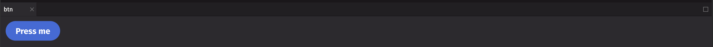

# Button

Buttons allow users to trigger an action or to navigate to another page. They are available in multiple styles for various purposes. Buttons are ideal for calling attention to actions users need to perform in order to move forward in a flow.

## Example

```python
from deephaven import ui

btn = ui.button("Press me", on_press=lambda: print("Button clicked"))
```



## UI recommendations

Recommendations for creating clear and effective buttons:

1. Button text should be clear and concise. No more than 4 words or 20 characters is recommended.
2. Use verbs for button text to indicate the action that will be taken when the button is clicked. For example, "Save", "Delete", or "Add friend", rather than "Ok" or "Cancel". Nouns or adjectives tend to be less clear.
3. Use sentence case for button text with more than one word. For example, "Add friend" instead of "Add Friend" or "ADD FRIEND".
4. No punctuation is needed at the end of the button text.
5. Use icons only when necessary, and not as a replacement for text or decoration. Icons should be used to provide additional context to the button's action.
6. When presenting choices, use a single filled accent button to suggest to users the recommended choice, paired with outlined primary or secondary buttons for the other options. This helps to visually distinguish the primary action from the secondary actions.
7. Use negative buttons sparingly, as they can be visually distracting. They should be used for actions that are destructive or irreversible.

Consider using [`action_button`](./action_button.md) for task-based actions, or in cases where buttons aren't meant to draw attention to themselves. To represent a binary choice, use a [`toggle_button`](./toggle_button.md) instead. If you have a collection of related buttons, you can group them using a [`button_group`](./button_group.md).

## Events

Buttons accept a value to display and can trigger actions based on events such as setting state when pressed. See the [API Reference](#api-reference) for a full list of available events.

```python
from deephaven import ui


@ui.component
def counter():
    count, set_count = ui.use_state(0)
    return ui.button(
        f"Pressed {count} times",
        on_press=lambda: set_count(count + 1),
    )


counter_example = counter()
```

## Variants

Buttons can have different styles to indicate their purpose.

```python
from deephaven import ui


@ui.component
def button_variants():
    return [
        ui.button("Accent fill", variant="accent", style="fill"),
        ui.button("Accent outline", variant="accent", style="outline"),
        ui.button("Primary fill", variant="primary", style="fill"),
        ui.button("Primary outline", variant="primary", style="outline"),
        ui.button("Secondary fill", variant="secondary", style="fill"),
        ui.button("Secondary outline", variant="secondary", style="outline"),
        ui.button("Negative fill", variant="negative", style="fill"),
        ui.button("Negative outline", variant="negative", style="outline"),
    ]


button_variants_example = button_variants()
```

Static-color buttons are available in white and black. They don't dynamically change in response to the user's theme. They should only be used over fixed-color backgrounds, not over theme colors that may change.

```python
from deephaven import ui


@ui.component
def static_buttons():
    return [
        ui.view(
            ui.button_group(
                ui.button("White fill", static_color="white", style="fill"),
                ui.button(
                    "White outline",
                    static_color="white",
                    style="outline",
                ),
            ),
            background_color="#000066",
            padding="size-300",
        ),
        ui.view(
            ui.button_group(
                ui.button("Black fill", static_color="black", style="fill"),
                ui.button(
                    "Black outline",
                    static_color="black",
                    style="outline",
                ),
            ),
            background_color="#FFFF00",
            padding="size-300",
        ),
    ]


static_buttons_example = static_buttons()
```

## Icon buttons

Buttons can have icons when necessary to provide additional context. If no visible label is provided (e.g., an icon-only button), an alternative text label must be provided to identify the control for accessibility using the `aria-label` prop. See [icon](./icon.md) for a list of available icons.

```python
from deephaven import ui


@ui.component
def icon_buttons():
    return [
        ui.button(ui.icon("squirrel"), "Squirrel"),
        ui.button(ui.icon("squirrel"), aria_label="Squirrel"),
    ]


icon_buttons_example = icon_buttons()
```

## Pending state

Buttons can be in a pending state to indicate that an action is in progress (such as an asynchronous server request). After a one-second delay, an indeterminate spinner will be displayed in place of the button label and icon. You can trigger this behavior by setting the `is_pending` prop. Button events are disabled while `is_pending` is true.

```python
from deephaven import ui
from threading import Timer


@ui.component
def pending_button():
    [pending, set_pending] = ui.use_state(False)

    def handle_on_press():
        # start an asynchronous thing
        timeout = Timer(3, callback_finshed)  # use a timer to wait 3 seconds
        timeout.start()

        # turn on loading spinner
        set_pending(True)

    def callback_finshed():
        # turn of loading spinner
        set_pending(False)

    return ui.button(
        "Pending request",
        on_press=handle_on_press,
        is_pending=pending,
        variant="accent",
    )


pending_example = pending_button()
```

## Disabled state

Buttons can be disabled to prevent user interaction. This is useful when the button is not available for interaction, but should still be visible.

```python
from deephaven import ui

btn = ui.button("Disabled button", is_disabled=True)
```

## Button links

Buttons can be used as links to navigate to another page if the `href` attribute is provided.

```python
from deephaven import ui

btn = ui.button("Go to deephaven.io", href="https://deephaven.io")
```

## API reference

```{eval-rst}
.. dhautofunction:: deephaven.ui.button
```
