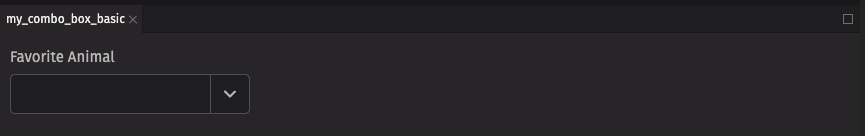

# Combo Box

Combo boxes combine a text input field with a picker menu, enabling users to filter and select from longer lists based on their query.

## Example

```python
from deephaven import ui


@ui.component
def ui_combo_box_basic():
    option, set_option = ui.use_state("")

    return ui.combo_box(
        ui.item("red panda"),
        ui.item("cat"),
        ui.item("dog"),
        ui.item("aardvark"),
        ui.item("kangaroo"),
        ui.item("snake"),
        ui.item("ant"),
        label="Favorite Animal",
        selected_key=option,
        on_change=set_option,
    )


my_combo_box_basic = ui_combo_box_basic()
```



## UI Recommendations

Recommendations for creating clear and effective combo boxes:

1. The combo box's text input simplifies searching through large lists. For lists with fewer than 6 items, use radio buttons. For lists with more than 6 items, assess if the list is complex enough to need searching and filtering, and if not, use a picker instead.
2. Every combo box should have a label specified. Without one, the combo box is ambiguous and not accessible.
3. Options in the combo box should be kept short and concise; multiple lines are strongly discouraged. If more than one line is needed, consider using a description to add context to the option.
4. Choose a `width` for your combo boxes that can accommodate most of the available options.
5. The field labels, menu items, and placeholder text should all be in sentence case.
6. Identify which combo boxes are required or optional, and use the `is_required` field or the `necessity_indicator` to mark them accordingly.
7. A combo box's help text should provide actionable guidance on what to select and how to select it, offering additional context without repeating the placeholder text.
8. When an error occurs, the help text specified in a combo box is replaced by error text; thus, ensure both help and error text convey the same essential information to maintain consistent messaging and prevent loss of critical details.
9. Write error messages in a clear, concise, and helpful manner, guiding users to resolve the issue without ambiguity; ideally, they should be 1-2 short, complete sentences.

## Data sources

For combo boxes, we can use a Deephaven table or [URI](uri.md) as a data source to populate the options. When using a table, it automatically uses the first column as both the key and label. If there are any duplicate keys, an error will be thrown; to avoid this, a `select_distinct` can be used on the table prior to using it as a combo box data source.

```python order=my_combo_box_table_source_example,countries
from deephaven import ui, empty_table
from deephaven.plot import express as dx


countries = dx.data.gapminder().select_distinct("Country")


my_combo_box_table_source_example = ui.combo_box(countries, label="Sample Combo box")
```

## Item table sources

If you wish to manually specify the keys and labels, use a `ui.item_table_source` to dynamically derive the options from a table.

```python order=my_combo_box_item_table_source_example,column_types
from deephaven import ui, empty_table

account_icon = "vsAccount"
columns = [
    "Key=new Integer(i)",
    "Label=new String(`Display `+i)",
    "Icon=(String) account_icon",
]
column_types = empty_table(20).update(columns)


item_table_source = ui.item_table_source(
    column_types,
    key_column="Key",
    label_column="Label",
    icon_column="Icon",
)


my_combo_box_item_table_source_example = ui.combo_box(
    item_table_source, label="User Combo box"
)
```

## Custom Value

By default, when a combo box loses focus, it resets its input value to match the selected option's text or clears the input if no option is selected. To allow users to enter a custom value, use the `allows_custom_value` prop to override this behavior.

```python order=my_combo_box_custom_value_examples,countries
from deephaven import ui
from deephaven.plot import express as dx

countries = dx.data.gapminder().select_distinct("Country")


@ui.component
def ui_combo_box_custom_value_examples():
    value, set_value = ui.use_state("")
    value_2, set_value_2 = ui.use_state("")
    return [
        ui.combo_box(
            countries,
            on_input_change=set_value,
            allows_custom_value=True,
            label="Allows custom value",
        ),
        ui.text_field(value=value),
        ui.combo_box(
            countries,
            on_input_change=set_value_2,
            allows_custom_value=False,
            label="Does not allow custom value",
        ),
        ui.text_field(value=value_2),
    ]


my_combo_box_custom_value_examples = ui_combo_box_custom_value_examples()
```

## HTML Forms

Combo boxes can support a `name` prop for integration with HTML forms, allowing for easy identification of a value on form submission. The `form_value` prop determines whether the text or key of the selected item is submitted in an HTML form; if `allows_custom_value` is true, only the text is submitted.

```python
from deephaven import ui


@ui.component
def ui_combo_box_form_examples():
    return [
        ui.form(
            ui.combo_box(
                ui.item("Chocolate"),
                ui.item("Mint"),
                ui.item("Vanilla"),
                ui.item("Strawberry"),
                ui.item("Cookies and Cream"),
                ui.item("Coffee"),
                ui.item("Mango"),
                label="Ice cream flavor",
                allows_custom_value=True,
            ),
            ui.combo_box(
                ui.item("Panda"),
                ui.item("Cat"),
                ui.item("Dog"),
                ui.item("Hamster"),
                ui.item("Rabbit"),
                ui.item("Horse"),
                label="Favourite Animal",
                name="favouriteAnimalId",
            ),
            ui.button("Submit", type="submit"),
            on_submit=lambda event: print(event),
        )
    ]


my_combo_box_form_examples = ui_combo_box_form_examples()
```

## Labeling

The combo box can be labeled using the `label` prop, and if no label is provided, an `aria_label` must be provided to identify the control for accessibility purposes.

```python
from deephaven import ui


@ui.component
def ui_combo_box_label_examples():
    return [
        ui.combo_box(
            ui.item("Option 1"),
            ui.item("Option 2"),
            ui.item("Option 3"),
            ui.item("Option 4"),
            ui.item("Option 5"),
            ui.item("Option 6"),
            ui.item("Option 7"),
            ui.item("Option 8"),
            label="Pick an option",
        ),
        ui.combo_box(
            ui.item("Option 1"),
            ui.item("Option 2"),
            ui.item("Option 3"),
            ui.item("Option 4"),
            ui.item("Option 5"),
            ui.item("Option 6"),
            ui.item("Option 7"),
            ui.item("Option 8"),
            aria_label="Pick an option",
        ),
    ]


my_combo_box_label_examples = ui_combo_box_label_examples()
```

The `is_required` prop and the `necessity_indicator` props can be used to show whether selecting an option in the combo box is required or optional.

When the `necessity_indicator` prop is set to "label", a localized string will be generated for "(required)" or "(optional)" automatically.

```python
from deephaven import ui


@ui.component
def ui_combo_box_required_examples():
    return [
        ui.combo_box(
            ui.item("Option 1"),
            ui.item("Option 2"),
            ui.item("Option 3"),
            ui.item("Option 4"),
            ui.item("Option 5"),
            ui.item("Option 6"),
            ui.item("Option 7"),
            label="Pick an option",
            is_required=True,
        ),
        ui.combo_box(
            ui.item("Option 1"),
            ui.item("Option 2"),
            ui.item("Option 3"),
            ui.item("Option 4"),
            ui.item("Option 5"),
            ui.item("Option 6"),
            ui.item("Option 7"),
            ui.item("Option 8"),
            label="Pick an option",
            is_required=True,
            necessity_indicator="label",
        ),
        ui.combo_box(
            ui.item("Option 1"),
            ui.item("Option 2"),
            ui.item("Option 3"),
            ui.item("Option 4"),
            ui.item("Option 5"),
            ui.item("Option 6"),
            ui.item("Option 7"),
            ui.item("Option 8"),
            ui.item("Option 9"),
            label="Pick an option",
            necessity_indicator="label",
        ),
    ]


my_combo_box_required_examples = ui_combo_box_required_examples()
```

## Selection

In a combo box, the `default_selected_key` or `selected_key` props set a selected option.

The `default_selected_key` is useful for simpler scenarios where you don't need to control the state externally. The `selected_key` is used for scenarios where the state should be managed by the parent component, providing control and flexibility over the selection of the combo box.

```python
from deephaven import ui


@ui.component
def ui_combo_box_selected_key_examples():
    option, set_option = ui.use_state("Option 1")
    return [
        ui.combo_box(
            ui.item("Option 1"),
            ui.item("Option 2"),
            ui.item("Option 3"),
            ui.item("Option 4"),
            ui.item("Option 5"),
            ui.item("Option 6"),
            ui.item("Option 7"),
            ui.item("Option 8"),
            ui.item("Option 9"),
            default_selected_key="Option 2",
            label="Pick an option (uncontrolled)",
        ),
        ui.combo_box(
            ui.item("Option 1"),
            ui.item("Option 2"),
            ui.item("Option 3"),
            ui.item("Option 4"),
            ui.item("Option 5"),
            ui.item("Option 6"),
            ui.item("Option 7"),
            ui.item("Option 8"),
            ui.item("Option 9"),
            selected_key=option,
            on_change=set_option,
            label="Pick an option (controlled)",
        ),
    ]


my_combo_box_selected_key_examples = ui_combo_box_selected_key_examples()
```

## Sections

Combo boxes support sections to group options. Sections can be used by wrapping groups of items in a Section element. Each Section takes a title and key prop.

Note that, when searching for options, searching by section will not result in the respective options within that section appearing.

Also, sections can only be used directly, not from a table data source.

```python
from deephaven import ui


my_combo_box_section_example = ui.combo_box(
    ui.section(
        ui.item("Option 1"),
        ui.item("Option 2"),
        ui.item("Option 3"),
        ui.item("Option 4"),
        ui.item("Option 5"),
        ui.item("Option 6"),
        ui.item("Option 7"),
        ui.item("Option 8"),
        title="Section 1",
    ),
    ui.section(
        ui.item("Option 9"),
        ui.item("Option 10"),
        ui.item("Option 11"),
        ui.item("Option 12"),
        ui.item("Option 13"),
        ui.item("Option 14"),
        ui.item("Option 15"),
        ui.item("Option 16"),
        title="Section 2",
    ),
)
```

## Events

Combo boxes support selection via mouse, keyboard, and touch. You can handle all these via the `on_change` prop, which receives the selected key as an argument. Additionally, combo boxes accept an `on_input_change` prop, which is triggered whenever the search value is edited by the user, whether through typing or option selection.

Each interaction done in the combo box will trigger its associated event handler. For instance, typing in the input field will only trigger the `on_input_change`, not the `on_change`.

Note, this is not the case for selections; when a selection is made, both the `on_change` and `on_input_change` are triggered.

```python
from deephaven import ui


@ui.component
def ui_combo_box_control_example():
    input_value, set_input_value = ui.use_state("")
    selection_state, set_selection_state = ui.use_state("")

    def handle_input_change(new_value):
        set_selection_state("")
        set_input_value(new_value)
        print(f"Text changed to {input_value}")

    def handle_selection_change(new_value):
        set_input_value(new_value)
        set_selection_state(new_value)
        print(f"Selection changed to {selection_state}")

    return [
        ui.combo_box(
            ui.item("Option 1"),
            ui.item("Option 2"),
            ui.item("Option 3"),
            ui.item("Option 4"),
            ui.item("Option 5"),
            ui.item("Option 6"),
            ui.item("Option 7"),
            ui.item("Option 8"),
            ui.item("Option 9"),
            input_value=input_value,
            on_input_change=handle_input_change,
            selected_key=selection_state,
            on_change=handle_selection_change,
        )
    ]


my_combo_box_control_example = ui_combo_box_control_example()
```

## Complex items

Items within a combo box can include additional content to better convey options. You can add icons, avatars, and descriptions to the children of an `ui.item`. When adding a description, set the `slot` prop to "description" to differentiate between the text elements.

```python
from deephaven import ui


my_combo_box_complex_items_example = ui.combo_box(
    ui.item(
        ui.icon("vsGithubAlt"),
        ui.text("Github"),
        ui.text("Github Option", slot="description"),
        text_value="Github",
    ),
    ui.item(
        ui.icon("vsAzureDevops"),
        ui.text("Azure"),
        ui.text("Azure Option", slot="description"),
        text_value="Azure",
    ),
)
```

## Validation

The `is_required` prop ensures that the user selects an option. The related `validation_behaviour` prop allows the user to specify aria or native verification.

When the prop is set to "native", the validation errors block form submission and are displayed as help text automatically.

```python
from deephaven import ui


@ui.component
def ui_combo_box_validation_behaviour_example():
    return ui.form(
        ui.combo_box(
            ui.section(ui.item("Option 1"), ui.item("Option 2"), title="Section 1"),
            validation_behavior="aria",
            is_required=True,
        )
    )


my_combo_box_validation_behaviour_example = ui_combo_box_validation_behaviour_example()
```

## Trigger Options

By default, the combo box's menu opens when the user types into the input field ("input"). This behavior can be changed to open on focus ("focus") or only when the field button is clicked ("manual") using the `menu_trigger` prop.

```python
from deephaven import ui


@ui.component
def ui_combo_box_trigger_option_examples():
    return [
        ui.combo_box(
            ui.item("Option 1"),
            ui.item("Option 2"),
            ui.item("Option 3"),
            ui.item("Option 4"),
            ui.item("Option 5"),
            ui.item("Option 6"),
            ui.item("Option 7"),
            ui.item("Option 8"),
            ui.item("Option 9"),
            label="Select Option",
        ),
        ui.combo_box(
            ui.item("Option 1"),
            ui.item("Option 2"),
            ui.item("Option 3"),
            ui.item("Option 4"),
            ui.item("Option 5"),
            ui.item("Option 6"),
            ui.item("Option 7"),
            ui.item("Option 8"),
            ui.item("Option 9"),
            label="Select Option",
            menu_trigger="focus",
        ),
        ui.combo_box(
            ui.item("Option 1"),
            ui.item("Option 2"),
            ui.item("Option 3"),
            ui.item("Option 4"),
            ui.item("Option 5"),
            ui.item("Option 6"),
            ui.item("Option 7"),
            ui.item("Option 8"),
            ui.item("Option 9"),
            label="Select Option",
            menu_trigger="manual",
        ),
    ]


my_combo_box_trigger_option_examples = ui_combo_box_trigger_option_examples()
```

## Label position

By default, the position of a combo box's label is above the combo box, but it can be moved to the side using the `label_position` prop.

```python
from deephaven import ui


@ui.component
def ui_combo_box_label_position_examples():
    return [
        ui.combo_box(
            ui.item("Option 1"),
            ui.item("Option 2"),
            ui.item("Option 3"),
            ui.item("Option 4"),
            ui.item("Option 5"),
            ui.item("Option 6"),
            ui.item("Option 7"),
            ui.item("Option 8"),
            ui.item("Option 9"),
            label="Test Label",
        ),
        ui.combo_box(
            ui.item("Option 1"),
            ui.item("Option 2"),
            ui.item("Option 3"),
            ui.item("Option 4"),
            ui.item("Option 5"),
            ui.item("Option 6"),
            ui.item("Option 7"),
            ui.item("Option 8"),
            ui.item("Option 9"),
            label="Test Label",
            label_position="side",
        ),
    ]


my_combo_box_label_position_examples = ui_combo_box_label_position_examples()
```

## Quiet State

The `is_quiet` prop makes a combo box "quiet". This can be useful when the combo box and its corresponding styling should not distract users from surrounding content.

```python
from deephaven import ui


my_combo_box_is_quiet_example = ui.combo_box(
    ui.item("Option 1"),
    ui.item("Option 2"),
    ui.item("Option 3"),
    ui.item("Option 4"),
    ui.item("Option 5"),
    ui.item("Option 6"),
    ui.item("Option 7"),
    ui.item("Option 8"),
    ui.item("Option 9"),
    is_quiet=True,
)
```

## Disabled State

The `is_disabled` prop disables a combo box to prevent user interaction. This is useful when the combo box should be visible but unavailable for selection.

```python
from deephaven import ui


my_combo_box_is_disabled_example = ui.combo_box(
    ui.item("Option 1"),
    ui.item("Option 2"),
    ui.item("Option 3"),
    ui.item("Option 4"),
    ui.item("Option 5"),
    ui.item("Option 6"),
    ui.item("Option 7"),
    ui.item("Option 8"),
    ui.item("Option 9"),
    is_disabled=True,
)
```

## Read-only State

The `is_read_only` prop prevents user input in a combo box, but the selected option should be visible.

```python
from deephaven import ui


my_combo_box_is_read_only_example = ui.combo_box(
    ui.item("Option 1", key="Option 1"),
    ui.item("Option 2", key="Option 2"),
    ui.item("Option 3", key="Option 3"),
    ui.item("Option 4", key="Option 4"),
    ui.item("Option 5", key="Option 5"),
    ui.item("Option 6", key="Option 6"),
    ui.item("Option 7", key="Option 7"),
    ui.item("Option 8", key="Option 8"),
    default_selected_key="Option 1",
    is_read_only=True,
)
```

## Help text

A combo box can have both a `description` and an `error_message`. The description remains visible at all times. Use the error message to offer specific guidance on how to correct the input.

```python
from deephaven import ui


@ui.component
def ui_combo_box_help_text_examples():
    return [
        ui.combo_box(
            ui.section(
                ui.item("Option 1", key="Option 1"),
                ui.item("Option 2", key="Option 2"),
                ui.item("Option 3", key="Option 3"),
                ui.item("Option 4", key="Option 4"),
                ui.item("Option 5", key="Option 5"),
                ui.item("Option 6", key="Option 6"),
                ui.item("Option 7", key="Option 7"),
                ui.item("Option 8", key="Option 8"),
                title="Section 1",
            ),
            label="Sample Label",
            description="Enter a comment.",
        ),
        ui.combo_box(
            ui.section(
                ui.item("Option 1", key="Option 1"),
                ui.item("Option 2", key="Option 2"),
                ui.item("Option 3", key="Option 3"),
                ui.item("Option 4", key="Option 4"),
                ui.item("Option 5", key="Option 5"),
                ui.item("Option 6", key="Option 6"),
                ui.item("Option 7", key="Option 7"),
                ui.item("Option 8", key="Option 8"),
                title="Section 1",
            ),
            label="Sample Label",
            validation_state="invalid",
            error_message="Sample invalid error message.",
        ),
    ]


my_combo_box_help_text_examples = ui_combo_box_help_text_examples()
```

## Contextual Help

Using the `contextual_help` prop, a `ui.contextual_help` can be placed next to the label to provide additional information about the combo box.

```python
from deephaven import ui


my_combo_box_contextual_help_example = ui.combo_box(
    ui.section(
        ui.item("Option 1"),
        ui.item("Option 2"),
        ui.item("Option 3"),
        ui.item("Option 4"),
        ui.item("Option 5"),
        ui.item("Option 6"),
        ui.item("Option 7"),
        ui.item("Option 8"),
        title="Section 1",
    ),
    label="Sample Label",
    contextual_help=ui.contextual_help(
        ui.heading("Content tips"), ui.content("Tips for the content.")
    ),
)
```

## Custom width

The `width` prop adjusts the width of a combo box, and the `max_width` prop enforces a maximum width.

```python
from deephaven import ui


@ui.component
def ui_combo_box_width_examples():
    return [
        ui.combo_box(
            ui.item("Option 1", key="Option 1"),
            ui.item("Option 2", key="Option 2"),
            ui.item("Option 3", key="Option 3"),
            ui.item("Option 4", key="Option 4"),
            ui.item("Option 5", key="Option 5"),
            ui.item("Option 6", key="Option 6"),
            ui.item("Option 7", key="Option 7"),
            ui.item("Option 8", key="Option 8"),
            width="size-3600",
        ),
        ui.combo_box(
            ui.item("Option 1", key="Option 1"),
            ui.item("Option 2", key="Option 2"),
            ui.item("Option 3", key="Option 3"),
            ui.item("Option 4", key="Option 4"),
            ui.item("Option 5", key="Option 5"),
            ui.item("Option 6", key="Option 6"),
            ui.item("Option 7", key="Option 7"),
            ui.item("Option 8", key="Option 8"),
            width="size-3600",
            max_width="100%",
        ),
    ]


my_combo_box_width_examples = ui_combo_box_width_examples()
```

## Align and Direction

The `align` prop sets the text alignment of the options in the combo box, while the `direction` prop specifies which direction the menu will open.

```python
from deephaven import ui


@ui.component
def ui_combo_box_alignment_direction_examples():
    return ui.view(
        ui.flex(
            ui.combo_box(
                ui.item("Option 1"),
                ui.item("Option 2"),
                ui.item("Option 3"),
                ui.item("Option 4"),
                ui.item("Option 5"),
                ui.item("Option 6"),
                ui.item("Option 7"),
                ui.item("Option 8"),
                align="end",
                menu_width="size-3000",
            ),
            ui.combo_box(
                ui.item("Option 1"),
                ui.item("Option 2"),
                ui.item("Option 3"),
                ui.item("Option 4"),
                ui.item("Option 5"),
                ui.item("Option 6"),
                ui.item("Option 7"),
                ui.item("Option 8"),
                direction="top",
            ),
            gap="size-150",
            direction="column",
        ),
        padding=40,
    )


my_combo_box_alignment_direction_examples = ui_combo_box_alignment_direction_examples()
```

## How to create a multi-select component

By leveraging the `on_change` handler of `ui.combo_box` to dynamically generate items, you can pair it with `ui.tag_group` to build a multi-select component.

```python
from deephaven import ui


@ui.component
def ui_combo_box_multi_select_example():
    input_value, set_input_value = ui.use_state("")
    selection_state, set_selection_state = ui.use_state("")
    items, set_items = ui.use_state([])

    def handle_input_change(new_value):
        set_selection_state("")
        set_input_value(new_value)
        print(f"Text changed to {input_value}")

    def handle_selection_change(new_value):
        set_input_value(new_value)
        set_selection_state(new_value)
        set_items(
            lambda prev_items: prev_items + [new_value]
            if new_value not in prev_items
            else prev_items
        )
        print(f"Selection changed to {items}")

    return [
        ui.flex(
            ui.combo_box(
                ui.item("Option 1"),
                ui.item("Option 2"),
                ui.item("Option 3"),
                ui.item("Option 4"),
                ui.item("Option 5"),
                ui.item("Option 6"),
                ui.item("Option 7"),
                ui.item("Option 8"),
                ui.item("Option 9"),
                input_value=input_value,
                on_input_change=handle_input_change,
                selected_key=None,
                on_change=handle_selection_change,
            ),
            ui.tag_group(
                *[ui.item(item, key=item.lower()) for item in items],
                on_remove=lambda keys: set_items(
                    [item for item in items if item.lower() not in keys]
                ),
            ),
        )
    ]


my_combo_box_multi_select_example = ui_combo_box_multi_select_example()
```


## API Reference

```{eval-rst}
.. dhautofunction:: deephaven.ui.combo_box
```
