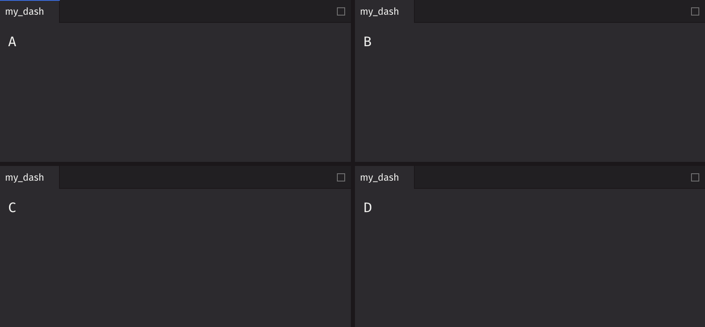

# Dashboard

Dashboards allow you to create a page layout containing a collection of components. The user can move and resize panels within the dashboard.

## Example

```python
from deephaven import ui

my_dash = ui.dashboard(
    ui.row(
        ui.column(ui.panel("A"), ui.panel("C")),
        ui.column(ui.panel("B"), ui.panel("D")),
    )
)
```



## Rules

1. Dashboards must be a child of the root script and not nested inside a `@ui.component`. Otherwise, the application cannot correctly determine the type of the component.
2. Dashboards must have one and only one child, typically a row or column.
3. Height and width of panels are summed to 100% within a row or column.

## Key Components

Four main children make up a dashboard: row, column, stack, and panels.

- **Row**: A container used to group elements horizontally. Each element is placed to the right of the previous one.
- **Column**: A container used to group elements vertically. Each element is placed below the previous one.
- **Stack**: A container used to group elements into a stack of tabs. Each element gets its own tab, with only one element visible at a time.
- **Panel**: A container used to group and label elements.

## Layout Hierarchy

### Top-Level

Your dashboard must start with a row or column, which is the "top" of the layout tree. Columns should go inside rows and rows should go inside columns

Note: Nesting rows within rows or columns within columns will sub-divide the row or column.

### Bottom-Level

Stacks and panels are considered the "bottom" of the layout tree. Once added, the layout in that section is considered complete. You can't further nest stacks within panels. For layouts within a panel, see [`tabs`](./tabs.md), [`flex`](./flex.md), and [`grid`](./grid.md).

## Automatic Wrapping

Children are implicitly wrapped when necessary, so the entire layout does not need to be explicitly defined.

End to end example: `dashboard([t1, t2])` would become `dashboard(column(stack(panel(t1)), stack(panel(t2))))`.

Automatic wrapping is applied by the following rules:

1. Dashboard: wrap in row/column if no single node is the default (e.g., `[t1, t2]` as the child to the dashboard would become `row(t1, t2)`).
2. Row/Column:
   - If there are children that are rows/columns, wrap the non-wrapped children with the same element (e.g., `row(col(t1), t2)` becomes `row(col(t1), col(t2))`).
   - If none of the children are wrapped by rows/columns, they are wrapped in stacks (e.g., `row(col(t1), col(t2))` from above becomes `row(col(stack(t1)), col(stack(t2)))`).
3. Stacks: wrap non-panel children in panels (e.g., `row(col(stack(t1)), col(stack(t2)))` becomes `row(col(stack(panel(t1))), col(stack(panel(t2))))`).

## Varying dimensions

Rows can have a specified height, while columns can have a specified width.

Stacks directly within a column can have a height or a width if they are within a row. Setting the other dimension will be ignored.

### Varying row heights

```python
from deephaven import ui

dash_row_heights = ui.dashboard(
    [
        ui.row(ui.stack(ui.panel("A", title="A")), ui.panel("B", title="B"), height=70),
        ui.row(ui.stack(ui.panel("C", title="C")), ui.panel("D", title="D")),
    ]
)
```

### Varying column widths

```python
from deephaven import ui

dash_column_widths = ui.dashboard(
    [
        ui.column(
            ui.stack(ui.panel("A", title="A")), ui.panel("C", title="C"), width=70
        ),
        ui.column(ui.stack(ui.panel("B", title="B")), ui.panel("D", title="D")),
    ]
)
```

### Varying stack widths

```python
from deephaven import ui

dash_stack_widths = ui.dashboard(
    ui.row(ui.stack(ui.panel("A", title="A"), width=70), ui.panel("B", title="B"))
)
```

### Varying stack heights

```python
from deephaven import ui

dash_stack_heights = ui.dashboard(
    ui.column(ui.stack(ui.panel("A", title="A"), height=70), ui.panel("B", title="B"))
)
```

## Layout Examples

### Row split (2x1)

```python
from deephaven import ui

dash_2x1 = ui.dashboard(ui.row(ui.panel("A", title="A"), ui.panel("B", title="B")))
```

### Column split (1x2)

```python
from deephaven import ui

dash_1x2 = ui.dashboard(ui.column(ui.panel("A", title="A"), ui.panel("B", title="B")))
```

### 2x2

```python
from deephaven import ui

dash_2x2 = ui.dashboard(
    ui.row(
        ui.column(ui.panel("A", title="A"), ui.panel("C", title="C")),
        ui.column(ui.panel("B", title="B"), ui.panel("D", title="D")),
    )
)
```

### 3x1

```python
from deephaven import ui

dash_3x1 = ui.dashboard(
    ui.row(ui.panel("A", title="A"), ui.panel("B", title="B"), ui.panel("C", title="C"))
)
```

### Basic stack

```python
from deephaven import ui

dash_stack = ui.dashboard(
    ui.stack(
        ui.panel("A", title="A"), ui.panel("B", title="B"), ui.panel("C", title="C")
    )
)
```

### Stack with an active item index

```python
from deephaven import ui

dash_stack_active = ui.dashboard(
    ui.stack(
        ui.panel("A", title="A"),
        ui.panel("B", title="B"),  # shown as active item
        ui.panel("C", title="C"),
        active_item_index=1,
    )
)
```

### Stack with nested tabs

```python
from deephaven import ui

dash_stack = ui.dashboard(
    ui.stack(
        ui.panel(
            ui.tabs(ui.tab("A1 content", title="A1"), ui.tab("A2 content", title="A2")),
            title="A",
        ),
        ui.panel(
            ui.tabs(ui.tab("B1 content", title="B1"), ui.tab("B2 content", title="B2")),
            title="B",
        ),
    )
)
```

### Stack in a layout

```python
from deephaven import ui

dash_layout_stack = ui.dashboard(
    ui.row(
        ui.stack(
            ui.panel("A", title="A"), ui.panel("B", title="B"), ui.panel("C", title="C")
        ),
        ui.panel("D", title="D"),
        ui.panel("E", title="E"),
    )
)
```

### Holy Grail

```python
from deephaven import ui

dash_holy_grail = ui.dashboard(
    ui.column(
        ui.panel("Header", title="Header"),
        ui.row(
            ui.panel("Left Sidebar", title="Left Sidebar"),
            ui.stack(ui.panel("Main Content", title="Main Content"), width=70),
            ui.panel("Right Sidebar", title="Right Sidebar"),
        ),
        ui.panel("Footer", title="Footer"),
    )
)
```

## Stateful Example

By hoisting state management to the dashboard component, interacting and sharing data between the child components is much easier to maintain and debug.

### Simple

```python
from deephaven import ui


@ui.component
def layout():
    message, set_message = ui.use_state("Hello world!")

    return ui.row(
        ui.panel(ui.text_field(value=message, on_change=set_message, width="100%")),
        ui.panel(message),
    )


dash_simple_state = ui.dashboard(layout())
```

### Complex

```python
from deephaven import ui, time_table
from deephaven.ui import use_memo, use_state
from deephaven.plot.figure import Figure


def use_wave_input():
    """
    Demonstrating a custom hook.
    Creates an input panel that controls the amplitude, frequency, and phase for a wave
    """
    amplitude, set_amplitude = use_state(1.0)
    frequency, set_frequency = use_state(1.0)
    phase, set_phase = use_state(1.0)

    input_panel = ui.flex(
        ui.slider(
            label="Amplitude",
            default_value=amplitude,
            min_value=-100.0,
            max_value=100.0,
            on_change=set_amplitude,
            step=0.1,
        ),
        ui.slider(
            label="Frequency",
            default_value=frequency,
            min_value=-100.0,
            max_value=100.0,
            on_change=set_frequency,
            step=0.1,
        ),
        ui.slider(
            label="Phase",
            default_value=phase,
            min_value=-100.0,
            max_value=100.0,
            on_change=set_phase,
            step=0.1,
        ),
        direction="column",
    )

    return amplitude, frequency, phase, input_panel


@ui.component
def multiwave():
    amplitude, frequency, phase, wave_input = use_wave_input()

    tt = use_memo(lambda: time_table("PT1s").update("x=i"), [])
    t = use_memo(
        lambda: tt.update(
            [
                f"y_sin={amplitude}*Math.sin({frequency}*x+{phase})",
                f"y_cos={amplitude}*Math.cos({frequency}*x+{phase})",
                f"y_tan={amplitude}*Math.tan({frequency}*x+{phase})",
            ]
        ),
        [amplitude, frequency, phase],
    )
    p_sin = use_memo(
        lambda: Figure().plot_xy(series_name="Sine", t=t, x="x", y="y_sin").show(), [t]
    )
    p_cos = use_memo(
        lambda: Figure().plot_xy(series_name="Cosine", t=t, x="x", y="y_cos").show(),
        [t],
    )
    p_tan = use_memo(
        lambda: Figure().plot_xy(series_name="Tangent", t=t, x="x", y="y_tan").show(),
        [t],
    )

    return ui.column(
        ui.row(
            ui.stack(
                ui.panel(wave_input, title="Wave Input"),
                ui.panel(t, title="Wave Table"),
                active_item_index=0,
            ),
            height=25,
        ),
        ui.row(
            ui.stack(ui.panel(p_sin, title="Sine"), width=50),
            ui.stack(ui.panel(p_cos, title="Cosine"), width=30),
            ui.stack(ui.panel(p_tan, title="Tangent")),
        ),
    )


dash_complex_state = ui.dashboard(multiwave())
```

## API Reference

```{eval-rst}
.. dhautofunction:: deephaven.ui.dashboard
```

### Row API Reference

```{eval-rst}
.. dhautofunction:: deephaven.ui.row
```

### Column API Reference

```{eval-rst}
.. dhautofunction:: deephaven.ui.column
```

### Stack API Reference

```{eval-rst}
.. dhautofunction:: deephaven.ui.stack
```
