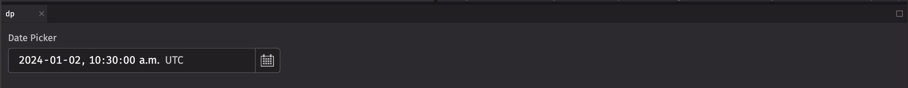

# Date Picker

Date Pickers allow users to select a Date and Time from a pop up Calendar.

## Example

```python
from deephaven import ui

dp = ui.date_picker(
    label="Date Picker",
    default_value="2024-01-02T10:30:00 UTC",
    on_change=print,
)
```



## Date types

The date picker accepts the following date types as inputs:  
`None`, `LocalDate`, `ZoneDateTime`, `Instant`, `int`, `str`, `datetime.datetime`, `numpy.datetime64`, `pandas.Timestamp`

The input will be converted to one of three Java date types:

1. `LocalDate`: A LocalDate is a date without a time zone in the ISO-8601 system, such as "2007-12-03" or "2057-01-28".
   This will create a date picker with a granularity of days.
2. `Instant`: An Instant represents an unambiguous specific point on the timeline, such as 2021-04-12T14:13:07 UTC.
   This will create a date picker with a granularity of seconds in UTC. The time zone will be rendered as the time zone in user settings.
3. `ZonedDateTime`: A ZonedDateTime represents an unambiguous specific point on the timeline with an associated time zone, such as 2021-04-12T14:13:07 America/New_York.
   This will create a date picker with a granularity of seconds in the specified time zone. The time zone will be rendered as the specified time zone.

The input is coverted according to the following rules:

1. If the input is one of the three Java date types, use that type.
2. A date string such as "2007-12-03" will parse to a `LocalDate`
3. A string with a date, time, and timezone such as "2021-04-12T14:13:07 America/New_York" will parse to a `ZonedDateTime`
4. All other types will attempt to convert in this order: `Instant`, `ZonedDateTime`, `LocalDate`

The format of the date picker and the type of the value passed to the `on_change` handler
is determined by the type of the following props in order of precedence:

1. `value`
2. `default_value`
3. `placeholder_value`

If none of these are provided, the `on_change` handler will be passed an `Instant`.

## Controlled mode with value

Setting the `value` prop will put the date_picker in controlled mode. Selecting a new date will call the `on_change` callback.
Then `value` must be updated programatically to render the new value. This can be done using the `use_state` hook.

```python order=zoned_date_picker,instant_date_picker,local_date_picker
from deephaven import ui
from deephaven.time import to_j_local_date, dh_today, to_j_instant, to_j_zdt

zoned_date_time = to_j_zdt("1995-03-22T11:11:11.23142 America/New_York")
instant = to_j_instant("2022-01-01T00:00:00 ET")
local_date = to_j_local_date(dh_today())


@ui.component
def date_picker_test(value):
    date, set_date = ui.use_state(value)
    return [ui.date_picker(on_change=set_date, value=date), ui.text(str(date))]


zoned_date_picker = date_picker_test(zoned_date_time)
instant_date_picker = date_picker_test(instant)
local_date_picker = date_picker_test(local_date)
```

## Uncontrolled mode with default_value

If the `value` prop is omitted, the date_picker will be in uncontrolled mode. It will store its state internally and automatically update when a new date is selected.
In this mode, setting the `default_value` prop will determine the initial value displayed by the date_picker.

```python
from deephaven.time import dh_now
from deephaven import ui

dp = ui.date_picker(
    label="Date Picker",
    default_value=dh_now(),
    on_change=print,
)
```

## Uncontrolled mode with placeholder_value

If both `value` and `default_value` are omitted, the date_picker will be in uncontrolled mode displaying no date selected. When opened, the date picker will suggest the date from the `placeholder_value` prop.
Omitting `placeholder_value` will default it to today at the current time on the server machine time zone.

```python order=dp1,dp2
from deephaven import ui

dp1 = ui.date_picker(
    label="Date Picker",
    placeholder_value="2022-10-01T08:30:00 ET",
    on_change=print,
)

dp2 = ui.date_picker(
    label="Date Picker",
    on_change=print,
)
```

## Events

Date Pickers accept a value to display and can trigger actions based on events such as setting state when changed. See the [API Reference](#api-reference) for a full list of available events.

## Variants

Date Pickers can have different variants to indicate their purpose.

```python
from deephaven import ui


@ui.component
def date_picker_variants():
    return [
        ui.date_picker(description="description"),
        ui.date_picker(error_message="error", validation_state="valid"),
        ui.date_picker(error_message="error", validation_state="invalid"),
        ui.date_picker(min_value="2024-01-01", max_value="2024-01-05"),
        ui.date_picker(value="2024-07-27T16:10:10 America/New_York", hour_cycle=24),
        ui.date_picker(granularity="YEAR"),
        ui.date_picker(granularity="MONTH"),
        ui.date_picker(granularity="DAY"),
        ui.date_picker(granularity="HOUR"),
        ui.date_picker(granularity="MINUTE"),
        ui.date_picker(granularity="SECOND"),
    ]


date_picker_variants_example = date_picker_variants()
```

## Time table filtering

Date Pickers can be used to filter tables with time columns.

```python order=date_filter,_table
from deephaven.time import dh_now
from deephaven import time_table, ui


@ui.component
def date_table_filter(table, start_date, end_date, time_col="Timestamp"):
    after_date, set_after_date = ui.use_state(start_date)
    before_date, set_before_date = ui.use_state(end_date)
    return [
        ui.date_picker(label="Start Date", value=after_date, on_change=set_after_date),
        ui.date_picker(label="End Date", value=before_date, on_change=set_before_date),
        table.where(f"{time_col} >= after_date  && {time_col} < before_date"),
    ]


SECONDS_IN_DAY = 86400
today = dh_now()
_table = time_table("PT1s").update_view(
    ["Timestamp=today.plusSeconds(SECONDS_IN_DAY*i)", "Row=i"]
)
date_filter = date_table_filter(_table, today, today.plusSeconds(SECONDS_IN_DAY * 10))
```

## API Reference

```{eval-rst}
.. dhautofunction:: deephaven.ui.date_picker
```
