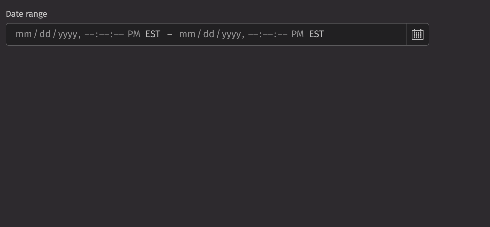

# Date Range Picker

Date range pickers allow users to select a range dates and times from a pop up calendar.

## Example

```python
from deephaven import ui

my_date_range_picker_basic = ui.date_range_picker(label="Date range")
```



## Date types

A date range picker can be used to select a `range` of dates.

The `range` is a dictionary with a `start` date and an `end` date. e.g. `{ "start": "2024-01-02", "end": "2024-01-05" }`

The date range picker accepts the following date types as inputs:

- `None`
- `LocalDate`
- `ZoneDateTime`
- `Instant`
- `int`
- `str`
- `datetime.datetime`
- `numpy.datetime64`
- `pandas.Timestamp`

The `start` and `end` dates should be the same type.

The input will be converted to one of three Java date types:

1. `LocalDate`: in the ISO-8601 system, a LocalDate is a date without a time zone, such as "2007-12-03" or "2057-01-28".
   This will create a date range picker with a granularity of days.
2. `Instant`: An Instant represents an unambiguous specific point on the timeline, such as 2021-04-12T14:13:07 UTC.
   This will create a date range picker with a granularity of seconds in UTC. The time zone will be rendered as the time zone in user settings.
3. `ZonedDateTime`: A ZonedDateTime represents an unambiguous specific point on the timeline with an associated time zone, such as 2021-04-12T14:13:07 America/New_York.
   This will create a date range picker with a granularity of seconds in the specified time zone. The time zone will be rendered as the specified time zone.

The `start` and `end` inputs are converted according to the following rules:

1. If the input is one of the three Java date types, use that type.
2. A date string such as "2007-12-03" will parse to a `LocalDate`.
3. A string with a date, time, and time zone such as "2021-04-12T14:13:07 America/New_York" will parse to a `ZonedDateTime`
4. All other types will attempt to convert in this order: `Instant`, `ZonedDateTime`, `LocalDate`

The format of the date range picker and the type of the value passed to the `on_change` handler
are determined by the type of the following props in order of precedence:

1. `value`
2. `default_value`
3. `placeholder_value`

If none of these are provided, the `on_change` handler will be passed a range of `Instant`.

```python order=my_zoned_example,my_instant_example,my_local_example
from deephaven import ui
from deephaven.time import to_j_local_date, dh_today, to_j_instant, to_j_zdt


@ui.component
def date_range_picker_example(start, end):
    dates, set_dates = ui.use_state({"start": start, "end": end})
    return [ui.date_range_picker(on_change=set_dates, value=dates), ui.text(str(dates))]


zdt_start = to_j_zdt("1995-03-22T11:11:11.23142 America/New_York")
zdt_end = to_j_zdt("1995-03-25T11:11:11.23142 America/New_York")
instant_start = to_j_instant("2022-01-01T00:00:00 ET")
instant_end = to_j_instant("2022-01-05T00:00:00 ET")
local_start = to_j_local_date("2024-05-06")
local_end = to_j_local_date("2024-05-10")

my_zoned_example = date_range_picker_example(zdt_start, zdt_end)
my_instant_example = date_range_picker_example(instant_start, instant_end)
my_local_example = date_range_picker_example(local_start, local_end)
```

## Value

A date range picker displays a `placeholder` by default. An initial, uncontrolled value can be provided to the date range picker using the `defaultValue` prop. Alternatively, a controlled value can be provided using the `value` prop.

```python
from deephaven import ui


@ui.component
def example():
    value, set_value = ui.use_state({"start": "2020-02-03", "end": "2020-02-08"})
    return ui.flex(
        ui.date_range_picker(
            label="Date range (uncontrolled)",
            default_value={"start": "2020-02-03", "end": "2020-02-08"},
        ),
        ui.date_range_picker(
            label="Date range (controlled)", value=value, on_change=set_value
        ),
        gap="size-150",
        wrap=True,
    )


my_example = example()
```

## Time zones

Date range picker is time zone aware when `ZonedDateTime` or `Instant` objects are provided as the value. In this case, the time zone abbreviation is displayed, and time zone concerns such as daylight saving time are taken into account when the value is manipulated.

In most cases, your data will come from and be sent to a server as an `ISO 8601` formatted string.

For `ZonedDateTime` objects, the date range picker will display the specified time zone.

For `Instant` objects, the date range picker will display the time zone from the user settings.

```python order=my_zoned_date_time,my_instant
from deephaven import ui
from deephaven.time import to_j_instant

my_zoned_date_time = ui.date_range_picker(
    label="Date range",
    default_value={
        "start": "2022-11-07T00:45 America/Los_Angeles",
        "end": "2022-11-08T11:15 America/Los_Angeles",
    },
)

my_instant = ui.date_range_picker(
    label="Date range",
    default_value={
        "start": to_j_instant("2022-11-07T00:45Z"),
        "end": to_j_instant("2022-11-08T11:15Z"),
    },
)
```

## Granularity

The `granularity` prop allows you to control the smallest unit that is displayed by a date range picker. By default, `LocalDate` values are displayed with "DAY" granularity (year, month, and day), and `ZonedDateTime` and `Instant` values are displayed with "SECOND" granularity.

In addition, when a value with a time is provided but you wish to display only the date, you can set the granularity to "DAY". This has no effect on the actual value (it still has a time component), only on what fields are displayed. In the following example, two date range pickers are synchronized with the same value but display different granularities.

```python
from deephaven import ui


@ui.component
def granularity_example():
    value, set_value = ui.use_state(
        {"start": "2021-04-07T18:45:22 UTC", "end": "2021-04-08T20:00:00 UTC"}
    )
    return ui.flex(
        ui.date_range_picker(
            label="Date range and time range",
            granularity="SECOND",
            value=value,
            on_change=set_value,
        ),
        ui.date_range_picker(
            label="Date range", granularity="DAY", value=value, on_change=set_value
        ),
        gap="size-150",
        wrap=True,
    )


my_granularity_example = granularity_example()
```

## HTML forms

Date range picker supports the `start_name` and `end_name` props for integration with HTML forms. The values will be submitted to the server as `ISO 8601` formatted strings according to the granularity of the value. For example, if the date range picker allows selecting only dates, then strings such as "2023-02-03" will be submitted, and if it allows selecting times, then strings such as "2023-02-03T08:45:00"

```python
from deephaven import ui

my_date_range_picker_forms = ui.form(
    ui.date_range_picker(
        label="Trip dates", start_name="startDate", end_name="endDate"
    ),
    ui.button("Submit", type="submit"),
    on_submit=print,
)
```

## Labeling

A visual label should be provided for the date range picker using the `label` prop. If the date range picker is required, the `is_required` and `necessity_indicator` props can be used to show a required state.

```python
from deephaven import ui

my_date_range_picker_labeling = ui.flex(
    ui.date_range_picker(label="Date range"),
    ui.date_range_picker(
        label="Date range", is_required=True, necessity_indicator="icon"
    ),
    ui.date_range_picker(
        label="Date range", is_required=True, necessity_indicator="label"
    ),
    ui.date_range_picker(label="Date range", necessity_indicator="label"),
)
```

## Events

Date range pickers support selection through mouse, keyboard, and touch inputs via the `on_change` prop, which receives the value as an argument.

```python
from deephaven import ui


@ui.component
def event_example():
    value, set_value = ui.use_state({"start": "2020-02-03", "end": "2020-02-08"})
    return ui.date_range_picker(
        label="Date range (controlled)", value=value, on_change=set_value
    )


my_event_example = event_example()
```

## Validation

The `is_required` prop ensures that the user selects a date range. The related `validation_behaviour` prop allows the user to specify aria or native verification.

When the prop is set to "native", the validation errors block form submission and are displayed as help text automatically.

```python
from deephaven import ui


@ui.component
def date_range_picker_validation_behaviour_example():
    return ui.form(
        ui.date_range_picker(
            validation_behavior="native",
            is_required=True,
        )
    )


my_date_range_picker_validation_behaviour_example = (
    date_range_picker_validation_behaviour_example()
)
```

## Minimum and maximum values

The `min_value` and `max_value` props can also be used to ensure the value is within a specific range. Date range picker also validates that the end date is after the start date.

```python
from deephaven import ui

my_date_range_picker_basic = ui.date_range_picker(
    label="Date range",
    min_value="2024-01-01",
    default_value={"start": "2022-02-03", "end": "2022-05-03"},
)
```

## Label position

By default, the position of a date range picker's label is above the date range picker, but it can be moved to the side using the `label_position` prop.

```python
from deephaven import ui


@ui.component
def date_range_picker_label_position_examples():
    return [
        ui.date_range_picker(
            label="Test Label",
        ),
        ui.date_range_picker(
            label="Test Label",
            label_position="side",
        ),
    ]


my_date_range_picker_label_position_examples = (
    date_range_picker_label_position_examples()
)
```

## Quiet state

The `is_quiet` prop makes a date range picker "quiet". This can be useful when the picker and its corresponding styling should not distract users from surrounding content.

```python
from deephaven import ui


my_date_range_picker_is_quiet_example = ui.date_range_picker(
    is_quiet=True,
)
```

## Disabled state

The `is_disabled` prop disables a picker to prevent user interaction. This is useful when the date range picker should be visible but not available for selection.

```python
from deephaven import ui


my_date_range_picker_is_disabled_example = ui.date_range_picker(
    is_disabled=True,
)
```

## Help text

A date range picker can have both a `description` and an `error_message`. Use the error message to offer specific guidance on how to correct the input.

The `validation_state` prop can be used to set whether the current date range picker state is `valid` or `invalid`.

```python
from deephaven import ui


@ui.component
def date_range_picker_help_text_examples():
    return [
        ui.date_range_picker(
            label="Sample Label",
            description="Enter a date range.",
        ),
        ui.date_range_picker(
            label="Sample Label",
            validation_state="valid",
            error_message="Sample invalid error message.",
        ),
        ui.date_range_picker(
            label="Sample Label",
            validation_state="invalid",
            error_message="Sample invalid error message.",
        ),
    ]


my_date_range_picker_help_text_examples = date_range_picker_help_text_examples()
```

## Contextual help

Using the `contextual_help` prop, a `ui.contextual_help` can be placed next to the label to provide additional information about the date range picker.

```python
from deephaven import ui


date_range_picker_contextual_help_example = ui.date_range_picker(
    label="Sample Label",
    contextual_help=ui.contextual_help(
        ui.heading("Content tips"), ui.content("Select a date range.")
    ),
)
```

## Custom width

The `width` prop adjusts the width of a date range picker, and the `max_width` prop enforces a maximum width.

```python
from deephaven import ui


@ui.component
def date_range_picker_width_examples():
    return [
        ui.date_range_picker(
            width="size-6000",
        ),
        ui.date_range_picker(
            width="size-6000",
            max_width="100%",
        ),
    ]


my_date_range_picker_width_examples = date_range_picker_width_examples()
```

## Maximum visible months

By default, the calendar popover displays a single month. The `max_visible_months` prop allows displaying up to 3 months at a time, if screen space permits.

```python
from deephaven import ui


date_range_picker_months_example = ui.date_range_picker(
    label="Date range", max_visible_months=3
)
```

## Page behavior

By default, when pressing the next or previous buttons, pagination advances by the `max_visible_months` value. This behavior can be changed to page by single months by setting `page_behavior` to single.

```python
from deephaven import ui


date_range_picker_page_example = ui.date_range_picker(
    label="Date range", max_visible_months=3, page_behavior="single"
)
```

## Hide time zone

The time zone can be hidden using the `hide_time_zone` option.

```python
from deephaven import ui

my_hide_time_zone_example = ui.date_range_picker(
    label="Date range",
    default_value={
        "start": "2022-11-07T00:45 America/Los_Angeles",
        "end": "2022-11-08T11:15 America/Los_Angeles",
    },
    hide_time_zone=True,
)
```

## Hour cycle

By default, date range picker displays times in either a `12` or `24` hour format depending on the user's locale. However, this can be overridden using the `hour_cycle` prop.

```python
from deephaven import ui


date_range_picker_hour_cycle_example = ui.date_range_picker(
    label="Date range", hour_cycle=24
)
```

## Time table filtering

Date range pickers can be used to filter tables with time columns.

```python order=date_filter,_table
from deephaven.time import dh_now
from deephaven import time_table, ui


@ui.component
def date_table_filter(table, start_date, end_date, time_col="Timestamp"):
    dates, set_dates = ui.use_state({"start": start_date, "end": end_date})
    start = dates["start"]
    end = dates["end"]
    return [
        ui.date_range_picker(label="Dates", value=dates, on_change=set_dates),
        table.where(f"{time_col} >= start && {time_col} < end"),
    ]


SECONDS_IN_DAY = 86400
today = dh_now()
_table = time_table("PT1s").update_view(
    ["Timestamp=today.plusSeconds(SECONDS_IN_DAY*i)", "Row=i"]
)
date_filter = date_table_filter(_table, today, today.plusSeconds(SECONDS_IN_DAY * 10))
```

## API Reference

```{eval-rst}
.. dhautofunction:: deephaven.ui.date_range_picker
```
