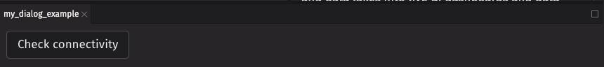

# Dialog

Dialogs are windows containing contextual information, tasks, or workflows that appear over the user interface. Depending on the kind of dialog, further interactions may be blocked until the dialog is acknowledged.

## Example

```python
from deephaven import ui


@ui.component
def dialog_example():
    is_open, set_open = ui.use_boolean()
    return ui.dialog_trigger(
        ui.action_button("Check connectivity", on_press=set_open.on),
        ui.dialog(
            ui.heading("Internet Speed Test"),
            ui.content("Start speed test?"),
            ui.button_group(
                ui.button("Cancel", variant="secondary", on_press=set_open.off),
                ui.button("Confirm", variant="accent", on_press=set_open.off),
            ),
        ),
        is_open=is_open,
    )


my_dialog_example = dialog_example()
```



## Content

The content can be populated by providing the following components to your `dialog` as children:

- `header` (optional)
- `heading` (title, required)
- `divider` (optional)
- `content` (body, required)
- `button_group` (optional)
- `footer` (optional)

### Examples

A typical `dialog` with a title, contents, and action buttons can be created like so:

```python
from deephaven import ui


@ui.component
def dialog_example1():
    is_open, set_open = ui.use_boolean()
    return ui.dialog_trigger(
        ui.action_button("Publish", on_press=set_open.on),
        ui.dialog(
            ui.heading("Publish 3 pages"),
            ui.content("Confirm publish?"),
            ui.footer("You can undo this action later."),
            ui.button_group(
                ui.button("Cancel", variant="secondary", on_press=set_open.off),
                ui.button(
                    "Confirm", variant="accent", on_press=set_open.off, auto_focus=True
                ),
            ),
        ),
        is_open=is_open,
    )


my_dialog_example1 = dialog_example1()
```

A dismissable `dialog` forgoes its `button_group` in favor of rendering a close button at the top right of the `dialog`.

```python
from deephaven import ui

my_dialog_example2 = ui.dialog_trigger(
    ui.action_button("Status"),
    ui.dialog(ui.heading("Status"), ui.content("Printer Status: Connected")),
    is_dismissable=True,
)
```

It is important to note that the `heading`, `header`, `content`, and `footer` content elements accept any renderable node, not just strings. This allows you to create `dialogs` for more complex workflows, such as including a form for the user to fill out or adding confirmation checkboxes.

```python
from deephaven import ui


@ui.component
def dialog_example3():
    is_open, set_open = ui.use_boolean()
    return ui.dialog_trigger(
        ui.action_button("Register", on_press=set_open.on),
        ui.dialog(
            ui.heading(
                ui.flex(
                    ui.text("Register for newsletter"),
                    align_items="center",
                    gap="size-100",
                )
            ),
            ui.content(
                ui.form(
                    ui.text_field(label="First Name", auto_focus=True),
                    ui.text_field(label="Last Name"),
                    ui.text_field(label="Street Address"),
                    ui.text_field(label="City"),
                )
            ),
            ui.footer(
                ui.checkbox("I want to receive updates for exclusive offers."),
            ),
            ui.button_group(
                ui.button("Cancel", variant="secondary", on_press=set_open.off),
                ui.button("Register", variant="accent", on_press=set_open.off),
            ),
        ),
        is_open=is_open,
    )


my_dialog_example3 = dialog_example3()
```

## Events

For dialogs, user defined callbacks should be chained with the close function in the `on_press` handler of the dialog's action buttons. The following example prints if the dialog's save or cancel button is clicked.

```python
from deephaven import ui


@ui.component
def print_example():
    is_open, set_open = ui.use_boolean()

    def print_save():
        set_open.off()
        print("Profile saved!")

    def print_cancel():
        set_open.off()
        print("Provfile not saved!")

    return ui.dialog_trigger(
        ui.action_button("Set Profile", on_press=set_open.on),
        ui.dialog(
            ui.heading("Profile"),
            ui.content(
                ui.form(ui.text_field(label="Name"), ui.checkbox("Make private"))
            ),
            ui.button_group(
                ui.button("Cancel", variant="secondary", on_press=print_cancel),
                ui.button("Confirm", variant="accent", on_press=print_save),
            ),
        ),
        is_open=is_open,
    )


my_print_example = print_example()
```

### Dismissable dialogs

Dismissable dialogs support an optional `on_dismiss` prop that is triggered whenever the dialog's close button is clicked. Like non-dismissable dialogs, you must chain the close function with whatever callback you provide as `onDismiss`. If this event callback is not needed, the dismissable dialog will behave normally without passing this callback through.

```python
from deephaven import ui


@ui.component
def dismissable_callback():
    is_open, set_open = ui.use_boolean()

    def print_dismiss():
        set_open.off()
        print("Dialog dismissed.")

    return ui.dialog_trigger(
        ui.action_button("Info", on_press=set_open.on),
        ui.dialog(
            ui.heading("Version Info"),
            ui.content("Version 1.0.0, Copyright 2020"),
            on_dismiss=print_dismiss,
        ),
        is_open=is_open,
        is_dismissable=True,
    )


my_dismissable_callback = dismissable_callback()
```

## Visual options

### Dialog types

Dialogs can be rendered as modals, popovers, or trays. See the [`dialog_trigger`](dialog_trigger.md) docs for more information.

```python order=my_modal,my_popover,my_tray
from deephaven import ui


my_modal = ui.dialog_trigger(
    ui.action_button(
        "Trigger Modal",
    ),
    ui.dialog(
        ui.heading("Modal"),
        ui.content("This is a modal."),
    ),
    is_dismissable=True,
    type="modal",
)

my_popover = ui.dialog_trigger(
    ui.action_button(
        "Trigger Popover",
    ),
    ui.dialog(
        ui.heading("Popover"),
        ui.content("This is a popover."),
    ),
    type="popover",
)

my_tray = ui.dialog_trigger(
    ui.action_button(
        "Trigger Tray",
    ),
    ui.dialog(
        ui.heading("Tray"),
        ui.content("This is a tray."),
    ),
    type="tray",
)
```

### Size

Only `modal` type dialogs support a user defined size prop. Note that the `fullscreen` and `fullscreenTakeover` sizes require the `dialog_trigger` `type` prop to be set to `fullscreen` or `fullscreenTakeover` respectively for container sizing considerations.

```python order=my_small_example,my_medium_example,my_large_example
from deephaven import ui


@ui.component
def small_example():
    is_open, set_open = ui.use_boolean()
    return ui.dialog_trigger(
        ui.action_button("Small", on_press=set_open.on),
        ui.dialog(
            ui.heading("Profile"),
            ui.content(
                ui.form(ui.text_field(label="Name"), ui.checkbox("Make private"))
            ),
            ui.button_group(
                ui.button("Cancel", variant="secondary", on_press=set_open.off),
                ui.button("Confirm", variant="accent", on_press=set_open.off),
            ),
            size="S",
        ),
        is_open=is_open,
    )


my_small_example = small_example()


@ui.component
def medium_example():
    is_open, set_open = ui.use_boolean()
    return ui.dialog_trigger(
        ui.action_button("Medium", on_press=set_open.on),
        ui.dialog(
            ui.heading("Profile"),
            ui.content(
                ui.form(ui.text_field(label="Name"), ui.checkbox("Make private"))
            ),
            ui.button_group(
                ui.button("Cancel", variant="secondary", on_press=set_open.off),
                ui.button("Confirm", variant="accent", on_press=set_open.off),
            ),
            size="M",
        ),
        is_open=is_open,
    )


my_medium_example = medium_example()


@ui.component
def large_example():
    is_open, set_open = ui.use_boolean()
    return ui.dialog_trigger(
        ui.action_button("Large", on_press=set_open.on),
        ui.dialog(
            ui.heading("Profile"),
            ui.content(
                ui.form(ui.text_field(label="Name"), ui.checkbox("Make private"))
            ),
            ui.button_group(
                ui.button("Cancel", variant="secondary", on_press=set_open.off),
                ui.button("Confirm", variant="accent", on_press=set_open.off),
            ),
            size="L",
        ),
        is_open=is_open,
    )


my_large_example = large_example()
```

## API Reference


```{eval-rst}
.. dhautofunction:: deephaven.ui.dialog

.. dhautofunction:: deephaven.ui.content

.. dhautofunction:: deephaven.ui.footer
```
