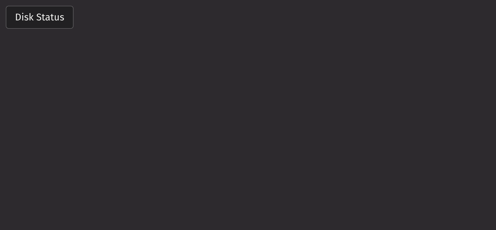

# Dialog Trigger

Dialog trigger serves as a wrapper around a dialog and its associated trigger, linking the dialog's open state with the trigger's press state. Additionally, it allows you to customize the type and positioning of the dialog.

## Example

```python
from deephaven import ui


my_dialog_trigger_example = ui.dialog_trigger(
    ui.action_button(
        "Disk Status",
    ),
    ui.dialog(
        ui.heading("C://"),
        ui.content("50% disk space remaining"),
    ),
    type="popover",
)
```



## Content

The `dialog_trigger` accepts exactly two children: the element which triggers opening of the `dialog` and the `dialog` itself. The trigger must be the first child passed into the `dialog_trigger` and should be an element that supports press events.

If your `dialog` has buttons within it that should close the dialog when pressed, you must use controlled mode to propagate the close function to the dialog's children. Dialogs that do not contain such interactive elements can provide the `dialog` component as is to the `dialog_trigger` as its second child.

The example below demonstrates how to pass the close function to the dialog's buttons.

```python
from deephaven import ui


@ui.component
def close_example():
    is_open, set_open = ui.use_boolean()
    return ui.dialog_trigger(
        ui.action_button("Check connectivity", on_press=set_open.on),
        ui.dialog(
            ui.heading("Internet Speed Test"),
            ui.content("Start speed test?"),
            ui.button_group(
                ui.button("Cancel", variant="secondary", on_press=set_open.off),
                ui.button("Confirm", variant="accent", on_press=set_open.off),
            ),
        ),
        is_open=is_open,
    )


my_close_example = close_example()
```

## Dialog types

By providing a `type` prop, you can specify the type of `dialog` that is rendered by your `dialog_trigger`. Note that pressing the `Esc` key will close the `dialog` regardless of its type.

### Modal

Modal dialogs create an underlay that blocks access to the underlying user interface until the dialog is closed. Sizing options can be found on the `dialog` page. Focus is trapped inside the modal as per the accessibility guidelines laid out by W3C.

```python
from deephaven import ui


my_modal = ui.dialog_trigger(
    ui.action_button(
        "Trigger Modal",
    ),
    ui.dialog(
        ui.heading("Modal"),
        ui.content("This is a modal."),
    ),
    is_dismissable=True,
    type="modal",
)
```

### Popover

If a dialog without an underlay is needed, consider using a popover dialog.

```python
from deephaven import ui

my_popover = ui.dialog_trigger(
    ui.action_button(
        "Trigger Popover",
    ),
    ui.dialog(
        ui.heading("Popover"),
        ui.content("This is a popover."),
    ),
    type="popover",
)
```

### Tray

Tray dialogs are typically used to portray information on mobile devices or smaller screens.

```python
from deephaven import ui

my_tray = ui.dialog_trigger(
    ui.action_button(
        "Trigger Tray",
    ),
    ui.dialog(
        ui.heading("Tray"),
        ui.content("This is a tray."),
    ),
    type="tray",
)
```

### Fullscreen

Fullscreen dialogs are a fullscreen variant of the modal dialog, only revealing a small portion of the page behind the underlay. Use this variant for more complex workflows that do not fit in the available modal dialog sizes. This variant does not support `is_dismissible`.

```python
from deephaven import ui


@ui.component
def fullscreen_example():
    is_open, set_open = ui.use_boolean()
    return ui.dialog_trigger(
        ui.action_button("Trigger Fullscreen", on_press=set_open.on),
        ui.dialog(
            ui.heading("Fullscreen"),
            ui.content(
                "Lorem ipsum dolor sit amet, consectetur adipiscing elit. Proin sit\
                amet tristique risus. In sit amet suscipit lorem. Orci varius\
                natoque penatibus et magnis dis parturient montes, nascetur\
                ridiculus mus. In condimentum imperdiet metus non condimentum. Duis\
                eu velit et quam accumsan tempus at id velit. Duis elementum\
                elementum purus, id tempus mauris posuere a. Nunc vestibulum sapien\
                pellentesque lectus commodo ornare."
            ),
            ui.button_group(
                ui.button("Close", variant="accent", on_press=set_open.off),
            ),
        ),
        is_open=is_open,
        type="fullscreen",
    )


my_fullscreen_example = fullscreen_example()
```

### Fullscreen takeover

Fullscreen takeover dialogs are similar to the fullscreen variant except that the `dialog` covers the entire screen.

```python
from deephaven import ui


@ui.component
def fullscreen_takeover_example():
    is_open, set_open = ui.use_boolean()
    return ui.dialog_trigger(
        ui.action_button("Trigger Fullscreen", on_press=set_open.on),
        ui.dialog(
            ui.heading("Fullscreen"),
            ui.content(
                ui.form(
                    ui.text_field(label="Name"),
                    ui.text_field(label="Email address"),
                    ui.checkbox("Make profile private"),
                )
            ),
            ui.button_group(
                ui.button("Cancel", variant="secondary", on_press=set_open.off),
                ui.button(
                    "Confirm", variant="accent", on_press=set_open.off, auto_focus=True
                ),
            ),
        ),
        is_open=is_open,
        type="fullscreenTakeover",
    )


my_fullscreen_takeover_example = fullscreen_takeover_example()
```

### Dismissable

If your modal dialog doesn't require the user to make a confirmation, you can set `is_dismissable` on the `dialog_trigger`. This adds a close button that the user can press to dismiss the `dialog`.

```python
from deephaven import ui

my_dialog_example2 = ui.dialog_trigger(
    ui.action_button("Status"),
    ui.dialog(ui.heading("Status"), ui.content("Printer Status: Connected")),
    is_dismissable=True,
)
```

## Dialog placement

Popover dialogs support a variety of placement options since they do not take over the user interface like modal or tray dialogs.

### Placement

The popover's placement can be adjusted using the `placement` prop. The full list of placements is:

- `bottom`
- `bottom left`
- `bottom right`
- `bottom start`
- `bottom end`
- `top`
- `top left`
- `top right`
- `top start`
- `top end`
- `left`
- `left top`
- `left bottom`
- `start`
- `start top`
- `start bottom`
- `right`
- `right top`
- `right bottom`
- `end`
- `end top`
- `end bottom`

```python
from deephaven import ui

my_placement = ui.dialog_trigger(
    ui.action_button("Trigger"),
    ui.dialog(
        ui.heading("The Heading"),
        ui.content(
            "This is a popover placed to the right of its\
          trigger and offset so the arrow is at the top of the dialog."
        ),
    ),
    type="popover",
    placement="right top",
)
```

### Offset and cross offset

The popover dialog's offset can be adjusted using the `offset` and `cross_offset` props. The `offset` prop controls the spacing applied along the main axis between the element and its anchor element, whereas the `cross_offset` prop handles the spacing applied along the cross axis.

Below is a popover offset by an additional 50px above the trigger.

```python
from deephaven import ui

my_offset = ui.dialog_trigger(
    ui.action_button("Trigger"),
    ui.dialog(
        ui.heading("Offset"),
        ui.content("Offset by an additional 50px."),
    ),
    type="popover",
    offset=50,
)
```

Below is a popover cross offset by an additional 100px to the right of the trigger.

```python
from deephaven import ui

my_cross_offset = ui.dialog_trigger(
    ui.action_button("Trigger"),
    ui.dialog(
        ui.heading("Cross offset"),
        ui.content("Cross offset by an additional 100px."),
    ),
    type="popover",
    cross_offset=100,
)
```

### Flipping

By default, `dialog_trigger` attempts to flip popovers on the main axis in situations where the original placement would cause it to render out of view. This can be overridden by setting `should_flip` to `False`.

```python
from deephaven import ui

my_should_flip_example = ui.dialog_trigger(
    ui.action_button("Trigger"),
    ui.dialog(
        ui.heading("The Heading"),
        ui.content(
            "This is a popover that won't flip if it can't fully render below the button."
        ),
    ),
    type="popover",
    placement="bottom",
    should_flip=False,
)
```

### Container padding

You can control the minimum padding required between the popover dialog and the surrounding container via the `container_padding` prop. This affects the positioning breakpoints that determine when the dialog will attempt to flip.

The example below will flip the dialog from above the trigger button to below the trigger button if the dialog cannot render fully while maintaining 50px of padding between itself and the top of the browser.

```python
from deephaven import ui

my_should_flip_example = ui.dialog_trigger(
    ui.action_button("Trigger"),
    ui.dialog(
        ui.heading("The Heading"),
        ui.content("This is a popover."),
    ),
    type="popover",
    placement="top",
    container_padding=50,
)
```

## Events

Dialog triggers accept an `on_open_change` handler that is triggered whenever the dialog is opened or closed. The example below updates a separate element with the dialog's current open state.

```python
from deephaven import ui


@ui.component
def event_example():
    state, set_state = ui.use_state(False)
    return ui.flex(
        ui.dialog_trigger(
            ui.action_button("Whispers"),
            ui.dialog(
                ui.heading("Whispers and DMs"),
                ui.content("You have 0 new messages."),
            ),
            type="popover",
            placement="top",
            on_open_change=lambda is_open: set_state(is_open),
        ),
        ui.text(f"Current open state: {state}"),
        align_items="center",
        gap="size-100",
    )


my_event_example = event_example()
```

## API Reference

```{eval-rst}
.. dhautofunction:: deephaven.ui.dialog_trigger

.. dhautofunction:: deephaven.ui.dialog
    :no-index:

.. dhautofunction:: deephaven.ui.content
    :no-index:

.. dhautofunction:: deephaven.ui.footer
    :no-index:
```
