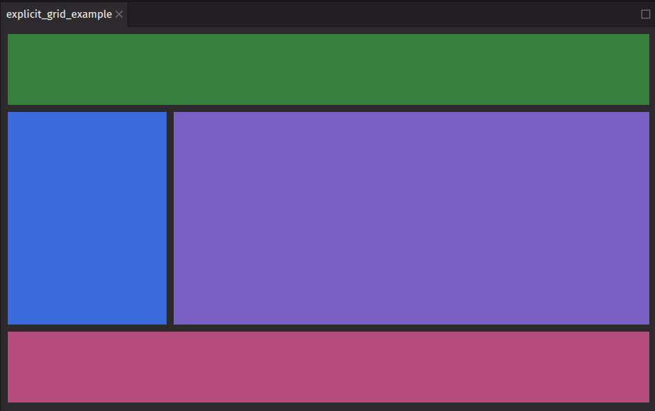
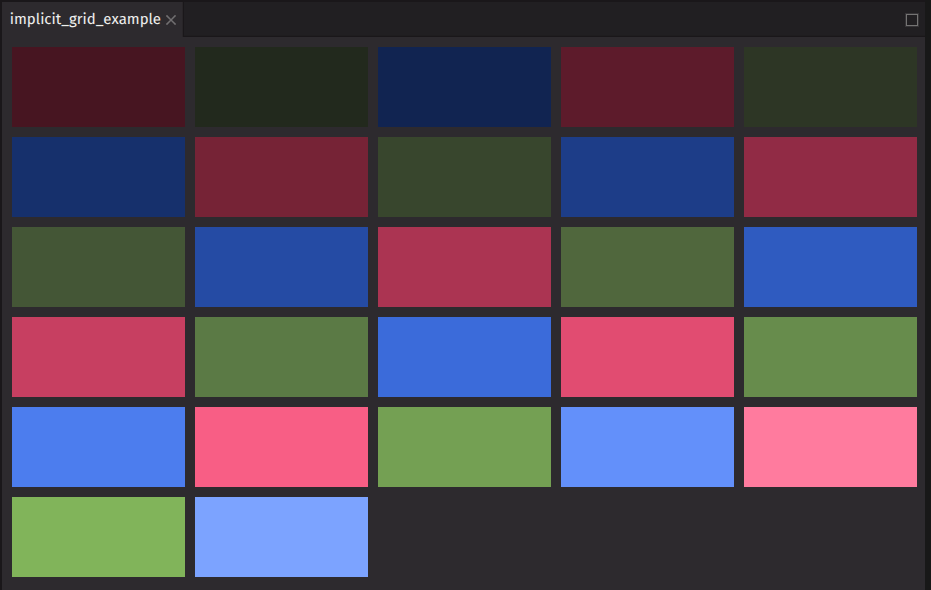

# Grid

`ui.grid` is a [grid](https://developer.mozilla.org/en-US/docs/Learn_web_development/Core/CSS_layout/Grids)-based layout container that can be used to layout its children in two dimensions.

> [!TIP]
> The `ui.grid` component follows the same rules as a browser CSS grid. The [CSS grid layout guide](https://css-tricks.com/snippets/css/complete-guide-grid/) from CSS-Tricks and the [Grid Garden](https://cssgridgarden.com/) game are great resources to learn more about grid.

The `columns` and `rows` props define the layout of the grid. The layout can use the `area` prop to define grid areas for child components to explicitly place components. Alternatively, an implicit layout can be created using `autoColumns`, `autoRows`, and helper functions like `repeat`.

Similar to [`flex`](./flex.md), a grid can justify and align items.

## Examples

### Explicit grid

This example demonstrates how to create a typical application layout featuring a header, sidebar, content area, and footer. The `areas` prop is used to specify the grid areas, while the `columns` and `rows` props define their sizes. Each child component utilizes the `grid_area` prop to indicate its designated area within the grid.

```python
from deephaven import ui


@ui.component
def explicit_grid():
    return ui.grid(
        ui.view(background_color="celery-600", grid_area="header"),
        ui.view(background_color="blue-600", grid_area="sidebar"),
        ui.view(background_color="purple-600", grid_area="content"),
        ui.view(background_color="magenta-600", grid_area="footer"),
        areas=["header header", "sidebar content", "footer footer"],
        columns=["1fr", "3fr"],
        rows=["size-1000", "size-3000", "size-1000"],
        height="size-6000",
        gap="size-100",
    )


explicit_grid_example = explicit_grid()
```



### Implicit grid

This example creates an implicit grid. It uses the `repeat` function to automatically generate five columns of equal width. The `auto_rows` prop sets the height of the rows, and the items are centered horizontally within the container. A gap is also added between the items.

```python
from deephaven import ui

colors = []
for i in range(100, 901, 100):
    colors.append(f"red-{i}")
    colors.append(f"green-{i}")
    colors.append(f"blue-{i}")


@ui.component
def implicit_grid():
    return ui.grid(
        [ui.view(background_color=color) for color in colors],
        columns="repeat(5, 1fr)",
        auto_rows="size-800",
        justify_content="center",
        gap="size-100",
    )


implicit_grid_example = implicit_grid()
```



## Justification

The `justify_content` prop is used to align items along the inline axis of a `grid`.

Options:

- `stretch` (default): the grid items are stretched to fill the container along the block axis.
- `start`: the grid items are aligned at the start of the block axis.
- `end`: the grid items are aligned at the end of the block axis.
- `center`: the grid items are centered along the block axis.
- `left`: the grid items are packed toward the left edge of the container.
- `right`: the grid items are packed toward the right edge of the container.
- `space-between`: the grid items are evenly distributed with the first item at the start and the last item at the end.
- `space-around`: the grid items are evenly distributed with equal space around them.
- `space-evenly`: the grid items are evenly distributed with equal space between them.
- `baseline`: the grid items are aligned based on their baselines.
- `first baseline`: the grid items are aligned based on the first baseline of the container.
- `last baseline`: the grid items are aligned based on the last baseline of the container.
- `safe center`: the grid items are centered along the block axis, ensuring they remain within the safe area.
- `unsafe center`: the grid items are centered along the block axis, without considering the safe area.

```python
from deephaven import ui

colors = []
for i in range(100, 901, 100):
    colors.append(f"red-{i}")
    colors.append(f"green-{i}")
    colors.append(f"blue-{i}")


@ui.component
def grid_justification():
    justify, set_justify = ui.use_state("stretch")
    return [
        ui.picker(
            ui.item("stretch"),
            ui.item("start"),
            ui.item("end"),
            ui.item("left"),
            ui.item("right"),
            ui.item("center"),
            ui.item("space-between"),
            ui.item("space-around"),
            ui.item("space-evenly"),
            ui.item("baseline"),
            ui.item("first baseline"),
            ui.item("last baseline"),
            ui.item("safe center"),
            ui.item("unsafe center"),
            selected_key=justify,
            on_selection_change=set_justify,
            label="Pick an option (controlled)",
        ),
        ui.grid(
            [
                ui.view(background_color=color, height="25px", width="25px")
                for color in colors
            ],
            columns="repeat(3, 80px)",
            justify_content=justify,
        ),
    ]


grid_justification_example = grid_justification()
```

## Alignment

The `align_items` prop aligns items along the block axis of a `grid`.

Options:

- `stretch` (default): the grid items are stretched to fill the container along the block axis.
- `start`: the grid items are aligned at the start of the block axis.
- `end`: the grid items are aligned at the end of the block axis.
- `center`: the grid items are centered along the block axis.
- `self-start`: the grid items are aligned at the start of their container.
- `self-end`: the grid items are aligned at the end of their container.
- `baseline`: the grid items are aligned based on their baselines.
- `first baseline`: the grid items are aligned based on the first baseline of the container.
- `last baseline`: the grid items are aligned based on the last baseline of the container.
- `safe center`: the grid items are centered along the block axis, ensuring they remain within the safe area.
- `unsafe center`: the grid items are centered along the block axis, without considering the safe area.

```python
from deephaven import ui

colors = []
for i in range(100, 901, 100):
    colors.append(f"red-{i}")
    colors.append(f"green-{i}")
    colors.append(f"blue-{i}")


@ui.component
def grid_align():
    align, set_align = ui.use_state("stretch")
    return [
        ui.picker(
            ui.item("stretch"),
            ui.item("start"),
            ui.item("end"),
            ui.item("center"),
            ui.item("self-start"),
            ui.item("self-end"),
            ui.item("baseline"),
            ui.item("first baseline"),
            ui.item("last baseline"),
            ui.item("safe center"),
            ui.item("unsafe center"),
            selected_key=align,
            on_selection_change=set_align,
            label="Pick an option (controlled)",
        ),
        ui.grid(
            [
                ui.view(background_color=color, height="25px", width="25px")
                for color in colors
            ],
            columns="repeat(3, 80px)",
            rows=["repeat(9, 80px)"],
            align_items=align,
        ),
    ]


grid_align_example = grid_align()
```

## API reference

```{eval-rst}
.. dhautofunction:: deephaven.ui.grid
```
