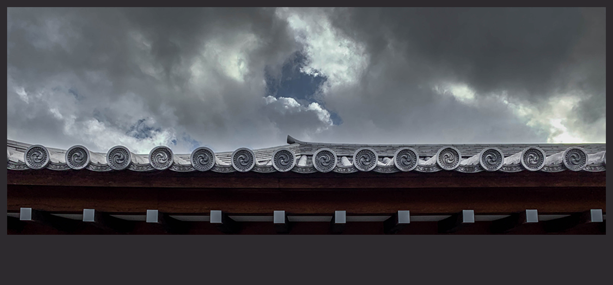

# Image

'image' is used to insert and display an image within a component.

## Example

```python
from deephaven import ui

img = ui.image(src="https://i.imgur.com/Z7AzH2c.png", alt="Sky and roof")
```



## UI Recommendations

1. Provide descriptive alt text for all images to ensure accessibility for users with visual impairments. Note: If the image is considered decorative and should not be announced by screen readers, then set alt="" to suppress the warning.
2. Alt text should convey the purpose and content of the image. For example, "Snow-capped mountains under a clear blue sky" or "Diagram illustrating the water cycle, showing evaporation, condensation, precipitation, and collection".
3. To internationalize an image, a localized string should be passed into the alt prop.

## Visual options

Different styles determine how an image fits into its container. The default value for the `object_fit` parameter is `fill`, which takes up the whole dimension of the container.

Other options:

- `contain` scales the image to the dimension of the container while preserving its aspect ratio. If the image's aspect ratio does not match the aspect ratio of the box, the image will be "letterboxed".
- `cover` scales the image to fill the entire container. If the image's aspect ratio does not match the aspect ratio of the box, the image will be clipped to fit.
- `none` renders the image in its original dimensions.
- `scale-down` sizes the image as if `none` or `contain` were specified. Whichever results in a smaller concrete image size is selected.

```python test-set=0
from deephaven import ui

@ui.component
def image_variants():
    return ui.flex(
        ui.view(
            ui.image(src="https://i.imgur.com/Z7AzH2c.png", alt="Sky and roof"),
            background_color="celery-600",
            padding="10px",
        ),
        ui.view(
            ui.image(
                src="https://i.imgur.com/Z7AzH2c.png",
                alt="Sky and roof",
                object_fit="contain",
            ),
            background_color="blue-600",
            padding="10px",
            padding_x="25px",
        ),
        ui.view(
            ui.image(
                src="https://i.imgur.com/Z7AzH2c.png",
                alt="Sky and roof",
                object_fit="cover",
            ),
            background_color="blue-600",
            width="75%",
        ),
        ui.view(
            ui.image(
                src="https://i.imgur.com/Z7AzH2c.png",
                alt="Sky and roof",
                object_fit="none",
            )
        ),
        ui.view(
            ui.image(
                src="https://i.imgur.com/Z7AzH2c.png",
                alt="Sky and roof",
                object_fit="scale-down",
            )
        ),
        direction="column",
        width="300px",
    )


image_variants_example = image_variants()
```

## Scrollable image
While the image component itself is not scrollable, wrap the image in a container view with the desired dimensions and set its overflow property to 'scroll' to achieve the same effect.

```python
from deephaven import ui


def scrollable_variant():
    return ui.view(
        ui.image(src="https://i.imgur.com/Z7AzH2c.png", alt="Sky and roof"),
        width="800px",
        height="150px",
        overflow="scroll",
    )


scrollable_variants_example = scrollable_variant()
```


## API Reference

```{eval-rst}
.. dhautofunction:: deephaven.ui.image
```
