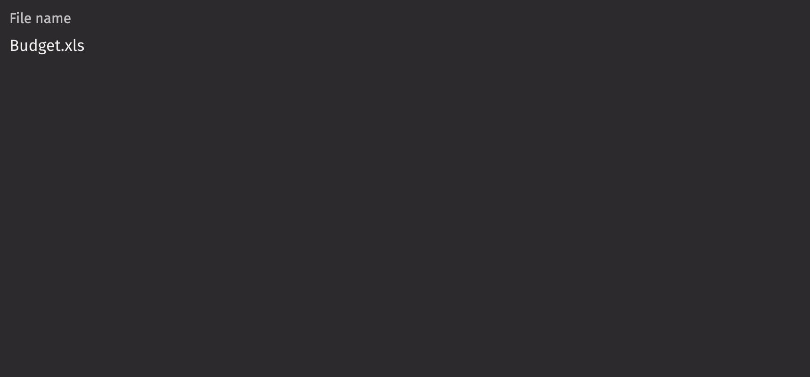

# Labeled Value

A labeled value displays a non-editable value with a label.

## Example

```python
from deephaven import ui


my_labeled_value_basic = ui.labeled_value(label="File name", value="Budget.xls")
```



## Value

A labeled value accepts numbers, dates, strings, and lists of strings in the `value` prop.

```python
from deephaven import ui
import datetime


@ui.component
def ui_labeled_value_examples():
    return [
        ui.labeled_value(label="File name", value="Budget.xls"),
        ui.labeled_value(label="Number of expenses in Budget file", value=123),
        ui.labeled_value(
            label="Pizza toppings", value=["Pizza", "Pineapple", "Mushroom", "Garlic"]
        ),
        ui.labeled_value(label="Today's date", value=datetime.datetime.today().date()),
    ]


my_labeled_value_values_examples = ui_labeled_value_examples()
```

## Numbers

When passing a number into a labeled value, the `format_options` prop dictates how the value is displayed. There are 3 styles supported by this parameter: Percentage, Currency, and Units.

Note that this prop is compatible with the options of [Intl.NumberFormat](https://developer.mozilla.org/en-US/docs/Web/JavaScript/Reference/Global_Objects/NumberFormat).

```python
from deephaven import ui


@ui.component
def ui_labeled_value_numbers_example():
    return [
        ui.labeled_value(
            label="Percent completed",
            value=0.89,
            format_options={"style": "percent"},
        ),
        ui.labeled_value(
            label="Withdrawal amount",
            value=2350.50,
            format_options={"style": "currency", "currency": "USD"},
        ),
        ui.labeled_value(
            label="Height of Burj Khalifa",
            value=32600,
            format_options={"style": "unit", "unit": "inch"},
        ),
    ]


my_labeled_value_numbers_example = ui_labeled_value_numbers_example()
```

An object with a `start` and `end` property can be passed to the `value` prop in order to format a numeric range.

```python
from deephaven import ui


my_number_range = ui.labeled_value(
    label="Price range",
    value={"start": 150, "end": 400},
    format_options={"style": "currency", "currency": "USD", "minimumFractionDigits": 0},
)
```

## Lists

When passing a list into a labeled value, the `format_options` prop dictates how the value is displayed.

Note that this prop is compatible with the options of [Intl.ListFormat](https://developer.mozilla.org/en-US/docs/Web/JavaScript/Reference/Global_Objects/Intl/ListFormat/ListFormat).

```python
from deephaven import ui


@ui.component
def labeled_value_list_formatting():

    return [
        ui.labeled_value(
            label="Interests",
            value=["Travel", "Hiking", "Snorkeling", "Camping"],
            format_options={"type": "conjunction"},
        ),
        ui.labeled_value(
            label="Travel Destination",
            value=["Paris", "Tokyo", "New York", "Sydney"],
            format_options={"type": "disjunction"},
        ),
        ui.labeled_value(
            label="Clothing Sizes",
            value=["XS", "S", "M", "L", "XL"],
            format_options={"type": "unit", "style": "narrow"},
        ),
    ]


my_labeled_value_list_formatting = labeled_value_list_formatting()
```

## Dates and time

`ui.labeled_value` accepts the following date types as inputs:

- `None`
- `LocalDate`
- `ZonedDateTime`
- `Instant`
- `int`
- `str`
- `datetime.datetime`
- `numpy.datetime64`
- `pandas.Timestamp`

When passing a `int` or `str` into the `value` prop, `format_options` with a `date_format` parameter must be specified to indicate that it should be parsed as a date. See more about date formatting in the next section.

```python order=my_labeled_value_datetime,_table
from deephaven import ui, time_table
from deephaven.time import dh_now
import datetime


_table = time_table(period="PT1s").reverse()


@ui.component
def labeled_value_datetime():
    timestamp = ui.use_cell_data(_table)

    return [
        ui.labeled_value(label="Instant", value=dh_now()),
        ui.labeled_value(label="Pandas timestamp", value=timestamp),
        ui.labeled_value(
            label="Date string",
            value="2035-01-31T12:30:00.12345Z",
            format_options={"date_format": ""},
        ),
        ui.labeled_value(
            label="Nanoseconds",
            value=2053877400123450000,
            format_options={"date_format": ""},
        ),
        ui.labeled_value(
            label="Python datetime",
            value=datetime.datetime(2035, 1, 31, 12, 30, 0),
        ),
    ]


my_labeled_value_datetime = labeled_value_datetime()
```

### Formatting dates

By default, dates and times are formatted according to the DateTime format set in user settings. An empty string can be passed to when passing a `str` or `int` date value to indicate that the default formatting behavior should be used.

If more precision or another format is desired, datetime values can be formatted using the `format_options` property. To do so, pass an object with a `date_format` property string that follows [the GWT Java DateTimeFormat syntax](https://www.gwtproject.org/javadoc/latest/com/google/gwt/i18n/client/DateTimeFormat.html) with additional support for nanoseconds. You may provide up to 9 `S` characters after the decimal to represent partial seconds down to nanoseconds. Below are examples of patterns that can be used to format dates.

```python
from deephaven import ui
from deephaven.time import dh_now


@ui.component
def labeled_value_datetime_formatting():
    now = dh_now()

    return [
        ui.labeled_value(
            label="12-hr time", value=now, format_options={"date_format": "h:mm a"}
        ),
        ui.labeled_value(
            label="Day, abbreviated month, year",
            value=now,
            format_options={"date_format": "d MMM yyyy"},
        ),
        ui.labeled_value(
            label="Day of week, full month, day, year, 24-hr time",
            value=now,
            format_options={"date_format": "EEEE, MMMM dd, yyyy HH:mm:ss"},
        ),
        ui.labeled_value(
            label="Timestamp in nanoseconds",
            value=now,
            format_options={"date_format": "yyyy-MM-dd'T'HH:mm:ss.SSSSSSSSS z"},
        ),
    ]


my_labeled_value_datetime_formatting = labeled_value_datetime_formatting()
```

### Timezones

By default, dates and times are displayed in the timezone set in user settings. If the provided date is already timezone aware, such is the case with a `ZonedDateTime`, its timezone will be used. If a different timezone is desired, it can be overridden by passing an object to the `format_options` prop containing a `timezone` property corresponding to a timezone identification string. See the [list of timezones supported by Deephaven](https://deephaven.io/core/client-api/javascript/classes/dh.i18n.TimeZone.html).

```python
from deephaven import ui


@ui.component
def labeled_value_datetime_timezone():
    date = "2035-01-31T12:30:00.12345Z"
    zoned_date = "2035-01-31T12:30:00.12345 America/Los_Angeles"
    default_date_format = {"date_format": ""}

    return [
        ui.labeled_value(
            label="User settings timezone",
            value=date,
            format_options=default_date_format,
        ),
        ui.labeled_value(
            label="Provided timezone from date string",
            value=zoned_date,
            format_options=default_date_format,
        ),
        ui.labeled_value(
            label="Overridden with timezone property",
            value=zoned_date,
            format_options={**default_date_format, "timezone": "America/Halifax"},
        ),
    ]


my_labeled_value_datetime_timezone = labeled_value_datetime_timezone()
```

### Date ranges

An object with a `start` and `end` property can be passed to the `value` prop in order to display a date range. The same date types listed above in [dates and times](./labeled_value.md#dates-and-time) are also accepted for the `start` and `end` props. The formatting options are the same as for individual dates, and will be applied to both dates.

```python
from deephaven import ui


@ui.component
def labeled_value_datetime_range_format():
    time_range = {"start": "2035-01-31T12:30:00Z", "end": "2035-01-31T16:30:00Z"}
    day_range = {"start": "2035-01-31", "end": "2035-02-01"}
    default_date_format = {"date_format": ""}

    return [
        ui.labeled_value(
            label="Default format time range",
            value=time_range,
            format_options=default_date_format,
        ),
        ui.labeled_value(
            label="Custom format time range",
            value=time_range,
            format_options={"date_format": "MMMM d, yyyy, h:mm a z"},
        ),
        ui.labeled_value(
            label="Default format day range",
            value=day_range,
            format_options=default_date_format,
        ),
        ui.labeled_value(
            label="Custom format day range",
            value=day_range,
            format_options={"date_format": "MMMM d, yyyy"},
        ),
    ]


my_labeled_value_datetime_range_format = labeled_value_datetime_range_format()
```

By default, both dates in the range will be displayed using the timezone set in user settings. If either of the provided date is already timezone aware, its timezone will be used. If both the dates passed in are timezone aware, the timezone of the `start` date will be used to display both dates. However, this can be overridden using the `format_options.timezone` prop to [set the display timezone](./labeled_value.md#timezones) for both dates.

```python
from deephaven import ui


@ui.component
def labeled_value_datetime_range_timezone():
    date_range = {"start": "2035-01-31T12:30:00Z", "end": "2035-02-01T12:30:00Z"}
    zoned_date_range = {
        "start": "2035-01-31T12:30:00Z",
        "end": "2035-02-01T23:30:00 Asia/Tokyo",
    }
    both_zoned_date_range = {
        "start": "2035-01-31T12:30:00 America/Los_Angeles",
        "end": "2035-02-01T23:30:00 Asia/Tokyo",
    }
    default_date_format = {"date_format": ""}

    return [
        ui.labeled_value(
            label="User settings timezone",
            value=date_range,
            format_options=default_date_format,
        ),
        ui.labeled_value(
            label="Provided timezone from one date",
            value=zoned_date_range,
            format_options=default_date_format,
        ),
        ui.labeled_value(
            label="Provided timezone from both dates",
            value=both_zoned_date_range,
            format_options=default_date_format,
        ),
        ui.labeled_value(
            label="Overridden with timezone property",
            value=both_zoned_date_range,
            format_options={**default_date_format, "timezone": "America/Halifax"},
        ),
    ]


my_labeled_value_datetime_range_timezone = labeled_value_datetime_range_timezone()
```

## Label position

By default, the label is positioned above the labeled value, but it can be moved to the side using the `label_position` prop.

```python
from deephaven import ui


my_labeled_value_label_position_example = ui.labeled_value(
    label="File name", value="Onboarding.pdf", label_position="side", label_align="end"
)
```

## Contextual Help

Using the `contextual_help` prop, a `ui.contextual_help` can be placed next to the labeled value to provide additional information.

```python
from deephaven import ui


my_labeled_value_contextual_help_example = ui.labeled_value(
    label="File name",
    value="Onboarding.pdf",
    contextual_help=ui.contextual_help(
        heading="Info about the onboarding document", content="Sample content"
    ),
)
```

## API reference

```{eval-rst}
.. dhautofunction:: deephaven.ui.labeled_value
```
