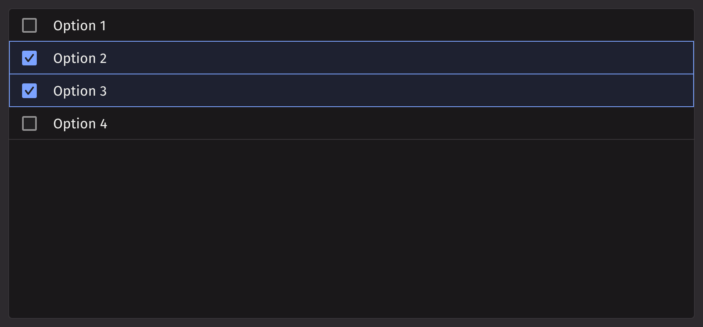

# List View

List view displays a list of interactive items, and allows a user to navigate, select, or perform an action. It offers greater flexibility in the contents it can render and can distinguish between row selection and actions performed on a row. This makes list view an ideal component for turning table columns into interactive lists.

## Example

```python
from deephaven import ui


@ui.component
def ui_list_view():
    return ui.list_view(
        ui.item("Option 1"),
        ui.item("Option 2"),
        ui.item("Option 3"),
        ui.item("Option 4"),
        default_selected_keys=["Option 2", "Option 3"],
    )


my_list_view = ui_list_view()
```



## Table Source Example

List view items can also be generated from a table directly or using `item_table_source`.

### Passing Table Directly

This method is ideal for quickly displaying a static dataset. By default, the first column is used as the key and label.

```python order=my_list_view_table,_colors
from deephaven import ui, new_table
from deephaven.column import string_col

_colors = new_table(
    [
        string_col("Colors", ["Red", "Blue", "Green"]),
    ]
)


@ui.component
def ui_list_view_table():
    return ui.list_view(_colors)


my_list_view_table = ui_list_view_table()
```

### Using item_table_source

`item_table_source` is used to create complex items from a table (ie., defining which columns are the keys/labels of the data).

```python order=my_list_view_table_source,_table
from deephaven import ui, new_table
from deephaven.column import string_col

_table = new_table(
    [
        string_col("Keys", ["key-0", "key-1", "key-2"]),
        string_col("Labels", ["Option 0", "Option 1", "Option 2"]),
    ]
)


@ui.component
def ui_list_view_table_source():
    source = ui.item_table_source(_table, key_column="Keys", label_column="Labels")
    return ui.list_view(source)


my_list_view_table_source = ui_list_view_table_source()
```

## Selection

The `selection_mode` prop can be used to configure how `ui.list_view` handles item selection. The options are `'MULTIPLE'` (the default value), `'SINGLE'`, or `'NONE'`.

Set `selection_mode='SINGLE'` to constrain selection to a single item.

```python
from deephaven import ui


@ui.component
def ui_list_view():
    return ui.list_view(
        ui.item("Option 1"),
        ui.item("Option 2"),
        ui.item("Option 3"),
        selection_mode="SINGLE",
    )


my_list_view = ui_list_view()
```

Set `selection_mode=None` or `selection_mode='NONE'` to disable selection.

```python test-set=0
from deephaven import ui


@ui.component
def ui_list_view():
    return ui.list_view(
        ui.item("Option 1"),
        ui.item("Option 2"),
        ui.item("Option 3"),
        selection_mode=None,
    )


my_list_view = ui_list_view()
```

`selection_mode` can be explicitly set to `MULTIPLE` for cases where it is dynamically defined. For example, a `ui.radio` can be used to change the selection mode.

```python test-set=0
@ui.component
def ui_list_view():
    selection_mode, set_selection_mode = ui.use_state("NONE")

    radio = ui.radio_group(
        ui.radio("None", value="NONE"),
        ui.radio("Multiple", value="MULTIPLE"),
        ui.radio("Single", value="SINGLE"),
        label="Selection Mode",
        orientation="horizontal",
        value=selection_mode,
        on_change=set_selection_mode,
    )

    lv = ui.list_view(
        ui.item("Option 1"),
        ui.item("Option 2"),
        ui.item("Option 3"),
        ui.item("Option 4"),
        selection_mode=selection_mode,
    )

    return radio, lv


my_list_view = ui_list_view()
```

## Events

List view accepts an action that can be triggered when a user performs an action on an item.

```python order=my_list_view_actions,_table
from deephaven import ui, new_table
from deephaven.column import string_col

_table = new_table(
    [
        string_col("Keys", ["key-0", "key-1", "key-2"]),
        string_col("Labels", ["Option 0", "Option 1", "Option 2"]),
    ]
)


@ui.component
def ui_list_view_actions():
    action_item_keys, set_action_item_keys = ui.use_state(["", ""])
    on_action = ui.use_callback(
        lambda action_key, item_key: set_action_item_keys([action_key, str(item_key)]),
        [],
    )

    source = ui.item_table_source(
        _table,
        key_column="Keys",
        label_column="Labels",
        actions=ui.list_action_group(
            "Edit",
            "Delete",
            on_action=on_action,
        ),
    )
    lv = ui.list_view(source)

    text_action = ui.text("Action: " + " ".join(map(str, action_item_keys)))

    return lv, text_action


my_list_view_actions = ui_list_view_actions()
```

List view can also accept a handler that is called when the selection is changed.

```python order=my_list_view_selection,_table
from deephaven import ui, new_table
from deephaven.column import string_col

_table = new_table(
    [
        string_col("Keys", ["key-0", "key-1", "key-2"]),
        string_col("Labels", ["Option 0", "Option 1", "Option 2"]),
    ]
)


@ui.component
def ui_list_view_selection():
    value, set_value = ui.use_state(["key-2"])

    def handle_change(e):
        set_value(e)
        print("Selection: " + ", ".join(map(str, e)))

    source = ui.item_table_source(
        _table,
        key_column="Keys",
        label_column="Labels",
    )
    lv = ui.list_view(source, on_change=handle_change)

    return lv


my_list_view_selection = ui_list_view_selection()
```

## Disabled Options

To disable certain rows in the `ListView` component, use the `disabled_keys` prop. By setting this prop with an array of keys, you can prevent interaction with those rows, providing greater control and customization options for the `ListView` behavior.

```python order=my_list_view_disabled,_table
from deephaven import ui, new_table
from deephaven.column import string_col

_table = new_table(
    [
        string_col("Keys", ["key-0", "key-1", "key-2"]),
        string_col("Labels", ["Option 0", "Option 1", "Option 2"]),
    ]
)


@ui.component
def ui_list_view_disabled():
    value, set_value = ui.use_state(["key-2"])

    source = ui.item_table_source(
        _table,
        key_column="Keys",
        label_column="Labels",
    )
    lv = ui.list_view(
        source, selected_keys=value, on_change=set_value, disabled_keys=["key-0"]
    )

    return lv


my_list_view_disabled = ui_list_view_disabled()
```

## Quiet State

```python
from deephaven import ui


@ui.component
def ui_list_view_quiet():
    value, set_value = ui.use_state(["Text 2"])

    quiet_list = ui.list_view(
        "Text 1",
        "Text 2",
        "Text 3",
        aria_label="List View - Quiet",
        on_change=set_value,
        selected_keys=value,
        is_quiet=True,
    )

    default_list = ui.list_view(
        "Text 1",
        "Text 2",
        "Text 3",
        aria_label="List View - Default",
        on_change=set_value,
        selected_keys=value,
    )
    return quiet_list, default_list


my_list_view_quiet = ui_list_view_quiet()
```

## Modifying Density

To adjust the vertical padding of each row in the list view, use the `density` prop.

```python
from deephaven import ui


@ui.component
def ui_list_view_density():
    value, set_value = ui.use_state(["Text 2"])

    compact_list = ui.list_view(
        "Text 1",
        "Text 2",
        "Text 3",
        aria_label="List View - Compact",
        on_change=set_value,
        selected_keys=value,
        density="compact",
    )

    spacious_list = ui.list_view(
        "Text 1",
        "Text 2",
        "Text 3",
        aria_label="List View - Spacious",
        on_change=set_value,
        selected_keys=value,
        density="spacious",
    )
    return compact_list, spacious_list


my_list_view_density = ui_list_view_density()
```

## Overflow Mode

The default behavior is to truncate content that overflows its row. Text can be wrapped instead by adding `wrap` to the `overflow_mode` prop.

Note: Currently not supported if a table source is used.

```python
from deephaven import ui


@ui.component
def ui_list_view_overflow():
    value, set_value = ui.use_state(["Text 2"])

    truncated_list = ui.list_view(
        "Really long Text 1",
        "Really long Text 2",
        "Really long Text 3",
        aria_label="List View - Quiet",
        on_change=set_value,
        selected_keys=value,
        overflow_mode="truncate",
        width="150px",
    )

    wrapped_list = ui.list_view(
        "Really long Text 1",
        "Really long Text 2",
        "Really long Text 3",
        aria_label="List View - Quiet",
        on_change=set_value,
        selected_keys=value,
        overflow_mode="wrap",
        width="150px",
    )
    return truncated_list, wrapped_list


my_list_view_overflow = ui_list_view_overflow()
```

## API reference

```{eval-rst}
.. dhautofunction:: deephaven.ui.list_view
```

## Item Table Source API reference

```{eval-rst}
.. dhautofunction:: deephaven.ui.item_table_source
```
