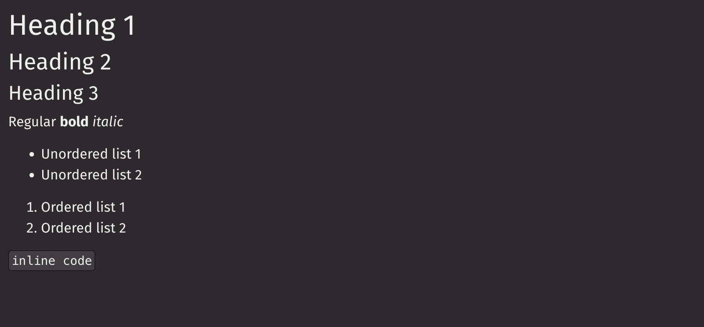

# Markdown

The markdown component renders a string in the CommonMark standard. It also supports LaTeX (through MathJax), with `remark-math` and `rehype-mathjax`. Other plugins and markdown components are not supported. The markdown is wrapped in a `View`, which all props are passed to except for `children`.

For individual lines of text, consider using `ui.text` and `ui.heading` instead.

## Example

```python
from deephaven import ui


markdown_str = """
# Heading 1
## Heading 2
### Heading 3

Regular **bold** *italic*

- Unordered list 1
- Unordered list 2

1. Ordered list 1
2. Ordered list 2

`inline code`
"""


@ui.component
def ui_markdown():
    return ui.markdown(markdown_str)


ui_markdown_example = ui_markdown()
```



## LaTeX

When writing LaTeX, be careful how Python handles backslashes with escape characters. To minimize this issue, it is recommended to use raw strings.

```python
from deephaven import ui


raw_md_str = r"""
This is a raw Python string. Notice the "r" before the quotation marks in the code.

$$
\eqalign{
(a+b)^2 &= (a+b)(a+b) \\
&= a^2 + ab + ba + b^2 \\
&= a^2 + 2ab + b^2
}
$$

Since raw strings ignore backslashes, all symbols require one backslash.
$$
\leftarrow \rightarrow \nrightarrow
$$
"""

regular_md_str = """
This is a regular Python string. Notice the extra backslashes necessary in the code.

$$
\eqalign{
(a+b)^2 &= (a+b)(a+b) \\\\
&= a^2 + ab + ba + b^2 \\\\
&= a^2 + 2ab + b^2
}
$$

Some backslashes are used to represent escape characters, requiring an extra backslash for LaTeX symbols.
$$
\leftarrow \\rightarrow \\nrightarrow
$$
"""


@ui.component
def latex_markdown():
    return ui.flex(
        ui.markdown(raw_md_str), ui.markdown(regular_md_str), column_gap="30px"
    )


latex_example = latex_markdown()
```

<!-- TODO (DOC-770): Need to find a way to get this working correctly. Myst parser does not handle nested code blocks correctly.
## Code Blocks

Code blocks follow Deephaven's formatting.

````python skip-test
from deephaven import ui


code_str = """
### Python

```python
print("Hello, World!")
```

### Java

```java
public class HelloWorld {
    public static void main(String[] args) {
        System.out.println("Hello, World!");
    }
}
```

"""

@ui.component
def code_markdown():
    return ui.markdown(code_str)

code_example = code_markdown()
```` -->

## Container Style

Markdown is automatically wrapped in a `View`, which all props except `children` are passed to.

```python
from deephaven import ui


@ui.component
def style_markdown():
    return ui.markdown("Test", height="150px", width="300px", background_color="red")


style_example = style_markdown()
```

## API Reference

```{eval-rst}
.. dhautofunction:: deephaven.ui.markdown
```
