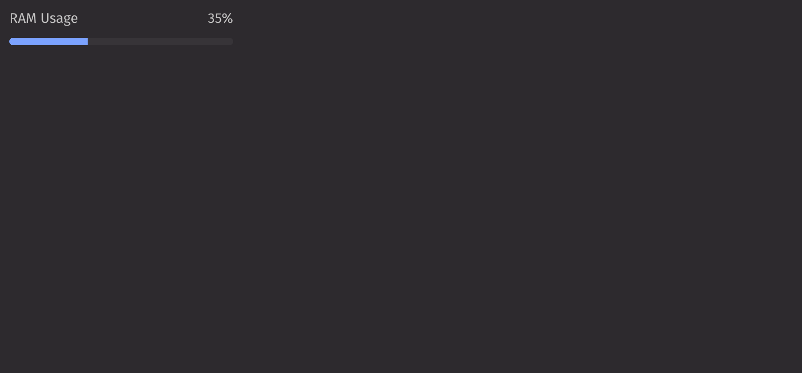

# Meter

Meters visually represent a quantity or achievement, displaying progress on a bar with a label.

## Example

```python
from deephaven import ui


@ui.component
def ui_meter():
    return ui.meter(label="RAM Usage", value=35)


my_meter = ui_meter()
```



## Value

The `value` prop controls the meter and represents the current percentage of progress. By default, the minimum and maximum values are 0 and 100 but a different scale can be used by setting the `min_value` and `max_value` props.

```python
from deephaven import ui


@ui.component
def ui_meter_value():
    return ui.meter(label="Tutorials completed", value=100, min_value=50, max_value=150)


my_meter_value = ui_meter_value()
```

## Formatting

The `format_options` prop dictates how the value is displayed and which characters can be inputted. This parameter supports three styles: Percentage, Currency, and Units.

Note: This prop is compatible with the option parameter of [Intl.NumberFormat](https://developer.mozilla.org/en-US/docs/Web/JavaScript/Reference/Global_Objects/NumberFormat).

```python
from deephaven import ui


@ui.component
def ui_meter_format():
    return ui.meter(
        label="Currency",
        value=75,
        format_options={"style": "currency", "currency": "USD"},
    )


my_meter_format = ui_meter_format()
```

## Labeling

When a label is provided, value labels are positioned above the meter by default. The `label_position` prop can change where these labels are placed, while the `show_value_prop` can hide them entirely.

```python
from deephaven import ui


@ui.component
def ui_meter_label():
    return [
        ui.meter(
            label="Label",
            value=50,
        ),
        ui.meter(
            label="Label",
            value=50,
            label_position="side",
        ),
        ui.meter(label="Label", value=50, show_value_label=False),
    ]


my_meter_label = ui_meter_label()
```

The `value_label` prop can update the value label directly where showing a different scale makes sense.

```python
from deephaven import ui


@ui.component
def ui_meter_value_label():
    return ui.meter(label="Currency", value=20, value_label="1 of 5")


my_meter_value_label = ui_meter_value_label()
```

## Size

The `size` prop controls how thick the meter bar is displayed.

```python
from deephaven import ui


@ui.component
def ui_meter_size():
    return [
        ui.meter(label="Progress", value=75, size="S"),
        ui.meter(label="Progress", value=75, size="L"),
    ]


my_meter_size = ui_meter_size()
```

## Variants

The `variant` prop changes the meter's visual style. It supports four options: informative, positive, critical, and warning.

```python
from deephaven import ui


@ui.component
def ui_meter_variant():
    return [
        ui.meter(
            label="Progress",
            value=75,
            variant="informative",
        ),
        ui.meter(
            label="Progress",
            value=75,
            variant="positive",
        ),
        ui.meter(
            label="Progress",
            value=75,
            variant="critical",
        ),
        ui.meter(
            label="Progress",
            value=75,
            variant="warning",
        ),
    ]


my_meter_variant = ui_meter_variant()
```

## API Reference

```{eval-rst}
.. dhautofunction:: deephaven.ui.meter
```
