# Component Overview

<CardList>

[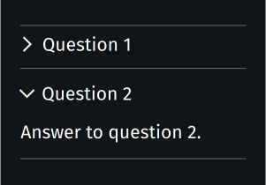](./accordion.md)

[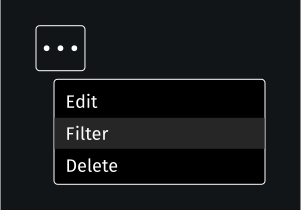](./action_menu.md)

[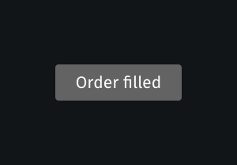](./badge.md)
[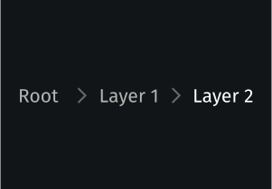](./breadcrumbs.md)

[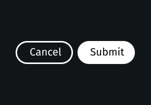](./button_group.md)
[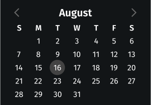](./calendar.md)
[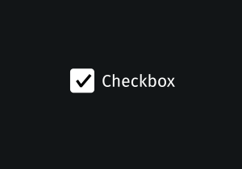](./checkbox.md)
[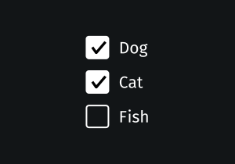](./checkbox_group.md)
[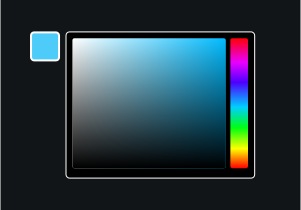](./color_picker.md)
[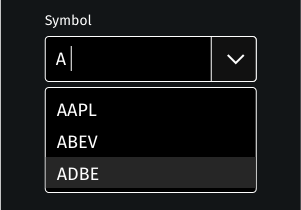](./combo_box.md)

[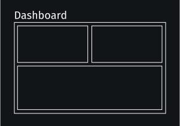](./dashboard.md)
[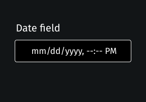](./date_field.md)
[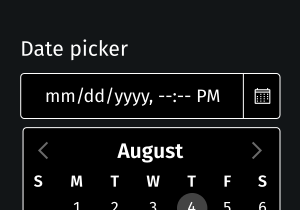](./date_picker.md)
[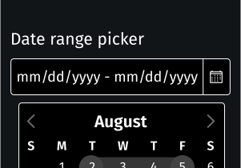](./date_range_picker.md)
[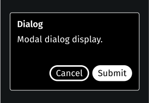](./dialog.md)
[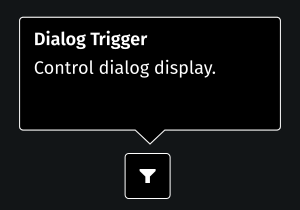](./dialog_trigger.md)
[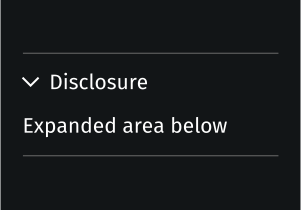](./disclosure.md)

[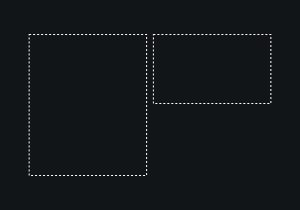](./flex.md)
[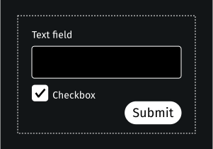](./form.md)
[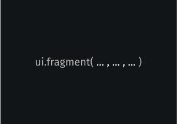](./fragment.md)
[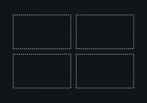](./grid.md)
[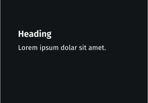](./heading.md)
[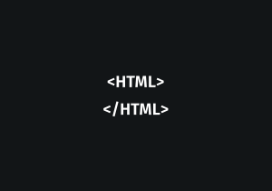](./html.md)
[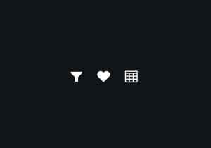](./icon.md)

[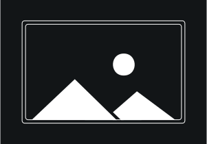](./image.md)
[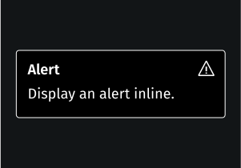](./inline_alert.md)
[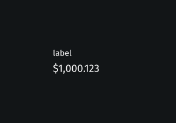](./labeled_value.md)

[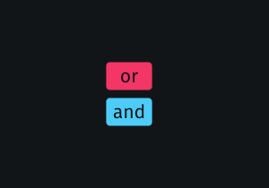](./logic_button.md)
[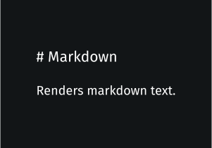](./markdown.md)
[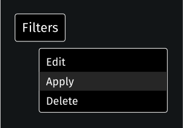](./menu.md)

[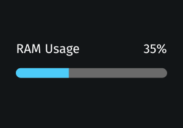](./meter.md)
[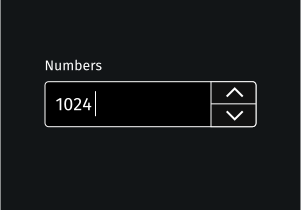](./number_field.md)
[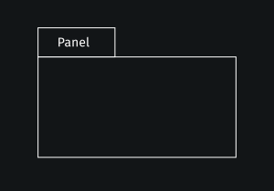](./panel.md)
[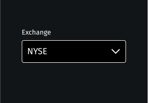](./picker.md)
[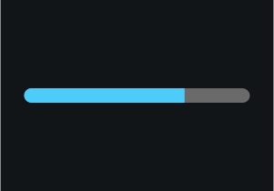](./progress_bar.md)
[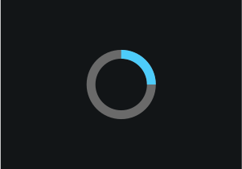](./progress_circle.md)

[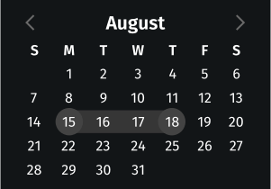](./range_calendar.md)
[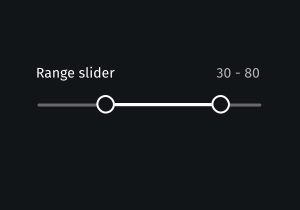](./range_slider.md)
[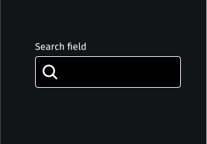](./search_field.md)

[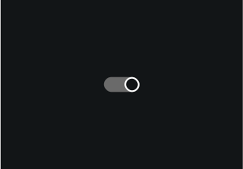](./switch.md)
[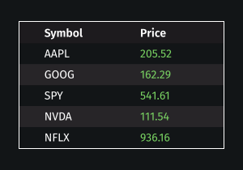](./table.md)
[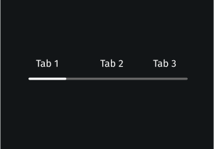](./tabs.md)

[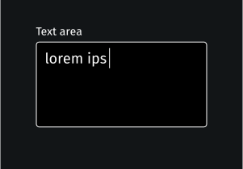](./text_area.md)
[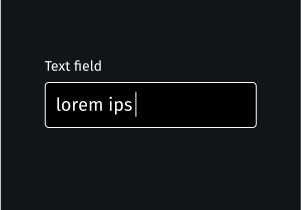](./text_field.md)
[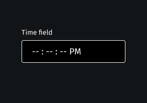](./time_field.md)
[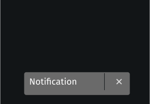](./toast.md)
[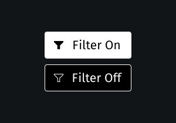](./toggle_button.md)
[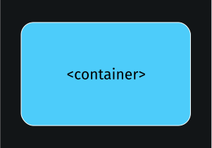](./view.md)

</CardList>
