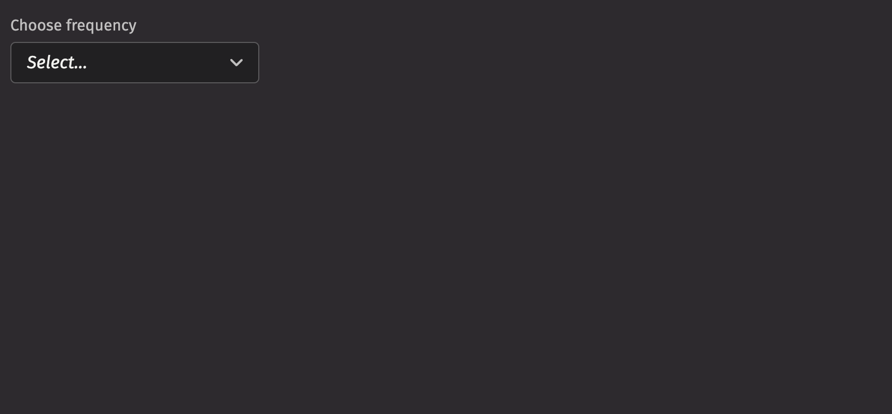

# Picker

Pickers enable users to pick an option from a collapsible list of options, often used when the space is limited.

## Example

```python
from deephaven import ui


@ui.component
def ui_picker_basic():
    option, set_option = ui.use_state(None)

    return ui.picker(
        "Rarely",
        "Sometimes",
        "Always",
        label="Choose frequency",
        selected_key=option,
        on_selection_change=set_option,
    )


my_picker_basic = ui_picker_basic()
```



## UI recommendations

Recommendations for creating pickers:

1. Every picker should have a [label](#labeling) specified. Without one, the picker is ambiguous. In the rare case that context is sufficient, the label is unnecessary; you must still include an aria-label via the `aria_label` prop.
2. Options in the picker should be kept short and concise; multiple lines are strongly discouraged.
3. The picker's width should be set so that the field button does not prevent options being displayed in full.
4. The label, menu items, and placeholder text should all be in sentence case.
5. A picker's help text should provide actionable guidance on what to select and how to select it, offering additional context without repeating the label.
6. When an error occurs, the help text specified in a picker should be replaced by error text.
7. Write error messages in a concise and helpful manner, guiding users to resolve the issue. Error text should be 1-2 short, complete sentences ending with a period.

## Data sources

We can use a Deephaven table or [URI](uri.md) as a data source to populate the options for pickers. A table automatically uses the first column as both the key and label. If there are duplicate keys, an error will be thrown; to avoid this, a `select_distinct` can be used on the table before using it as a picker data source.

```python order=my_picker_table_source_example,stocks
from deephaven import ui
from deephaven.plot import express as dx

stocks = dx.data.stocks().select_distinct("Sym")

my_picker_table_source_example = ui.picker(stocks, label="Stock Symbol Picker")
```

If you wish to specify the keys and labels manually, you can use a `ui.item_table_source` to dynamically derive the options from a table.

```python order=my_picker_item_table_source_example,column_types
from deephaven import ui, empty_table

icon_names = ["vsAccount"]
columns = [
    "Key=new Integer(i)",
    "Label=new String(`Display `+i)",
    "Icon=(String) icon_names[0]",
]
column_types = empty_table(20).update(columns)

item_table_source = ui.item_table_source(
    column_types,
    key_column="Key",
    label_column="Label",
    icon_column="Icon",
)

my_picker_item_table_source_example = ui.picker(item_table_source, label="User Picker")
```

## Labeling

The picker can be labeled using the `label` prop. If no label is provided, an `aria_label` must be provided to identify the control for accessibility purposes.

```python
from deephaven import ui


@ui.component
def ui_picker_label_examples():
    return [
        ui.picker(
            ui.item("Option 1"),
            ui.item("Option 2"),
            ui.item("Option 3"),
            label="Pick an option",
        ),
        ui.picker(
            ui.item("Option 1"),
            ui.item("Option 2"),
            ui.item("Option 3"),
            ui.item("Option 4"),
            aria_label="Pick an option",
        ),
    ]


my_picker_label_examples = ui_picker_label_examples()
```

The `is_required` prop and the `necessity_indicator` props can be used to show whether selecting an option in the picker is required or optional.

When the `necessity_indicator` prop is set to "label", a localized string will be generated for "(required)" or "(optional)" automatically.

```python
from deephaven import ui


@ui.component
def ui_picker_required_examples():
    return [
        ui.picker(
            ui.item("Option 1"),
            ui.item("Option 2"),
            ui.item("Option 3"),
            label="Pick an option",
            is_required=True,
        ),
        ui.picker(
            ui.item("Option 1"),
            ui.item("Option 2"),
            ui.item("Option 3"),
            ui.item("Option 4"),
            label="Pick an option",
            is_required=True,
            necessity_indicator="label",
        ),
        ui.picker(
            ui.item("Option 1"),
            ui.item("Option 2"),
            ui.item("Option 3"),
            ui.item("Option 4"),
            label="Pick an option",
            necessity_indicator="label",
        ),
    ]


my_picker_required_examples = ui_picker_required_examples()
```

## Selection

In a picker, the `default_selected_key` or `selected_key` props set a selected option.

```python
from deephaven import ui


@ui.component
def ui_picker_selected_key_examples():
    option, set_option = ui.use_state("Option 1")
    return [
        ui.picker(
            ui.item("Option 1"),
            ui.item("Option 2"),
            ui.item("Option 3"),
            default_selected_key="Option 2",
            label="Pick an option (uncontrolled)",
        ),
        ui.picker(
            ui.item("Option 1"),
            ui.item("Option 2"),
            ui.item("Option 3"),
            ui.item("Option 4"),
            selected_key=option,
            on_selection_change=set_option,
            label="Pick an option (controlled)",
        ),
    ]


my_picker_selected_key_examples = ui_picker_selected_key_examples()
```

Providing a value to the `selected_key` prop runs the component in "controlled" mode where the selection state is driven from the provided value. A value of `None` can be used to indicate nothing is selected while keeping the component in controlled mode. The default value is `ui.types.Undefined`, which causes the component to run in "uncontrolled" mode.

```python
from deephaven import ui


@ui.component
def ui_picker_key_variations():
    controlled_value, set_controlled_value = ui.use_state(None)

    return [
        ui.picker(
            "Option 1",
            "Option 2",
            selected_key=controlled_value,
            on_change=set_controlled_value,
            label="Key: Controlled",
        ),
        ui.picker(
            "Option 1",
            "Option 2",
            on_change=lambda x: print(x),
            label="Key: Undefined",
        ),
    ]


my_picker_key_variations = ui_picker_key_variations()
```

## HTML Forms

Pickers can support a `name` prop for integration with HTML forms, allowing for easy identification of a value on form submission.

```python
from deephaven import ui


my_picker_name_example = ui.form(
    ui.flex(ui.picker(ui.item("Option 1"), ui.item("Option 2"), name="Sample Name"))
)
```

## Sections

Picker supports sections that group options. Sections can be used by wrapping groups of items in a `section` element. Each section takes a `title` and `key` prop.

```python
from deephaven import ui

my_picker_section_example = ui.picker(
    ui.section(ui.item("Option 1"), ui.item("Option 2"), title="Section 1"),
    ui.section(ui.item("Option 3"), ui.item("Option 4"), title="Section 2"),
)
```

## Events

The Picker component supports selection through mouse, keyboard, and touch inputs via the `on_selection_change` prop, which receives the selected key as an argument.

```python
from deephaven import ui


@ui.component
def ui_picker_event_example():
    value, set_value = ui.use_state("")
    return ui.form(
        ui.picker(
            ui.section(ui.item("Option 1"), ui.item("Option 2"), title="Section 1"),
            on_selection_change=set_value,
        )
    )


my_picker_event_example = ui_picker_event_example()
```

## Complex items

Items within a picker can include additional content to better convey options. You can add icons, avatars, and descriptions to the children of an `ui.item`. When adding a description, set the `slot` prop to "description" to differentiate between the text elements.

```python
from deephaven import ui

my_picker_complex_items_example = ui.picker(
    ui.item(
        ui.icon("vsGithubAlt"),
        ui.text("Github"),
        ui.text("Github Option", slot="description"),
        text_value="Github",
    ),
    ui.item(
        ui.icon("vsAzureDevops"),
        ui.text("Azure"),
        ui.text("Azure Option", slot="description"),
        text_value="Azure",
    ),
)
```

## Loading

The `is_loading` prop displays a progress circle indicating that the picker is loading or processing data, which can be used to give immediate visual feedback to users. It also prevents users from interacting with the picker while data is loading, avoiding potential bad states.

```python
from deephaven import ui


@ui.component
def ui_picker_loading_example():
    loading, set_loading = ui.use_state("loading")
    return ui.form(
        ui.picker(
            ui.section(ui.item("Option 1"), ui.item("Option 2"), title="Section 1"),
            is_loading=True if loading == "loading" else False,
        )
    )


my_picker_loading_example = ui_picker_loading_example()
```

## Validation

The `is_required` prop ensures that the user selects an option. The related `validation_behaviour` prop allows the user to specify aria or native verification.

When the prop is set to "native", the validation errors block form submission and are displayed as help text automatically.

```python
from deephaven import ui


@ui.component
def ui_picker_validation_behaviour_example():
    return ui.form(
        ui.picker(
            ui.section(ui.item("Option 1"), ui.item("Option 2"), title="Section 1"),
            validation_behavior="native",
            is_required=True,
        )
    )


my_picker_validation_behaviour_example = ui_picker_validation_behaviour_example()
```

## Label position

By default, the position of a picker's label is above the picker, but it can be moved to the side using the `label_position` prop.

```python
from deephaven import ui


@ui.component
def ui_picker_label_position_examples():
    return [
        ui.picker(
            ui.section(ui.item("Option 1"), ui.item("Option 2"), title="Section 1"),
            label="Test Label",
        ),
        ui.picker(
            ui.section(ui.item("Option 1"), ui.item("Option 2"), title="Section 1"),
            label="Test Label",
            label_position="side",
        ),
    ]


my_picker_label_position_examples = ui_picker_label_position_examples()
```

## Quiet state

The `is_quiet` prop makes a picker "quiet". This can be useful when the picker and its corresponding styling should not distract users from surrounding content.

```python
from deephaven import ui


my_picker_is_quiet_example = ui.picker(
    ui.section(ui.item("Option 1"), ui.item("Option 2"), title="Section 1"),
    is_quiet=True,
)
```

## Disabled state

The `is_disabled` prop disables a picker to prevent user interaction. This is useful when the picker should be visible but not available for selection.

```python
from deephaven import ui


my_picker_is_disabled_example = ui.picker(
    ui.section(ui.item("Option 1"), ui.item("Option 2"), title="Section 1"),
    is_disabled=True,
)
```

## Help text

A picker can have both a `description` and an `error_message`. Use the error message to offer specific guidance on how to correct the input.

The `is_invalid` prop can be used to set whether the current picker state is valid or invalid.

```python
from deephaven import ui


@ui.component
def ui_picker_help_text_examples():
    return [
        ui.picker(
            ui.section(ui.item("Option 1"), ui.item("Option 2"), title="Section 1"),
            label="Sample Label",
            description="Enter a comment.",
        ),
        ui.picker(
            ui.section(ui.item("Option 1"), ui.item("Option 2"), title="Section 1"),
            label="Sample Label",
            is_invalid=False,
            error_message="Sample invalid error message.",
        ),
        ui.picker(
            ui.section(ui.item("Option 1"), ui.item("Option 2"), title="Section 1"),
            label="Sample Label",
            is_invalid=True,
            error_message="Sample invalid error message.",
        ),
    ]


my_picker_help_text_examples = ui_picker_help_text_examples()
```

## Contextual help

Using the `contextual_help` prop, a `ui.contextual_help` can be placed next to the label to provide additional information about the picker.

```python
from deephaven import ui


picker_contextual_help_example = ui.picker(
    ui.section(ui.item("Option 1"), ui.item("Option 2"), title="Section 1"),
    label="Sample Label",
    contextual_help=ui.contextual_help(
        ui.heading("Content tips"), ui.content("Select an option.")
    ),
)
```

## Custom width

The `width` prop adjusts the width of a picker, and the `max_width` prop enforces a maximum width.

```python
from deephaven import ui


@ui.component
def ui_picker_width_examples():
    return [
        ui.picker(
            ui.section(ui.item("Option 1"), ui.item("Option 2"), title="Section 1"),
            width="size-3600",
        ),
        ui.picker(
            ui.section(ui.item("Option 1"), ui.item("Option 2"), title="Section 1"),
            width="size-3600",
            max_width="100%",
        ),
    ]


my_picker_width_examples = ui_picker_width_examples()
```

## Align and direction

The `align` prop sets the text alignment of the options in the picker, while the `direction` prop specifies which direction the menu will open.

It is important to note that the popover will not open in the set `direction` if there is not enough room to open in that direction.

```python
from deephaven import ui


@ui.component
def ui_picker_alignment_direction_examples():
    return ui.flex(
        ui.picker(
            ui.section(ui.item("Option 1"), ui.item("Option 2"), title="Section 1"),
            align="end",
            menu_width="size-3000",
        ),
        ui.picker(
            ui.section(ui.item("Option 1"), ui.item("Option 2"), title="Section 1"),
            direction="top",
        ),
        gap="size-150",
        direction="column",
    )


my_picker_alignment_direction_examples = ui_picker_alignment_direction_examples()
```

## Menu state

The open state of the picker menu can be controlled through the `is_open` and `default_open` props.

```python
from deephaven import ui


@ui.component
def ui_picker_open_state_examples():
    open, set_open = ui.use_state(False)
    return [
        ui.picker(
            ui.section(ui.item("Option 1"), ui.item("Option 2"), title="Section 1"),
            is_open=open,
            on_open_change=set_open,
        ),
        ui.picker(
            ui.section(ui.item("Option 1"), ui.item("Option 2"), title="Section 1"),
            default_open=True,
        ),
    ]


my_picker_open_state_examples = ui_picker_open_state_examples()
```

## API Reference

```{eval-rst}
.. dhautofunction:: deephaven.ui.picker
```
