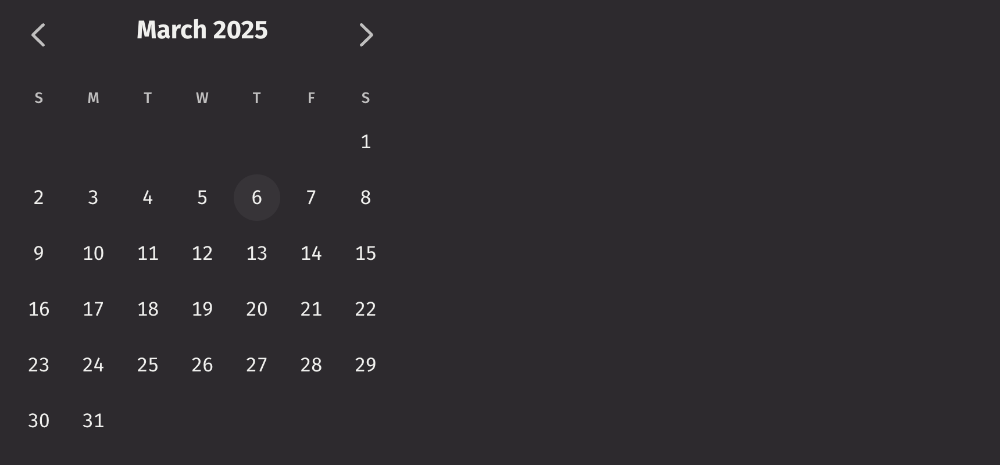

# Range Calendar

Range calendars display a grid of days in one or more months and allow users to select a contiguous range of dates.

## Example

```python
from deephaven import ui

my_range_calendar_basic = ui.range_calendar(aria_label="Trip Dates")
```



## Date types

The range is a dictionary with a `start` date and an `end` date; e.g., `{ "start": "2024-01-02", "end": "2024-01-05" }`.

The range calendar accepts the following date types as inputs:

- `None`
- `LocalDate`
- `ZoneDateTime`
- `Instant`
- `int`
- `str`
- `datetime.datetime`
- `numpy.datetime64`
- `pandas.Timestamp`

The input will be converted to one of three Java date types:

1. `LocalDate`: A LocalDate is a date without a time zone in the ISO-8601 system, such as "2007-12-03" or "2057-01-28".
2. `Instant`: An Instant represents an unambiguous specific point on the timeline, such as 2021-04-12T14:13:07 UTC.
3. `ZonedDateTime`: A ZonedDateTime represents an unambiguous specific point on the timeline with an associated time zone, such as 2021-04-12T14:13:07 America/New_York.

The format of the range calendar and the type of the value passed to the `on_change` handler is determined by the type of the following props in order of precedence:

1. `value`
2. `default_value`
3. `focused_value`
4. `default_focused_value`

If none of these are provided, the `on_change` handler passes a range of `Instant`.

```python order=my_zoned_example,my_instant_example,my_local_example
from deephaven import ui
from deephaven.time import to_j_local_date, to_j_instant, to_j_zdt


@ui.component
def range_calendar_example(start, end):
    dates, set_dates = ui.use_state({"start": start, "end": end})
    return [
        ui.range_calendar(on_change=set_dates, value=dates),
        ui.text(str(dates["start"])),
        ui.text(str(dates["end"])),
    ]


zdt_start = to_j_zdt("1995-03-22T11:11:11.23142 America/New_York")
zdt_end = to_j_zdt("1995-03-25T11:11:11.23142 America/New_York")
instant_start = to_j_instant("2022-01-01T00:00:00 ET")
instant_end = to_j_instant("2022-01-05T00:00:00 ET")
local_start = to_j_local_date("2024-05-06")
local_end = to_j_local_date("2024-05-10")

my_zoned_example = range_calendar_example(zdt_start, zdt_end)
my_instant_example = range_calendar_example(instant_start, instant_end)
my_local_example = range_calendar_example(local_start, local_end)
```

## Value

A range calendar has no selection by default. An initial, uncontrolled value can be provided to the range calendar using the `default_value` prop. Alternatively, a controlled value can be provided using the `value` prop.

```python
from deephaven import ui


@ui.component
def example():
    value, set_value = ui.use_state({"start": "2020-02-03", "end": "2020-02-08"})
    return ui.flex(
        ui.range_calendar(
            aria_label="Date range (uncontrolled)",
            default_value={"start": "2020-02-03", "end": "2020-02-08"},
        ),
        ui.range_calendar(
            aria_label="Date range (controlled)", value=value, on_change=set_value
        ),
        gap="size-300",
        wrap=True,
    )


my_example = example()
```

## Labeling

An `aria_label` must be provided to the Calendar for accessibility. If it is labeled by a separate element, an `aria_labelledby` prop must be provided using the id of the labeling element instead.

## Events

Range calendar accepts an `on_change` prop which is triggered whenever a date is selected by the user.

```python
from deephaven import ui


@ui.component
def event_example():
    value, set_value = ui.use_state({"start": "2020-02-03", "end": "2020-02-08"})
    return ui.range_calendar(
        aria_label="Calendar (controlled)", value=value, on_change=set_value
    )


my_event_example = event_example()
```

## Validation

By default, range calendar allows selecting any date range. The `min_value` and `max_value` props can also be used to prevent the user from selecting dates outside a certain range.

This example only accepts dates after today.

```python
from deephaven import ui
from deephaven.time import dh_today


my_range_calendar_min_value_example = ui.range_calendar(
    aria_label="Appointment Date", min_value=dh_today()
)
```

## Controlling the focused date

By default, the selected date is focused when a Calendar first mounts. If no `value` or `default_value` prop is provided, then the current date is focused. However, range calendar supports controlling which date is focused using the `focused_value` and `on_focus_change` props. This also determines which month is visible. The `default_focused_value` prop allows setting the initial focused date when the range calendar first mounts, without controlling it.

This example focuses July 1, 2021 by default. The user may change the focused date, and the `on_focus_change` event updates the state. Clicking the button resets the focused date back to the initial value.

```python
from deephaven import ui
from deephaven.time import to_j_local_date

default_date = to_j_local_date("2021-07-01")


@ui.component
def focused_example():
    value, set_value = ui.use_state(default_date)
    return ui.flex(
        ui.action_button(
            "Reset focused date", on_press=lambda: set_value(default_date)
        ),
        ui.range_calendar(focused_value=value, on_focus_change=set_value),
        direction="column",
        align_items="start",
        gap="size-200",
    )


my_focused_example = focused_example()
```

## Disabled state

The `is_disabled` prop disables the range calendar to prevent user interaction. This is useful when the range calendar should be visible but not available for selection.

```python
from deephaven import ui


my_range_calendar_is_disabled_example = ui.range_calendar(
    is_disabled=True,
)
```

## Read only

The `is_read_only` prop makes the range calendar's value immutable. Unlike `is_disabled`, the range calendar remains focusable.

```python
from deephaven import ui


my_range_calendar_is_read_only_example = ui.range_calendar(
    is_read_only=True,
)
```

## Visible Months

By default, the range calendar displays a single month. The `visible_months` prop allows displaying up to 3 months at a time.

```python
from deephaven import ui


my_range_calendar_visible_months_example = ui.range_calendar(
    visible_months=3,
)
```

## Page Behavior

By default, when pressing the next or previous buttons, pagination will advance by the `visible_months` value. This behavior can be changed to page by single months instead, by setting `page_behavior` to `single`.

```python
from deephaven import ui


my_range_calendar_page_behavior_example = ui.range_calendar(
    visible_months=3, page_behavior="single"
)
```

## Time table filtering

Calendars can be used to filter tables with time columns.

```python order=date_filter,_table
from deephaven.time import dh_now
from deephaven import time_table, ui


@ui.component
def date_table_filter(table, start_date, end_date, time_col="Timestamp"):
    dates, set_dates = ui.use_state({"start": start_date, "end": end_date})
    start = dates["start"]
    end = dates["end"]
    return [
        ui.range_calendar(value=dates, on_change=set_dates),
        table.where(f"{time_col} >= start && {time_col} < end"),
    ]


SECONDS_IN_DAY = 86400
today = dh_now()
_table = time_table("PT1s").update_view(
    ["Timestamp=today.plusSeconds(SECONDS_IN_DAY*i)", "Row=i"]
)
date_filter = date_table_filter(_table, today, today.plusSeconds(SECONDS_IN_DAY * 10))
```

## API Reference

```{eval-rst}
.. dhautofunction:: deephaven.ui.range_calendar
```
