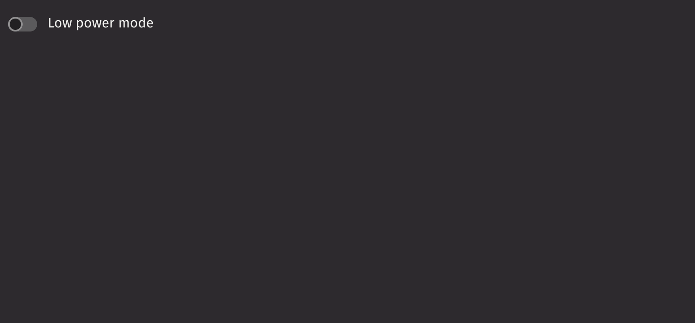

# Switch

Switches allow users to turn a single option on or off.

## Example

```python
from deephaven import ui

my_switch_basic = ui.switch("Low power mode")
```



## UI recommendations

Recommendations for creating switches:

1. Emphasized switches are ideal for forms and settings where the switch being noticed is crucial, while non-emphasized switches suit monochrome application panels to maintain focus on the content.
2. Use a standalone switch when the context is clear without a text label, such as next to a panel's title, to enable or disable panel options.
3. Use switches for activation and checkboxes for selection; unlike checkboxes, switches cannot have an error state.
4. When a switch represents multiple values from other switches, it should initially appear unselected; clicking it will select and unify all values, while a subsequent click will deselect and reset them.
5. Switches can only be on or off; for partial states, use a checkbox, as indeterminate switches are not accessible.

Consider using a [`checkbox`](./checkbox.md) for individual selections or when marking a single item as selected.

## Value

Switches are not selected by default. Use the `default_selected` prop to set the initial state (uncontrolled) or the `is_selected` prop to control the selected state.

```python
from deephaven import ui


@ui.component
def ui_switch_value_examples():
    selected, set_selected = ui.use_state(False)
    return [
        ui.switch("Low power mode (uncontrolled)", default_selected=True),
        ui.switch(
            "Low power mode (controlled)", is_selected=selected, on_change=set_selected
        ),
    ]


my_switch_value_examples = ui_switch_value_examples()
```


## HTML Forms

Switches can support a `name` prop for integration with HTML forms, allowing for easy identification of a value on form submission.

```python
from deephaven import ui


my_switch_name_example = ui.form(ui.switch("Low Power Mode", name="power", value="low"))
```

## Labeling

The switch can be labeled by passing in a child. If no label is provided, an `aria_label` must be provided to identify the control for accessibility purposes.

```python
from deephaven import ui


@ui.component
def ui_switch_label_examples():
    return [
        ui.switch("Switch Label", name="value"),
        ui.switch(aria_label="Switch Label", name="value"),
    ]


my_switch_label_examples = ui_switch_label_examples()
```


## Events

The `on_change` property is triggered whenever the switch is pressed.

```python
from deephaven import ui


@ui.component
def ui_switch_on_change_example():
    selected, set_selected = ui.use_state(False)
    return [
        ui.switch("Switch Label", on_change=set_selected, is_selected=selected),
        ui.text(f"The switch is {'on' if selected else 'off'}."),
    ]


my_switch_on_change_example = ui_switch_on_change_example()
```


## Disabled

Setting the `is_disabled` prop disables the switch.

```python
from deephaven import ui


my_switch_is_disabled_example = ui.switch("Switch Label", is_disabled=True)
```


## Emphasized

The `is_emphasized` prop makes the switch's fill color the user's accent color, adding visual prominence to the selection.

```python
from deephaven import ui


my_switch_is_emphasized_example = ui.switch("Switch Label", is_emphasized=True)
```


## Read only

The `is_read_only` prop makes the switch read-only to prevent user interaction. This differs from setting the `is_disabled` prop since the switch remains focusable.

```python
from deephaven import ui


my_switch_is_read_only_example = ui.switch(
    "Switch Label", is_read_only=True, default_selected=True
)
```
## API Reference

```{eval-rst}
.. dhautofunction:: deephaven.ui.switch
```
