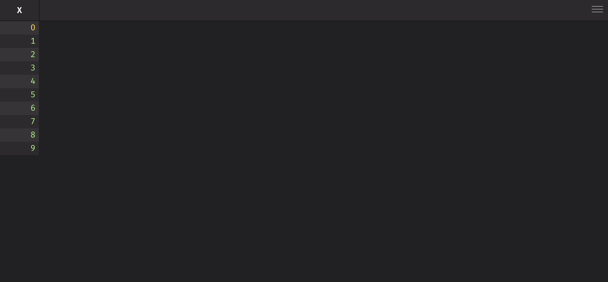
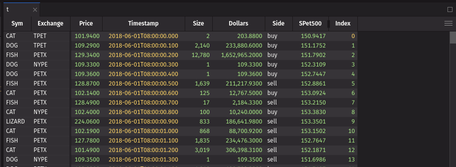
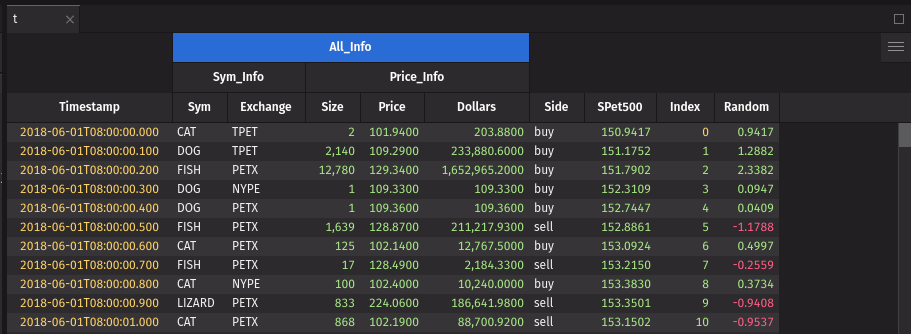
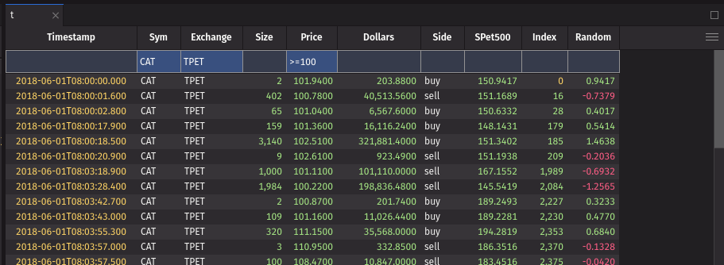

# Table

Tables are wrappers for Deephaven tables that allow you to change how the table is displayed in the UI and handle user events.

## Example

```python order=t,_t
from deephaven import ui, empty_table

_t = empty_table(10).update("X=i")
t = ui.table(_t)
```



## UI recommendations

1. It is not necessary to use a UI table if you do not need any of its properties. You can just use the Deephaven table directly.
2. Use a UI table to show properties like filters as if the user had created them in the UI. Users can change the default values provided by the UI table, such as filters.
3. UI tables handle ticking tables automatically, so you can pass any Deephaven table to a UI table.

## Table data source

The first argument to `ui.table` is the table data source. This can be any Deephaven table, a URI to a table, or a string which will be resolved as a URI. See the [URI Element](uri.md) documentation for more information on how to use URIs with UI elements.

## Formatting

You can format the table using the `format_` prop. This prop takes a `ui.TableFormat` object or list of `ui.TableFormat` objects. `ui.TableFormat` is a dataclass that encapsulates the formatting options for a table. The full list of formatting options can be found in the [API Reference](#tableformat).

### Formatting rows and columns

Every formatting rule may optionally specify `cols` and `if_` properties. The `cols` property is a column name or list of column names to which the formatting rule applies. If `cols` is omitted, then the rule will be applied to the entire row. The `if_` property is a Deephaven formula that indicates a formatting rule should be applied conditionally. The `if_` property _must_ evaluate to a boolean. If `if_` is omitted, then the rule will be applied to every row. These may be combined to apply formatting to specific columns only when a condition is met.

> [!NOTE]
> The `if_` property is a Deephaven formula evaluated in the engine. You can think of it like adding a new boolean column using [`update_view`](https://deephaven.io/core/docs/reference/table-operations/select/update-view/).

The following example shows how to format the `Sym` and `Exchange` columns with a red background and white text when the `Sym` is `DOG`.

```python
from deephaven import ui
import deephaven.plot.express as dx

t = ui.table(
    dx.data.stocks(),
    format_=[
        ui.TableFormat(
            cols=["Sym", "Exchange"],
            if_="Sym = `DOG`",
            background_color="red",
            color="white",
        )
    ],
)
```

### Formatting rule priority

The last matching formatting rule for each property will be applied. This means the lowest priority rules should be first in the list with higher priority rules at the end.

In the following example, the `Sym` column will have a red background with white text, and the rest of the table will have a blue background with white text.

```python
from deephaven import ui
import deephaven.plot.express as dx

t = ui.table(
    dx.data.stocks(),
    format_=[
        ui.TableFormat(background_color="blue", color="white"),
        ui.TableFormat(cols="Sym", background_color="red"),
    ],
)
```

### Formatting values from a column source

Any string value for a formatting rule can be read from a column by specifying the column name as the value. Note that if a value matches a column name, it will always be used (i.e., the theme color `positive` can not be used as a direct value if there is also a column called `positive`). The following example sets the `background_color` of column `x` using the value of the `bg_color` column.

```python order=t,_t
from deephaven import empty_table, ui

_t = empty_table(100).update(["x = i", "y = sin(i)", "bg_color = x % 2 == 0 ? `positive` : `negative`"])

t = ui.table(
    _t,
    format_=[
        ui.TableFormat(cols="x", background_color="bg_color"),
    ],
    hidden_columns=["bg_color"],
)
```

### Formatting color

Formatting rules for colors support [theme colors](../creating-layouts/size-and-theme.md#color-palette), hex colors, or any valid CSS color (e.g., `red`, `#ff0000`, `rgb(255, 0, 0)`). It is **recommended to use Deephaven theme colors** when possible to maintain a consistent look and feel across the UI. Theme colors will also automatically update if the user changes the theme.

#### Formatting text color

The `color` property sets the text color of the cell. If a cell has a `background_color`, but no `color` set, the text color will be set to black or white depending on which contrasts better with the background color. Setting the `color` property will override this behavior.

The following example will make all text the foreground color except the `Sym` column, which will be white. In dark mode, the foreground color is white, and in light mode, it is black. In light mode, the `Sym` column will be nearly invisible because it is not a theme color.

```python
from deephaven import ui
import deephaven.plot.express as dx

t = ui.table(
    dx.data.stocks(),
    format_=[
        ui.TableFormat(color="fg"),
        ui.TableFormat(cols="Sym", color="white"),
    ],
)
```

#### Formatting background color

The `background_color` property sets the background color of the cell. Setting the `background_color` without setting `color` will result in the text color automatically being set to black or white based on the contrast with the `background_color`.

The following example will make all the background color what is usually the foreground color. This means the table will have a white background with black text in dark theme and a black background with white text in light theme. The `Sym` column text will be the accent color in both themes.

```python
from deephaven import ui
import deephaven.plot.express as dx

t = ui.table(
    dx.data.stocks(),
    format_=[
        ui.TableFormat(background_color="fg"),
        ui.TableFormat(cols="Sym", color="accent"),
    ],
)
```

### Formatting numeric values

> [!WARNING]
> Datetime values are considered numeric. If you provide a default format for numeric values, it will also apply to datetime values. It is recommended to specify `cols` when applying value formats.

Numeric values can be formatted using the `value` property. The `value` property is a string that follows [the GWT Java NumberFormat syntax](https://www.gwtproject.org/javadoc/latest/com/google/gwt/i18n/client/NumberFormat.html). If a numeric format is applied to a non-numeric column, it will be ignored.

This example will format the `Price` and `Dollars` columns with the dollar sign, a comma separator for every 3 digits, 2 decimal places, and a minimum of 1 digit to the left of the decimal point. The `Random` column will be formatted with 3 decimal places and will drop the leading zero if the absolute value is less than 1.

```python
from deephaven import ui
import deephaven.plot.express as dx

t = ui.table(
    dx.data.stocks(),
    format_=[
        ui.TableFormat(cols=["Price", "Dollars"], value="$#,##0.00"),
        ui.TableFormat(cols="Random", value="#.000"),
    ],
)
```

### Formatting datetime and timestamp values

Datetime and timestamp values can be formatted using the `value` property. The `value` property is a string that follows [the GWT Java DateTimeFormat syntax](https://www.gwtproject.org/javadoc/latest/com/google/gwt/i18n/client/DateTimeFormat.html) with additional support for nanoseconds. You may provide up to 9 `S` characters after the decimal to represent partial seconds down to nanoseconds.

The following example formats the `Timestamp` column to show the short date of the week, day of the month, short month name, full year, hours, minutes, seconds, and microseconds with the user selected timezone.

```python
from deephaven import ui
import deephaven.plot.express as dx

t = ui.table(
    dx.data.stocks(),
    format_=[
        ui.TableFormat(cols="Timestamp", value="E, dd MMM yyyy HH:mm:ss.SSSSSS z"),
    ],
)
```

### Formatting cell text alignment

You can control text alignment using the `alignment` property. This property accepts the values `left`, `center`, and `right`, overriding the default alignment based on the column type. By default, numeric columns are right-aligned, string columns are left-aligned, and date columns are center-aligned.

```python
from deephaven import ui
import deephaven.plot.express as dx

t = ui.table(
    dx.data.stocks(),
    format_=[
        ui.TableFormat(cols="Sym", alignment="right"),
        ui.TableFormat(cols="Exchange", alignment="center"),
        ui.TableFormat(cols="Size", alignment="left"),
    ],
)
```

### Formatting databars

Table databars provide a visual representation of numeric data directly within table cells, making it easy to compare values at a glance. Databars appear as horizontal bars behind or alongside cell values.

To add a databar, set the `mode` of a `ui.TableFormat` to `ui.TableDatabar()`. The `cols` prop specifies which column(s) should display the databar.

```python
from deephaven import ui
import deephaven.plot.express as dx

t = ui.table(
    dx.data.stocks(),
    format_=[ui.TableFormat(cols="Price", mode=ui.TableDatabar())],
)
```

#### Value Column

The `value_column` prop allows you to use a different column's values for calculating the databar length while displaying the original column's values. This is useful for log-scaled visualizations or when displaying formatted text with calculated bar lengths.

```python
from deephaven import ui
import deephaven.plot.express as dx

t = ui.table(
    dx.data.stocks(),
    format_=[
        ui.TableFormat(
            cols="Sym", mode=ui.TableDatabar(value_column="Price", color="info")
        )
    ],
)
```

#### Scale Configuration

The `min` and `max` props control the scaling of databars. These can be set to fixed values or reference other columns for dynamic scaling.

By default these props will change to the min and max of the values in the column.

```python
from deephaven import ui
import deephaven.plot.express as dx

t = ui.table(
    dx.data.stocks(),
    format_=[
        ui.TableFormat(
            cols="Size", mode=ui.TableDatabar(min=0, max=1000, color="positive")
        ),
        ui.TableFormat(
            cols="Price", mode=ui.TableDatabar(min=0, max="Dollars", color="positive")
        ),
    ],
)
```

#### Axis Configuration

The `axis` prop controls how the zero point is positioned within the databar.

Options:

- `"proportional"` (default): relative to the min and max of the values
- `"middle"`: always centered, regardless of values in column
- `"directional"`: left-most or right-most, dependent on `direction` prop. The sign of the value is ignored, and the databar will show the magnitude of the value (i.e., -7 and 7 are the same).

```python
from deephaven import ui
import deephaven.plot.express as dx


t = ui.table(
    dx.data.stocks(),
    format_=[
        ui.TableFormat(cols="Size", mode=ui.TableDatabar()),
        ui.TableFormat(cols="Price", mode=ui.TableDatabar(axis="middle")),
        ui.TableFormat(cols="Dollars", mode=ui.TableDatabar(axis="directional")),
    ],
)
```

#### Direction

The `direction` prop controls which direction the databar grows from its zero point.

Options:

- `"LTR"`: (left to right, default)
- `"RTL"`: (right to left)

```python
from deephaven import ui
import deephaven.plot.express as dx


t = ui.table(
    dx.data.stocks(),
    format_=[
        ui.TableFormat(cols="Size", mode=ui.TableDatabar(direction="LTR")),
        ui.TableFormat(cols="Price", mode=ui.TableDatabar(direction="RTL")),
    ],
)
```

#### Value Placement

The `value_placement` prop controls how cell values are displayed relative to the databar.

Options:

- `"beside"` (default): to the right of the databar
- `"overlap"`: on top of the databar
- `"hide"`: not displayed

```python
from deephaven import ui
import deephaven.plot.express as dx

t = ui.table(
    dx.data.stocks(),
    format_=[
        ui.TableFormat(cols="Size", mode=ui.TableDatabar()),
        ui.TableFormat(cols="Price", mode=ui.TableDatabar(value_placement="overlap")),
        ui.TableFormat(cols="Dollars", mode=ui.TableDatabar(value_placement="hide")),
    ],
)
```

#### Color

The `color` prop defines the databar's color scheme. Use single colors for uniform appearance or color arrays for gradients.

```python
from deephaven import ui
import deephaven.plot.express as dx


t = ui.table(
    dx.data.stocks(),
    format_=[
        ui.TableFormat(cols="Size", mode=ui.TableDatabar(color="info")),
        ui.TableFormat(
            cols="Price", mode=ui.TableDatabar(color=["negative", "positive"])
        ),
    ],
)
```

#### Opacity

The `opacity` prop controls the transparency of databars, accepting values from 0.0 (fully transparent) to 1.0 (fully opaque).

```python
from deephaven import ui
import deephaven.plot.express as dx

t = ui.table(
    dx.data.stocks(),
    format_=[
        ui.TableFormat(cols="Size", mode=ui.TableDatabar(color="info", opacity=0.3)),
    ],
)
```

#### Markers

The `markers` prop adds reference lines or thresholds to databars. Each marker requires a `value` (column name or constant) and `color`.

```python
from deephaven import ui
import deephaven.plot.express as dx


t = ui.table(
    dx.data.stocks(),
    format_=[
        ui.TableFormat(
            cols="Price",
            mode=ui.TableDatabar(
                color="positive",
                markers=[
                    {"value": "SPet500", "color": "accent"},
                    {"value": 50, "color": "notice"},
                ],
            ),
        )
    ],
)
```

## Aggregations

You can add aggregation rows to the table using `ui.TableAgg` with the `aggregations` prop. These will be shown as floating rows at the top or bottom of the table and account for any user-applied filters. The `aggregations_position` prop determines if aggregations are shown at the top or bottom of the table and defaults to the bottom. The full list of aggregations can be found in the "Aggregate Columns" section in the table sidebar menu and in our [JavaScript API docs](/core/client-api/javascript/classes/dh.AggregationOperation.html).

Aggregations will be applied to all columns that can use the chosen aggregation unless `cols` or `ignore_cols` are provided. If `cols` is provided, only the specified columns will be aggregated. If `ignore_cols` is provided, all columns which can be aggregated except those specified will be aggregated.

The following example show aggregations of the first row for each column, the last row for the `Timestamp` column, and the sum of all columns which can be summed except `Index` and `Random`. One table shows the aggregations at the bottom, and the other shows the aggregations at the top.

```python order=t_bottom,t_top
from deephaven import ui
import deephaven.plot.express as dx

aggs = [
    ui.TableAgg(agg="first"),
    ui.TableAgg(agg="last", cols="Timestamp"),
    ui.TableAgg(agg="sum", ignore_cols=["Index", "Random"])
]

t_bottom = ui.table(
    dx.data.stocks(),
    aggregations=aggs
)

t_top = ui.table(
    dx.data.stocks(),
    aggregations=aggs,
    aggregations_position="top"
)
```

## Events

### Press Events

You can listen for different user press events on a `ui.table`. There is both a `press` and `double_press` event for `row`, `cell`, and `column`. These events typically correspond to a click or double click on the table. The event payloads include table data related to the event. For `row` and `column` events, the corresponding data within the viewport will be sent to the event handler. The viewport is typically the visible area &plusmn; a window equal to the visible area (e.g., if rows 5-10 are visible, rows 0-15 will be in the viewport). Data specified via [`always_fetch_columns`](#always-fetching-some-columns) is also included.

Note that there is no row index in event data because the row index is not a safe way to reference a row between the client and server since the user could have manipulated the table, resulting in a different client order.

A `double_press` event will be preceded by 2 `press` events with the same data.

The following example shows how to listen for the different events and prints the event data to the console.

```python
from deephaven import ui
import deephaven.plot.express as dx

t = ui.table(
    dx.data.stocks(),
    on_row_press=lambda data: print(f"Row Press: {data}"),
    on_row_double_press=lambda data: print(f"Row Double Press: {data}"),
    on_cell_press=lambda data: print(f"Cell Press: {data}"),
    on_cell_double_press=lambda data: print(f"Cell Double Press: {data}"),
    on_column_press=lambda column: print(f"Column Press: {column}"),
    on_column_double_press=lambda column: print(f"Column Double Press: {column}"),
)
```

### Selection Events

The `on_selection_change` event is triggered when the user selects or deselects a row. The event data will contain all selected rows within the viewport as a list of dictionaries keyed by column name. There are a few caveats to the selection event.

1. The event will **only** send data from columns in the [`always_fetch_columns`](#always-fetching-some-columns) prop.
2. The event will **only** send data from rows that are visible in the viewport.
3. The event will **not** be triggered if a ticking table row is replaced or shifted. This may cause what the user sees after row shifts to differ from the selection event data.

With these caveats in mind, it is highly recommended that the `on_selection_change` event be used only with static tables. It is also recommended to only use this event for relatively small actions where you can see all selected rows at once.

```python
from deephaven import ui
import deephaven.plot.express as dx

t = ui.table(
    dx.data.stocks(),
    on_selection_change=lambda data: print(f"Selection: {data}"),
    always_fetch_columns=["Sym", "Exchange"],
)
```

### Always fetching some columns

Deephaven only fetches data for visible rows and columns within a window around the viewport (typically the viewport plus 1 page in all directions). This reduces the amount of data transferred between the server and client and allows tables with billions of rows to be displayed. Sometimes you may need to always fetch columns, such as a key column for a row press event. You can use the `always_fetch_columns` prop to specify columns that should always be fetched regardless of their visibility.

The `always_fetch_columns` prop takes a single column name, a list of column names, or a boolean to always fetch all columns. The data for these columns is included in row event data (e.g., `on_row_press`) and context menu callbacks.

When using event callbacks, include any columns referenced in the callback in `always_fetch_columns` to prevent undefined columns when users hide columns or scroll beyond the viewport.

> [!WARNING]
> Setting `always_fetch_columns` to `True` will fetch all columns and can be slow for tables with many columns.

This example shows how to use `always_fetch_columns` to always fetch the `Sym` column for a row press event. Without the `always_fetch_columns` prop, the press callback will fail because the `Sym` column is not fetched when hidden.

```python
from deephaven import ui
import deephaven.plot.express as dx

t = ui.table(
    dx.data.stocks(),
    hidden_columns=["Sym"],
    on_row_press=lambda d: print(d["Sym"]),
    always_fetch_columns="Sym",
)
```

## Context menu

Items can be added to the bottom of the `ui.table` context menu (right-click menu) by using the `context_menu` or `context_header_menu` props. The `context_menu` prop adds items to the cell context menu, while the `context_header_menu` prop adds items to the column header context menu. You can pass either a single dictionary for a single item or a list of dictionaries for multiple items.

Menu items must have a `title` and either an `action` or `actions` prop. They may have an `icon`, which is the name of the icon that will be passed to `ui.icon`.

The `action` prop is a callback that is called when the item is clicked and receives info about the cell that was clicked when the menu was opened.

The following example shows how to add a context menu item to the table and column header. When the context menu item is clicked, both actions print the cell's data.

```python
from deephaven import ui
import deephaven.plot.express as dx

t = ui.table(
    dx.data.stocks(),
    context_menu={
        "title": "Context item",
        "icon": "dhTruck",
        "action": lambda d: print("Context item", d),
    },
    context_header_menu={
        "title": "Header context menu item",
        "action": lambda d: print("Header context menu item", d),
    },
)
```

### Sub-menus

The `actions` prop is an array of menu items that will be displayed in a sub-menu. If you specify `actions`, you cannot specify an `action` for the menu item. The action will be to show the sub-menu. Sub-menus can contain other sub-menus for deeply nested menus.

The following example shows how to add a context menu item and a nested menu item to the table. When the context menu item is clicked, the actions print the data of the cell.

```python
from deephaven import ui
import deephaven.plot.express as dx

t = ui.table(
    dx.data.stocks(),
    context_menu=[
        {
            "title": "Context item",
            "icon": "dhTruck",
            "action": lambda d: print("Context item", d),
        },
        {
            "title": "Nested menu",
            "actions": [
                {
                    "title": "Nested item 1",
                    "action": lambda d: print("Nested item 1", d),
                },
                {
                    "title": "Nested item 2",
                    "icon": "vsCheck",
                    "action": lambda d: print("Nested item 2", d),
                },
            ],
        },
    ],
)
```

### Dynamic menu items

Menu items can be dynamically created by passing a function as the context item. The function will be called with the data of the cell that was clicked when the menu was opened, and must return the menu items or None if you do not want to add context menu items based on the cell info.

The following example shows how to create a context menu item dynamically so that it appears only on the `sym` column. If a list of functions is provided, each will be called, and any items they return will be added to the context menu.

```python
from deephaven import ui
import deephaven.plot.express as dx


def create_context_menu(data):
    if data["column_name"] == "Sym":
        return {
            "title": f"Print {data['value']}",
            "action": lambda d: print(d["value"]),
        }
    return None


t = ui.table(dx.data.stocks(), context_menu=create_context_menu)
```

## Column order and visibility

You can freeze columns to the front of the table using the `frozen_columns` prop. Frozen columns will always be visible on the left side of the table, even when the user scrolls horizontally. The `frozen_columns` prop takes a list of column names to freeze.

You can also pin columns to the front or back of the table using the `front_columns` and `back_columns` props. Pinned columns will be moved to the front or back of the table and will not be moveable by the user. These columns will still scroll off the screen if the user needs to scroll horizontally. The `front_columns` and `back_columns` props take a list of column names to pin.

Columns can also be hidden by default using the `hidden_columns` prop. Note that users can still expand these columns if they want to see them. The columns will be collapsed by default. The `hidden_columns` prop takes a list of column names to hide.

```python
from deephaven import ui
import deephaven.plot.express as dx

t = ui.table(
    dx.data.stocks(),
    frozen_columns=["Sym", "Exchange"],
    front_columns=["Price"],
    back_columns=["Index"],
    hidden_columns=["Random"],
)
```



## Column display names

You can set custom display names for columns using the `column_display_names` prop. The `column_display_names` prop takes a dictionary where the key is the column name and the value is the display name. The display name can be any string, so this can be used to show a user-friendly name that does not adhere to column naming rules.

```python
from deephaven import ui
import deephaven.plot.express as dx

t = ui.table(
    dx.data.stocks(), column_display_names={"Price": "Price (USD)", "Side": "Buy/Sell"}
)
```

## Grouping columns

Columns can be grouped visually using the `column_groups` prop. Columns in a column group are moved so they are next to each other, and a header spanning all columns in the group is added. Columns can be rearranged within a group, but they cannot be moved outside of the group without using the table sidebar menu.

The `column_groups` prop takes a list of dictionaries, each representing a column group. Each dictionary must have a `name` and `children` prop.

The `name` prop is the name of the column group. Column group names must follow the same guidelines as column names. Group names should be unique among all column names and group names.

The `children` prop is a list of column names or groups that belong to the group. Any columns or groups should only ever be listed as children in one group.

The `color` prop is optional and sets the color of the column group header.

Column groups may be nested by including the name of another group in the `children` list of a group.

The following example shows how to group columns and nest groups.

```python
from deephaven import ui
import deephaven.plot.express as dx

t = ui.table(
    dx.data.stocks(),
    column_groups=[
        {
            "name": "Sym_Info",
            "children": ["Sym", "Exchange"],
        },
        {"name": "Price_Info", "children": ["Size", "Price", "Dollars"]},
        {
            "name": "All_Info",
            "children": ["Sym_Info", "Price_Info"],
            "color": "#3b6bda",
        },
    ],
)
```



## Quick filters

Quick filters are an easy way to filter the table while also showing the user what filters are currently applied. These filters are applied on the server via request from the client, so users may change the filters without affecting other users. Unlike a `where` statement to filter a table on the server, quick filters can be easily changed by the user.

Quick filters may be preferred if you have multiple servers or workers hosting your data. If, for example, the table is on another Deephaven instance, performing a `where` operation on the table may require copying all of the data from the host server into the server running Deephaven UI. With a quick filter, the filter can instead be applied directly on the server hosting the table.

Quick filters can be added to the table using the `quick_filters` prop. The `quick_filters` prop takes a dictionary where the key is the column and the value is the filter to apply.

The quick filter bar can be expanded by default with the `show_quick_filters` prop.

```python order=t2,t,_stocks
from deephaven import ui
import deephaven.plot.express as dx

_stocks = dx.data.stocks()

t = _stocks.where("Sym = `CAT`") # Applied when query is run

t2 = ui.table( # Filters applied when table is opened on the client
    _stocks,
    show_quick_filters=True,
    quick_filters={
        "Sym": "CAT",
        "Exchange": "TPET",
        "Price": ">=100"
    }
)
```



## Reverse

The table can be displayed in reverse order using the `reverse` prop. Using the reverse prop visually indicates to the user that the table is reversed via a colored bar under the column headers. Users can disable the reverse with the column header context menu or via a shortcut. The reverse is applied on the server via request from the client.

```python
from deephaven import ui
import deephaven.plot.express as dx

t = ui.table(dx.data.stocks(), reverse=True)
```

## API Reference

### Table

```{eval-rst}
.. dhautofunction:: deephaven.ui.table
```

### TableAgg

```{eval-rst}
.. dhautofunction:: deephaven.ui.TableAgg
```

### TableFormat

```{eval-rst}
.. dhautofunction:: deephaven.ui.TableFormat
```

### TableDatabar

```{eval-rst}
.. dhautofunction:: deephaven.ui.TableDatabar
```
