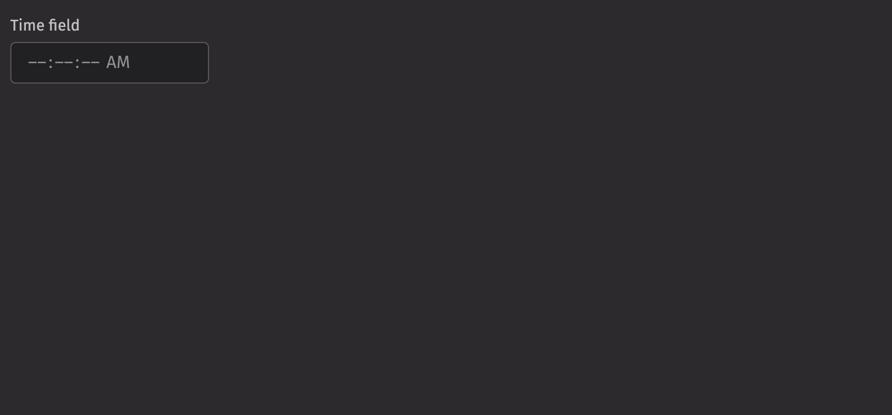

# Time field

Time fields allow users to input a time using a text field.

## Example

```python
from deephaven import ui

my_time_field_basic = ui.time_field(label="Time field")
```



## Time types

A time field can be used to input a time.

The time field accepts the following time types as inputs:

- `None`
- `LocaTime`
- `ZonedDateTime`
- `Instant`
- `int`
- `str`
- `datetime.datetime`
- `numpy.datetime64`
- `pandas.Timestamp`

The input will be converted to one of three Java time types:

1. `LocalTime`: A LocalTime is a time without a time zone in the ISO-8601 system, such as "10:30:45" or "16:10:00".
   This will create a time field with a granularity of seconds.
2. `Instant`: An Instant represents an unambiguous specific point on the timeline, such as 2021-04-12T14:13:07 UTC.
   This will create a time field with a granularity of seconds in UTC. The time zone will be rendered as the time zone in user settings.
3. `ZonedDateTime`: A ZonedDateTime represents an unambiguous specific point on the timeline with an associated time zone, such as 2021-04-12T14:13:07 America/New_York.
   This will create a time field with a granularity of seconds in the specified time zone. The time zone will be rendered as the specified time zone.

4. If the input is one of the three Java time types, use that type.
5. A time string such as "10:30:45" will parse to a `LocaTime`.
6. A string with a date, time, and timezone such as "2021-04-12T14:13:07 America/New_York" will parse to a `ZonedDateTime`.
7. All other types will attempt to convert in this order: `LocaTime`, `Instant`, `ZonedDateTime`.

The format of the time field and the type of the value passed to the `on_change` handler
is determined by the type of the following props in order of precedence:

1. `value`
2. `default_value`
3. `placeholder_value`

If none of these are provided, the `on_change` handler passes a range of `LocalTime`.

```python order=zoned_time_field,instant_time_field,local_time_field
from deephaven import ui
from deephaven.time import to_j_local_time, dh_now, to_j_instant, to_j_zdt

zoned_date_time = to_j_zdt("1995-03-22T11:11:11.23142 America/New_York")
instant = to_j_instant("2022-01-01T00:00:00 ET")
local_time = to_j_local_time("12:30:45")


@ui.component
def time_field_test(value):
    time, set_time = ui.use_state(value)
    return ui.time_field(on_change=set_time, value=time)


zoned_time_field = time_field_test(zoned_date_time)
instant_time_field = time_field_test(instant)
local_time_field = time_field_test(local_time)
```

## Value

A time field displays a `placeholder` by default. An initial, uncontrolled value can be provided to the time field using the `defaultValue` prop. Alternatively, a controlled value can be provided using the `value` prop.

```python
from deephaven import ui


@ui.component
def example():
    value, set_value = ui.use_state("11:45")
    return ui.flex(
        ui.time_field(
            label="Time field (uncontrolled)",
            default_value="11:45",
        ),
        ui.time_field(
            label="Time field (controlled)", value=value, on_change=set_value
        ),
        gap="size-150",
        wrap=True,
    )


my_example = example()
```

## Time zones

Time field is time zone aware when `ZonedTimeTime` or `Instant` objects are provided as the value. In this case, the time zone abbreviation is displayed, and time zone concerns such as daylight saving time are taken into account when the value is manipulated.

In most cases, your data will come from and be sent to a server as an `ISO 8601` formatted string.

- For `ZonedTimeTime` objects, the time field displays the specified time zone.
- For `Instant` objects, the time field displays the time zone from the user settings.

```python order=my_zoned_time_time,my_instant
from deephaven import ui
from deephaven.time import to_j_instant

my_zoned_time_time = ui.time_field(
    label="Time field",
    default_value="2022-11-07T00:45 America/Los_Angeles",
)

my_instant = ui.time_field(
    label="Time field",
    default_value=to_j_instant("2022-11-07T00:45Z"),
)
```

## Granularity

The `granularity` prop allows you to control the smallest unit displayed by a time field. By default, values are displayed with "SECOND" granularity.

In addition, when a value with a time is provided but you wish to display only the time, you can set the granularity to "DAY". This has no effect on the actual value (it still has a time component), only on what fields are displayed. In the following example, two time fields are synchronized with the same value but display different granularities.

```python
from deephaven import ui


@ui.component
def granularity_example():
    value, set_value = ui.use_state("2021-04-07T18:45:22 UTC")
    return ui.flex(
        ui.time_field(
            label="Time field and time field",
            granularity="SECOND",
            value=value,
            on_change=set_value,
        ),
        ui.time_field(
            label="Time field", granularity="HOUR", value=value, on_change=set_value
        ),
        gap="size-150",
        wrap=True,
    )


my_granularity_example = granularity_example()
```

## HTML forms

The time field supports the `name` prop for integration with HTML forms. The value will be submitted to the server as an `ISO 8601` formatted string, e.g., "08:45:00."

```python
from deephaven import ui

my_time_field_forms = ui.form(
    ui.time_field(label="Meeting time", name="meetingTime"),
    ui.button("Submit", type="submit"),
    on_submit=print,
)
```

## Labeling

A visual label should be provided for the time field using the `label` prop. If the time field is required, the `is_required` and `necessity_indicator` props can be used to show a required state.

```python
from deephaven import ui

my_time_field_labeling = ui.flex(
    ui.time_field(label="Time field"),
    ui.time_field(label="Time field", is_required=True, necessity_indicator="icon"),
    ui.time_field(label="Time field", is_required=True, necessity_indicator="label"),
    ui.time_field(label="Time field", necessity_indicator="label"),
)
```

## Events

Time fields support selection through mouse, keyboard, and touch inputs via the `on_change` prop, which receives the value as an argument.

```python
from deephaven import ui


@ui.component
def event_example():
    value, set_value = ui.use_state("11:45")
    return ui.time_field(
        label="Time field (controlled)", value=value, on_change=set_value
    )


my_event_example = event_example()
```

## Validation

The `is_required` prop ensures that the user selects a time field. The related `validation_behaviour` prop allows the user to specify aria or native verification.

When the prop is set to "native", the validation errors block form submission and are displayed as help text automatically.

```python
from deephaven import ui


@ui.component
def time_field_validation_behaviour_example():
    return ui.form(
        ui.time_field(
            validation_behavior="native",
            is_required=True,
        )
    )


my_time_field_validation_behaviour_example = time_field_validation_behaviour_example()
```

## Minimum and maximum values

The `min_value` and `max_value` props can also be used to ensure the value is within a specific field. Time field also validates that the end time is after the start time.

```python
from deephaven import ui

my_time_field_basic = ui.time_field(
    label="Time field",
    min_value="11:00",
    default_value="11:45",
)
```

## Label position

By default, the position of a time field's label is above the time field, but it can be moved to the side using the `label_position` prop.

```python
from deephaven import ui


@ui.component
def time_field_label_position_examples():
    return [
        ui.time_field(
            label="Test Label",
        ),
        ui.time_field(
            label="Test Label",
            label_position="side",
        ),
    ]


my_time_field_label_position_examples = time_field_label_position_examples()
```

## Quiet state

The `is_quiet` prop makes a time field "quiet". This can be useful when its corresponding styling should not distract users from surrounding content.

```python
from deephaven import ui


my_time_field_is_quiet_example = ui.time_field(
    is_quiet=True,
)
```

## Disabled state

The `is_disabled` prop disables the time field to prevent user interaction. This is useful when the time field should be visible but not available for selection.

```python
from deephaven import ui


my_time_field_is_disabled_example = ui.time_field(
    is_disabled=True,
)
```

## Read only

The `is_read_only` prop makes the time field's value immutable. The time field remains focusable, unlike when `is_disabled` is used.

```python
from deephaven import ui


my_time_field_is_read_only_example = ui.time_field(
    is_read_only=True,
)
```

## Help text

A time field can have both a `description` and an `error_message`. Use the error message to offer specific guidance on how to correct the input.

The `validation_state` prop can be used to set whether the current time field state is `valid` or `invalid`.

```python
from deephaven import ui


@ui.component
def time_field_help_text_examples():
    return [
        ui.time_field(
            label="Sample Label",
            description="Enter a time field.",
        ),
        ui.time_field(
            label="Sample Label",
            validation_state="valid",
            error_message="Sample invalid error message.",
        ),
        ui.time_field(
            label="Sample Label",
            validation_state="invalid",
            error_message="Sample invalid error message.",
        ),
    ]


my_time_field_help_text_examples = time_field_help_text_examples()
```

## Contextual help

Using the `contextual_help` prop, a `ui.contextual_help` can be placed next to the label to provide additional information about the time field.

```python
from deephaven import ui


time_field_contextual_help_example = ui.time_field(
    label="Sample Label",
    contextual_help=ui.contextual_help(
        ui.heading("Content tips"), ui.content("Enter a time.")
    ),
)
```

## Custom width

The `width` prop adjusts the width of a time field, and the `max_width` prop enforces a maximum width.

```python
from deephaven import ui


@ui.component
def time_field_width_examples():
    return [
        ui.time_field(
            width="size-3600",
        ),
        ui.time_field(
            width="size-3600",
            max_width="100%",
        ),
    ]


my_time_field_width_examples = time_field_width_examples()
```

## Hide time zone

The time zone can be hidden using the `hide_time_zone` option.

```python
from deephaven import ui

my_hide_time_zone_example = ui.time_field(
    label="Time field",
    default_value="2022-11-07T00:45 America/Los_Angeles",
    hide_time_zone=True,
)
```

## Hour cycle

By default, time field displays times in either a `12` or `24` hour format depending on the user's locale. However, this can be overridden using the `hour_cycle` prop.

```python
from deephaven import ui


time_field_hour_cycle_example = ui.time_field(label="Time field", hour_cycle=24)
```

## Time table filtering

Time fields can be used to filter tables with time columns.

```python order=time_filter,_table
from deephaven.time import dh_now
from deephaven import time_table, ui


@ui.component
def time_table_filter(table, start_time, end_time, time_col="Timestamp"):
    after_time, set_after_time = ui.use_state(start_time)
    before_time, set_before_time = ui.use_state(end_time)
    return [
        ui.time_field(
            label="Start Time",
            value=after_time,
            on_change=set_after_time,
            hour_cycle=24,
        ),
        ui.time_field(
            label="End Time",
            value=before_time,
            on_change=set_before_time,
            hour_cycle=24,
        ),
        table.where(f"{time_col} >= after_time  && {time_col} < before_time"),
    ]


SECONDS_IN_HOUR = 3600
today = dh_now()
_table = time_table("PT1s").update_view(
    ["Timestamp=today.plusSeconds(SECONDS_IN_HOUR*i)", "Row=i"]
)
time_filter = time_table_filter(_table, today, today.plusSeconds(SECONDS_IN_HOUR * 10))
```

## API Reference

```{eval-rst}
.. dhautofunction:: deephaven.ui.time_field
```
