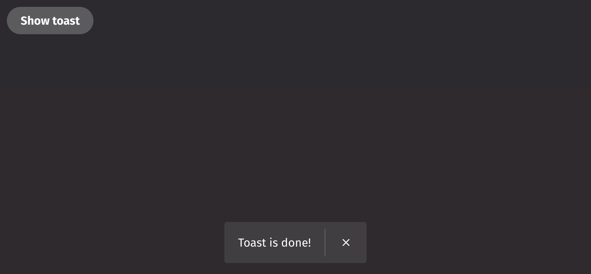

# Toast

Toasts display brief, temporary notifications of actions, errors, or other events in an application.

## Example

```python
from deephaven import ui

btn = ui.button(
    "Show toast",
    on_press=lambda: ui.toast("Toast is done!"),
    variant="primary",
)
```



## Content

Toasts are triggered using the method `ui.toast`. Toasts use `variant` to specify the following styles: `neutral`, `positive`, `negative`, and `info`. Toast will default to `neutral` if `variant` is omitted.

Toasts are shown according to the order they are added, with the most recent toast appearing at the bottom of the stack. Please use Toasts sparingly.

```python
from deephaven import ui

toasts = ui.button_group(
    ui.button(
        "Show neutral toast",
        on_press=lambda: ui.toast("Toast available", variant="neutral"),
        variant="secondary",
    ),
    ui.button(
        "Show positive toast",
        on_press=lambda: ui.toast("Toast is done!", variant="positive"),
        variant="primary",
    ),
    ui.button(
        "Show negative toast",
        on_press=lambda: ui.toast("Toast is burned!", variant="negative"),
        variant="negative",
    ),
    ui.button(
        "Show info toast",
        on_press=lambda: ui.toast("Toasting...", variant="info"),
        variant="accent",
        style="outline",
    ),
)
```

## Events

Toasts can include an optional action by specifying the `action_label` and `on_action` options when queueing a toast. In addition, the `on_close` event is triggered when the toast is dismissed. The `should_close_on_action` option automatically closes the toast when an action is performed.

```python
from deephaven import ui


btn = ui.button(
    "Show toast",
    on_press=lambda: ui.toast(
        "An update is available",
        action_label="Update",
        on_action=lambda: print("Updating!"),
        should_close_on_action=True,
        on_close=lambda: print("Closed"),
        variant="positive",
    ),
    variant="primary",
)
```

## Auto-dismiss

Toasts support a `timeout` option to automatically hide them after a certain amount of time. For accessibility, toasts have a minimum `timeout` of 5 seconds, and actionable toasts will not auto dismiss. In addition, timers will pause when the user focuses or hovers over a toast.

Be sure only to automatically dismiss toasts when the information is not important, or may be found elsewhere. Some users may require additional time to read a toast message, and screen zoom users may miss toasts entirely.

```python
from deephaven import ui


btn = ui.button(
    "Show toast",
    on_press=lambda: ui.toast("Toast is done!", timeout=5000, variant="positive"),
    variant="primary",
)
```

## Show toast on mount

This example shows how to display a toast when a component mounts.

```python
from deephaven import ui


@ui.component
def ui_toast_on_mount():
    ui.toast("Mounted.", variant="info")
    return ui.heading("Toast was shown on mount.")


my_mount_example = ui_toast_on_mount()
```

## Toast from table example

This example shows how to create a toast from the latest update of a ticking table. It is recommended to auto dismiss these toasts with a `timeout` and to avoid ticking faster than the value of the `timeout`. Note that the toast must be triggered on the render thread, whereas the table listener may be fired from another thread. Therefore you must use the render queue to trigger the toast.

```python order=my_toast_table,_source
from deephaven import time_table
from deephaven import ui

_source = time_table("PT5S").update("X = i").tail(5)


@ui.component
def toast_table(t):
    render_queue = ui.use_render_queue()

    def listener_function(update, is_replay):
        data_added = update.added()["X"][0]
        render_queue(lambda: ui.toast(f"added {data_added}", timeout=5000))

    ui.use_table_listener(t, listener_function, [])
    return t


my_toast_table = toast_table(_source)
```

# Multi threading example

This example shows how to use toast with multi threading.

```python
import threading
from deephaven import read_csv, ui


@ui.component
def csv_loader():
    # The render_queue we fetch using the `use_render_queue` hook at the top of the component.
    # The toast must be triggered from the render queue.
    render_queue = ui.use_render_queue()
    table, set_table = ui.use_state()
    error, set_error = ui.use_state()

    def handle_submit(data):
        # We define a callable that we'll queue up on our own thread
        def load_table():
            try:
                # Read the table from the URL
                t = read_csv(data["url"])

                # Define our state updates in another callable. We'll need to call this on the render thread
                def update_state():
                    set_error(None)
                    set_table(t)
                    ui.toast("Table loaded", variant="positive", timeout=5000)

                # Queue up the state update on the render thread
                render_queue(update_state)
            except Exception as e:
                # In case we have any errors, we should show the error to the user. We still need to call this from the render thread,
                # so we must assign the exception to a variable and call the render_queue with a callable that will set the error
                error_message = e

                def update_state():
                    set_table(None)
                    set_error(error_message)
                    ui.toast(
                        f"Unable to load table: {error_message}",
                        variant="negative",
                        timeout=5000,
                    )

                # Queue up the state update on the render thread
                render_queue(update_state)

        # Start our own thread loading the table
        threading.Thread(target=load_table).start()

    return [
        # Our form displaying input from the user
        ui.form(
            ui.flex(
                ui.text_field(
                    default_value="https://media.githubusercontent.com/media/deephaven/examples/main/DeNiro/csv/deniro.csv",
                    label="Enter URL",
                    label_position="side",
                    name="url",
                    flex_grow=1,
                ),
                ui.button(f"Load Table", type="submit"),
                gap=10,
            ),
            on_submit=handle_submit,
        ),
        (
            # Display a hint if the table is not loaded yet and we don't have an error
            ui.illustrated_message(
                ui.heading("Enter URL above"),
                ui.content("Enter a URL of a CSV above and click 'Load' to load it"),
            )
            if error is None and table is None
            else None
        ),
        # The loaded table. Doesn't show anything if it is not loaded yet
        table,
        # An error message if there is an error
        (
            ui.illustrated_message(
                ui.icon("vsWarning"),
                ui.heading("Error loading table"),
                ui.content(f"{error}"),
            )
            if error != None
            else None
        ),
    ]


my_loader = csv_loader()
```

## API Reference

```{eval-rst}
.. dhautofunction:: deephaven.ui.toast
```
