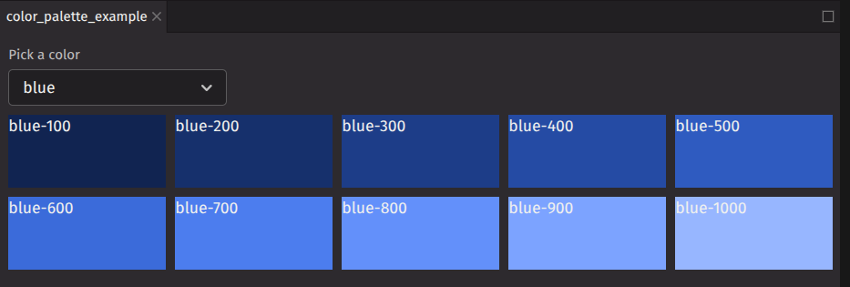
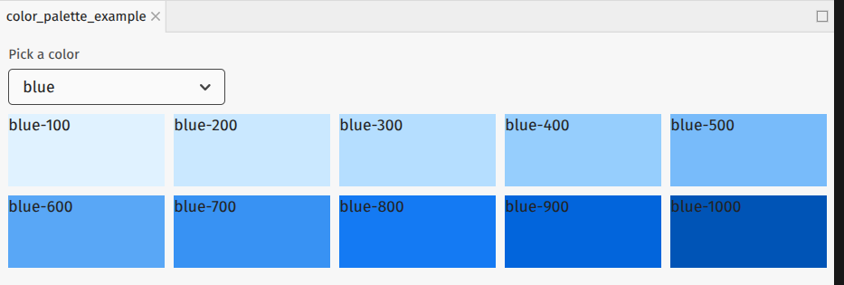
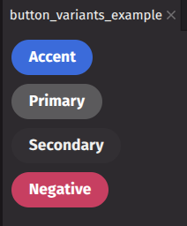
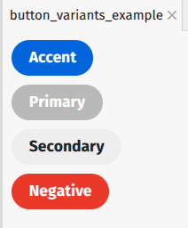
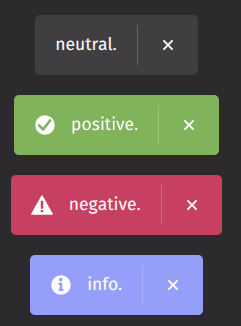
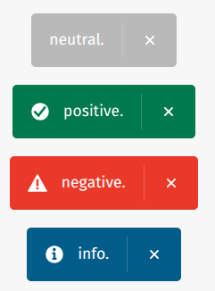
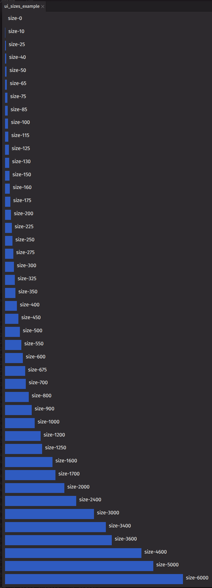

# Size and Theme

## Deephaven theme

The Deephaven Web IDE theme can be changed in the [settings menu](/enterprise/docs/interfaces/web/settings/#theme). The `Default Dark` and `Default Light` themes are provided, but you can also [create a custom theme](/core/docs/how-to-guides/custom-themes/).

## Color palette

`deephaven.ui` uses the same color convention as [Adobe Spectrum](https://spectrum.adobe.com/page/color-system/). A color is specified with a `name` and an `index` number. For example `blue-100` or `red-600`. In a dark theme, `blue-100` will be a dark blue and `blue-1000` will be a light blue. In a light theme, they will be reversed. The example component below displays a color palette for a selected color. Try changing the theme to see the difference in colors.

```python
from deephaven import ui


def generate_colors(color):
    colors = []
    for i in range(100, 1401, 100):
        colors.append(f"{color}-{i}")
    return colors


@ui.component
def color_palette():
    color, set_color = ui.use_state("blue")
    colors = ui.use_memo(lambda: generate_colors(color), [color])
    return [
        ui.picker(
            ui.item("red"),
            ui.item("orange"),
            ui.item("yellow"),
            ui.item("chartreuse"),
            ui.item("celery"),
            ui.item("green"),
            ui.item("seafoam"),
            ui.item("cyan"),
            ui.item("blue"),
            ui.item("indigo"),
            ui.item("purple"),
            ui.item("fuchsia"),
            ui.item("magenta"),
            selected_key=color,
            on_selection_change=set_color,
            label="Pick a color",
        ),
        ui.grid(
            [ui.view(ui.text(color), background_color=color) for color in colors],
            columns="repeat(5, 1fr)",
            auto_rows="size-800",
            justify_content="center",
            gap="size-100",
        ),
    ]


color_palette_example = color_palette()
```

**Dark theme palette**



**Light theme palette**



For a full list of colors, see the [Adobe Spectrum color values](https://react-spectrum.adobe.com/react-spectrum/styling.html#color-values).

## Semantic color

In addition to the color palette, `deephaven.ui` uses semantic colors which assign color based on meanings. This means that a `negative` UI element will have the same color throughout the UI rather than various elements having a different shade of red.

For example, the [button](../components/button.md) component uses `variant` to apply semantic color.

```python
from deephaven import ui


@ui.component
def button_variants():
    return [
        ui.button(
            "Accent",
            variant="accent",
        ),
        ui.button("Primary", variant="primary"),
        ui.button("Secondary", variant="secondary"),
        ui.button("Negative", variant="negative"),
    ]


button_variants_example = button_variants()
```

**Dark theme buttons**



**Light theme example**



In this example, the [toast](../components/toast.md) component uses `variant` to apply semantic color.

```python
from deephaven import ui

variants = ["neutral", "positive", "negative", "info"]

ui_toast_variants_example = ui.picker(
    [ui.item(option) for option in variants],
    on_selection_change=lambda variant: ui.toast(variant, variant=variant),
)
```

**Dark theme toast**



**Light theme toast**



## Size

`deephaven.ui` components will be sized automatically based on [layout](../creating-layouts/layout-overview.md). You can also specify the size using the sizing props:

- [`width`](https://developer.mozilla.org/en-US/docs/Web/CSS/width)
- [`height`](https://developer.mozilla.org/en-US/docs/Web/CSS/height)
- [`min_width`](https://developer.mozilla.org/en-US/docs/Web/CSS/min-width)
- [`min_height`](https://developer.mozilla.org/en-US/docs/Web/CSS/min-height)
- [`max_width`](https://developer.mozilla.org/en-US/docs/Web/CSS/max-width)
- [`max_height`](https://developer.mozilla.org/en-US/docs/Web/CSS/max-height)

These props accept normal [CSS values](https://developer.mozilla.org/en-US/docs/Learn_web_development/Core/Styling_basics/Values_and_units#numbers_lengths_and_percentages) like `100px`, `50%` or `20em`. Additionally, they use an [Adobe Spectrum dimension value](https://react-spectrum.adobe.com/react-spectrum/styling.html#dimension-values).

When absolute sizing is required, using dimension values help promote consistent sizing of your layout across components.

```python
from deephaven import ui

sizes = [
    "size-0",
    "size-10",
    "size-25",
    "size-40",
    "size-50",
    "size-65",
    "size-75",
    "size-85",
    "size-100",
    "size-115",
    "size-125",
    "size-130",
    "size-150",
    "size-160",
    "size-175",
    "size-200",
    "size-225",
    "size-250",
    "size-275",
    "size-300",
    "size-325",
    "size-350",
    "size-400",
    "size-450",
    "size-500",
    "size-550",
    "size-600",
    "size-675",
    "size-700",
    "size-800",
    "size-900",
    "size-1000",
    "size-1200",
    "size-1250",
    "size-1600",
    "size-1700",
    "size-2000",
    "size-2400",
    "size-3000",
    "size-3400",
    "size-3600",
    "size-4600",
    "size-5000",
    "size-6000",
]


@ui.component
def size_bar(size):
    return ui.flex(ui.view(background_color="blue-500", width=size), ui.text(size))


@ui.component
def ui_sizes():
    return [size_bar(size) for size in sizes]


ui_sizes_example = ui_sizes()
```


