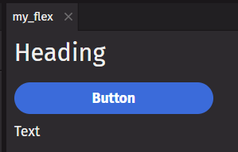

# Component Rules

This guide presents some important rules to remember for `deephaven.ui` components when writing queries.

## Children and props

Arguments passed to a component may be either `children` or `props`. `Children` are positional arguments passed to a `parent` component. `Props` are keyword arguments that determine the behavior and rendering style of the component. The `child` positional arguments must be passed first in the desired order. The `prop` keyword arguments can then be added in any order. Placing a `prop` before a `child` argument will cause the `child` to be out of order.

```python
from deephaven import ui

my_flex = ui.flex(
    ui.heading("Heading"),
    ui.button("Button"),
    ui.text("Text"),
    direction="column",
    wrap=True,
    width="200px",
)
```



In the above example, the `flex` component is the `parent`. It has three `children`: a `heading`, a `button`, and a `text` component. These `children` will be rendered inside the `flex`. It also has three props: `direction`, `wrap`, and `width`. These three props indicate that the flex should be rendered as a 200 pixel column with wrap enabled.

## Comparison with JSX

For developers familiar with React JSX, this example shows how `prop` and `child` arguments are specified in JSX.

```html
<MyComponent prop1="value1">Hello World</MyComponent>
```

Here is the same component written in `deephaven.ui`.

```python skip-test
my_component("Hello World", prop1="value1")
```

## Define your own children and props

To define `children` and `props` for a custom component, add them as arguments to the component function. As a convention, you may declare the children using the `*` symbol to take any number of arguments.

```python
from deephaven import ui


@ui.component
def custom_flex(*children, is_column):
    return ui.flex(
        ui.heading("My Component"),
        children,
        direction="column" if is_column else "row",
    )


my_custom_flex = custom_flex(ui.text("text"), ui.button("button"), is_column=True)
```


## Component return values

A `deephaven.ui` component usually returns a component. However, it may also return:

- a list or tuple of components.
- `None` if it should perform logic but does not need to be rendered.
- a single value like a `string` or `int`.

```python order=my_return_component,my_list_of_components,my_return_tuple,my_return_none,my_return_string,my_return_int
from deephaven import ui


@ui.component
def return_component():
    return ui.text("component")


@ui.component
def list_of_components():
    return [ui.text("list"), ui.text("of"), ui.text("components")]


@ui.component
def return_tuple():
    return (ui.text("a"), ui.text("b"))


@ui.component
def return_none():
    print("return none")
    return None


@ui.component
def return_string():
    return "string"


@ui.component
def return_int():
    return 1


my_return_component = return_component()
my_list_of_components = list_of_components()
my_return_tuple = return_tuple()
my_return_none = return_none()
my_return_string = return_string()
my_return_int = return_int()
```

## Conditional return

Return statements can be conditional in order to render different components based on inputs.

```python order=my_button,my_text
from deephaven import ui


@ui.component
def return_conditional(is_button):
    if is_button:
        return ui.button("button")
    return ui.text("text")


my_button = return_conditional(True)
my_text = return_conditional(False)
```
