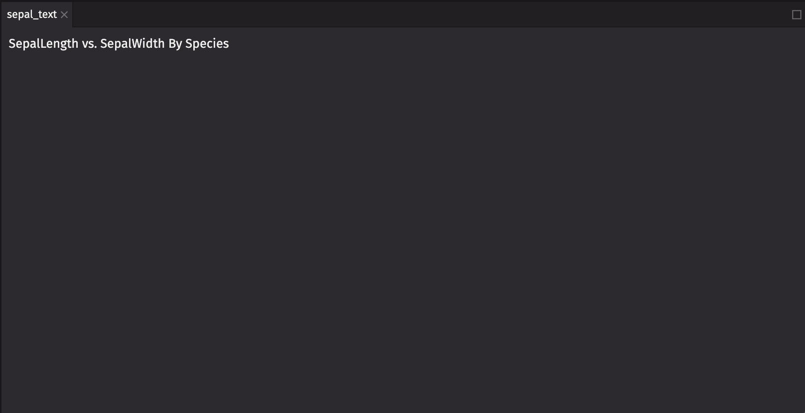
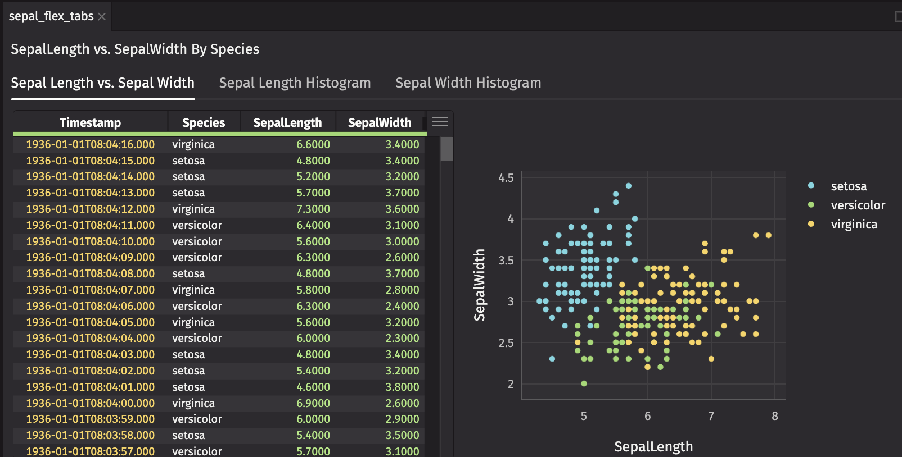
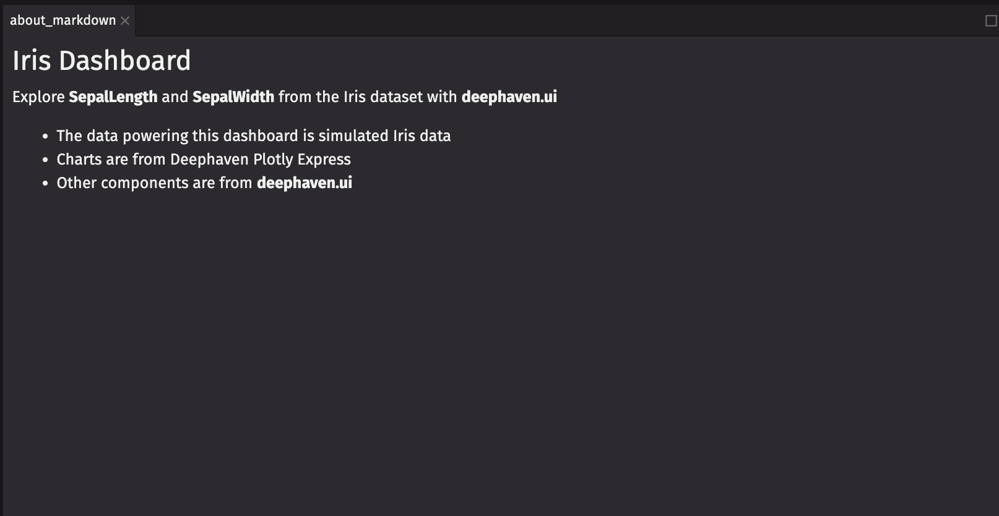
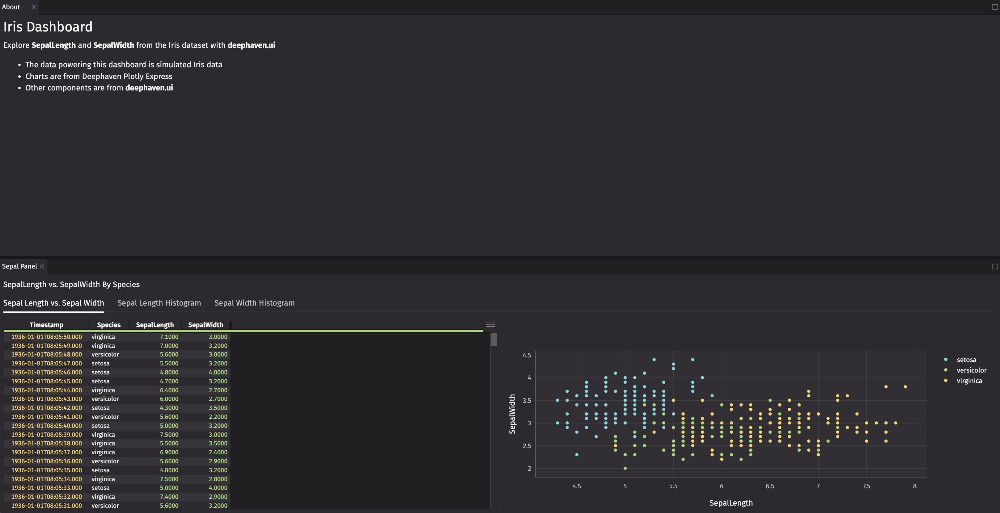
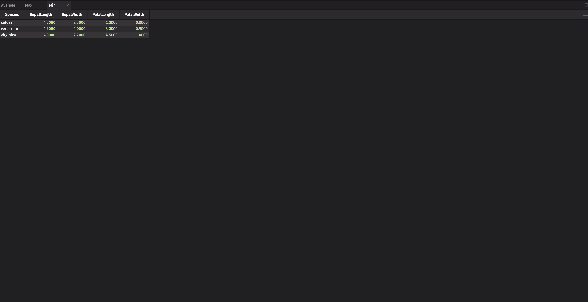
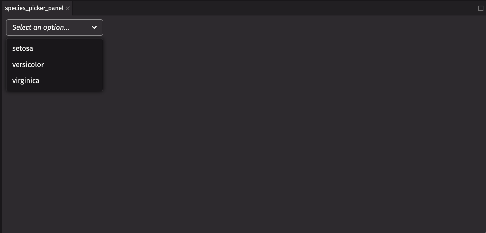
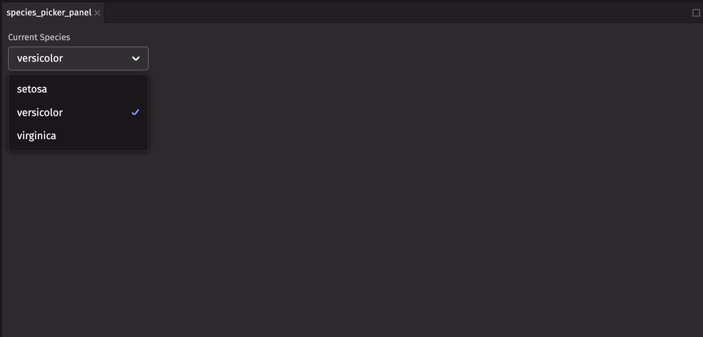
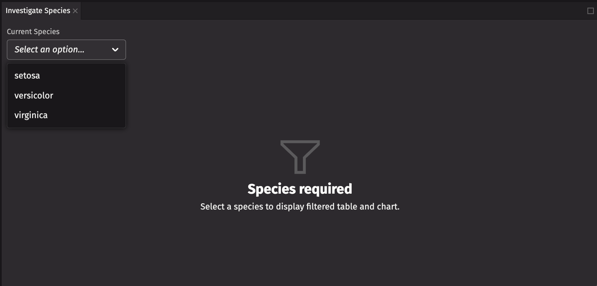

This guide shows you how to build a dashboard with `deephaven.ui`. [`deephaven.ui`](https://github.com/deephaven/deephaven-plugins/tree/main/plugins/ui) is Deephaven’s Python library to create user interfaces. You’ll use a wide range of components supported by the library to get you familiar with what `deephaven.ui` provides.

  
To follow along, you need the [`deephaven.ui`](https://pypi.org/project/deephaven-plugin-ui/) package.  
You also need simulated data and charts from [`deephaven.plot.express`](https://pypi.org/project/deephaven-plugin-ui/). Specifically, you’ll explore simualted `iris` data, which you create below.  
Both of these packages are included in the default setup.  
Import the data with this script:

```py
from deephaven import ui
import deephaven.plot.express as dx

iris = dx.data.iris()
```


## Basic Components

Components are the building blocks of `deephaven.ui`. Each component takes parameters that control how the component appears. By default, a component renders in a panel.

### `ui.table`

Wrapping a table in `ui.table` unlocks visual functionality on the table. With `iris`, create a `ui.table` that:

1. Reverses the order so that the newest rows are shown first
2. Pulls the `Species` column to the front along with `Timestamp`
3. Hides the `PetalLength`, `PetalWidth`, and `SpeciesID` columns
4. Uses the compact table density so you can see as many rows as possible

```py
ui_iris = ui.table(
  iris,
  reverse=True,
  front_columns=["Timestamp", "Species"],
  hidden_columns=["PetalLength", "PetalWidth", "SpeciesID"],
  density="compact"
)
```


### Charts

Charts from Deephaven Plotly Express (`dx`) have no `deephaven.ui` specific wrapping and are added directly. Create a scatter chart that plots `SepalLength` and `SepalWidth` by `Species`.

```py
scatter_by_species = dx.scatter(iris, x = "SepalLength", y = "SepalWidth", by="Species")
```


### `ui.text`

Basic text is added with the `ui.text` component.

```py
sepal_text = ui.text("SepalLength vs. SepalWidth By Species Panel")
```



### `ui.flex`

Wrap your chart and `ui.table` in a `ui.flex` component. `ui.flex` enables responsive layouts that adjust as you resize panels.

```py
sepal_flex = ui.flex(ui_iris, scatter_by_species)
```


The `direction` of `sepal_flex` is `"row"`. Add `sepal_text` and `sepal_flex` to another panel, with a `direction` of `"column"`.

```py
sepal_flex_column = ui.flex(sepal_text, sepal_flex, direction="column")
```


### Tabs

The `ui.tabs` component enables tabs within a panel. Create `ui.tab` elements for `sepal_flex`, `ui_iris`, and `scatter_by_species` then pass them to `ui.tabs` to allow you to switch between different views.

```py
sepal_tabs = ui.tabs(
    ui.tab(sepal_flex, title="Table and Chart"),
    ui.tab(ui_iris, title="Table Only"),
    ui.tab(scatter_by_species, title="Chart Only"),

)
sepal_flex_tabs = ui.flex(sepal_text, sepal_tabs, direction="column")
```



### Markdown

`ui.markdown` components allow you to provide text in a markdown format.

```py
about_markdown = ui.markdown(r"""
### Iris Dashboard

Explore the Iris dataset with `deephaven.ui`
- The data powering this dashboard is simulated Iris data
- Charts are from Deephaven Plotly Express
- Other components are from `deephaven.ui`
""")
```



Now you have two responsive panels with fundamental components of `deephaven.ui`.

## Dashboard

By default, components are rendered in a panel, but a dashboard enables more complex layouts in an isolated window. The dashboard is built up of individual panels.

<details>
<summary>Expand for code up to this point</summary>

```py skip-test
from deephaven import ui
import deephaven.plot.express as dx

iris = dx.data.iris()

ui_iris = ui.table(
    iris,
    reverse=True,
    front_columns=["Timestamp", "Species"],
    hidden_columns=["PetalLength", "PetalWidth", "SpeciesID"],
    density="compact",
)

scatter_by_species = dx.scatter(iris, x="SepalLength", y="SepalWidth", by="Species")

sepal_text = ui.text("SepalLength vs. SepalWidth By Species Panel")

sepal_flex = ui.flex(ui_iris, scatter_by_species)

sepal_flex_column = ui.flex(sepal_text, sepal_flex, direction="column")

sepal_tabs = ui.tabs(
    ui.tab(sepal_flex, title="Table and Chart"),
    ui.tab(ui_iris, title="Table Only"),
    ui.tab(scatter_by_species, title="Chart Only"),
)
sepal_flex_tabs = ui.flex(sepal_text, sepal_tabs, direction="column")

about_markdown = ui.markdown(r"""
### Iris Dashboard

Explore the Iris dataset with `deephaven.ui`

- The data powering this dashboard is simulated Iris data
- Charts are from Deephaven Plotly Express
- Other components are from `deephaven.ui`
  """)

sepal_panel = ui.panel(sepal_flex_tabs, title="Sepal Panel")
about_panel = ui.panel(about_markdown, title="About")
```

</details>

A dashboard is a collection of panels that you add to a layout. Start by create a dashboard with one panel with the `sepal_flex_tabs` component.
Before that, create a `ui.panel` manually to provide a `title`.

```py
sepal_panel = ui.panel(sepal_flex_tabs, title="Sepal Panel")
iris_dashboard = ui.dashboard(sepal_panel)
```


You now have a one panel dashboard.

With multiple panels, you can create a default layout. Create a panel for `about_markdown` so you can provide it a `title`.

```py
about_panel = ui.panel(about_markdown, title="About")
```


### Row

One way to create a default layout is by wrapping your panels in a `ui.row` component.

```py
iris_dashboard_row = ui.dashboard(ui.row(about_panel, sepal_panel))
```


### Column

Another way to create a default layout is with `ui.column`.

```py
iris_dashboard_column = ui.dashboard(ui.column(about_panel, sepal_panel))
```



### Stack

One more way to create a default layout is with `ui.stack`. The last panel is active by default.

```
iris_dashboard_stack = ui.dashboard(ui.stack(about_panel, sepal_panel))
```



## Interactivity

So far, you’ve worked with `deephaven.ui` components that don’t interact with each other. Now, you’ll create your own component with interactivity and embed it into your dashboard. The component allows you to pick options from `Species` and view a table and chart, filtered by that column.

### `ui.component`

A custom component uses the `ui.component` decorator. The decorator signals to the `deephaven.ui` rendering engine that this component needs to be rendered. Create a function with the `ui.component` decorator that returns `"Hello, World!"`.

```py
@ui.component
def custom_component():
  return "Hello, World!"

custom_panel = custom_component()
```


### Picker

Pickers allow you to select options from a list. Start by creating one.

```py
@ui.component
def species_panel():
  species_picker = ui.picker("setosa", "versicolor", "virginica")

  return species_picker

picker_panel = species_panel()
```


### Table-backed Picker

Pickers can pull directly from a table so they update automatically based on a column in the table. Modify your picker to pass in a table instead.

:::note

It’s important to filter your table down to the distinct values you want. The picker does not do this for you.

:::

```py
species_table = iris.view("Species").select_distinct()

@ui.component
def species_panel():
  species_picker = ui.picker(species_table)

  return species_picker

species_picker_panel = species_panel()
```



### `ui.use_state`

The `use_state` hook is how you’ll enable interactivity. The hook takes a starting value and returns a tuple of the current value and a function to set the value.
Next, modify your picker to take the `species` and `set_species` from the hook you just defined. For the `ui.picker` component, use `on_change` and `selected_key`. `on_change` is called whenever a picker option is selected. `selected_key` is the currently selected option. Using these makes the component controlled, meaning that the `selected_key` is controlled outside of the picker itself. This allows you to use the `selected_key` in other ways such as filtering a table.

```py
@ui.component
def species_panel():
  species, set_species = ui.use_state()
  species_picker = ui.picker(species_table, on_change=set_species, selected_key=species, label="Current Species")

  return species_picker

species_picker_panel = species_panel()
```



Now your picker is both controlled by the rendering engine and updates as you pick values and you have an up-to-date value from the table to filter on.

### Utilizing State

Add in a table filtered on this value and a chart that uses this filtered table and return them with the picker.

```py
@ui.component
def species_panel():
  species, set_species = ui.use_state()
  species_picker = ui.picker(
    species_table,
    on_change=set_species,
    selected_key=species,
    label="Current Species"
  )

  filtered_table = iris.where("Species = species")

  scatter_petal = dx.scatter(filtered_table, x = "PetalLength", y = "PetalWidth")

  species_flex = ui.flex(filtered_table, scatter_petal)

  return ui.panel(ui.flex(species_picker, species_flex, direction="column"), title="Investigate Species")

species_picker_panel = species_panel()
```


### `ui.illustrated_message`

Currently, an empty table and chart appears if no species is selected. Add a `ui.illustrated_message` component to display instead if no `species` is selected.

```py
@ui.component
def species_panel():
  species, set_species = ui.use_state()
  species_picker = ui.picker(
    species_table,
    on_change=set_species,
    selected_key=species,
    label="Current Species"
  )

  species_flex = ui.illustrated_message(
      ui.icon("vsFilter"),
      ui.heading("Species required"),
      ui.content("Select a species to display filtered table and chart."),
      width="100%",
  )

  if species:
    filtered_table = iris.where("Species = species")

    scatter_petal = dx.scatter(filtered_table, x = "PetalLength", y = "PetalWidth")

    species_flex = ui.flex(filtered_table, scatter_petal)

  return ui.panel(ui.flex(species_picker, species_flex, direction="column"), title="Investigate Species")

species_picker_panel = species_panel()
```



### Utilizing Custom Components

Next, embed your custom component in your dashboard.

```py
iris_dashboard_species = ui.dashboard(ui.row(ui.column(about_panel, sepal_panel), species_picker_panel))
```


<details>
<summary>Expand for final code</summary>

```py skip-test
from deephaven import ui
import deephaven.plot.express as dx

iris = dx.data.iris()

ui_iris = ui.table(
  iris,
  reverse=True,
  front_columns=["Timestamp", "Species"],
  hidden_columns=["PetalLength", "PetalWidth", "SpeciesID"],
  density="compact"
)

scatter_by_species = dx.scatter(iris, x = "SepalLength", y = "SepalWidth", by="Species")

sepal_text = ui.text("SepalLength vs. SepalWidth By Species Panel")

sepal_flex = ui.flex(ui_iris, scatter_by_species)

sepal_flex_column = ui.flex(sepal_text, sepal_flex, direction="column")

sepal_tabs = ui.tabs(
  ui.tab(sepal_flex, title="Table and Chart"),
  ui.tab(ui_iris, title="Table Only"),
  ui.tab(scatter_by_species, title="Chart Only"),
)
sepal_flex_tabs = ui.flex(sepal_text, sepal_tabs, direction="column")

about_markdown = ui.markdown(r"""

### Iris Dashboard

Explore the Iris dataset with `deephaven.ui`

- The data powering this dashboard is simulated Iris data
- Charts are from Deephaven Plotly Express
- Other components are from `deephaven.ui`
  """)

sepal_panel = ui.panel(sepal_flex_tabs, title="Sepal Panel")
about_panel = ui.panel(about_markdown, title="About")

species_table = iris.view("Species").select_distinct()

@ui.component
def species_panel():
  species, set_species = ui.use_state()
  species_picker = ui.picker(
    species_table,
    on_change=set_species,
    selected_key=species,
    label="Current Species"
  )

  species_flex = ui.illustrated_message(
      ui.icon("vsFilter"),
      ui.heading("Species required"),
      ui.content("Select a species to display filtered table and chart."),
      width="100%",
  )

  if species:
    filtered_table = iris.where("Species = species")

    scatter_petal = dx.scatter(filtered_table, x = "PetalLength", y = "PetalWidth")

    species_flex = ui.flex(filtered_table, scatter_petal)

  return ui.panel(ui.flex(species_picker, species_flex, direction="column"), title="Investigate Species")

species_picker_panel = species_panel()

iris_dashboard_species = ui.dashboard(ui.row(ui.column(about_panel, sepal_panel), species_picker_panel))
```

</details>

Finally, you’ve completed this dashboard crash course, with your custom component and interactivity.

## Wrapping Up

This wraps up the `deephaven.ui` dashboard crash course. In this course you learned about the following components and concepts and created a dashboard with many of them

- [`ui.table`](https://github.com/deephaven/deephaven-plugins/blob/main/plugins/ui/docs/components/table.md)
- [Charts](https://github.com/deephaven/deephaven-plugins/tree/main/plugins/plotly-express/docs)
- [`ui.text`](https://github.com/deephaven/deephaven-plugins/blob/main/plugins/ui/docs/components/text.md)
- [`ui.flex`](https://github.com/deephaven/deephaven-plugins/blob/main/plugins/ui/docs/components/flex.md)
- [`ui.tabs`](https://github.com/deephaven/deephaven-plugins/blob/main/plugins/ui/docs/components/tabs.md)
- [`ui.markdown`](https://github.com/deephaven/deephaven-plugins/blob/main/plugins/ui/docs/components/markdown.md)
- [`ui.dashboard`](https://github.com/deephaven/deephaven-plugins/blob/main/plugins/ui/docs/components/dashboard.md)
- [`ui.row`](https://github.com/deephaven/deephaven-plugins/blob/main/plugins/ui/docs/components/dashboard.md)
- [`ui.column`](https://github.com/deephaven/deephaven-plugins/blob/main/plugins/ui/docs/components/dashboard.md)
- [`ui.stack`](https://github.com/deephaven/deephaven-plugins/blob/main/plugins/ui/docs/components/dashboard.md)
- [`ui.component`](https://github.com/deephaven/deephaven-plugins/blob/main/plugins/ui/docs/describing/your_first_component.md)
- [`ui.picker`](https://github.com/deephaven/deephaven-plugins/blob/main/plugins/ui/docs/components/picker.md)
- [`ui.use_state`](https://github.com/deephaven/deephaven-plugins/blob/main/plugins/ui/docs/hooks/use_state.md)
- [`ui.illustrated_message`](https://github.com/deephaven/deephaven-plugins/blob/main/plugins/ui/docs/components/illustrated_message.md)
- Component State
- Custom Components

This gets you started on the rich set of components `deephaven.ui` has to offer to create a dashboard.
