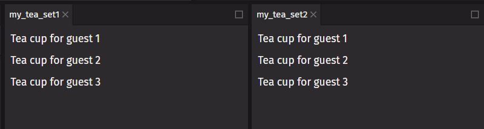
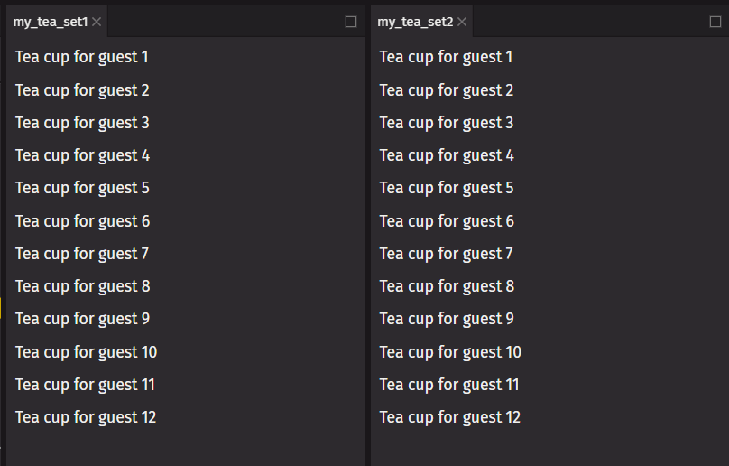

# Pure Components

A [pure function](https://en.wikipedia.org/wiki/Pure_function) returns the same value given the same arguments and has no side effects. By writing `deephaven.ui` components as pure functions, you can avoid bugs and unpredictable behavior.

## Unintentional side effects

The rendering process must always be pure. Component functions should always return the same value for the same arguments. They should not _change_ any objects or variables that existed before rendering. That would not be pure.

Here is a component that breaks this rule by reading and writing a `guest` variable declared outside of it:

```python order=my_tea_set1,my_tea_set2
from deephaven import ui

guest = [0]


@ui.component
def cup():
    # changing a preexisting variable
    guest[0] += 1
    return ui.text(f"Tea cup for guest {guest[0]}")


@ui.component
def tea_set():
    return ui.flex(cup(), cup(), cup(), direction="column")


my_tea_set1 = tea_set()
my_tea_set2 = tea_set()
```


Calling this component multiple times will produce different results. If other components read `guest`, they will produce different results, too, depending on when they are rendered. That is not predictable.

You can fix this component by passing `guest` as a prop instead:

```python order=my_tea_set1,my_tea_set2
from deephaven import ui


@ui.component
def cup(guest):
    return ui.text(f"Tea cup for guest {guest}")


@ui.component
def tea_set():
    return ui.flex(cup(guest=1), cup(guest=2), cup(guest=3), direction="column")


my_tea_set1 = tea_set()
my_tea_set2 = tea_set()
```



Now the component is pure. Its returns only depend on the `guest` prop.

In general, you should not expect components to be rendered in any particular order. Each component should only “think for itself”, and not attempt to coordinate with or depend upon others during rendering.

## Local mutations

Pure functions do not mutate variables outside of the function's scope or objects that were created before the function call. However, it is fine to change variables and objects created inside the function. In this example, the component creates a list and adds a dozen cups to it:

```python order=my_tea_set1,my_tea_set2
from deephaven import ui


@ui.component
def cup(guest):
    return ui.text(f"Tea cup for guest {guest}")


@ui.component
def tea_set():
    cups = []
    for i in range(1, 13):
        cups.append(cup(guest=i))
    return ui.flex(cups, direction="column")


my_tea_set1 = tea_set()
my_tea_set2 = tea_set()
```



If the `cups` variable was outside the `tea_set` function, this would be a problem. You would be changing a preexisting object by appending items to that list.

However, because you created them during the same render, no code outside of `tea_set` will be impacted by this. This is a local mutation.

## Intentional side effects

While the rendering process must remain pure, at some point, something needs to change. You may need to print a message, update the screen, start an animation, or change data. These changes are called side effects. They must happen on the side rather than during rendering.

In `deephaven.ui`, side effects usually belong in event handlers. Event handlers are functions that run when you perform some action like clicking a button. Even though the event handlers are defined inside your component, they do not run during rendering, so even handlers do not need to be pure.

```python
from deephaven import ui


@ui.component
def event_handler_example():
    # An event handler for a button
    def button_handler():
        print("button pressed")

    return ui.button("button", on_press=button_handler)


my_event_handler_example = event_handler_example()
```

If an event handler is not the correct place for a certain side effect, you can place it in a [`use_effect`](../hooks/use_effect.md) hook. This tells `deephaven.ui` to execute it later, after rendering, when side effects are allowed.
