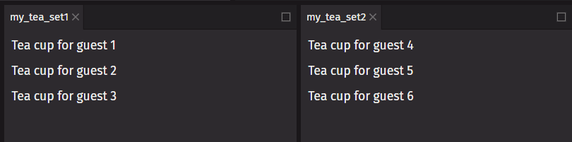

# Pure Components

A [pure function](https://en.wikipedia.org/wiki/Pure_function) returns the same value given the same arguments and has no side effects. By writing `deephaven.ui` components as pure functions, you can avoid bugs and unpredictable behavior.

## Side effects

The rendering process must always be pure. Component functions should always return the same value for the same arguments. They should not _change_ any objects or variables that existed before rendering. That would not be pure.

Here is a component that breaks this rule:

```python
from deephaven import ui

guest = [0]


@ui.component
def cup():
    # changing a preexisting variable
    guest[0] += 1
    return ui.text(f"Tea cup for guest {guest[0]}")


@ui.component
def tea_set():
    return ui.flex(cup(), cup(), cup(), direction="column")


my_tea_set1 = tea_set()
my_tea_set2 = tea_set()
```



This component is reading and writing a `guest` variable declared outside of it. This means that calling this component multiple times will produce different results. If other components read `guest`, they will produce different results, too, depending on when they are rendered. That is not predictable.

You can fix this component by passing `guest` as a prop instead:

```python
from deephaven import ui


@ui.component
def cup(guest):
    return ui.text(f"Tea cup for guest {guest}")


@ui.component
def tea_set():
    return ui.flex(cup(guest=1), cup(guest=2), cup(guest=3), direction="column")


my_tea_set1 = tea_set()
my_tea_set2 = tea_set()
```


