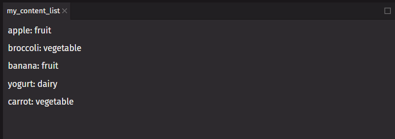
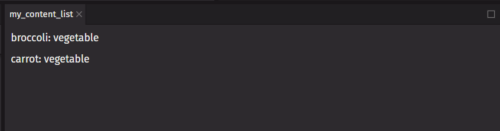

# Render Lists

You will often want to display multiple similar components from a collection of data. You can use the Python [`filter`](https://docs.python.org/3/library/functions.html#filter) function and [`list comprehensions`](https://docs.python.org/3/tutorial/datastructures.html#list-comprehensions) with `deephaven.ui` to filter and transform your list of data into a list of components.

## Render data from lists

Here is an example list of content:

```python
from deephaven import ui


@ui.component
def content_list():
    return ui.flex(
        ui.text("apple: fruit"),
        ui.text("broccoli: vegetable"),
        ui.text("banana: fruit"),
        ui.text("yogurt: dairy"),
        ui.text("carrot: vegetable"),
        direction="column",
    )


my_content_list = content_list()
```



The only difference among those list items is their contents (their data). You will often need to show several instances of the same component using different data when building interfaces. Here is a short example of how to generate a list of items from a list of data:

1. Move the data into a list
2. Use list comprehension to map the list of data to a list of components
3. Use the list of components in your component

```python
from deephaven import ui

food = [
    "apple: fruit",
    "broccoli: vegetable",
    "banana: fruit",
    "yogurt: dairy",
    "carrot: vegetable",
]


@ui.component
def content_list(data):
    # map the text items to components
    components = [ui.text(item) for item in data]
    return ui.flex(components, direction="column")


my_content_list = content_list(food)
```

## Filter lists of items

If you want a way to only show items of type vegetable, you can use the Python `filter` function to return just those items.

```python
from deephaven import ui

food = [
    "apple: fruit",
    "broccoli: vegetable",
    "banana: fruit",
    "yogurt: dairy",
    "carrot: vegetable",
]


@ui.component
def content_list(data, data_type):
    # filter for items that end with the desired data type
    filtered = list(filter(lambda item: item.endswith(data_type), data))
    # map the text items to components
    components = [ui.text(item) for item in filtered]
    return ui.flex(components, direction="column")


my_content_list = content_list(food, "vegetable")
```



## Keep list items in order with keys

Keys tell `deephaven.ui` which list item each component corresponds to so that it can match them up later. This becomes important if your list items can move (e.g., due to sorting), get inserted, or get deleted. A well-chosen key helps `deephaven.ui` infer exactly what happened and make the correct updates.

Rather than generating keys on the fly, you should include them in your data.

### Where to get your key

Different sources of data provide different sources of keys:

- Data from a database: If your data is coming from a database, you can use the database keys/IDs, which are unique by nature.
- Locally generated data: If your data is generated and persisted locally, use an incrementing counter or a package like `uuid` when creating items.

### Rules of keys

- Keys must be unique among siblings. However, it is okay to use the same keys for items in different lists.
- Keys must not change. Do not generate them while rendering.

In this example, the `ui_cells` component can add cell which can be deleted. The line `key=str(i)` is commented out, so the cell components do not have keys. If the user tries to delete a cell in the middle of the component, the last cell will be deleted instead. Comment in the line that sets the key. Now the correct cell will be deleted.

```python
from deephaven import ui
import itertools


@ui.component
def ui_cell(label="Cell"):
    text, set_text = ui.use_state("")
    return ui.text_field(label=label, value=text, on_change=set_text)


@ui.component
def ui_deletable_cell(i, delete_cell):
    return ui.flex(
        ui_cell(label=f"Cell {i}"),
        ui.action_button(
            ui.icon("vsTrash"),
            aria_label="Delete cell",
            on_press=lambda: delete_cell(i),
        ),
        align_items="end",
        # comment in this line to fix
        # key=str(i),
    )


@ui.component
def ui_cells():
    id_iter, set_id_iter = ui.use_state(lambda: itertools.count())
    cells, set_cells = ui.use_state(lambda: [next(id_iter)])

    def add_cell():
        set_cells(lambda old_cells: old_cells + [next(id_iter)])

    def delete_cell(delete_id: int):
        set_cells(lambda old_cells: [c for c in old_cells if c != delete_id])

    return ui.view(
        [ui_deletable_cell(i, delete_cell) for i in cells],
        ui.action_button(ui.icon("vsAdd"), "Add cell", on_press=add_cell),
        overflow="auto",
    )


cells = ui_cells()
```
