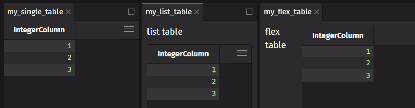
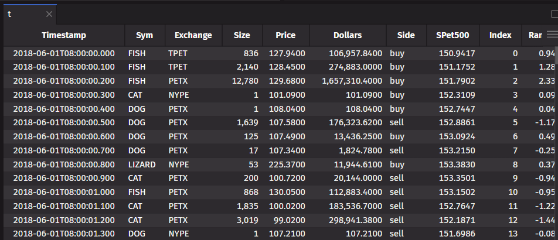

# Work with Tables

The Deephaven table is the key abstraction that unites static and real-time data for a seamless, integrated experience. Combining tables with `deephaven.ui` components allows you to create your own powerful, data centered workflows.

For more information about tables, see [Working with Deephaven Tables](/core/docs/getting-started/quickstart/#4-working-with-deephaven-tables)

## Display a table in a component

You can display a Deephaven table in a component by doing one of the following:

- return a table directly from a component
- return a table as part of a `list` or `tuple`
- add a table to a container such as a `flex` or `panel`
- [use ui.table](#Use-ui.table)

```python
from deephaven import new_table, ui
from deephaven.column import int_col

# Prepend name with an underscore to avoid displaying the source table
_source = new_table([int_col("IntegerColumn", [1, 2, 3])])


@ui.component
def single_table(t):
    ui.use_effect(lambda: print("displaying table"), [])
    return t


@ui.component
def list_table(t):
    return [ui.text("list table"), t]


@ui.component
def flex_table(t):
    return ui.flex(ui.text("flex table"), t)


my_single_table = single_table(_source)
my_list_table = list_table(_source)
my_flex_table = flex_table(_source)
```



## Use ui.table

`ui.table` is a wrapper for Deephaven tables that allow you to change how the table is displayed in the UI and handle user events. Here is an example of how to add custom color formatting.

```py
from deephaven import ui
import deephaven.plot.express as dx

_stocks_table = dx.data.stocks()

t = ui.table(
    _stocks_table,
    format_=[
        ui.TableFormat(color="fg"),
        ui.TableFormat(cols="Sym", color="white"),
    ],
)
```



For more examples and detailed information, see [ui.table](../components/table.md)

## Memoize table operations

If you are working with a table, memoize the table operation. This will store the result in a memoized value and prevent the table from being re-computed on every render. This can be done with the [use_memo](../hooks/use_memo.md) hook.

```python
from deephaven import time_table, ui
from deephaven.table import Table


theme_options = ["accent-200", "red-200", "green-200"]


@ui.component
def ui_memo_table_app():
    n, set_n = ui.use_state(1)
    theme, set_theme = ui.use_state(theme_options[0])

    # ✅ Memoize the table operation, only recompute when the dependency `n` changes
    result_table = ui.use_memo(
        lambda: time_table("PT1s").update(f"x=i*{n}").reverse(), [n]
    )

    return ui.view(
        ui.flex(
            ui.picker(
                *theme_options, label="Theme", selected_key=theme, on_change=set_theme
            ),
            ui.slider(value=n, min_value=1, max_value=999, on_change=set_n, label="n"),
            result_table,
            direction="column",
            height="100%",
        ),
        background_color=theme,
        align_self="stretch",
        flex_grow=1,
    )


memo_table_app = ui_memo_table_app()
```

## Hooks for tables

The [use_table_data](../hooks/use_table_data.md) hook lets you use the data of a table. This is useful when you want to listen to an updating table and use the data in your component.

```python
from deephaven import time_table, ui


@ui.component
def ui_table_data(table):
    table_data = ui.use_table_data(table)
    return ui.heading(f"The table data is {table_data}")


table_data = ui_table_data(time_table("PT1s").update("x=i").tail(5))
```

The [use_cell_data](../hooks/use_cell_data.md) hook lets you use the cell data of the first cell (first row in the first column) in a table. This is useful when you want to listen to an updating table and use the data in your component.

```python
from deephaven import time_table, ui


@ui.component
def ui_table_first_cell(table):
    cell_value = ui.use_cell_data(table)
    return ui.heading(f"The first cell value is {cell_value}")


table_first_cell = ui_table_first_cell(time_table("PT1s").tail(1))
```
