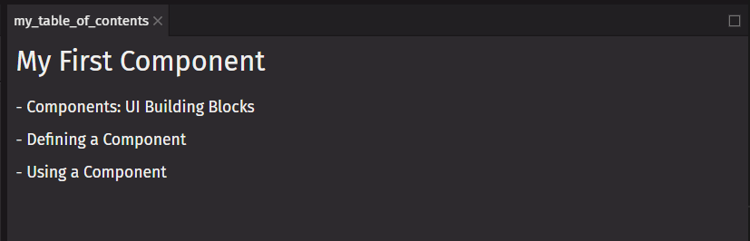
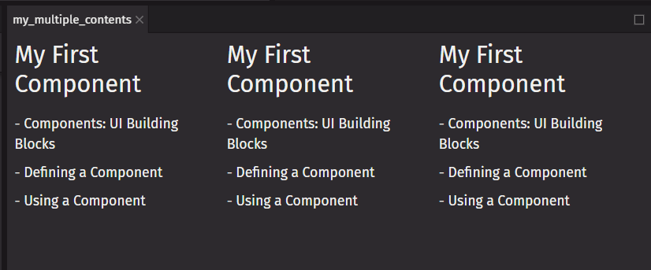

# Your First Component

`Components` are one of the core concepts of `deephaven.ui`. They are the foundation upon which you build user interfaces (UI).

## Components: UI building blocks

On the Web, HTML lets us create rich structured documents with its built-in set of tags like `<h1>` and `<li>`:

```html
<div>
  <h1>My First Component</h1>
  <ol>
    <li>Components: UI Building Blocks</li>
    <li>Defining a Component</li>
    <li>Defining a Component</li>
  </ol>
</div>
```

This markup represents an article `<div>`, its heading `<h1>`, and an (abbreviated) table of contents as an ordered list `<ol>`. Markup like this, combined with CSS for style, and JavaScript for interactivity, lies behind every sidebar, avatar, modal, dropdown—every piece of UI you see on the Web.

`deephaven.ui` lets you use Python code to write custom "components", reusable UI elements for your app. The table of contents code you saw above could be turned into a `table_of_contents` component you could render in the UI.

As your project grows, you will notice that many of your designs can be composed by reusing components you already wrote, speeding up your development.

## Defining a component

A `deephaven.ui` component is a Python function annotated with `@ui.component`. Here is what it looks like:

```python
from deephaven import ui


@ui.component
def table_of_contents():
    return ui.flex(
        ui.heading("My First Component"),
        ui.text("- Components: UI Building Blocks"),
        ui.text("- Defining a Component"),
        ui.text("- Using a Component"),
        direction="column",
    )


my_table_of_contents = table_of_contents()
```



And here’s how to build a component:

### Step 1: Import deephaven.ui

Your Python code must include this import:

```python
from deephaven import ui
```

This allows you to access the `@ui.component` annotation and all of the `deephaven.ui` components which you will use to build your component.

### Step 2: Define the function

With `def table_of_contents():` you define a Python function with the name `table_of_contents`. It must have the `@ui.component` annotation.

### Step 3: Add deephaven.ui components

The component returns a `ui.flex` component with child components `ui.heading` and `ui.text`.

## Using a component

Now that you’ve defined your `table_of_contents` component, you can nest it inside other components. You can export a `multiple_contents` component that uses multiple `table_of_contents` components:

```python
from deephaven import ui


@ui.component
def table_of_contents():
    return ui.flex(
        ui.heading("My First Component"),
        ui.text("- Components: UI Building Blocks"),
        ui.text("- Defining a Component"),
        ui.text("- Using a Component"),
        direction="column",
    )


@ui.component
def multiple_contents():
    return ui.flex(
        table_of_contents(),
        table_of_contents(),
        table_of_contents(),
    )


my_multiple_contents = multiple_contents()
```



## Nesting and organizing components

Components are regular Python functions, so you can keep multiple components in the same file. This is convenient when components are relatively small or tightly related to each other. If this file gets crowded, you can always move a component to a separate file. See [How do I import one Python script into another in the Deephaven IDE?](/core/docs/reference/community-questions/import-python-script) and [Modularizing Queries](/enterprise/docs/query-management/modularizing-queries-python/).

Because the `table_of_contents` components are rendered inside `multiple_contents` we can say that `multiple_contents` is a parent component, rendering each `table_of_contents` as a "child". You can define a component once, and then use it in as many places and as many times as you like.
