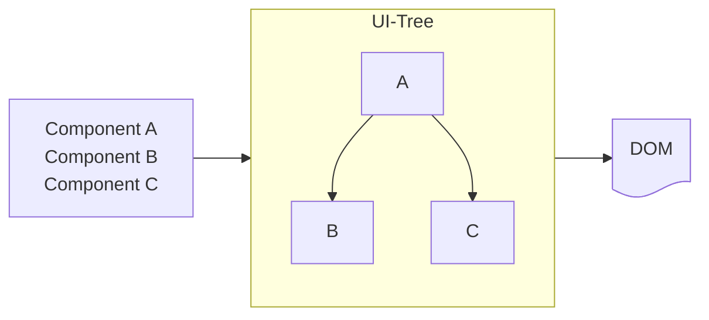

# Your UI as a Tree

Your `deephaven.ui` query is taking shape with many components being nested within each other. How does `deephaven.ui` keep track of your query's component structure?

`deephaven.ui`, and many other UI libraries, model UI as a tree. Thinking of your app as a tree is useful for understanding the relationship between components. This understanding will help you debug future concepts like performance and state management.

## UI as a tree

Trees are a relationship model between items and UI is often represented using tree structures. For example, browsers use tree structures to model HTML (DOM) and CSS (CSSOM). Mobile platforms also use trees to represent their view hierarchy.

Like browsers and mobile platforms, `deephaven.ui` also uses tree structures to manage and model the relationship between components in a `deephaven.ui` query. These trees are useful tools to understand how data flows through a `deephaven.ui` query and how to optimize rendering.

## The render tree

## The module dependency tree
