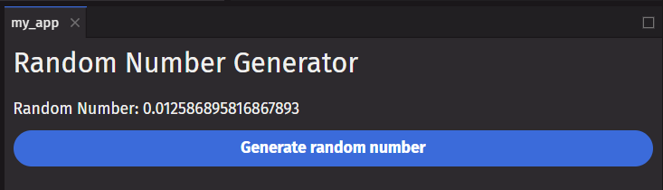
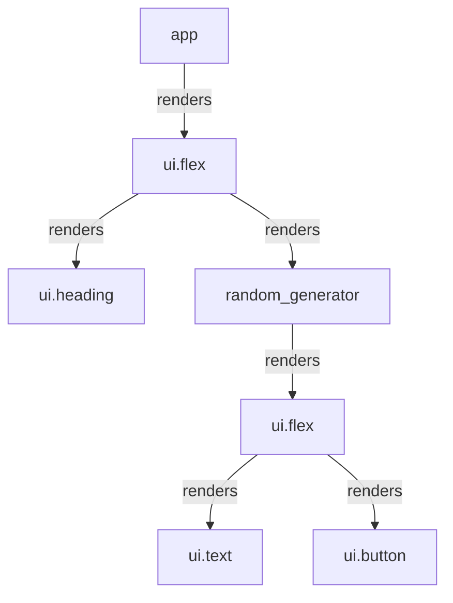
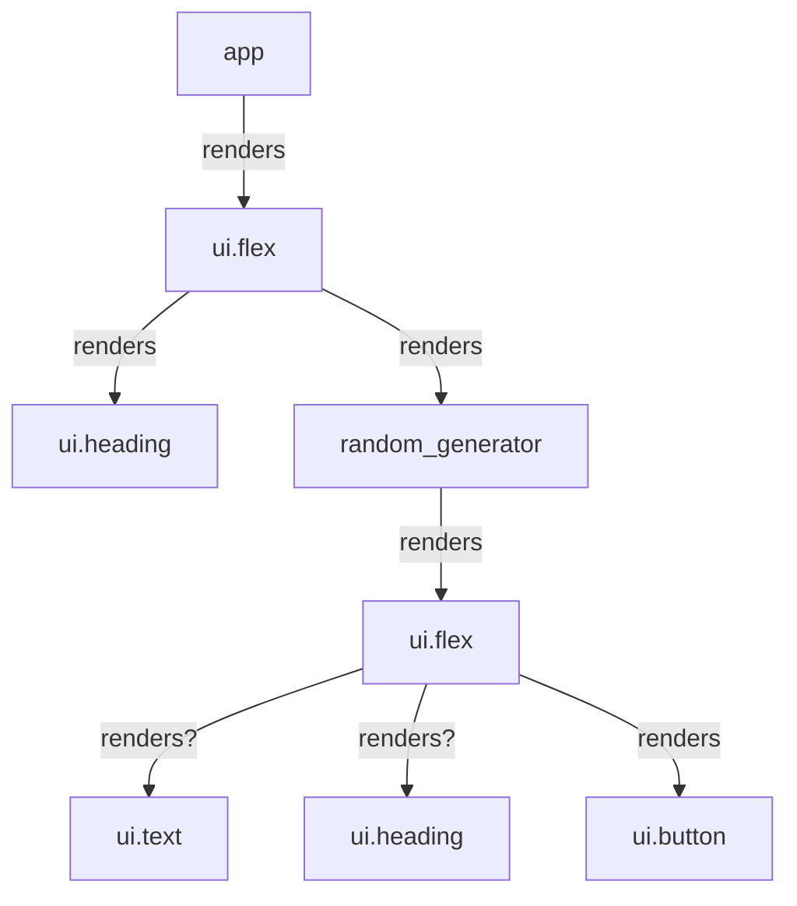

# Your UI as a Tree

Your `deephaven.ui` query is taking shape with many components being nested within each other. How does `deephaven.ui` keep track of your query's component structure?

`deephaven.ui`, and many other UI libraries, model UI as a tree. Thinking of your app as a tree is useful for understanding the relationship between components. This understanding will help you debug future concepts like performance and state management.

## UI as a tree

Trees are a relationship model between items and UI is often represented using tree structures. For example, browsers use tree structures to model HTML (DOM) and CSS (CSSOM). Mobile platforms also use trees to represent their view hierarchy.


Like browsers and mobile platforms, `deephaven.ui` also uses tree structures to manage and model the relationship between components in a `deephaven.ui` query. These trees are useful tools to understand how data flows through a `deephaven.ui` query and how to optimize rendering.

## The render tree

A major feature of components is the ability to compose components of other components. As we nest components, we have the concept of parent and child components, where each parent component may itself be a child of another component.

When we render a `deephaven.ui` app, we can model this relationship in a tree, known as the render tree.

Here is a `deephaven.ui` app that renders random numbers.

```python
from deephaven import ui
import random


@ui.component
def random_generator():
    num, set_num = ui.use_state()

    def generate():
        set_num(random.random())

    return ui.flex(
        ui.text(f"Random Number: {num}"),
        ui.button("Generate random number", on_press=generate),
        direction="column",
    )


@ui.component
def app():
    return ui.flex(
        ui.heading("Random Number Generator"),
        random_generator(),
        direction="column",
    )


my_app = app()
```





From the example app, we can construct the above render tree. Each arrow in the tree points from a parent component to a child component.

A render tree represents a single render pass of a `deephaven.ui` component. With conditional rendering, a parent component may render different children depending on the data passed.

We can update the app to conditionally render either a `ui.text` or a `ui.heading`.

```python
from deephaven import ui
import random


@ui.component
def random_generator():
    num, set_num = ui.use_state()
    flag, set_flag = ui.use_boolean()

    def generate():
        set_flag.toggle()
        set_num(random.random())

    return ui.flex(
        ui.text(f"Random text: {num}")
        if flag
        else ui.heading(f"Random heading: {num}"),
        ui.button("Generate random number", on_press=generate),
        direction="column",
    )


@ui.component
def app():
    return ui.flex(
        ui.heading("Random Number Generator"),
        random_generator(),
        direction="column",
    )


my_app = app()
```



In this example, depending on the `flag` , we may render `ui.text` or `ui.heading`. The render tree may be different for each render pass.

Although render trees may differ across render passes, these trees are generally helpful for identifying what the top-level and leaf components are in a `deephaven.ui` component. Top-level components are the components nearest to the root component and affect the rendering performance of all the components beneath them and often contain the most complexity. Leaf components are near the bottom of the tree and have no child components and are often frequently re-rendered.

Identifying these categories of components are useful for understanding data flow and performance of your component.

## The module dependency tree
