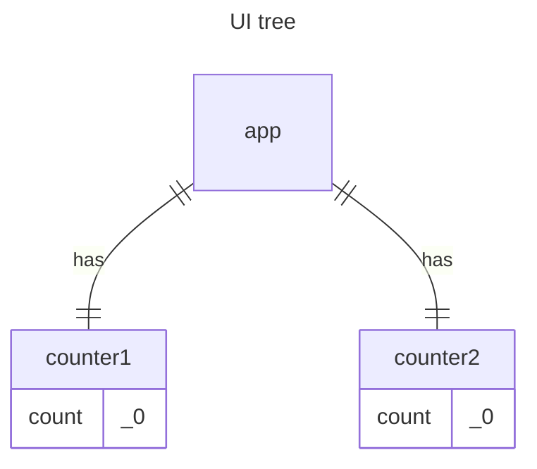
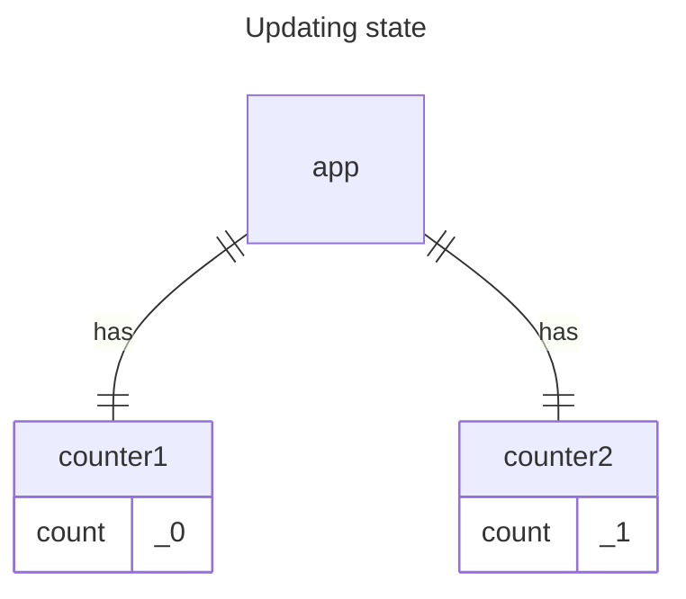

# Preserving and Resetting State

State is isolated between components. `deephaven.ui` manages state based on the component's position in the UI tree. You can decide when to preserve or reset state between re-renders.

## State is tied to a position in the render tree

`deephaven.ui` constructs render trees for the component structure in your UI.

When you assign state to a component, it might seem like the state resides within the component. However, the state is actually managed by `deephaven.ui`. `deephaven.ui` links each piece of state it manages to the appropriate component based on the component's position in the render tree.

In this example, a `counter` component is rendered in two different locations:

```python
from deephaven import ui


@ui.component
def counter():
    score, set_score = ui.use_state(0)

    return [
        ui.heading(f"{score}"),
        ui.button("Add one", on_press=lambda: set_score(score + 1)),
    ]


@ui.component
def app():
    return [counter(), ui.divider(), counter()]


counter_example = app()
```

Here is how these look as a tree:



Each counter is rendered at its own position in the tree, making them separate. While you don't usually need to consider these positions when using `deephaven.ui`, understanding this can be beneficial.

In `deephaven.ui`, every component on the screen maintains its own isolated state. For instance, rendering two `counter` components side by side will result in each having its own independent score state.

Try clicking both counters and observe that they operate independently. As you can see, when one `counter` is updated, only the state for that component is updated:



`deephaven.ui` maintains the state as long as you render the same component at the same position in the tree. To observe this, increment both counters, then remove the second component by unchecking the “Render the second counter” checkbox, and add it back by checking it again:

```python
from deephaven import ui


@ui.component
def counter():
    score, set_score = ui.use_state(0)

    return [
        ui.heading(f"{score}"),
        ui.button("Add one", on_press=lambda: set_score(score + 1)),
    ]


@ui.component
def app():
    show_second, set_show_second = ui.use_state(True)
    return [
        counter(),
        ui.divider(),
        counter() if show_second else None,
        ui.checkbox(
            "Render the second counter",
            is_selected=show_second,
            on_change=set_show_second,
        ),
    ]


counter_example = app()
```

Notice how the moment you stop rendering the second counter, its state disappears completely. That is because when `deephaven.ui` removes a component, it destroys its state. When you tick “Render the second counter”, a second `counter` and its state are initialized from scratch (`score = 0`) and added to the DOM.

`deephaven.ui` maintains a component's state as long as it remains rendered in the same position within the UI tree. If the component is removed or replaced by a different component at the same position, `deephaven.ui` will discard its state.

## Same component at the same position preserves state
