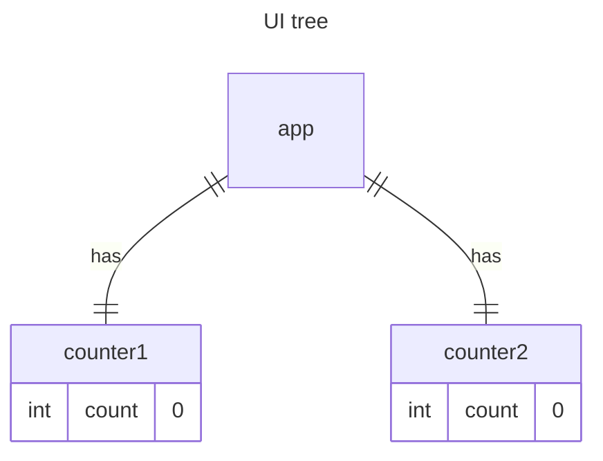
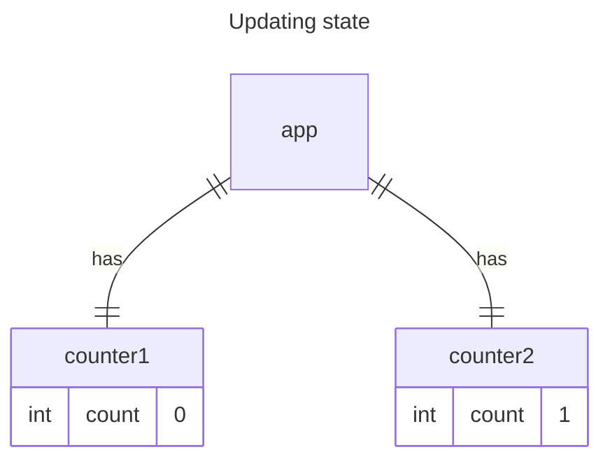

# Preserving and Resetting State

State is isolated between components. `deephaven.ui` manages state based on the component's position in the UI tree. You can decide when to preserve or reset state between re-renders.

## State is tied to a position in the render tree

`deephaven.ui` constructs render trees for the component structure in your UI.

When you assign state to a component, it might seem like the state resides within the component. However, the state is actually managed by `deephaven.ui`. `deephaven.ui` links each piece of state it manages to the appropriate component based on the component's position in the render tree.

In this example, a `counter` component is rendered in two different locations:

```python
from deephaven import ui


@ui.component
def counter():
    score, set_score = ui.use_state(0)

    return [
        ui.heading(f"{score}"),
        ui.button("Add one", on_press=lambda: set_score(score + 1)),
    ]


@ui.component
def app():
    return [counter(), ui.divider(), counter()]


counter_example = app()
```

Here is how these look as a tree:



Each counter is rendered at its own position in the tree, making them separate. While you don't usually need to consider these positions when using `deephaven.ui`, understanding this can be beneficial.

In `deephaven.ui`, every component on the screen maintains its own isolated state. For instance, rendering two `counter` components side by side will result in each having its own independent score state.

Try clicking both counters and observe that they operate independently. As you can see, when one `counter` is updated, only the state for that component is updated:



`deephaven.ui` maintains the state as long as you render the same component at the same position in the tree. To observe this, increment both counters, then remove the second component by unchecking the “Render the second counter” checkbox, and add it back by checking it again:

```python
from deephaven import ui


@ui.component
def counter():
    score, set_score = ui.use_state(0)

    return [
        ui.heading(f"{score}"),
        ui.button("Add one", on_press=lambda: set_score(score + 1)),
    ]


@ui.component
def app():
    show_second, set_show_second = ui.use_state(True)
    return [
        counter(),
        ui.divider(),
        counter() if show_second else None,
        ui.checkbox(
            "Render the second counter",
            is_selected=show_second,
            on_change=set_show_second,
        ),
    ]


counter_example = app()
```

Notice how the moment you stop rendering the second counter, its state disappears completely. That is because when `deephaven.ui` removes a component, it destroys its state. When you tick “Render the second counter”, a second `counter` and its state are initialized from scratch (`score = 0`) and added to the DOM.

`deephaven.ui` maintains a component's state as long as it remains rendered in the same position within the UI tree. If the component is removed or replaced by a different component at the same position, `deephaven.ui` will discard its state.

## Same component at the same position preserves state

In this example, there are two different calls to `counter`:

```python
from deephaven import ui


@ui.component
def counter(is_fancy):
    score, set_score = ui.use_state(0)

    return [
        ui.heading(f"{score}", level=1 if is_fancy else 3),
        ui.button(
            "Add one",
            on_press=lambda: set_score(score + 1),
            variant="accent" if is_fancy else "primary",
        ),
    ]


@ui.component
def app():
    is_fancy, set_is_fancy = ui.use_state()
    return [
        counter(True) if is_fancy else counter(False),
        ui.checkbox("Fancy", is_selected=is_fancy, on_change=set_is_fancy),
    ]


counter_example = app()
```

Toggling the checkbox does not reset the `counter` state. Regardless of whether `is_fancy` is true or false, the `counter` component always remains the first child returned by the root `app` component. It is the same component at the same position, so from the `deephaven.ui` perspective, it’s the same `counter`.

## Different components at the same position reset state

In this example, checking the checkbox will replace the `counter` with a `ui.text`:

```python
from deephaven import ui


@ui.component
def counter():
    score, set_score = ui.use_state(0)

    return [
        ui.heading(f"{score}"),
        ui.button("Add one", on_press=lambda: set_score(score + 1)),
    ]


@ui.component
def app():
    hide, set_hide = ui.use_state(False)
    return [
        ui.text("Counter hidden") if hide else counter(),
        ui.checkbox(
            "hide counter",
            is_selected=hide,
            on_change=set_hide,
        ),
    ]


counter_example = app()
```

In this example, you alternate between different component types at the same location. Initially, the first child of the `app` was a `counter`. However, when you replaced it with a `ui.text` component, `deephaven.ui` removed the `counter` from the UI tree and discarded its state.

Rendering a different component in the same position resets the state of its entire subtree. To observe this, increment the counter and then tick the checkbox:

```python
from deephaven import ui


@ui.component
def counter(is_fancy):
    score, set_score = ui.use_state(0)

    return [
        ui.heading(f"{score}", level=1 if is_fancy else 3),
        ui.button(
            "Add one",
            on_press=lambda: set_score(score + 1),
            variant="accent" if is_fancy else "primary",
        ),
    ]


@ui.component
def app():
    is_fancy, set_is_fancy = ui.use_state()
    return [
        ui.grid(counter(True))
        if is_fancy
        else ui.flex(counter(False), direction="column"),
        ui.checkbox("Fancy", is_selected=is_fancy, on_change=set_is_fancy),
    ]


counter_example2 = app()
```

Clicking the checkbox resets the counter state. Although a `counter` is rendered, the first child of the `app` changes from a `flex` to a `grid`. When the child `flex` is removed from the DOM, the entire tree below it (including the `counter` and its state) is destroyed.

To maintain state between re-renders, ensure that the structure of your component tree remains consistent. `deephaven.ui` will destroy the state if the structure changes, as it removes the component from the tree.

## Resetting state at the same position

By default, `deephaven.ui` maintains the state of a component as long as it remains in the same position. This default behavior is usually desirable. However, there are cases where you might want to reset a component’s state. For example, consider an app that allows two players to track their scores during each turn:

```python
from deephaven import ui


@ui.component
def counter(person):
    score, set_score = ui.use_state(0)

    return [
        ui.heading(f"{person}'s score: {score}"),
        ui.button("Add one", on_press=lambda: set_score(score + 1)),
    ]


@ui.component
def scoreboard():
    is_player1, set_is_player1 = ui.use_boolean(True)
    return [
        counter("John") if is_player1 else counter("Jill"),
        ui.divider(),
        ui.action_button("Change player", on_press=set_is_player1.toggle),
    ]


scoreboard_example = scoreboard()
```

When switching players, the score remains unchanged because `deephaven.ui` treats the two `counters` as the same component with a different `person` prop.

However, in this app, they should be treated as separate counters. Although they occupy the same UI position, one `counter` is for John and the other is for Jill.

To reset the state when switching between them, you can:

1. Render components in different positions.
2. Assign each component a unique identity using the `key` prop.

### Option 1: Rendering a component in different positions

If you want these two `counters` to be independent, you can render them in two different positions:

```python
from deephaven import ui


@ui.component
def counter(person):
    score, set_score = ui.use_state(0)

    return [
        ui.heading(f"{person}'s score: {score}"),
        ui.button("Add one", on_press=lambda: set_score(score + 1)),
    ]


@ui.component
def scoreboard():
    is_player1, set_is_player1 = ui.use_boolean(True)
    return [
        counter("John") if is_player1 else None,
        counter("Jill") if not is_player1 else None,
        ui.divider(),
        ui.action_button("Change player", on_press=set_is_player1.toggle),
    ]


scoreboard_example = scoreboard()
```

Initially, `is_player1` is `True`, so the first position contains a `counter` component, while the second one is empty.

When you click the "Change player" button, the first position clears, and the second one now contains a `counter`.

Each `counter` component's state is destroyed each time it is removed from the DOM. This is why they reset every time you click the button.

This solution is convenient when you only have a few independent components rendered in the same place. In this example, you only have two, so it’s not a hassle to render both separately.

### Option 2: Resetting state with a key

There is another, more general, method to reset a component’s state.

You might have encountered keys when [rendering lists](../describing/render_lists.md). However, keys are not limited to lists. They can be used to help `deephaven.ui` differentiate between any components. By default, `deephaven.ui` uses the order within the parent (e.g., “first counter”, “second counter”) to distinguish between components. However, keys allow you to specify that this is not just any counter but a specific one, such as John's counter. This way, `deephaven.ui` can identify John's counter wherever it appears in the component tree.

In the following example, the two `counter` components do not share state, even though they are rendered in the same location:

```python
from deephaven import ui


@ui.component
def counter(person):
    score, set_score = ui.use_state(0)

    return [
        ui.heading(f"{person}'s score: {score}"),
        ui.button("Add one", on_press=lambda: set_score(score + 1)),
    ]


@ui.component
def scoreboard():
    is_player1, set_is_player1 = ui.use_boolean(True)
    return [
        counter("John", key="John") if is_player1 else counter("Jill", key="Jill"),
        ui.divider(),
        ui.action_button("Change player", on_press=set_is_player1.toggle),
    ]


scoreboard_example = scoreboard()
```

Switching between John and Jill does not preserve the state. This is because they have different keys:

```python
counter("John", key="John") if is_player1 else counter("Jill", key="Jill")
```

When you specify a key in `deephaven.ui`, it uses the key to determine the component's position rather than its order within the parent. This means that even if you render components in the same place, `deephaven.ui` treats them as distinct entities, so they do not share state. Each time a `counter` is displayed, its state is initialized, and each time it is removed, its state is destroyed. Consequently, toggling between counters resets their state repeatedly.

### Resetting a form with a key

Resetting state with a key is especially helpful when managing forms.

In this chat application, the `chat` component holds the text input state:

```python
from deephaven import ui


@ui.component
def chat(contact):
    text, set_text = ui.use_state("")
    return ui.form(
        ui.text_area(
            label=f"Chat to {contact['name']}", value=text, on_change=set_text
        ),
        ui.action_button(f"Send to {contact['email']}"),
    )


@ui.component
def contact_list(selected_contact, contacts, on_select):
    return ui.flex(
        [
            ui.action_button(
                f"{contact['name']}",
                on_press=lambda e, contact=contact: on_select(contact),
                key=contact["id"],
            )
            for contact in contacts
        ],
        max_width="size-1000",
        direction="column",
    )


contacts = [
    {"id": 0, "name": "Taylor", "email": "taylor@mail.com"},
    {"id": 1, "name": "Alice", "email": "alice@mail.com"},
    {"id": 2, "name": "Bob", "email": "bob@mail.com"},
]


@ui.component
def messenger():
    to, set_to = ui.use_state(contacts[0])
    return ui.flex(contact_list(to, contacts, set_to), chat(to))


messenger_example = messenger()
```

Try typing a message into the text area, then press “Alice” or “Bob” to switch recipients. Notice that the input state is preserved because the `chat` component remains in the same position in the tree.

While this behavior might be desirable in many applications, it is not suitable for a chat app. You don't want users to accidentally send a message to the wrong person due to an unintended click. To resolve this, add a key:

```python
from deephaven import ui


@ui.component
def chat(contact):
    text, set_text = ui.use_state("")
    return ui.form(
        ui.text_area(
            label=f"Chat to {contact['name']}",
            value=text,
            on_change=set_text,
        ),
        ui.action_button(f"Send to {contact['email']}"),
    )


@ui.component
def contact_list(selected_contact, contacts, on_select):
    return ui.flex(
        [
            ui.action_button(
                f"{contact['name']}",
                on_press=lambda e, contact=contact: on_select(contact),
                key=contact["id"],
            )
            for contact in contacts
        ],
        max_width="size-1000",
        direction="column",
    )


contacts = [
    {"id": 0, "name": "Taylor", "email": "taylor@mail.com"},
    {"id": 1, "name": "Alice", "email": "alice@mail.com"},
    {"id": 2, "name": "Bob", "email": "bob@mail.com"},
]


@ui.component
def messenger():
    to, set_to = ui.use_state(contacts[0])
    return ui.flex(contact_list(to, contacts, set_to), chat(to), key=to["id"])


messenger_example = messenger()
```

This guarantees that when you choose a different recipient, the `chat1` component will be rebuilt from the ground up, including all state in its subtree. As a result, switching the recipient always resets the text area.
