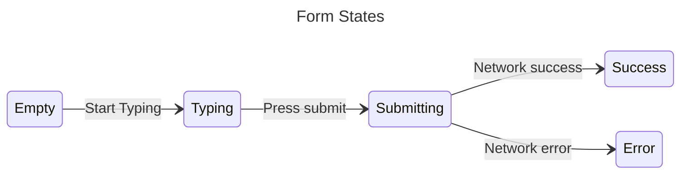

# React to Input with State

`deephaven.ui` offers a declarative approach to UI manipulation. Rather than directly altering individual UI elements, you define the various states your component can occupy and transition between them based on user input. This approach aligns with how designers conceptualize the UI.

## Declarative UI compared to imperative

When designing UI interactions, you likely consider how the UI should respond to user actions. Take, for example, a form that allows users to submit an answer:

- Typing into the form enables the “Submit” button.
- Pressing “Submit” disables both the form and the button, and displays a spinner.
- If the network request is successful, the form is hidden, and a “Thank you” message appears.
- If the network request fails, an error message is shown, and the form is re-enabled.

In imperative programming, you would implement these interactions by writing explicit instructions to manipulate the UI based on the events that occur. This is akin to giving step-by-step directions to someone driving a car.

They don't know your destination; they simply follow your commands. If you provide incorrect directions, you'll end up in the wrong place. This approach is called imperative because you must "command" each element, from the spinner to the button, instructing the computer on how to update the UI.

This example shows a quiz form written in an imperative style:

```python
from deephaven import ui
import threading


@ui.component
def form():
    answer, set_answer = ui.use_state("")
    error, set_error = ui.use_state(None)

    # Imperative style means tracking state for each thing that can change
    disable_text_area, set_disable_text_area = ui.use_state(False)
    disable_button, set_disable_button = ui.use_state(True)
    show_error, set_show_error = ui.use_state(False)
    show_success, set_show_success = ui.use_state(False)

    def submit_form(answer):
        should_error = answer != "3.14"
        if should_error:
            set_disable_text_area(False)
            set_disable_button(False)
            set_error("Incorrect!")
            set_show_error(True)
        else:
            set_show_success(True)

    def handle_submit():
        set_disable_text_area(True)
        set_disable_button(True)
        threading.Timer(1.5, lambda: submit_form(answer)).start()

    def handle_text_area_change(value):
        set_answer(value)
        set_disable_button(len(value) == 0)

    if show_success:
        return ui.heading("Correct!")

    return [
        ui.heading("Quiz"),
        ui.text("What are the first three digits of pi?"),
        ui.form(
            ui.text_area(
                value=answer,
                on_change=handle_text_area_change,
                is_disabled=disable_text_area,
            ),
            ui.button("Submit", type="submit", is_disabled=disable_button),
            ui.text(error) if show_error else None,
            on_submit=handle_submit,
        ),
    ]


form_example = form()
```

Imperatively manipulating the UI works for simple examples, but becomes increasingly difficult in complex systems. Imagine updating a page with multiple forms. Adding a new UI element or interaction would require meticulously checking all existing code to avoid bugs, such as forgetting to show or hide elements.

`deephaven.ui` addresses this issue.

In `deephaven.ui`, you do not manipulate the UI directly. Instead, you declare what you want to display, and `deephaven.ui` determines how to update the UI. It is like telling a taxi driver your destination instead of giving step-by-step directions. The driver knows the best route and possibly even shortcuts you had not considered.

## Think about UI declaratively

You’ve seen how to implement a form imperatively above. To better understand how to think declaratively, let's walk through reimplementing this UI using `deephaven.ui` below:

1. **Identify** your component’s different visual states
2. **Determine** what triggers those state changes
3. **Represent** the state in memory using useState
4. **Remove** any non-essential state variables
5. **Connect** the event handlers to set the state

### Step 1: Identify your component’s different visual states

In computer science, you may hear about a “state machine” being in one of several “states”. For declarative programming with `deephaven.ui`, you should visualize your component's different states:

- **Empty**: Form has a disabled “Submit” button.
- **Typing**: Form has an enabled “Submit” button.
- **Submitting**: Form is completely disabled while the answer is submitted.
- **Success**: A success message is shown instead of a form.
- **Error**: Same as Typing state, but with an error message shown.

### Step 2: Determine what triggers those state changes

You can trigger state updates in response to two kinds of inputs:

- **Human inputs**: clicking a button, typing in a field, navigating a link.
- **Computer inputs**: a network response arriving, a timeout completing, an image loading.

In both cases, you must set state variables to update the UI. For the form you’re developing, you will need to change state in response to a few different inputs:

- **Changing the text input** (human input) should switch it from the Empty state to the Typing state or back, depending on whether the text box is empty or not.
- **Clicking the Submit button** (human input) should switch it to the Submitting state.
- **Successful network response** (computer input) should switch it to the Success state.
- **Failed network response** (computer input) should switch it to the Error state with the matching error message.

To help visualize this flow, try drawing each state diagram.



### Step 3: Represent the state in memory with `use_state`

```python
from deephaven import ui
import threading


@ui.component
def form():
    answer, set_answer = ui.use_state("")
    error, set_error = ui.use_state(None)
    status, set_status = ui.use_state("typing")

    def submit_form(answer):
        should_error = answer != "3.14"
        if should_error:
            set_status("typing")
            set_error("Incorrect!")
        else:
            set_status("success")

    def handle_submit():
        set_status("submitting")
        threading.Timer(1.5, lambda: submit_form(answer)).start()

    if status == "success":
        return ui.heading("Correct!")

    return [
        ui.heading("Quiz"),
        ui.text("What are the first three digits of pi?"),
        ui.form(
            ui.text_area(
                value=answer, on_change=set_answer, is_disabled=status == "submitting"
            ),
            ui.button(
                "Submit",
                type="submit",
                is_disabled=len(answer) == 0 or status == "submitting",
            ),
            ui.text(error),
            on_submit=handle_submit,
        ),
    ]


form_example = form()
```
