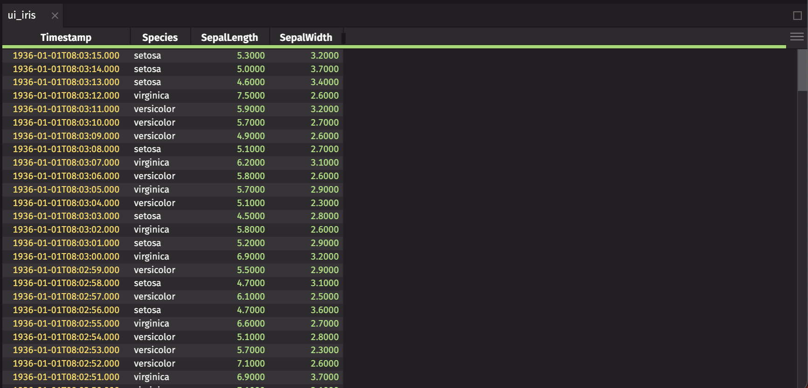
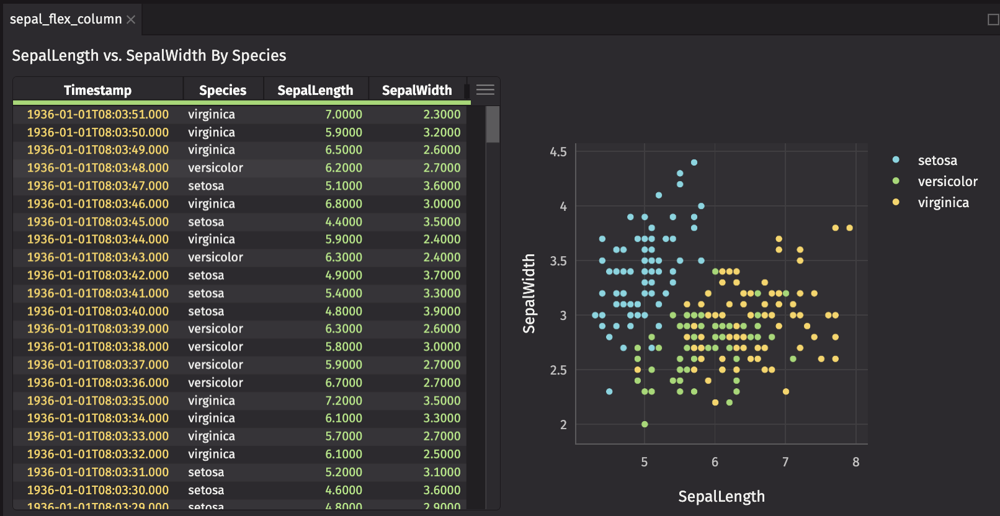
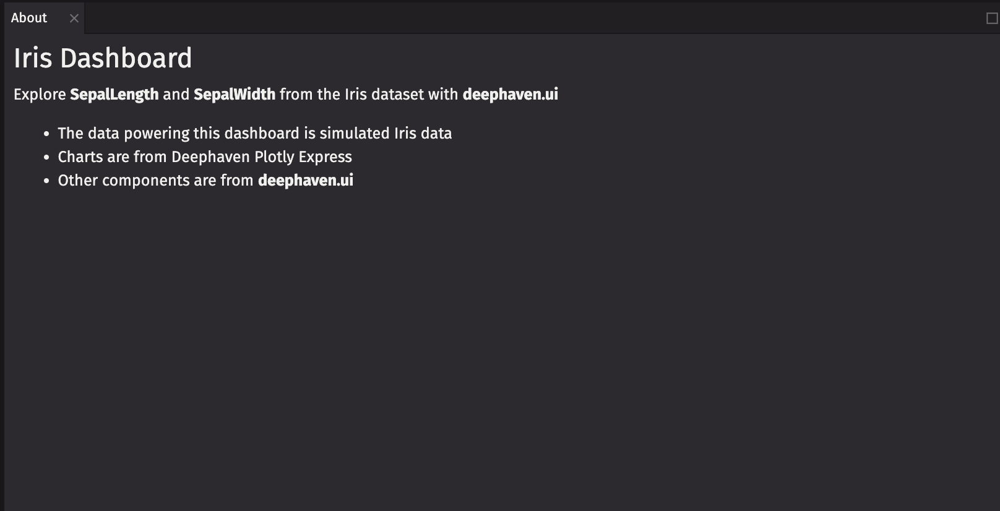
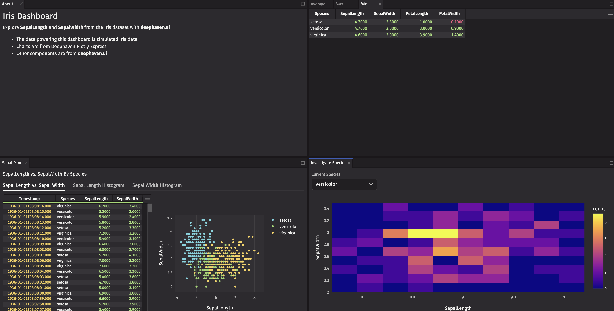

# Create a Dashboard with `deephaven.ui`

This guide shows you how to build a dashboard with [`deephaven.ui`](https://github.com/deephaven/deephaven-plugins/tree/main/plugins/ui), Deephaven’s Python library to create user interfaces. You’ll use a wide range of components supported by the library to familiarize you with what `deephaven.ui` provides and dive deep into simulated data with live dataframes, visualizations, and interactivity seamlessly integrated into a dashboard.

- First, you'll learn the basic `deephaven.ui` components. Basic components use panels, which are individual and adjustable windows within Deephaven. Tables, charts, and other components are rendered in panels.
- After creating panels, you'll create a dashboard. A dashboard is a collection of panels that open in a separate window within Deephaven.
- Then, you'll create a custom panel component. Custom components enable rich interactivity within your panels and dashboards.
- Finally, you'll embed your custom component into your dashboard.


To follow along, you need the [`deephaven.ui`](https://pypi.org/project/deephaven-plugin-ui/) package and simulated data and charts from [`deephaven.plot.express`](https://pypi.org/project/deephaven-plugin-ui/). Both of these packages are included in the default setup.

Import the simulated `iris` data with this script:

```python test-set=tutorial
from deephaven import ui
import deephaven.plot.express as dx

iris = dx.data.iris()
```


In this dataset, the `Species` column is a categorical column with three values: `setosa`, `Versicolor`, and `Virginia`. The `SepalLength`, `SepalWidth`, `PetalLength`, and `PetalWidth` columns are continuous numerical columns that contain measurements of the sepal and petal of an iris flower. The `Timestamp` column is also useful for ordering the data.

You'll mostly focus on `SepalLength` and `SepalWidth` in this guide.

## Basic components

Components are the building blocks of `deephaven.ui`. Each component takes parameters that control how the component appears. By default, a component renders in a panel.

### `ui.table`

Wrapping a table in [`ui.table`](components/table.md) unlocks visual functionality on the table.
Since you're investigating `SepalLength` and `SepalWidth`, create a `ui.table` that accentuates the latest filtered data.
With `iris`, create a `ui.table` that:

1. Reverses the order so that the newest rows are shown first.
2. Pulls the `Species` column to the front along with `Timestamp`.
3. Hides the `PetalLength`, `PetalWidth`, and `SpeciesID` columns.
4. Uses the compact table density so you can see as many rows as possible.

```python test-set=tutorial
ui_iris = ui.table(
  iris,
  reverse=True,
  front_columns=["Timestamp", "Species"],
  hidden_columns=["PetalLength", "PetalWidth", "SpeciesID"],
  density="compact"
)
```



### Charts

Charts from Deephaven Plotly Express (`dx`) have no `deephaven.ui` specific wrapping and are added directly. Create a [`dx.scatter`](/core/plotly/docs/scatter) chart that compares `SepalLength` and `SepalWidth` by `Species`.

```python test-set=tutorial
scatter_by_species = dx.scatter(iris, x = "SepalLength", y = "SepalWidth", by="Species")
```


### `ui.text`

The [`ui.text`](components/text.md) component adds basic text. Create text to accompany the chart and table.

```python test-set=tutorial
sepal_text = ui.text("SepalLength vs. SepalWidth By Species")
```


### `ui.flex`

Wrap your chart and `ui.table` in a [`ui.flex`](components/flex.md) component. `ui.flex` is an implementation of [Flexbox](https://developer.mozilla.org/en-US/docs/Learn/CSS/CSS_layout/Flexbox) that enables responsive layouts that adjust as you resize panels.
Items within a `ui.flex` component stretch and shrink based on available space.

```python test-set=tutorial
sepal_flex = ui.flex(ui_iris, scatter_by_species)
```


The `direction` of `sepal_flex` is `"row"`. Add `sepal_text` and `sepal_flex` to another panel, with a `direction` of `"column"`.

```python test-set=tutorial
sepal_flex_column = ui.flex(sepal_text, sepal_flex, direction="column")
```



### Tabs

The [`ui.tabs`](components/tabs.md) component enables tabs within a panel. Create histograms of `SepalLength` to display in tabs.
Histograms are useful to display comparisons of data distributions, so create [`dx.histogram`](/core/plotly/docs/histogram) charts of the columns of interest, `SepalLength` and `SepalWidth`, by `Species`.
Create `ui.tab` elements for `sepal_flex`, `sepal_length_hist`, and `sepal_width_hist`, then pass them to `ui.tabs` to switch between different views.

```python test-set=tutorial order=sepal_flex_tabs,sepal_tabs,sepal_width_hist,sepal_length_hist
sepal_length_hist = dx.histogram(iris, x="SepalLength", by="Species")
sepal_width_hist = dx.histogram(iris, x="SepalWidth", by="Species")

sepal_tabs = ui.tabs(
    ui.tab(sepal_flex, title="Sepal Length vs. Sepal Width"),
    ui.tab(sepal_length_hist, title="Sepal Length Histogram"),
    ui.tab(sepal_width_hist, title="Sepal Width Histogram"),
)
sepal_flex_tabs = ui.flex(sepal_text, sepal_tabs, direction="column")
```


### Markdown

[`ui.markdown`](components/markdown.md) components allow you to provide text in a markdown format. Create an informational panel with markdown text.

```python test-set=tutorial
about_markdown = ui.markdown(r"""
### Iris Dashboard

Explore **SepalLength** and **SepalWidth** from the Iris dataset with **deephaven.ui**
- The data powering this dashboard is simulated Iris data
- Charts are from Deephaven Plotly Express
- Other components are from **deephaven.ui**
""")
```


Now you have two responsive panels with fundamental components of `deephaven.ui` that explore `SepalLength` and `SepalWidth` by `Species`.

## Dashboard

By default, components are rendered in a panel, but a dashboard enables more complex layouts in an isolated window.
When you have multiple panels, you can create a dashboard to contain them so that you can add even more panels later for your `iris` data exploration.

<details>
<summary>Expand for complete code up to this point</summary>

```python skip-test
from deephaven import ui
import deephaven.plot.express as dx
from deephaven import agg

iris = dx.data.iris()

ui_iris = ui.table(
    iris,
    reverse=True,
    front_columns=["Timestamp", "Species"],
    hidden_columns=["PetalLength", "PetalWidth", "SpeciesID"],
    density="compact",
)

scatter_by_species = dx.scatter(iris, x="SepalLength", y="SepalWidth", by="Species")

sepal_text = ui.text("SepalLength vs. SepalWidth By Species Panel")

sepal_flex = ui.flex(ui_iris, scatter_by_species)

sepal_flex_column = ui.flex(sepal_text, sepal_flex, direction="column")

sepal_length_hist = dx.histogram(iris, x="SepalLength", by="Species")
sepal_width_hist = dx.histogram(iris, x="SepalWidth", by="Species")

sepal_tabs = ui.tabs(
    ui.tab(sepal_flex, title="Sepal Length vs. Sepal Width"),
    ui.tab(sepal_length_hist, title="Sepal Length Histogram"),
    ui.tab(sepal_width_hist, title="Sepal Width Histogram"),
)
sepal_flex_tabs = ui.flex(sepal_text, sepal_tabs, direction="column")

about_markdown = ui.markdown(r"""
### Iris Dashboard

Explore the Iris dataset with **deephaven.ui**

- The data powering this dashboard is simulated Iris data
- Charts are from Deephaven Plotly Express
- Other components are from **deephaven.ui**
  """)
```

</details>

Before that, create a `ui.panel` manually to provide a `title`.

```python test-set=tutorial order=iris_dashboard
sepal_panel = ui.panel(sepal_flex_tabs, title="Sepal Panel")
iris_dashboard = ui.dashboard(sepal_panel)
```


You now have a one-panel dashboard.

You can create a default layout with multiple panels. Create a panel for `about_markdown` so you can give it a `title`.

```python test-set=tutorial
about_panel = ui.panel(about_markdown, title="About")
```



### Row

One way to create a default layout is by wrapping your panels in a [`ui.row`](components/dashboard.md) component.

```python test-set=tutorial
iris_dashboard_row = ui.dashboard(ui.row(about_panel, sepal_panel))
```


### Column

Another way to create a default layout is with [`ui.column`](components/dashboard.md).

```python test-set=tutorial
iris_dashboard_column = ui.dashboard(ui.column(about_panel, sepal_panel))
```


### Stack

One more way to create a default layout is with [`ui.stack`](components/dashboard.md). The last panel is active by default.
`ui.stack` is useful if you want a tabbed layout but also the ability to move the individual components around, which is not possible with `ui.tabs`.
Create tabs that show the average, max, and min values of `SepalLength`, `SepalWidth`, `PetalLength`, and `PetalWidth` by `Species`.
You can compare a specific statistic across the different `Species` within the same panel or move between panels to compare different statistics across `Species`.

```python test-set=tutorial order=iris_dashboard_stack
from deephaven import agg

iris_avg = iris.agg_by([agg.avg(cols=["SepalLength", "SepalWidth", "PetalLength", "PetalWidth"])], by=["Species"])
iris_max = iris.agg_by([agg.max_(cols=["SepalLength", "SepalWidth", "PetalLength", "PetalWidth"])], by=["Species"])
iris_min = iris.agg_by([agg.min_(cols=["SepalLength", "SepalWidth", "PetalLength", "PetalWidth"])], by=["Species"])

ui_iris_avg = ui.panel(iris_avg, title="Average")
ui_iris_max = ui.panel(iris_max, title="Max")
ui_iris_min = ui.panel(iris_min, title="Min")

iris_dashboard_stack = ui.dashboard(ui.stack(ui_iris_avg, ui_iris_max, ui_iris_min))
```


## Interactivity

So far, you’ve worked with `deephaven.ui` components that don’t interact with each other. Now, you’ll create your own component with interactivity and embed it into your dashboard.
Since this walkthrough investigates `SepalLength` and `SepalWidth`, this section shows you how to create a [`dx.densityheatmap`](/core/plotly/docs/density_heatmap) chart that shows the density of `SepalLength` and `SepalWidth`, with a `Species` filter.

### `ui.component`

A custom component uses the `ui.component` decorator. The decorator signals to the `deephaven.ui` rendering engine that this component needs to be rendered. Create a function with the `ui.component` decorator that returns `"Hello, World!"`.

```python test-set=tutorial
@ui.component
def custom_component():
  return "Hello, World!"

custom_panel = custom_component()
```


### Picker

A [`ui.picker`](components/picker.md) allows you to select options from a list.

```python test-set=tutorial
@ui.component
def species_panel():
  species_picker = ui.picker("setosa", "versicolor", "virginica")

  return species_picker

picker_panel = species_panel()
```


### Table-backed `ui.picker`

A `ui.picker` can pull directly from a table so they update automatically based on a column in the table. Modify your `ui.picker` to pass in a table instead, which is recommended for dynamic data.

> [!NOTE]
> It’s important to filter your table down to the distinct values you want. The `ui.picker` does not do this for you.

```python test-set=tutorial order=species_picker_panel,species_table
species_table = iris.view("Species").select_distinct()

@ui.component
def species_panel():
  species_picker = ui.picker(species_table)

  return species_picker

species_picker_panel = species_panel()
```


### `ui.use_state`

The [`ui.use_state`](hooks/use_state.md) hook is how you’ll enable interactivity. The hook takes a starting value and returns a tuple of the current value and a function to set the value.
Next, modify your picker to take the `species` and `set_species` from the hook you just defined using `on_change` and `selected_key`. `on_change` is called whenever an option is selected. `selected_key` is the currently selected option. Using these makes the component controlled, meaning that the `selected_key` is controlled outside of the `ui.picker` itself. This allows you to use the `selected_key` in other ways such as filtering a table.

> [!WARNING]
> Hooks like `ui.use_state` are only available in components decorated with `ui.component`.
> Additionally, hooks should not be called conditionally within a component. Create a new component if conditional rendering is needed.

```python test-set=tutorial
@ui.component
def species_panel():
  species, set_species = ui.use_state()
  species_picker = ui.picker(species_table, on_change=set_species, selected_key=species, label="Current Species")

  return species_picker

species_picker_panel = species_panel()
```


Now, your picker is controlled by the rendering engine and updates as you pick values, and you have an up-to-date value from the table to filter on.

### Utilizing State

Now, add a table filtered on this value and a chart that uses this filtered table. Return them with the picker.
You'll create a `dx.heatmap`, which shows the joint density of `SepalLength` and `SepalWidth` (the variables of interest) filtered by `Species`.

```python test-set=tutorial
@ui.component
def species_panel():
  species, set_species = ui.use_state()
  species_picker = ui.picker(
    species_table,
    on_change=set_species,
    selected_key=species,
    label="Current Species"
  )

  filtered_table = iris.where("Species = species")

  heatmap = dx.density_heatmap(filtered_table, x="SepalLength", y="SepalWidth")

  return ui.panel(ui.flex(species_picker, heatmap, direction="column"), title="Investigate Species")

species_picker_panel = species_panel()
```


### `ui.illustrated_message`

Currently, an empty table and chart appear if no species is selected. For a more user-friendly experience, add a [`ui.illustrated_message`](components/illustrated_message.md) component to display instead if no `species` is selected.

```python test-set=tutorial
@ui.component
def species_panel():
  species, set_species = ui.use_state()
  species_picker = ui.picker(
    species_table,
    on_change=set_species,
    selected_key=species,
    label="Current Species"
  )

  heatmap = ui.illustrated_message(
      ui.icon("vsFilter"),
      ui.heading("Species required"),
      ui.content("Select a species to display filtered table and chart."),
      width="100%",
  )

  if species:
    filtered_table = iris.where("Species = species")

    heatmap = dx.density_heatmap(filtered_table, x="SepalLength", y="SepalWidth")

  return ui.panel(ui.flex(species_picker, heatmap, direction="column"), title="Investigate Species")

species_picker_panel = species_panel()
```


### Utilizing custom components

Next, embed your custom component in your dashboard.

```python test-set=tutorial
iris_species_dashboard = ui.dashboard(
    ui.column(
        ui.row(about_panel, ui.stack(ui_iris_avg, ui_iris_max, ui_iris_min)), ui.row(sepal_panel, species_picker_panel)
    )
)
```



The top row contains lots of empty space. Resize the height of the top row to 1 and the bottom row to 2 for a ratio of 1:2, so the bottom row is twice the height of the top row.

```python test-set=tutorial
iris_species_dashboard_resized = ui.dashboard(
    ui.column(
        ui.row(about_panel, ui.stack(ui_iris_avg, ui_iris_max, ui_iris_min), height=1),
        ui.row(sepal_panel, species_picker_panel, height=2),
    )
)
```


### Dashboard state across panels

Currently, the `ui.picker` selects `Species` within a panel. You can change state across panels as well.

Recreate the `sepal_flex_tabs` panel within the `create_sepal_panel` function, which takes a `set_species` function as an argument. Now, we'll add a `ui.table` event -- these are useful if you see a row you want to investigate further.

- Add a listener (`on_row_double_press`) to the table that is called when a row is double-clicked, returning the row data. This sets the `Species` value displayed in the `ui.picker` and `dx.density_heatmap`.
- Pull the `Species` value from the row data and set it with `set_species`.
- Then, create `sepal_panel` with `create_sepal_panel`, passing `set_species` to it.

```python test-set=tutorial
def create_sepal_panel(set_species):
    ui_iris = ui.table(
        iris,
        reverse=True,
        front_columns=["Timestamp", "Species"],
        hidden_columns=["PetalLength", "PetalWidth", "SpeciesID"],
        density="compact",
        on_row_double_press=lambda event: set_species(event["Species"]["value"]),
    )

    sepal_flex = ui.flex(ui_iris, scatter_by_species)

    sepal_tabs = ui.tabs(
        ui.tab(sepal_flex, title="Sepal Length vs. Sepal Width"),
        ui.tab(sepal_length_hist, title="Sepal Length Histogram"),
        ui.tab(sepal_width_hist, title="Sepal Width Histogram"),
    )

    sepal_flex_tabs = ui.flex(sepal_text, sepal_tabs, direction="column")

    return ui.panel(sepal_flex_tabs, title="Sepal Panel")


@ui.component
def create_species_dashboard():
    species, set_species = ui.use_state()
    species_picker = ui.picker(
        species_table,
        on_change=set_species,
        selected_key=species,
        label="Current Species",
    )

    heatmap = ui.illustrated_message(
        ui.icon("vsFilter"),
        ui.heading("Species required"),
        ui.content("Select a species to display filtered table and chart."),
        width="100%",
    )

    if species:
        filtered_table = iris.where("Species = species")

        heatmap = dx.density_heatmap(filtered_table, x="SepalLength", y="SepalWidth")

    species_panel = ui.panel(
        ui.flex(species_picker, heatmap, direction="column"),
        title="Investigate Species",
    )

    sepal_panel = create_sepal_panel(set_species)

    return ui.column(
        ui.row(about_panel, ui.stack(ui_iris_avg, ui_iris_max, ui_iris_min), height=1),
        ui.row(sepal_panel, species_panel, height=2),
    )


iris_species_dashboard_state = ui.dashboard(create_species_dashboard())
```


### `ui.use_row_data` and `ui.badge`

You've got a density heatmap that shows the density of `SepalLength` and `SepalWidth` by `Species`, but it's tricky to see the min, max, and average overall values for `SepalLength` and `SepalWidth` for the selected `Species`. They're in your table stack, but you can make them more prominent.

`deephaven.ui` provides hooks to access table data. Each hook provides access to a specific part of the table and is updated when the table changes.
The hooks are:

- [`ui.use_cell_data`](hooks/use_cell_data.md) - Accesses a single cell value.
- [`ui.use_row_data`](hooks/use_row_data.md) - Accesses a row of data.
- [`ui.use_row_list`](hooks/use_row_list.md) - Accesses a row as a list.
- [`ui.use_column_data`](hooks/use_column_data.md) - Accesses a column of data.
- [`ui.use_table_data`](hooks/use_table_data.md) - Accesses the entire table.

> [!WARNING]
> Filter your table to only the data you need the hook to pull out. The hooks do not filter the table for you.

Create a custom component that pulls the min, max, and average values for `SepalLength` and `SepalWidth` for the selected `Species`.
To display the values, wrap them in [`ui.badge`](components/badge.md) components, which draw attention to specific values.

```python test-set=tutorial
@ui.component
def summary_badges(species):
    # Filter the tables to the selected species
    species_min = iris_min.where("Species=species")
    species_max = iris_max.where("Species=species")
    species_avg = iris_avg.where("Species=species")

    # Pull the desired columns from the tables before using the hooks
    sepal_length_min = ui.use_cell_data(species_min.view(["SepalLength"]))
    sepal_width_min = ui.use_cell_data(species_min.view(["SepalWidth"]))
    sepal_length_max = ui.use_cell_data(species_max.view(["SepalLength"]))
    sepal_width_max = ui.use_cell_data(species_max.view(["SepalWidth"]))
    sepal_length_avg = ui.use_cell_data(species_avg.view(["SepalLength"]))
    sepal_width_avg = ui.use_cell_data(species_avg.view(["SepalWidth"]))

    # format the values to 3 decimal places
    # set flex_grow to 0 to prevent the badges from growing
    return ui.flex(
        ui.badge(f"SepalLength Min: {sepal_length_min:.3f}", variant="info"),
        ui.badge(f"SepalLength Max: {sepal_length_max:.3f}", variant="info"),
        ui.badge(f"SepalLength Avg: {sepal_length_avg:.3f}", variant="info"),
        ui.badge(f"SepalWidth Min: {sepal_width_min:.3f}", variant="info"),
        ui.badge(f"SepalWidth Max: {sepal_width_max:.3f}", variant="info"),
        ui.badge(f"SepalWidth Avg: {sepal_width_avg:.3f}", variant="info"),
        flex_grow=0,
    )


@ui.component
def create_species_dashboard():
    species, set_species = ui.use_state()
    species_picker = ui.picker(
        species_table,
        on_change=set_species,
        selected_key=species,
        label="Current Species",
    )

    heatmap = ui.illustrated_message(
        ui.icon("vsFilter"),
        ui.heading("Species required"),
        ui.content("Select a species to display filtered table and chart."),
        width="100%",
    )

    badges = None

    if species:
        filtered_table = iris.where("Species = species")

        heatmap = dx.density_heatmap(filtered_table, x="SepalLength", y="SepalWidth")

        badges = summary_badges(species)

    species_panel = ui.panel(
        ui.flex(species_picker, badges, heatmap, direction="column"),
        title="Investigate Species",
    )

    sepal_panel = create_sepal_panel(set_species)

    return ui.column(
        ui.row(about_panel, ui.stack(ui_iris_avg, ui_iris_max, ui_iris_min), height=1),
        ui.row(sepal_panel, species_panel, height=2),
    )


iris_species_dashboard_badge = ui.dashboard(create_species_dashboard())
```


### `ui.use_memo`

`ui.use_memo` allows you to cache expensive calculations so they are only recalculated when needed. It takes a function and a list of dependencies. If the dependencies change, the function is recalculated.
Since you've added badges to the dashboard, the `dx.heatmap` is recreated every time any of the badges change, but only needs to be recreated when the `Species` changes.
Heatmap is a fairly expensive chart to create (it requires a filtered table in this case) and changes rarely, so pull the heatmap creation into a separate function and use `ui.use_memo` to cache the heatmap creation.

```python test-set=tutorial
def create_heatmap(species):
    heatmap = ui.illustrated_message(
        ui.icon("vsFilter"),
        ui.heading("Species required"),
        ui.content("Select a species to display filtered table and chart."),
        width="100%",
    )

    if species:
        filtered_table = iris.where("Species = species")
        heatmap = dx.density_heatmap(filtered_table, x="SepalLength", y="SepalWidth")

    return heatmap


@ui.component
def create_species_dashboard():
    species, set_species = ui.use_state()
    species_picker = ui.picker(
        species_table,
        on_change=set_species,
        selected_key=species,
        label="Current Species",
    )

    heatmap = ui.use_memo(lambda: create_heatmap(species), [species])

    badges = summary_badges(species) if species else None

    species_panel = ui.panel(
        ui.flex(species_picker, badges, heatmap, direction="column"),
        title="Investigate Species",
    )

    sepal_panel = create_sepal_panel(set_species)

    return ui.column(
        ui.row(about_panel, ui.stack(ui_iris_avg, ui_iris_max, ui_iris_min), height=1),
        ui.row(sepal_panel, species_panel, height=2),
    )


iris_species_dashboard_final = ui.dashboard(create_species_dashboard())
```


<details>
<summary>Expand for final code</summary>

```python skip-test
from deephaven import ui
import deephaven.plot.express as dx
from deephaven import agg

iris = dx.data.iris()

ui_iris = ui.table(
    iris,
    reverse=True,
    front_columns=["Timestamp", "Species"],
    hidden_columns=["PetalLength", "PetalWidth", "SpeciesID"],
    density="compact",
)

scatter_by_species = dx.scatter(iris, x="SepalLength", y="SepalWidth", by="Species")

sepal_text = ui.text("SepalLength vs. SepalWidth By Species Panel")

sepal_flex = ui.flex(ui_iris, scatter_by_species)

sepal_flex_column = ui.flex(sepal_text, sepal_flex, direction="column")

sepal_length_hist = dx.histogram(iris, x="SepalLength", by="Species")
sepal_width_hist = dx.histogram(iris, x="SepalWidth", by="Species")

sepal_tabs = ui.tabs(
    ui.tab(sepal_flex, title="Sepal Length vs. Sepal Width"),
    ui.tab(sepal_length_hist, title="Sepal Length Histogram"),
    ui.tab(sepal_width_hist, title="Sepal Width Histogram"),
)
sepal_flex_tabs = ui.flex(sepal_text, sepal_tabs, direction="column")

about_markdown = ui.markdown(r"""
### Iris Dashboard

Explore the Iris dataset with **deephaven.ui**

- The data powering this dashboard is simulated Iris data
- Charts are from Deephaven Plotly Express
- Other components are from **deephaven.ui**
  """)

sepal_panel = ui.panel(sepal_flex_tabs, title="Sepal Panel")
about_panel = ui.panel(about_markdown, title="About")

iris_avg = iris.agg_by([agg.avg(cols=["SepalLength", "SepalWidth", "PetalLength", "PetalWidth"])], by=["Species"])
iris_max = iris.agg_by([agg.max_(cols=["SepalLength", "SepalWidth", "PetalLength", "PetalWidth"])], by=["Species"])
iris_min = iris.agg_by([agg.min_(cols=["SepalLength", "SepalWidth", "PetalLength", "PetalWidth"])], by=["Species"])

ui_iris_avg = ui.panel(iris_avg, title="Average")
ui_iris_max = ui.panel(iris_max, title="Max")
ui_iris_min = ui.panel(iris_min, title="Min")

ui_stack = ui.stack(ui_iris_avg, ui_iris_max, ui_iris_min)

species_table = iris.view("Species").select_distinct()

def create_sepal_panel(set_species):
  ui_iris = ui.table(
      iris,
      reverse=True,
      front_columns=["Timestamp", "Species"],
      hidden_columns=["PetalLength", "PetalWidth", "SpeciesID"],
      density="compact",
      on_row_double_press=lambda event: set_species(event["Species"]["value"])
    )

  sepal_flex = ui.flex(ui_iris, scatter_by_species)

  sepal_tabs = ui.tabs(
      ui.tab(sepal_flex, title="Sepal Length vs. Sepal Width"),
      ui.tab(sepal_length_hist, title="Sepal Length Histogram"),
      ui.tab(sepal_width_hist, title="Sepal Width Histogram"),
  )

  sepal_flex_tabs = ui.flex(sepal_text, sepal_tabs, direction="column")

  return ui.panel(sepal_flex_tabs, title="Sepal Panel")

@ui.component
def summary_badges(species):
  # Filter the tables to the selected species
  species_min = iris_min.where("Species=species")
  species_max = iris_max.where("Species=species")
  species_avg = iris_avg.where("Species=species")

  # Pull the desired columns from the tables before using the hooks
  sepal_length_min = ui.use_cell_data(species_min.view(["SepalLength"]))
  sepal_width_min = ui.use_cell_data(species_min.view(["SepalWidth"]))
  sepal_length_max = ui.use_cell_data(species_max.view(["SepalLength"]))
  sepal_width_max = ui.use_cell_data(species_max.view(["SepalWidth"]))
  sepal_length_avg = ui.use_cell_data(species_avg.view(["SepalLength"]))
  sepal_width_avg = ui.use_cell_data(species_avg.view(["SepalWidth"]))

  # format the values to 3 decimal places
  # set flex_grow to 0 to prevent the badges from growing
  return ui.flex(
    ui.badge(f"SepalLength Min: {sepal_length_min:.3f}", variant="info"),
    ui.badge(f"SepalLength Max: {sepal_length_max:.3f}", variant="info"),
    ui.badge(f"SepalLength Avg: {sepal_length_avg:.3f}", variant="info"),
    ui.badge(f"SepalWidth Min: {sepal_width_min:.3f}", variant="info"),
    ui.badge(f"SepalWidth Max: {sepal_width_max:.3f}", variant="info"),
    ui.badge(f"SepalWidth Avg: {sepal_width_avg:.3f}", variant="info"),
    flex_grow=0
  )

def create_heatmap(species):
    heatmap = ui.illustrated_message(
        ui.icon("vsFilter"),
        ui.heading("Species required"),
        ui.content("Select a species to display filtered table and chart."),
        width="100%",
    )

    if species:
        filtered_table = iris.where("Species = species")
        heatmap = dx.density_heatmap(filtered_table, x="SepalLength", y="SepalWidth")

    return heatmap

@ui.component
def create_species_dashboard():
    species, set_species = ui.use_state()
    species_picker = ui.picker(
        species_table,
        on_change=set_species,
        selected_key=species,
        label="Current Species",
    )

    heatmap = ui.use_memo(lambda: create_heatmap(species), [species])

    badges = summary_badges(species) if species else None

    species_panel = ui.panel(
        ui.flex(species_picker, badges, heatmap, direction="column"),
        title="Investigate Species",
    )

    sepal_panel = create_sepal_panel(set_species)

    return ui.column(
        ui.row(about_panel, ui.stack(ui_iris_avg, ui_iris_max, ui_iris_min), height=1),
        ui.row(sepal_panel, species_panel, height=2),
    )

iris_species_dashboard_final = ui.dashboard(create_species_dashboard())
```

</details>

You've now completed this dashboard crash course with your custom component and interactivity.

## Wrapping up

This wraps up the `deephaven.ui` dashboard crash course. In this course, you learned about the following components and concepts and created a dashboard with many of them:

- [`ui.table`](components/table.md)
- [`ui.text`](components/text.md)
- [`ui.flex`](components/flex.md)
- [`ui.tabs`](components/tabs.md)
- [`ui.markdown`](components/markdown.md)
- [`ui.dashboard`](components/dashboard.md)
- [`ui.row`](components/dashboard.md#row-api-reference)
- [`ui.column`](components/dashboard.md#column-api-reference)
- [`ui.stack`](components/dashboard.md#stack-api-reference)
- [`ui.component`](describing/your_first_component.md)
- [`ui.picker`](components/picker.md)
- [`ui.use_state`](hooks/use_state.md)
- [`ui.illustrated_message`](components/illustrated_message.md)
- [`ui.badge`](components/illustrated_message.md)
- [`ui.use_cell_data`](hooks/use_cell_data.md)
- [`ui.use_row_data`](hooks/use_row_data.md)
- [`ui.use_row_list`](hooks/use_row_list.md)
- [`ui.use_column_data`](hooks/use_column_data.md)
- [`ui.use_table_data`](hooks/use_table_data.md)
- [`ui.use_memo`](hooks/use_memo.md)
- [`dx.scatter`](/core/plotly/docs/box)
- [`dx.histogram`](/core/plotly/docs/histogram)
- [`dx.density_heatmap`](/core/plotly/docs/density_heatmap)
