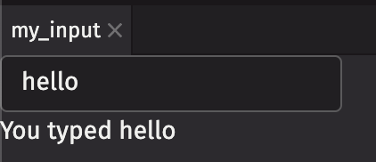
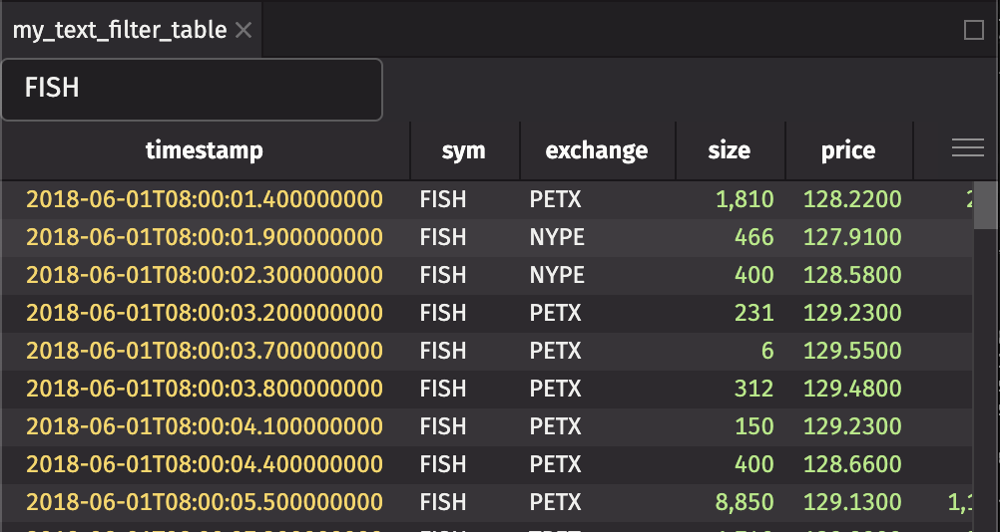

# ⚠️This plugin is a work in progress and is subject to change. Use at your own risk.⚠️

# Introduction

deephaven.ui is a plugin for Deephaven that allows for programmatic layouts and callbacks. It uses a React-like approach to building components and rendering them in the UI, allowing for creating reactive components that can be re-used and composed together, as well as reacting to user input from the UI.

Below are some examples to demonstrate some of the functionality you can do so far with deephaven.ui. At this point it is only showcasing the subset of the planned functionality that has been implemented, but should give an idea of what is possible. Most notably, all examples will only appear within one panel in the UI, the `ui.table` functionality (allowing interactivity and customization of displayed tables), and ability to use other plugins (such as deephaven.plot.express) is not yet implemented.

You can run the example Docker container with the following command:

```
docker run --rm --name deephaven-ui -p 10000:10000 --pull=always ghcr.io/deephaven/server-ui:edge
```

You'll need to find the link to open the UI in the Docker logs:


# Basic `use_state` Examples

deephaven.ui uses functional components with "hooks" to create components. The most useful and basic hook is the `use_state` hook, which allows you to create a stateful component. The `use_state` hook returns a tuple of the current value of the state and a function to update the state. The function returned by `use_state` can be called with a new value to update the state, and the component will re-render with the new value. People familiar with React will be familiar with this paradigm.

The below examples show a simple usage of the `use_state` hook, building some of the basic examples on the [React useState docs](https://react.dev/reference/react/useState#examples-basic).

## Counter (number)

A simple example to demonstrate how state can be used using the `use_state` hook. `count` holds the value of the counter, and pressing the button increments the number.

We define our `counter` component as a function using the `@ui.component` decorator. This decorator allows the component to be rendered in the UI, when we assign the result of it to a value with the `c = counter()` line. The `counter` function returns a `ui.action_button` component, which is a [button that can be pressed](https://react-spectrum.adobe.com/react-spectrum/ActionButton.html). The `on_press` argument is a callback that is called when the button is pressed. In this case, we call the `set_count` function returned by `use_state` to update the value of `count`.

```python
import deephaven.ui as ui
from deephaven.ui import use_state


@ui.component
def counter():
    count, set_count = use_state(0)
    return ui.action_button(
        f"You pressed me {count} times", on_press=lambda: set_count(count + 1)
    )


c = counter()
```


## Text field (string)

You can create a [TextField](https://react-spectrum.adobe.com/react-spectrum/TextField.html) that takes input from the user. You can also use a [Flex](https://react-spectrum.adobe.com/react-spectrum/Flex.html) component to display multiple components in a row (or column, depending on the `direction` argument).

```python
import deephaven.ui as ui
from deephaven.ui import use_state


@ui.component
def my_input():
    text, set_text = use_state("hello")

    return ui.flex(
        ui.text_field(value=text, on_change=set_text),
        ui.text(f"You typed {text}"),
        direction="column",
    )


mi = my_input()
```



## Checkbox (boolean)

You can use a [checkbox](https://react-spectrum.adobe.com/react-spectrum/Checkbox.html) to get a boolean value from the user.

```python
import deephaven.ui as ui
from deephaven.ui import use_state


@ui.component
def checkbox_example():
    liked, set_liked = use_state(True)
    return ui.flex(
        ui.checkbox("I liked this", is_selected=liked, on_change=set_liked),
        ui.text("You liked this" if liked else "You didn't like this"),
        direction="column",
    )


ce = checkbox_example()
```


## Form (two variables)

You can have state with multiple different variables in one component. In this example, we have a [text field](https://react-spectrum.adobe.com/react-spectrum/TextField.html) and a [slider](https://react-spectrum.adobe.com/react-spectrum/Slider.html), and we display the values of both of them.

```python
import deephaven.ui as ui
from deephaven.ui import use_state


@ui.component
def form_example():
    name, set_name = use_state("Homer")
    age, set_age = use_state(36)

    return ui.flex(
        ui.text_field(value=name, on_change=set_name),
        ui.slider(value=age, on_change=set_age),
        ui.text(f"Hello {name}, you are {age} years old"),
        direction="column",
    )


fe = form_example()
```

## Form with Submit

You can also create a form that user can click Submit on and react to that on a callback you specify. In this example, we create a [Form](https://react-spectrum.adobe.com/react-spectrum/forms.html) that takes a name and age, and when the user clicks Submit, the values entered in the form are sent to the user on the forms `on_submit` callback.

```python
from deephaven import ui


@ui.component
def form_submit_example():
    def handle_submit(data):
        print(f"Hello {data['name']}, you are {data['age']} years old")

    return ui.form(
        ui.text_field(default_value="Douglas", name="name"),
        ui.number_field(default_value=42, name="age"),
        ui.button("Submit", type="submit"),
        on_submit=handle_submit,
    )


fs = form_submit_example()
```

# Data Examples

Many of the examples below use the stocks table provided by `deephaven.plot.express` package:

```python
import deephaven.plot.express as dx

stocks = dx.data.stocks()
```

## Table with input filter

You can take input from a user to filter a table using the `where` method. In this example, we have a [text field](https://react-spectrum.adobe.com/react-spectrum/TextField.html) that takes input from the user, and we filter the table based on the input. By simply returning the table `t` from the component, it will be displayed in the UI (as if we had set it to a variable name).

```python
import deephaven.ui as ui
from deephaven.ui import use_state


@ui.component
def text_filter_table(source, column):
    value, set_value = use_state("FISH")
    t = source.where(f"{column}=`{value}`")
    return ui.flex(
        ui.text_field(value=value, on_change=set_value),
        t,
        direction="column",
        flex_grow=1,
    )


pp = text_filter_table(stocks, "sym")
```



## Table with range filter

You can also filter a table based on a range. In this example, we have a [range slider](https://react-spectrum.adobe.com/react-spectrum/RangeSlider.html) that takes input from the user, and we filter the table by price based on the input. By simply returning the table `t` from the component, it will be displayed in the UI (as if we had set it to a variable name).

```python
import deephaven.ui as ui
from deephaven.ui import use_state


@ui.component
def range_table(source, column):
    range, set_range = use_state({"start": 1000, "end": 10000})
    t = source.where(f"{column} >= {range['start']} && {column} <= {range['end']}")
    return ui.flex(
        ui.range_slider(
            value=range, on_change=set_range, label=column, min_value=0, max_value=50000
        ),
        t,
        direction="column",
        flex_grow=1,
    )


srt = range_table(stocks, "size")
```

## Table with required filters

In the previous example, we took a users input. But we didn't display anything if the user didn't enter any text. We can display a different message prompting the user for input if they haven't entered anything. We use a few new components in this example:

- [IllustratedMessage](https://react-spectrum.adobe.com/react-spectrum/IllustratedMessage.html) (ui.illustrated_message): A component that displays an icon, heading, and content. In this case, we display a warning icon, a heading, and some content.
- [Icon](https://react-spectrum.adobe.com/react-spectrum/Icon.html) (ui.icon): A component that displays an icon. In this case, we display the warning icon, and set the font size to 48px so it appears large in the UI.
- [Flex](https://react-spectrum.adobe.com/react-spectrum/Flex.html) (ui.flex): A component that displays its children in a row. In this case, we display the input text fields beside eachother in a row.

```python
import deephaven.ui as ui
from deephaven.ui import use_state


@ui.component
def stock_widget_table(source, default_sym="", default_exchange=""):
    sym, set_sym = use_state(default_sym)
    exchange, set_exchange = use_state(default_exchange)

    ti1 = ui.text_field(
        label="Sym", label_position="side", value=sym, on_change=set_sym
    )
    ti2 = ui.text_field(
        label="Exchange", label_position="side", value=exchange, on_change=set_exchange
    )
    error_message = ui.illustrated_message(
        ui.icon("vsWarning", style={"fontSize": "48px"}),
        ui.heading("Invalid Input"),
        ui.content("Please enter 'Sym' and 'Exchange' above"),
    )
    t1 = (
        source.where([f"sym=`{sym.upper()}`", f"exchange=`{exchange.upper()}`"])
        if sym and exchange
        else error_message
    )

    return ui.flex(ui.flex(ti1, ti2), t1, direction="column", flex_grow=1)


swt = stock_widget_table(stocks, "", "")
```


## Plot with filters

You can also do plots as you would expect.

```python
import deephaven.ui as ui
from deephaven.ui import use_state
from deephaven.plot.figure import Figure


@ui.component
def stock_widget_plot(source, default_sym="", default_exchange=""):
    sym, set_sym = use_state(default_sym)
    exchange, set_exchange = use_state(default_exchange)

    ti1 = ui.text_field(
        label="Sym", label_position="side", value=sym, on_change=set_sym
    )
    ti2 = ui.text_field(
        label="Exchange", label_position="side", value=exchange, on_change=set_exchange
    )
    t1 = source.where([f"sym=`{sym.upper()}`", f"exchange=`{exchange}`"])
    p = (
        Figure()
        .plot_xy(series_name=f"{sym}-{exchange}", t=t1, x="timestamp", y="price")
        .show()
    )

    return ui.flex(ui.flex(ti1, ti2), t1, p, direction="column", flex_grow=1)


swp = stock_widget_plot(stocks, "CAT", "TPET")
```


# Other Examples

## Memoization

We can use the `use_memo` hook to memoize a value. This is useful if you have a value that is expensive to compute, and you only want to compute it when the inputs change. In this example, we create a time table with a new column `y_sin` that is a sine wave. We use `use_memo` to memoize the time table, so that it is only re-computed when the inputs to the `use_memo` function change (in this case, the function is a lambda that takes no arguments, so it will only re-compute when the dependencies change, which is never). We then use the `update` method to update the table with the new column, based on the values inputted on the sliders.

```python
import deephaven.ui as ui
from deephaven.ui import use_memo, use_state
from deephaven import time_table


@ui.component
def waves():
    amplitude, set_amplitude = use_state(1)
    frequency, set_frequency = use_state(1)
    phase, set_phase = use_state(1)

    tt = use_memo(lambda: time_table("PT1s").update("x=i"), [])
    t = tt.update_view([f"y_sin={amplitude}*Math.sin({frequency}*x+{phase})"])

    return ui.flex(
        ui.flex(
            ui.slider(
                label="Amplitude",
                default_value=amplitude,
                min_value=-100,
                max_value=100,
                on_change=set_amplitude,
            ),
            ui.slider(
                label="Frequency",
                default_value=frequency,
                min_value=-100,
                max_value=100,
                on_change=set_frequency,
            ),
            ui.slider(
                label="Phase",
                default_value=phase,
                min_value=-100,
                max_value=100,
                on_change=set_phase,
            ),
            direction="column",
        ),
        t,
        flex_grow=1,
    )


w = waves()
```


## Custom hook

We can write custom hooks that can be re-used. In this example, we create a custom hook that creates an input panel that controls the amplitude, frequency, and phase for a wave. We then use this custom hook in our `waves` component.

```python
import deephaven.ui as ui
from deephaven.ui import use_memo, use_state
from deephaven import time_table


def use_wave_input():
    """
    Demonstrating a custom hook.
    Creates an input panel that controls the amplitude, frequency, and phase for a wave
    """
    amplitude, set_amplitude = use_state(1.0)
    frequency, set_frequency = use_state(1.0)
    phase, set_phase = use_state(1.0)

    input_panel = ui.flex(
        ui.slider(
            label="Amplitude",
            default_value=amplitude,
            min_value=-100.0,
            max_value=100.0,
            on_change=set_amplitude,
            step=0.1,
        ),
        ui.slider(
            label="Frequency",
            default_value=frequency,
            min_value=-100.0,
            max_value=100.0,
            on_change=set_frequency,
            step=0.1,
        ),
        ui.slider(
            label="Phase",
            default_value=phase,
            min_value=-100.0,
            max_value=100.0,
            on_change=set_phase,
            step=0.1,
        ),
        direction="column",
    )

    return amplitude, frequency, phase, input_panel


@ui.component
def waves():
    amplitude, frequency, phase, wave_input = use_wave_input()

    tt = use_memo(lambda: time_table("PT1s").update("x=i"), [])
    t = tt.update([f"y_sin={amplitude}*Math.sin({frequency}*x+{phase})"])

    return ui.flex(wave_input, t, flex_grow=1)


w = waves()
```


We can then re-use that hook to make a component that displays a plot as well:

```python
import deephaven.ui as ui
from deephaven.ui import use_memo
from deephaven.plot.figure import Figure


@ui.component
def waves_with_plot():
    amplitude, frequency, phase, wave_input = use_wave_input()

    tt = use_memo(lambda: time_table("PT1s").update("x=i"), [])
    t = use_memo(
        lambda: tt.update(
            [
                f"y_sin={amplitude}*Math.sin({frequency}*x+{phase})",
            ]
        ),
        [amplitude, frequency, phase],
    )
    p = use_memo(
        lambda: Figure().plot_xy(series_name="Sine", t=t, x="x", y="y_sin").show(), [t]
    )

    return ui.flex(wave_input, ui.flex(t, max_width=200), p, flex_grow=1)


wp = waves_with_plot()
```


## Using Panels

When you return an array of elements, they automatically get created as individual panels. You can use the `ui.panel` component to name the panel.

```python
from deephaven import ui
from deephaven.ui import use_state
from deephaven.plot.figure import Figure


@ui.component
def multiwave():
    amplitude, frequency, phase, wave_input = use_wave_input()

    tt = use_memo(lambda: time_table("PT1s").update("x=i"), [])
    t = use_memo(
        lambda: tt.update(
            [
                f"y_sin={amplitude}*Math.sin({frequency}*x+{phase})",
                f"y_cos={amplitude}*Math.cos({frequency}*x+{phase})",
                f"y_tan={amplitude}*Math.tan({frequency}*x+{phase})",
            ]
        ),
        [amplitude, frequency, phase],
    )
    p_sin = use_memo(
        lambda: Figure().plot_xy(series_name="Sine", t=t, x="x", y="y_sin").show(), [t]
    )
    p_cos = use_memo(
        lambda: Figure().plot_xy(series_name="Cosine", t=t, x="x", y="y_cos").show(),
        [t],
    )
    p_tan = use_memo(
        lambda: Figure().plot_xy(series_name="Tangent", t=t, x="x", y="y_tan").show(),
        [t],
    )

    return [
        ui.panel(wave_input, title="Wave Input"),
        ui.panel(t, title="Wave Table"),
        ui.panel(p_sin, title="Sine"),
        ui.panel(p_cos, title="Cosine"),
        ui.panel(p_tan, title="Tangent"),
    ]


mw = multiwave()
```

## Using ui.table

You can use `ui.table` to add interactivity to a table, or give other instructions to the UI. Here's an example that will create two tables and a plot. The first table `t1` is an unfiltered view of the stocks table, with a row double-press listener so if you double-click on a row, it will filter the second table `t2` to only show that row and the plot to show that selected sym and exchange.

```py
import deephaven.ui as ui
from deephaven.ui import use_state
from deephaven.plot.figure import Figure
import deephaven.plot.express as dx

stocks = dx.data.stocks()


@ui.component
def stock_table_input(source, default_sym="", default_exchange=""):
    sym, set_sym = use_state(default_sym)
    exchange, set_exchange = use_state(default_exchange)

    t1 = source
    t2 = source.where([f"sym=`{sym.upper()}`", f"exchange=`{exchange}`"])
    p = (
        Figure()
        .plot_xy(series_name=f"{sym}-{exchange}", t=t2, x="timestamp", y="price")
        .show()
    )

    def handle_row_double_press(row, data):
        set_sym(data["sym"]["value"])
        set_exchange(data["exchange"]["value"])

    return [
        ui.panel(
            ui.table(t1).on_row_double_press(handle_row_double_press),
            title="Stock Table Input",
        ),
        ui.panel(t2, title="Stock Filtered Table"),
        ui.panel(p, title="Stock Plot"),
    ]


sti = stock_table_input(stocks, "CAT", "TPET")
```

## Re-using components

In a previous example, we created a text_filter_table component. We can re-use that component, and display two tables with an input filter side-by-side:

```python
import deephaven.ui as ui
from deephaven.ui import use_state


@ui.component
def text_filter_table(source, column, default_value=""):
    value, set_value = use_state(default_value)
    return ui.flex(
        ui.text_field(
            label=column, label_position="side", value=value, on_change=set_value
        ),
        source.where(f"{column}=`{value}`"),
        direction="column",
        flex_grow=1,
    )


@ui.component
def double_table(source):
    return ui.flex(
        text_filter_table(source, "sym", "FISH"),
        text_filter_table(source, "exchange", "PETX"),
        flex_grow=1,
    )


dt = double_table(stocks)
```


## Stock rollup

You can use the `rollup` method to create a rollup table. In this example, we create a rollup table that shows the average price of each stock and/or exchange. You can toggle the rollup by clicking on the [ToggleButton](https://react-spectrum.adobe.com/react-spectrum/ToggleButton.html). You can also highlight a specific stock by entering the symbol in the text field, but only when a rollup option isn't selected. We wrap the highlight input field with a `ui.fragment` that is conditionally used so that it doesn't appear when the rollup is selected. We also use the `ui.contextual_help` component to display a help message when you hover over the help icon.

```python
import deephaven.ui as ui
from deephaven.ui import use_memo, use_state
from deephaven import agg
import deephaven.plot.express as dx

stocks = dx.data.stocks()


def get_by_filter(**byargs):
    """
    Gets a by filter where the arguments are all args passed in where the value is true.
    e.g.
    get_by_filter(sym=True, exchange=False) == ["sym"]
    get_by_filter(exchange=False) == []
    get_by_filter(sym=True, exchange=True) == ["sym", "exchange"]

    """
    return [k for k in byargs if byargs[k]]


@ui.component
def stock_table(source):
    is_sym, set_is_sym = use_state(False)
    is_exchange, set_is_exchange = use_state(False)
    highlight, set_highlight = use_state("")
    aggs, set_aggs = use_state(agg.avg(cols=["size", "price", "dollars"]))

    by = get_by_filter(sym=is_sym, exchange=is_exchange)

    formatted_table = use_memo(
        lambda: source.format_row_where(f"sym=`{highlight}`", "LEMONCHIFFON"),
        [source, highlight],
    )
    rolled_table = use_memo(
        lambda: t if len(by) == 0 else t.rollup(aggs=aggs, by=by), [t, aggs, by]
    )

    return ui.flex(
        ui.flex(
            ui.toggle_button(ui.icon("vsSymbolMisc"), "By Sym", on_change=set_is_sym),
            ui.toggle_button(
                ui.icon("vsBell"), "By Exchange", on_change=set_is_exchange
            ),
            ui.fragment(
                ui.text_field(
                    label="Highlight Sym",
                    label_position="side",
                    value=highlight,
                    on_change=set_highlight,
                ),
                ui.contextual_help(
                    ui.heading("Highlight Sym"),
                    ui.content("Enter a sym you would like highlighted."),
                ),
            )
            if not is_sym and not is_exchange
            else None,
            align_items="center",
            gap="size-100",
            margin="size-100",
            margin_bottom="0",
        ),
        rolled_table,
        direction="column",
        flex_grow=1,
    )


st = stock_table(stocks)
```


## Listening to Table Updates

You can use the `use_table_listener` hook to listen to changes to a table. In this example, we use the `use_table_listener` hook to listen to changes to the table then display the last changes.

```python
import deephaven.ui as ui
from deephaven.table import Table
from deephaven import time_table, empty_table, merge
from deephaven import pandas as dhpd
import pandas as pd


def to_table(update):
    return dhpd.to_table(pd.DataFrame.from_dict(update))


def add_as_op(ls, t, op):
    t = t.update(f"type=`{op}`")
    ls.append(t)


@ui.component
def monitor_changed_data(source: Table):

    changed, set_changed = ui.use_state(empty_table(0))

    show_added, set_show_added = ui.use_state(True)
    show_removed, set_show_removed = ui.use_state(True)

    def listener(update, is_replay):

        to_merge = []

        if (added_dict := update.added()) and show_added:
            added = to_table(added_dict)
            add_as_op(to_merge, added, "added")

        if (removed_dict := update.removed()) and show_removed:
            removed = to_table(removed_dict)
            add_as_op(to_merge, removed, "removed")

        if to_merge:
            set_changed(merge(to_merge))
        else:
            set_changed(empty_table(0))

    ui.use_table_listener(source, listener)

    added_check = ui.checkbox(
        "Show Added", isSelected=show_added, on_change=set_show_added
    )

    removed_check = ui.checkbox(
        "Show Removed", isSelected=show_removed, on_change=set_show_removed
    )

    return [added_check, removed_check, changed]


t = time_table("PT1S").update(formulas=["X=i"]).tail(5)

monitor = monitor_changed_data(t)
```


## Tabs

You can add [Tabs](https://react-spectrum.adobe.com/react-spectrum/Tabs.html) within a panel by using the `ui.tabs` method. In this example, we create a tabbed panel with multiple tabs:

- Unfiltered table
- Table filtered on sym `CAT`. We also include an icon in the tab header.
- Table filtered on sym `DOG`

```python
from deephaven import ui
from deephaven.plot import express as dx

stocks = dx.data.stocks()


@ui.component
def table_tabs(source):
    return ui.panel(
        ui.tabs(
            ui.tab_list(
                ui.item("Unfiltered", key="Unfiltered"),
                ui.item(ui.icon("vsGithubAlt"), "CAT", key="CAT"),
                ui.item("DOG", key="DOG"),
            ),
            ui.tab_panels(
                ui.item(source, key="Unfiltered"),
                ui.item(source.where("sym=`CAT`"), key="CAT"),
                ui.item(source.where("sym=`DOG`"), key="DOG"),
            ),
            flex_grow=1,
        )
    )


tt = table_tabs(stocks)
```
