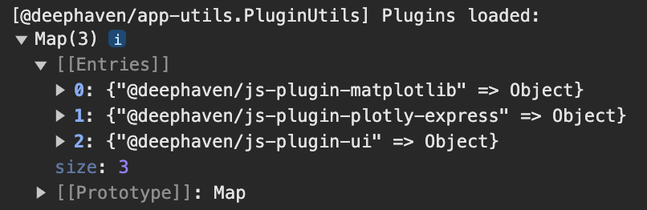
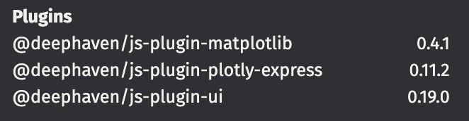

# {{ cookiecutter.python_project_name }}

This is a Python plugin for Deephaven generated from a [deephaven-plugin](https://github.com/deephaven/deephaven-plugins) template.

Specifically, this plugin is a bidirectional widget plugin, which can send and receive messages on both the client and server.  
The plugin works out of the box, demonstrates basic plugin structure, and can be used as a starting point for building more complex plugins.  

## Plugin Structure

The `src` directory contains the Python and JavaScript code for the plugin.  
Within the `src` directory, the {{ cookiecutter.python_project_name }} directory contains the Python code, and the `js` directory contains the JavaScript code.  

The Python files have the following structure:  
`{{ cookiecutter.__object_file_name }}.py` defines a simple Python class that can send messages to the client. This object can be modified to have other plugin functionality or replaced with a different object entirely, depending on the plugin's needs.  
`{{ cookiecutter.__type_file_name }}.py` defines the Python type for the plugin (which is used for registration) and a simple message stream. These can be modified to handle different objects or messages. An initial message is sent from the Python side to the client, then additional messages can be sent back and forth.  
`register.py` registers the plugin with Deephaven. This file will not need to be modified for most plugins at the initial stages, but will need to be if the package is renamed or JavaScript files are moved.

The JavaScript files have the following structure:  
`{{ cookiecutter.__js_plugin_obj }}.ts` registers the plugin with Deephaven. This contains the client equivalent of the type in `{{ cookiecutter.__type_file_name }}.py` and these should be kept in sync.  
`{{ cookiecutter.__js_plugin_view_obj }}.tsx` defines the plugin panel and message handling. This is where messages are received when sent from the Python side of the plugin. This file is a good starting point for adding more complex plugin functionality.  

Additionally, the `test` directory contains Python tests for the plugin. This demonstrates how the embedded Deephaven server can be used in tests.  
It's recommended to use `tox` to run the tests, and the `tox.ini` file is included in the project.  

## Using plugin_builder.py
The `plugin_builder.py` script is the recommended way to build the plugin.
See [Building the Plugin](#building-the-plugin) for more information if you want to build the plugin manually instead.

To use `plugin_builder.py`, first set up your Python environment and install the required packages.  
To build the plugin, you will need `npm` and `python` installed, as well as the `build` package for Python.
`nvm` is also strongly recommended, and an `.nvmrc` file is included in the project.
The script uses `watchdog` and `deephaven-server` for `--watch` mode and `--server` mode, respectively.
```sh
cd {{ cookiecutter.python_project_name }}
python -m venv .venv
source .venv/bin/activate
cd src/js
nvm install
npm install
cd ../..
pip install --upgrade -r requirements.txt
pip install deephaven-server watchdog
```

First, run an initial install of the plugin:
This builds and installs the full plugin, including the JavaScript code.
```sh
python plugin_builder.py --install --js
```

After this, more advanced options can be used.
For example, if only iterating on the plugins with no version bumps, use the `--reinstall` flag for faster builds.
This adds `--force-reinstall --no-deps` to the `pip install` command.
```sh
python plugin_builder.py --reinstall --js
```

If only the Python code has changed, the `--js` flag can be omitted.
```sh
python plugin_builder.py --reinstall
```

Additional especially useful flags are `--watch` and `--server`.
`--watch` will watch the Python and JavaScript files for changes and rebuild the plugin when they are modified.
`--server` will start the Deephaven server with the plugin installed.
Taken in combination with `--reinstall` and `--js`, this command will  rebuild and restart the server when changes are made to the plugin.
```sh
python plugin_builder.py --reinstall --js --watch --server
```

If interested in passing args to the server, the `--server-arg` flag can be used as well
Check `deephaven server --help` for more information on the available arguments.
```sh
python plugin_builder.py --reinstall --js --watch --server --server-arg --port=9999
```

See [Using the Plugin](#using-the-plugin) for more information on how to use the plugin.

## Manually Building the Plugin

To build the plugin, you will need `npm` and `python` installed, as well as the `build` package for Python.
`nvm` is also strongly recommended, and an `.nvmrc` file is included in the project.
The python venv can be created and the recommended packages installed with the following commands:
```sh
cd {{ cookiecutter.python_project_name }}
python -m venv .venv
source .venv/bin/activate
pip install --upgrade -r requirements.txt
```

Build the JavaScript plugin from the `src/js` directory:

```sh
cd src/js
nvm install
npm install
npm run build
```

Then, build the Python plugin from the top-level directory:

```sh
cd ../..
python -m build --wheel
```

The built wheel file will be located in the `dist` directory.

If you modify the JavaScript code, remove the `build` and `dist` directories before rebuilding the wheel:
```sh
rm -rf build dist
```

## Installing the Plugin

The plugin can be installed into a Deephaven instance with `pip install <wheel file>`.
The wheel file is stored in the `dist` directory after building the plugin.
Exactly how this is done will depend on how you are running Deephaven.
If using the venv created above, the plugin and server can be created with the following commands:
```sh
pip install deephaven-server
pip install dist/{{ cookiecutter.python_project_name }}-0.0.1.dev0-py3-none-any.whl
deephaven server
```
See the [plug-in documentation](https://deephaven.io/core/docs/how-to-guides/install-use-plugins/) for more information.

## Using the Plugin

Once the Deephaven server is running, the plugin should be available to use.

```python
from {{ cookiecutter.python_project_name }} import {{ cookiecutter.__object_name }}

obj = {{ cookiecutter.__object_name }}()
```

A panel should appear. You can now use the object to send messages to the client.

```python
obj.send_message("Hello, world!")
```

The panel can also send messages back to the Python client by using the input field.

## Debugging the Plugin
It's recommended to run through all the steps in [Using plugin_builder.py](#Using-plugin_builder.py) and [Using the Plugin](#Using-the-plugin) to ensure the plugin is working correctly.  
Then, make changes to the plugin and rebuild it to see the changes in action.
Checkout the [Deephaven plugins repo](https://github.com/deephaven/deephaven-plugins), which is where this template was generated from, for more examples and information.  
The `plugins` folder contains current plugins that are developed and maintained by Deephaven.  
Below are some common issues and how to resolve them as you develop your plugin.  
If there is an issue with the process while following the Installation and Usage steps on the originally generated plugin, please open an issue.  

### The Panel is Not Appearing
#### Checking if the Plugin is Registered
If the panel is not appearing or an error is thrown that the import is not found, the plugin may not be registered correctly.
To verify the plugin is registered, check either the console logs or the versions in the settings panel.  
- In the console logs, there should be a messaging saying `Plugins loaded:` with a map that includes this plugin.  
  

- To get to the settings panel, click on the gear icon in the top right corner of the Deephaven window. Towards the bottom this plugin should be listed.  
  
- If the plugin is not listed, attempt to rebuild and reinstall the plugin and check for errors during that process.

#### Checking if the Python Package is Installed
- Running `pip list` in the `.venv` environment should show the Python package installed, but this is not a guarantee that the plugin is registered properly.  
- The version can also be checked directly from the Python console with:
```{python}
from importlib.metadata import version
print(version("{{ cookiecutter.python_project_name }}"))
```

### The Panel is Appearing but with Errors or Not Functioning Correctly
Check both the Python and JavaScript logs for errors as either side could be causing the issue.

## Distributing the Plugin
To distribute the plugin, you can upload the wheel file to a package repository, such as [PyPI](https://pypi.org/).
The version of the plugin can be updated in the `setup.cfg` file.

There is a separate instance of PyPI for testing purposes.
Start by creating an account at [TestPyPI](https://test.pypi.org/account/register/).
Then, get an API token from [account management](https://test.pypi.org/manage/account/#api-tokens), setting the “Scope” to “Entire account”.

To upload to the test instance, use the following commands:
```sh
python -m pip install --upgrade twine
python -m twine upload --repository testpypi dist/*
```

Now, you can install the plugin from the test instance. The extra index is needed to find dependencies:
```sh
pip install --index-url https://test.pypi.org/simple/ --extra-index-url https://pypi.org/simple/ {{ cookiecutter.python_project_name }}
```

For a production release, create an account at [PyPI](https://pypi.org/account/register/).
Then, get an API token from [account management](https://pypi.org/manage/account/#api-tokens), setting the “Scope” to “Entire account”.

To upload to the production instance, use the following commands. 
Note that `--repository` is the production instance by default, so it can be omitted:
```sh
python -m pip install --upgrade twine
python -m twine upload dist/*
```

Now, you can install the plugin from the production instance:
```sh
pip install {{ cookiecutter.python_project_name }}
```

See the [Python packaging documentation](https://packaging.python.org/en/latest/tutorials/packaging-projects/#uploading-the-distribution-archives) for more information.

